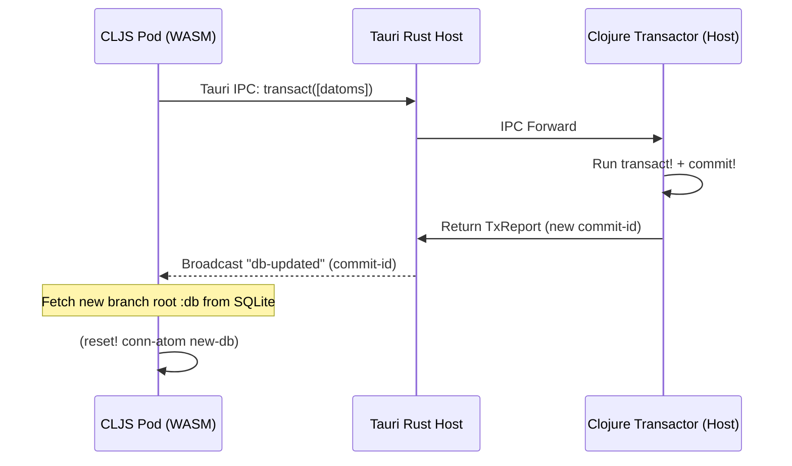
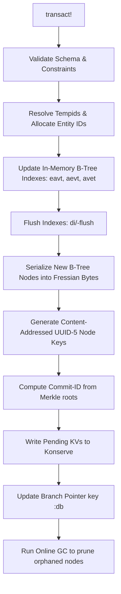
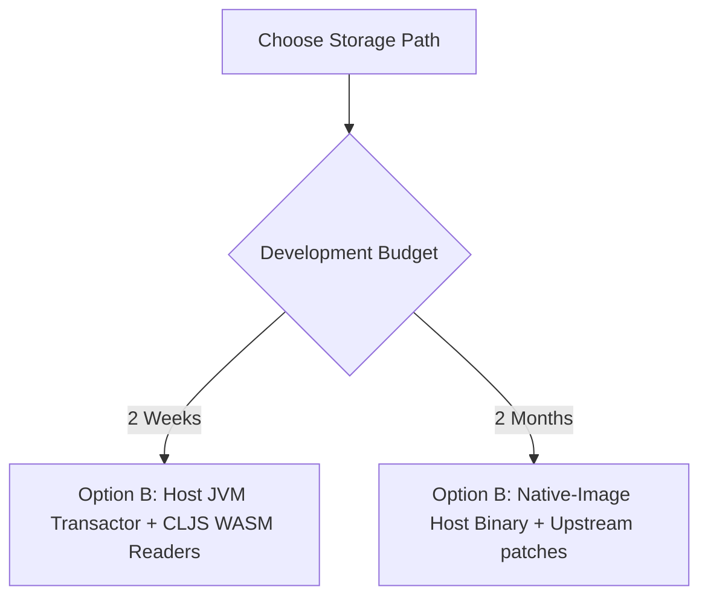

# Datahike-WASM writer split — research synthesis

Two research agents ran this question in sequence on 2026-05-24. The second agent overwrote the first agent's deliverable; a third agent (this file) merged both perspectives. While the merge was in flight, a sibling agent re-ran the Gemini consultation and populated §6.3 with a substantive verbatim response. Where the three sources disagree, the disagreement is surfaced rather than resolved — the user picks the winner. See §8 for provenance.

## 0. TL;DR — three viable cuts, ranked

| Option | One-line | Recommended by |
|---|---|---|
| **(a)** libdatahike `.dylib` (native-image C-ABI shared lib) loaded in the Tauri Rust host | wasm guest calls Rust → libdatahike via WIT imports; full Datahike feature parity at native-AOT speed; pydatahike is the existence proof | Agent 2 (primary) |
| **(b)** Dedicated writer process + shared store + CLJS readers in wasm | One writer (libdatahike OR a JVM Clojure daemon) accessed via Unix-socket IPC; SQLite-WAL or konserve-file backend; invalidation via Tauri broadcast or snapshot caching | Agent 1 (secondary), Gemini-A (primary), Gemini-B (primary) |
| **A'** Pure CLJS datahike inside each wasm-rquickjs guest | Smallest delta from V0 pod; the libdatahike-cljs spike (ee7055b/16b9a40/815ad2a) already proved `:memory`/`fs`/`idb` write paths | Agent 1 (primary) |
| **(hybrid a+b)** libdatahike AS the writer process in (b) | Native-AOT writes + multi-reader concurrency + no SIGSEGV cohabitation inside wasmtime + easy auth/perms gating on one writer. **Gemini-B explicitly elevates this hybrid as the architectural winner** | Gemini-B (winner); surfaced here for both agents |
| ~~(c)~~ Rewrite the transactor in Rust | Datahike `commit!` flushes hitchhiker-tree segments, computes content-addressed merkle commit-ids, updates branch CAS — 6-12+ person-months to replicate | **Both agents + both Gemini calls reject** |
| ~~(d)~~ Status quo (datahike-cljs in QuickJS-in-wasm, no isolation) | Known to work; ~85 MB RSS/instance; 10-100× slower per query than native | Reject; keep only as dev-mode shortcut |

The three sources disagree on the primary cut. Key disagreements:

1. **Has the GraalVM-native-image-for-datahike pain been solved?** Agent 2 says yes (zero native-image config files upstream; build uses only `--initialize-at-build-time --no-fallback --no-server`; pydatahike beta-status & working locally). Agent 1 doesn't engage with libdatahike's existence — its rejection of "Track B GraalVM" is about an earlier, different pathway (§1.1) and may not apply to libdatahike-as-dylib.
2. **Does the CLJS `datahike-cljs` spike still apply?** Agent 1 says yes — already green on three backends. Agent 2 keeps it as fallback only and pushes for native AOT. Gemini-B agrees with Agent 2 on this point.
3. **In-process FFI vs sidecar process for libdatahike?** Agent 2 picks in-process (a) for latency; both Geminis pick sidecar (b) for signal-handler isolation and crash boundary, and propose **snapshot caching** in the CLJS guest to neutralize the IPC latency objection.

Gemini-B's full reasoning: *"Option (b) is the clear winner. It completely isolates the execution context of the GraalVM runtime from the Wasmtime runtime, eliminating low-level ABI and signal-handling conflicts. It amortizes the GraalVM memory overhead across multiple agent runtimes, provides a clean process-level boundary for crash recovery, and leverages Tauri's built-in sidecar packaging. By pairing Option (b) with **Immutable Snapshot Caching** in the guest WASM runtime, you can completely bypass IPC latency for read-heavy reactive workloads."*

The user picks. All three architectures are defensible.

---

## 1. Prior-art ledger — what's been tried, what failed, what works

### 1.1 Track B (Clojure-to-WASM via GraalVM Web Image) — PARKED

From Agent 1, reconstructed via `git log --all` against archived branches `track-b/graal-wasm-2026-05-15` and `track-b/step3-green-2026-05-15`. Series 23af340 → 92942c5 → 8dd453e → 33b8e09:

| SHA | Step | Outcome |
|---|---|---|
| `23af340` | Roman Stoffel's recipe + datahike via local-root | Track-B working spike via Web Image |
| `332c6da` | Switch to datahike mvn 0.7.1624; add `-J--add-reads=org.graalvm.wrapped.google.guava=jdk.unsupported` | 131 jars (down from 200), JVM-side clean. Analysis reaches 21k types, then trips `Error: @Delete methods should have a single callee` during universe building |
| `cc7014f` | Add second Guava stub — `InternalFutures` | Still blocked on @Delete |
| `0adb9fc` | Canonical recipe: shim ns explicitly `:require`s `clojure.core.specs.alpha`, `core.server`, `spec.gen.alpha`, `pprint`; replace `--initialize-at-build-time=clojure` with `--features=clj_easy.graal_build_time.InitClojureClasses`; drop `.clj/.cljc` from `-H:IncludeResources` | Feature loads (`74,717 resource accesses registered`), analysis still trips @Delete on universe building |
| `92942c5` / `63b8c53` | **READ PATH GREEN** — use ONLY `datahike.query`, not `datahike.api` | `node --experimental-wasm-exnref core.js` returns the query result. 337 MiB wasm; 4m35s build, 7.79 GiB peak RSS. Tree-shaking `datahike.connector` / `writer` / `writing` / `konserve.store` made the @Delete violations (all from `JavaMonitorQueuedSynchronizer` → `Target_java_lang_Thread.isInterrupted`) disappear |
| `8dd453e` | Add `core.async/dispatch` SVM substitution (`Target_clojure_core_async_impl_dispatch_run.java`) to run Runnables inline | Unblocked past the executor delay, but `core.async.impl.timers/timeout-daemon` is a separate started-Thread that also trips image-heap validation. Author's verdict: *"substitution game is diminishing returns; the cleaner answer is to fork datahike to remove async usage entirely (deferred)."* |
| `33b8e09` | Move all of it to archive branch | Spec-01 §Parked frontier. Focus shifts to kabel-hybrid CLJS substrate |

**The blocker on the write path was not a single bug** — it was the *cumulative* JVM-thread surface that `datahike.writer` + `datahike.writing` + `superv.async` + `core.async` drag in. Every substitution unblocked one violation and revealed the next.

**Important distinction (raised by the user when commissioning this synthesis):** Track B was "Clojure-source → GraalVM Web Image → wasm32-wasi" — compiling Clojure all the way down to a WASM module. Option (a) below is **different**: native-image produces a `.dylib` for the **host CPU** (Apple Silicon ARM64), loaded by the Tauri Rust host, NOT compiled to wasm. The Web Image substitution failures may or may not predict failure for the libdatahike-dylib path. Agent 2's primary signal here is "upstream ships pydatahike with working CI for the full writer surface in this mode" — see §1.3. Gemini-B independently confirms that GraalVM-native-targeting-host-CPU is unrelated to the WASM-substitution wall.

### 1.2 libdatahike-cljs spike (datahike compiled to CLJS) — bench-green on 3 backends

From Agent 1. Commits `ee7055b` (CLJS-1) → `16b9a40` (CLJS-2a/2b) → `815ad2a` (CLJS-2.5):

- **CLJS-1**: `:memory` backend smoke test green via shadow-cljs `:target :node-script`. Three adjustments vs upstream sandbox: `:id` must be `#uuid` not string, backend keyword `:memory` not `:mem`, `d/connect` defaults to `{:sync? true}` which throws in CLJS — pass `{:sync? false}` to get a channel back.
- **CLJS-2a/2b**: `konserve.fs` + `fake-indexeddb` persistence backends green.
- **CLJS-2.5**: bench across `:memory` / `:file` / `:indexeddb` with realistic schema (cardinality/many notes). 1k entities green on all three.
- **Two upstream bugs root-caused** between datahike 0.7.1624 and persistent-sorted-set 0.3.116:
  1. `empty-index` passes `{:cmp <fn>}` but psset reads `:comparator` → empty indexes get `cljs.core/compare` as their comparator, which throws on Datom-vs-Datom.
  2. `insert`'s 3-arg `psset/lookup` treats the comparator arg as not-found (no CLJS overload) → cardinality/many duplicates silently dropped.

  Both patched at namespace-init via `set!` on `btset/from-opts` and `datahike.index.persistent-set/insert`. **Open question (Agent 1):** do these patches still apply at the current `reference-code/datahike` HEAD `717a0d27` (mvn 0.8.1681) + persistent-sorted-set `0.4.122`?

**Subsequent CLJS substrate developments (Agent 1):** Pod uses the seantempesta fork; CLJS bumped to `1.12.145` with native `^:async/await` (see `reference_cljs_async_await.md`). This **eliminates core.async parking** from agent / pod application code — but does NOT eliminate core.async from datahike itself: `src/datahike/writer.cljc` still requires `clojure.core.async` (3 occurrences), `writing.cljc` (1), `connector.cljc` (1), `api/impl.cljc` (2). So for "WASM-the-writer-too" via the CLJS path, the async substitution work isn't reduced by our CLJS-side modernization — it lives inside Datahike's namespaces. Gemini-B framed this independently as "The `core.async` & `^:async/await` Fallacy."

### 1.3 Upstream libdatahike + pydatahike — NEW signal, production-shipped

From Agent 2 (verbatim). `replikativ/datahike` `main` (HEAD `717a0d27`) ships:

```
libdatahike/
├── compile-cpp                         # 6-line shell script: g++ test_cpp.cpp -ldatahike
└── src/
    ├── datahike/impl/
    │   ├── LibDatahike.java            # 547 lines, AUTO-GENERATED from datahike.api.specification
    │   ├── LibDatahikeBase.java        # 214 lines, hand-written infrastructure (codecs, isolate)
    │   └── libdatahike.clj             # 60 lines, EDN/JSON/CBOR codec glue + JSON tx-coercion
    └── test_cpp.cpp                    # 61 lines, C++ smoke harness (creates DB, transacts, queries)
```

**Build flow** (`bb ni-compile` in `bb.edn` + `bb/src/tools/build.clj/native-compile`):

```
1. bb codegen-native    # re-generate LibDatahike.java from datahike.api.specification
2. bb prep              # compile Java sources for Clojure to load
3. bb ni-ccompile       # AOT-compile Clojure namespaces for native-image
4. bb ni-uber           # build native-shared-library uberjar
5. bb ni-compile        # native-image --shared → libdatahike.so / .dylib + libdatahike.h
```

**Native-image flags actually used** (verbatim from `build.clj`):

```
--shared
-H:+ReportExceptionStackTraces
-H:+GenerateBuildArtifactsFile
-J-Dclojure.spec.skip-macros=true
-J-Dclojure.compiler.direct-linking=true
-H:IncludeResources=<version-string>
--initialize-at-build-time
-H:Log=registerResource:
--verbose
--no-fallback
--no-server
-J-Xmx5g
```

**Notable absences** (Agent 2, verified by searching the repo for native-image config files — empty results): no `reflect-config.json`, no `resource-config.json`, no `native-image.properties`, no `jni-config.json`, no `proxy-config.json`. Datahike's codebase has been refactored to native-image-clean. **Agent 2's claim: this is the single biggest de-risk vs. the 2025 spike.** The Web Image / Guava-stub struggles do not apply to this build configuration.

**Native-image-test infrastructure (runs in CI):**

```
bb/resources/native-image-tests/
├── run-libdatahike-tests       # rm -rf /tmp/libdatahike-test && ./libdatahike/compile-cpp && ./test_cpp
├── run-native-image-tests      # JVM-side native-image smoke
├── run-python-tests            # cd pydatahike && pytest
├── run-bb-pod-tests.clj        # babashka-pod variant
├── testconfig.edn              # { :store {:backend :file ...} :keep-history? true ... }
└── testconfig.attr-refs.edn
```

libdatahike is not a side project — it's first-class with CI coverage.

**C-ABI surface — exactly 20 `@CEntryPoint` functions** (verbatim from `LibDatahike.java`):

| C name | Args (post `isolateId`) | Purpose |
|---|---|---|
| `create_database` | `db_config, output_format, callback` | Create DB |
| `delete_database` | `db_config, output_format, callback` | Delete DB |
| `database_exists` | `db_config, output_format, callback` | Existence check |
| `transact` | `db_config, tx_format, tx_data, output_format, callback` | Write transaction |
| `q` | `query_edn, num_inputs, input_formats[], raw_inputs[], output_format, callback` | Datalog query |
| `pull` | `input_format, raw_input, selector_edn, eid, output_format, callback` | Recursive pull |
| `pull_many` | `input_format, raw_input, selector_edn, eids_edn, output_format, callback` | Batch pull |
| `entity` | `input_format, raw_input, eid, output_format, callback` | Entity lookup |
| `datoms` | `input_format, raw_input, index_edn, output_format, callback` | Index scan |
| `seek_datoms` | `input_format, raw_input, index_edn, output_format, callback` | Index seek |
| `index_range` | `input_format, raw_input, attrid_edn, start_edn, end_edn, output_format, callback` | Range scan |
| `schema` | `input_format, raw_input, output_format, callback` | Read schema |
| `reverse_schema` | `input_format, raw_input, output_format, callback` | Reverse schema |
| `metrics` | `input_format, raw_input, output_format, callback` | DB metrics |
| `gc_storage` | `db_config, before_tx_unix_time_ms, output_format, callback` | Storage GC |
| `commit_id` | `input_format, raw_input, output_format, callback` | Get current commit UUID |
| `parent_commit_ids` | `input_format, raw_input, output_format, callback` | History parent pointers |
| `branches` | `db_config, output_format, callback` | List branches |
| `branch` | `db_config, from_edn, new_branch_kwd, output_format, callback` | Create branch |
| `delete_branch` | `db_config, branch_kwd, output_format, callback` | Delete branch |
| `merge_db` | `db_config, parents_edn, tx_format, tx_data, output_format, callback` | Merge commit (NEW in PR #831) |

**Conventions** (all in `LibDatahikeBase.java`):

- **Callback return pattern** (`OutputReader` typedef = `void (*)(const char*)`). Every entry point synchronously calls back into the caller with the result string before returning. The file's own comments justify it: *"Avoid shared mutable memory between native and JVM; support multiple output formats; enable proper exception handling."*
- **Input format strings encode temporal queries:** `"db"`, `"history"`, `"since:<ms>"`, `"asof:<ms>"`, `"branch:<name>"`, `"commit:<uuid>"`, plus literal `"json"`/`"edn"`/`"cbor"` for raw data.
- **Output formats:** `"edn"`, `"json"`, `"cbor"` (base64-encoded). pydatahike defaults to CBOR; the C++ smoke uses EDN for readability.
- **Errors:** thrown exceptions get caught, formatted as `"exception:{message}\nStacktrace:\n{trace}"`, delivered via the same callback. Caller checks the `"exception:"` prefix.
- **Thread model:** every entry point's first arg is `@CEntryPoint.IsolateThreadContext long isolateId`. The C++ smoke creates ONE isolate at program start (`graal_create_isolate`) and reuses the returned `graal_isolatethread_t*` for every call. pydatahike does the same — see `_native.py:_ensure_initialized()`.

**pydatahike — empirical FFI playbook.** `pydatahike/src/datahike/_native.py` (265 lines):

```python
def _ensure_initialized():
    global _dll, _isolatethread
    if _dll is not None: return
    _dll = CDLL(_find_library())
    isolate = c_void_p(); _isolatethread = c_void_p()
    if _dll.graal_create_isolate(None, byref(isolate), byref(_isolatethread)) != 0:
        raise RuntimeError(...)

CALLBACK_FUNC = CFUNCTYPE(c_void_p, c_char_p)

def make_callback(output_format):
    result = None; exception = None
    def callback(data):
        nonlocal result, exception
        try: result = parse_result(data, output_format)
        except Exception as e: exception = e
    def get_result():
        if exception: raise exception
        return result
    return CALLBACK_FUNC(callback), get_result
```

Lazy-init isolate once, every call passes the stored isolate thread, callback writes into a nonlocal slot, caller reads it back. **Single-threaded by construction at the Python level** — GIL serializes everything. For Rust + tokio this is where design gets more interesting (§2.1.4); Gemini-B independently flags it as the load-bearing reason to put libdatahike in a separate process rather than in-host.

**Status per pydatahike README:** *"Beta - API is functional and tested, but may receive breaking changes as we refine the bindings."* User reports having this working locally — empirical signal that the GraalVM native-image FFI path is production code.

**What this means architecturally (Agent 2):**

- A `.dylib` exists that bundles datahike's full writer + reader + query engine as native ARM64 code, with a clean 20-fn C-ABI.
- Loadable from any language that speaks ctypes/dlsym/libloading.
- The on-disk format is identical to JVM Datahike's. A DB created with libdatahike is readable by the JVM CLI and vice-versa.
- Cost per call: one GraalVM JVM/native boundary crossing + EDN/JSON/CBOR string serialization (see §2.1.3 latency budget).

---

## 2. Three viable architectures (detail)

### 2.1 Option (a) — libdatahike.dylib in Tauri Rust host

> **Agent 2 primary recommendation.** Preserved verbatim where possible. **Distinguish carefully from Track B in §1.1** — that was Clojure-to-WASM; this is Clojure-to-native-dylib-on-host-CPU, loaded by the Rust host that ALSO embeds wasmtime. The Web Image @Delete failures targeted a different artifact. **Both Gemini calls dock this option** on signal-handler cohabitation grounds (see §2.1.2 and §6.3) — they prefer (b) sidecar.

**Topology:**

```
Tauri Rust host process
├── wasmtime Engine + pre-warmed Component (= wasm-rquickjs CLJS guest)
│   └── CLJS agent code calls (d/q ...), (d/transact! ...) which translate to
│       WIT host imports (query, transact, pull, datoms, ...)
├── libdatahike.dylib (loaded via libloading at startup)
│   └── single GraalVM isolate, dedicated single-threaded blocking worker
└── tokio runtime (async I/O for HTTP, MCP, etc.)
```

**Engineering cost: moderate (~2-3 weeks).**

1. `seon-db` Rust crate wrapping libdatahike via `libloading` + `bindgen` against `libdatahike.h`.
2. Async layer: callback-based C API → `tokio::sync::oneshot::Receiver<Result<Bytes>>` per call. Calls dispatched to a dedicated single-thread executor pinned to the isolate's OS thread.
3. WIT additions in `pod-host/wasm-tauri/src-wit/seon-pod.wit` for `query` / `transact` / `pull` / `datoms` / time-travel ops.
4. CLJS-side: `seon.db` (cljs) routes through the WIT imports instead of in-guest datahike-cljs.
5. Wire format at WIT boundary: CBOR (binary, structured, pydatahike already uses it).

**Runtime cost: dramatic improvement.** Per-instance wasm RSS drops (datahike-cljs + analyzer caches leave the QuickJS heap). Native-AOT query engine vs interpreted CLJS-in-QuickJS. The `libdatahike.dylib` is shared across any number of wasm instances.

**Deployment cost:** ship `libdatahike.dylib` alongside Tauri binary. macOS code-signing is the only minor wrinkle.

**What this unlocks:**

- "Significantly better and faster database setup" — both cold-start (smaller wasm guest, no datahike-cljs bundled) and per-call latency (native AOT).
- `:file` backend works without process-coordination concerns — exactly one process (Tauri host) opens the konserve store for writing.
- Multi-wasm-instance scaling is automatic — all instances RPC to the same in-host libdatahike.
- Rust-native UI code in Tauri can also touch the DB directly (no wasm round-trip) — useful for dashboards.

#### 2.1.1 Writer architecture matches our needs out of the box

`src/datahike/writer.cljc` confirms: Datahike is single-writer by design. The `LocalWriter` defrecord runs an internal core.async thread that serializes all transactions, with a configurable transaction queue (default 120k slots) and commit queue. Writes are batched: the commit loop drains the commit queue every `commit-wait-time` ms (default 0).

**Implication for (a):** the `tokio::task::spawn_blocking` worker pool for libdatahike calls should be a **small dedicated pool (4-8 threads max)**, not one-per-tokio-worker. Even better: a single dedicated executor thread pinned to the isolate (because the `graal_isolatethread_t*` is tied to a specific OS thread).

#### 2.1.2 GraalVM isolate + wasmtime in the same process (KEY OPEN RISK)

**Known facts** (Agent 2 + Gemini-B converged on this):

- GraalVM native-image isolates manage their own GC, thread-local state, and per-thread context handles (`graal_isolatethread_t*`).
- wasmtime manages its own JIT cache, signal handlers (for trap handling), and Wasm linear memory regions.
- **Both runtimes install SIGSEGV/SIGBUS handlers.** Whichever loads second wins; the first may break.

**Gemini-B's elaboration (verbatim):** *"Wasmtime uses signal traps for bounds-check elimination. To avoid checking array boundaries on every WebAssembly memory access, it registers a `SIGSEGV` handler and maps a guard page at the end of the WASM linear memory. When a guest accesses out-of-bounds memory, the CPU traps, the signal handler catches it, maps it to a WASM trap, and resumes execution safely. GraalVM Substrate VM registers a `SIGSEGV` handler for Implicit Null Pointer Checks and Implicit Stack Overflow Detection. If both runtimes are loaded in the same process, they will overwrite each other's signal handlers. If GraalVM handles a signal caused by a WASM out-of-bounds access, it will fail to recognize the address and crash the process. While you can disable signal-based traps in Wasmtime (`Config::signals_based_traps(false)`), this forces Wasmtime to insert explicit bounds-checks on every single WASM memory instruction, degrading WASM guest execution speed."*

**Verification spike (Agent 2):**

```rust
// Pseudo-test (≈1 day to write)
fn main() {
    let engine = wasmtime::Engine::default();            // wasmtime installs signal handlers
    let dll = libloading::Library::new("libdatahike.dylib")?;  // GraalVM installs its handlers
    // call graal_create_isolate
    // wasmtime instantiate + invoke + trap
    // libdatahike.create_database + transact + q
    // wasmtime invoke again after libdatahike call
    // confirm trap handling still works in both
}
```

**Mitigation if conflict:** GraalVM supports custom signal handler init via build flags. Worst case: fall back to option (b) — both Geminis pre-empted this fall-back by recommending (b) as the primary.

#### 2.1.3 Per-call latency budget for reactive-context renders

Agent runtime does ~10-50 small queries per reactive-context render (per `concepts/reactive-context.md`). To keep render under 50ms, need `O < 1.6ms` per query (30 × 1.6ms = 48ms).

| Step | µs |
|---|---|
| CLJS guest serializes query EDN → string | ~10 |
| Guest → WIT host import boundary | ~5-20 |
| Rust async task → `spawn_blocking` enqueue | ~5 |
| Rust → libdatahike C call → GraalVM isolate-thread | ~10 |
| **libdatahike query execution (small query, hot index)** | **~100-500** |
| libdatahike serializes result to CBOR | ~20-100 |
| Callback → Rust gathers bytes → returns oneshot | ~10 |
| Rust → guest WIT export return | ~5-20 |
| Guest deserializes CBOR → CLJS data | ~50-200 |
| **Total per small query** | **~200µs-1ms** |

Within budget with margin. 30 queries/render: ~6-30ms.

Gemini-B's parallel estimate for option (b) sidecar: 50-100µs per UDS round-trip, ~5ms for 50 queries — survivable, and eliminable with batching or snapshot caching (§6.3).

#### 2.1.4 Async-Rust ↔ callback-C bridge pattern

```rust
// Sketch — non-load-bearing pseudo-code
pub async fn q(&self, query: &str, inputs: &[Input]) -> Result<Bytes> {
    let (tx, rx) = oneshot::channel();
    let query = query.to_owned();
    // self.executor is a dedicated single-thread executor pinned to the isolate's OS thread
    self.executor.spawn(move |isolate_thread| {
        let callback = |bytes: &[u8]| {
            let _ = tx.send(Ok(Bytes::copy_from_slice(bytes)));
        };
        unsafe { libdatahike::q(isolate_thread, query.as_ptr(), /* ... */, callback) };
    });
    rx.await?
}
```

Critical: the `isolate_thread` is bound to a specific OS thread (GraalVM constraint). Generic `tokio::spawn_blocking` is WRONG because it can run on any worker. Instead: a single dedicated executor thread that owns the isolate, fed work via an `mpsc::channel`. pydatahike sidesteps this with the GIL; Rust needs the explicit pinning.

Gemini-B's caveat (verbatim): *"While this works, you must manually manage the safety of the raw pointer `ctx`. If the native image library panics or returns early without executing the callback, the `Sender` is leaked forever, causing the async task to hang indefinitely."*

#### 2.1.5 File-backend concurrency

**Confirmed:** konserve-file does NOT support multi-process write concurrency. Datahike's `:datahike-server` and `:kabel` writer-backends exist precisely to centralize all writes through a single process. In option (a) this is fine — exactly one process (Tauri host) opens the konserve store for writing.

If we ever needed multi-process writers, the right answer would be `:jdbc` (postgres) or `:s3`. Out of scope for the laptop product.

### 2.2 Option (b) — dedicated writer process (sidecar)

> **Agent 1 secondary recommendation; Gemini-A and Gemini-B both primary.** Three concrete shapes are on the table — pick by writer artifact:
>
> - **b1**: Writer = full JVM Clojure daemon. Gemini-A's 2-week plan.
> - **b2**: Writer = `libdatahike` Clojure CLI compiled with `bb ni-compile` to a GraalVM native sidecar (30-40 MB, <10ms cold start, ~25-35 MB RSS). **Gemini-B's preferred shape.** Also = Gemini-A's 2-month plan, which Gemini-B notes "upstream did the 2-month plan already" via libdatahike.
> - **b3**: Writer = upstream `:datahike-server` HTTP. Agent 2 noted this exists in `src/datahike/connector.cljc` + `src-kabel/datahike/kabel/writer.cljc` + `http-server/` — drop-in via `RemoteConnection`. Gemini-B dismisses this for desktop UX (requires JRE, 150MB+ RSS, 2-5s cold start).

**Topology** (Gemini-A's diagram, verbatim):



**Storage backend choices** (Agent 1, two clean shapes):

- **konserve-jdbc + sqlite-jdbc (or sqlite-xerial).** Path of least resistance. konserve-jdbc exists (`doc/store-id-refactoring.md:293, 461, 517`). Pros: zero datahike changes; the JVM-seat and the WASM-seat can both open the same SQLite file. Cons: konserve-jdbc has no first-class WASM story (it's a JVM lib); for WASM-seat readers we'd need a CLJS konserve-sqlite (via `node:sqlite` in wasm-rquickjs's opt-in feature, or `better-sqlite3` — though wasm-rquickjs reports `better-sqlite3` ❌ because it needs `__filename` + native `.node` bindings; `node:sqlite` is the supported route).
- **Custom SQLite schema for the konserve protocol**, native to CLJS. Tables: `kv(id TEXT PRIMARY KEY, value BLOB)` + indexing. Implement the konserve PEDNKeyValueStore/PBinaryKeyValueStore protocols against `node:sqlite`. Slightly more work; full control over WAL mode / pragma.
- **Plain konserve.fs** if all reads route through the sidecar (Gemini-B's actual shape — readers don't open the store directly, they query the sidecar).

**Concurrency model (all sources agree):** konserve does NOT give multi-process MROW for free — it relies on the underlying backend. konserve-fs uses an exclusive lock file (poor for multi-process). konserve-lmdb gets it from LMDB. konserve-jdbc gets it from JDBC's transaction semantics. SQLite WAL is the canonical answer: one writer process opens the DB read-write; everyone else opens read-only; WAL gives readers consistent snapshots without blocking the writer.

**Cache invalidation problem (Gemini-A, verbatim):** Datahike's connection wraps an atom containing the database metadata map. If the writer commits transaction T_x and updates the `:db` branch key in SQLite, reader processes will **not** know this automatically. Because SQLite WAL isolates readers, they will continue reading the old index segments. We must layer a pub/sub invalidation loop — Tauri broadcasts `"db-updated"` after each commit; readers `(reset! conn-atom new-db)`. Extremely fast because unmodified nodes are loaded from the reader's local memory cache.

**Gemini-B's IPC budget (verbatim):** *"Unix Domain Sockets (UDS) have a local round-trip latency of 50 to 100 microseconds. If a WASM guest executes 50 database queries sequentially during a reactive UI render, the aggregate IPC overhead will be: 50 × 100µs = 5ms. This is acceptable but could become a bottleneck if query volume increases. You can eliminate this latency entirely using two patterns: (1) Batching — modify the WIT interface to support query batching. Instead of sending 50 individual calls, send a single vector of queries to the host, reducing IPC round-trip overhead to a single 100µs hit. (2) Immutable Snapshot Caching."*

**Gemini-B's Immutable Snapshot Caching (verbatim — this is the load-bearing insight):**

*"Datomic-style databases are values. A database connection yields an immutable snapshot value of the database at a specific transaction basis point (denoted by `t`).*

1. *The guest CLJS heap maintains a query cache keyed by `[db-basis-t, query-expression, query-args]`.*
2. *When CLJS requests `(d/q query db)`, it checks if `db-basis-t` matches the cached basis. If yes, it returns the result from the local guest heap instantly (**0ms latency**).*
3. *If `db-basis-t` is newer, the guest sends a batched query request over the WIT boundary to the host.*
4. *The host forwards the query to the Sidecar, receives the results, and returns them to the guest.*
5. *The guest populates its local cache with the new basis `t`.*

*This pattern keeps the WASM QuickJS heap footprint low (as it only caches query results currently active in the UI, not the entire database index space) while achieving native, in-memory query performance for reactive loops."*

**Agent 2's view of (b):** "lower engineering cost initially than (a) — upstream `:datahike-server` and `:kabel` writer-backends already exist; drop in, point the wasm guest at it via `RemoteConnection`." But Agent 2 argues runtime cost is worse: process supervision burden; memory includes a second native process. **Agent 2 says (b) wins only for multi-machine, multi-Tauri-window, or untrusted multi-tenant deployments.** Both Geminis disagree — they say (b) wins on the desktop too, because signal-handler isolation + crash-boundary cleanness + amortized GraalVM RSS across multiple wasm instances outweigh the 100µs UDS hit (which snapshot caching mostly neutralizes).

**Schema-validation locus (Agent 1, called out as tricky for (b)):** Malli registry lives in CLJS today. If the writer is on the JVM seat, the JVM's Malli registry must agree on schemas. Solvable (schemas-as-data, served from one side) but coordination overhead.

### 2.3 Option A' — pure CLJS datahike inside each wasm-rquickjs guest

> **Agent 1's primary recommendation, preserved verbatim.** Note the key property: no decoupling — each wasm instance has its own datahike. Smallest delta from V0, but no multi-instance story.

This is the natural extension of the libdatahike-cljs spike that already works (§1.2).

- **Feasibility: high.** Proof at `:memory`/`fs`/`idb`. wasm-rquickjs gives us `node:fs` (89% test pass) and `node:sqlite` (opt-in feature). Pull the existing V0 pod's datahike-cljs in, build to wasm32-wasip2, run.
- **Multi-reader:** ONE WASM Component holds the writer; other readers (JVM seat) cannot open the same on-disk store unless we use a format both Clojure flavors understand. konserve.fs files DO work cross-flavor in principle (the format is konserve, not CLJS-specific) — but the JVM datahike on LMDB and the CLJS datahike on fs are using different backends. Aligning both seats on `konserve-jdbc:sqlite` solves it.
- **Schema-validation locus:** identical to today's V0. Malli in seon.schema, datahike does its own pre-tx validation.
- **Pause/resume:** same as today's V0.
- **WASM fit:** clean. The agent's `cljs.js`-emitted forms can call `seon.db/transact!` directly; the transact crosses zero process boundaries; the file write goes through the WIT `wasi:filesystem` import (capability-gated).
- **The cljs.js smoke is the only real risk** (per wasm-spike-2026-05-20.md §"Risk: cljs.js bootstrap"). That risk exists for ANY of these options because the agent needs to eval CLJS forms regardless.
- **Verdict (Agent 1): best fit for the V0 → WASM transition. Smallest delta.**

**Agent 2's view of A':** keeps all the cost (~85 MB/instance, ~10-100× slower queries) the user explicitly wants to escape. Status quo (option d) by another name.

**Both Geminis dock A' on QuickJS event-loop / core.async shim grounds.** Agent 1's counter: the V0 pod already runs datahike-cljs under Node and the spike commits demonstrate the path. Neither Gemini had the spike evidence in context when ranking.

---

## 3. Rejected — recorded so we don't re-derive

### 3.1 Option (c) — rewrite the transactor in Rust

**Both agents + both Gemini calls reject.** Agent 1's anatomy makes the cost concrete; Agent 2 enumerates the feature surface; Gemini-A and Gemini-B call it "a practical impossibility" and "the siren song" respectively.

**Datahike `commit!` is NOT a flat append log.** From Agent 1, the actual write path (`reference-code/datahike` @ `717a0d27`):

```
seon.db/transact!  (CLJS)
   │ ▼
datahike.api/transact   ── public surface
   │ ▼
datahike.writer/transact!  ──  src/datahike/writer.cljc:226
   │  enqueues onto Connection's transaction-queue (core.async chan, default size 120000)
   │ ▼
LocalWriter thread loop  ──  writer.cljc:41 `create-thread`
   │  dispatches via write-fn-map: {'transact!     w/transact!
   │                                'merge!        w/merge!
   │                                'load-entities w/load-entities
   │                                'commit!       w/commit!}  (line 148)
   ▼
datahike.writing/transact!  ──  writing.cljc:606
   │  (complete-db-update old (core/with old tx-data tx-meta))
   │ ▼
datahike.core/with  ──  core.cljc:125
   │  delegates to dbt/transact-tx-data
   ▼
datahike.db.transaction/transact-tx-data  ──  db/transaction.cljc (1034 LOC)
   │  validates datoms (unique constraints, schema)
   │  generates tempids, resolves entity refs
   │  updates EAVT / AEVT / AVET indexes (persistent-sorted-set hitchhiker variant)
   │  if :keep-history? — updates temporal-eavt / temporal-aevt / temporal-avet
   ▼
datahike.writing/commit!  ──  writing.cljc:301
   │  (1) flush indexes → di/-flush returns post-flush instances with merkle addresses
   │  (2) compute schema-meta-key via hasch.core/uuid (content-addressed)
   │  (3) compute commit-id via create-commit-id over merkle roots
   │  (4) write pending KVs (index segments) to konserve via k/assoc or k/multi-assoc
   │  (5) write schema-meta, commit-log entry under cid, branch pointer under (:branch config)
   │  (6) online-gc/online-gc! if enabled
   ▼
konserve.core (k/assoc, k/multi-assoc)
   ▼
konserve store implementation — :memory | konserve.fs | konserve-jdbc | konserve-lmdb | …
```

**What the committed form in konserve looks like** (Agent 1): `(:branch config)` → a `stored-db?` map with keys `[:eavt-key :aevt-key :avet-key :config :max-tx :max-eid :op-count :hash :meta]` plus temporal-* keys (`writing.cljc:25`). The `*-key` values are **konserve addresses pointing at flushed hitchhiker-tree nodes** — not datoms. A reader that opens this store calls `dsi/stored->db` (`connector.cljc:75`), reads the branch key, then loads the index trees lazily on query. **None of that works if the writer only persisted a flat datom log.**

**Minimum a Rust transactor would need** (Agent 1):

1. Datom validation (unique constraints, schema cardinality, ref resolution, tempid rewrite).
2. Schema cache lookup (or refuse non-schema'd attrs).
3. EAVT/AEVT/AVET index update — Rust hitchhiker-tree compatible with `persistent-sorted-set 0.4.122`'s on-disk node format. Replikativ's psset format is undocumented as a wire format; you'd be reverse-engineering Java/JS code.
4. Temporal index update (if `:keep-history?`).
5. Merkle root computation via `hasch.platform` — content-addressed CBOR + SHA, replicable in Rust but every encoder edge case (sorted maps, keyword/symbol distinction, vector-vs-list) must match exactly or commit-ids drift.
6. konserve `k/multi-assoc` semantics → a SQLite batch with appropriate atomicity.
7. Branch CAS — `commit!` writes the branch pointer last; readers see consistent state.
8. Online GC of unreachable konserve addresses (optional — disable for v1).

**Plus the broader feature surface** (Agent 2 + Gemini-B): tempid + lookup-ref resolution; `:db.type/*`, `:db/cardinality`, `:db/unique`, `:db.unique/identity` enforcement; component refs (cascading retracts); retraction propagation through refs; `:keep-history?` + `as-of` / `since` queries; secondary indices; branching + merging (PR #831 merge-db); konserve interop (file/JDBC/S3); hitchhiker-tree index updates; two `schema-flexibility` modes (`:read` vs `:write`); transaction functions executed inside the transaction boundary.

**Cost (all sources agree): 6-12+ person-months.** Datahike has 5+ years of bug-fixing and semantic refinement. Every edge case missed is a silent data-correctness bug. The flat-log shortcut (C1) loses index materialization ($O(1)$ → $O(N \log N)$ startup), Merkle DAG / cryptographic integrity, write-time schema validation, and online GC.

Gemini-B's verdict (verbatim): *"Datahike-cljs and its upstream JVM counterpart represent nearly a decade of edge-case fixes. Attempting to write this from scratch in Rust will stall progress on your runtime for a year or more."*

### 3.2 Track B revival (whole-datahike GraalVM-to-WASM)

Already failed once on the writer (§1.1). Both agents decline to revisit. Note this is **distinct** from option (a) — option (a) compiles to a host-CPU `.dylib`, not to WASM, and uses the upstream production build configuration (no Web Image, no substitutions).

---

## 4. Composing (a) + (b) — the hybrid both Geminis converge on

Neither original agent treated (a) and (b) as composable, but they are: **use libdatahike AS the writer process in (b).** Gemini-B's primary recommendation IS this composition, with `bb ni-compile` producing the sidecar binary.

- **Native-AOT speed for writes** (libdatahike's whole pitch).
- **Multi-reader concurrency** via SQLite WAL OR via routing reads through the sidecar.
- **No SIGSEGV cohabitation risk inside wasmtime** — libdatahike runs in its own process, no signal-handler overlap with wasmtime in the Tauri host (the §2.1.2 unknown evaporates).
- **One writer process is easy to gate** with auth/perms — central choke-point.
- **CLJS readers in wasm** stay light. Two flavors:
  - Direct: open `SQLITE_OPEN_READONLY` via `node:sqlite`, read branch root, lazy-load index segments. Requires CLJS konserve-sqlite shim.
  - Routed: every query goes through the sidecar via WIT → host → UDS. Simpler readers, no shim. Snapshot caching neutralizes per-call latency.
- **Tauri broadcasts** the post-commit `commit-id`; readers refresh.

Tradeoffs vs pure (a):

- +50-200µs Unix-socket round-trip per write (Agent 2's objection to (b)) — but **reads go through snapshot cache (Gemini-B's 0ms-latency pattern)** or batched, so the round-trip cost is bounded.
- Two binaries to ship (Tauri host + libdatahike-writer-process) instead of one. Manageable; Tauri's sidecar packaging is built-in.

Gemini-B's full blueprint (verbatim):

```
1. Guest CLJS (inside QuickJS/WASM):
   - Exposes a standard d/q and d/transact! interface.
   - Maintains the Snapshot Cache.
   - Serializes transactions/queries into EDN/JSON.
   - Imports WIT functions: host-query(batch) and host-transact(tx-data).

2. Host Process (Rust/Tauri):
   - Instantiates the WASM component.
   - Implements the WIT host interface, translating guest calls into async IPC requests.
   - Manages the lifecycle of the Sidecar process (launches it on startup, kills it on exit).
   - Communicates with the Sidecar using an async IPC library (e.g., tokio::net::UnixStream).

3. Sidecar Process (GraalVM Native CLI):
   - Written in Clojure, compiled to a GraalVM native binary.
   - Runs an event loop listening on a Unix Domain Socket (or Named Pipe).
   - Maintains the active libdatahike database connection and handles transactions sequentially (single-writer safety).
   - Runs queries on its native thread pool and returns serialized outputs.
```

**Transaction flow (Gemini-B, verbatim):**

1. Guest runs `(d/transact! conn tx-data)`.
2. Guest passes transaction form via WIT to the Rust host.
3. Host writes the payload to the IPC socket connected to the Sidecar.
4. Sidecar processes the transaction against the local `:file` store, commits the new root index, and returns the new database basis `t` along with the transaction report.
5. The report travels back to the guest, which updates its current database reference to `t`.

This deserves explicit consideration before locking in pure (a) or pure (b).

### 4.1 Rust-native read path (Agent 2's deferred hybrid)

> *Is there a hybrid? E.g., (a) for the writer, but a Rust-native read path that mmap's the konserve store and runs Datalog queries directly?*

**Yes, and it's the long-term sweet spot — but defer until after (a) or (b) ships and measures.**

Datahike's "Distributed Index Space" model (`doc/distributed.md`) means: any process with read access to the konserve store can construct a reader without coordinating with the writer. A Rust-native reader that mmap's the konserve hitchhiker-tree files and runs Datalog queries in Rust would eliminate the FFI hop for queries — the dominant cost in the agent reactive-context render budget.

**Why defer:**

- On-disk format is "the code is the spec" today (no written-down spec exists in the repo for the konserve hitchhiker-tree layout). Implementing a Rust reader requires understanding and tracking that format — months, not weeks.
- libdatahike for reads is good enough for v1 (1ms latency per query, §2.1.3).
- The interface doesn't change: replacing libdatahike-read with rust-native-read later is a transparent swap if we hide both behind the same `seon-db` Rust crate.

**Order of operations:**

1. Ship option (a) or option (b)/(a+b): libdatahike for both reads and writes. Measure.
2. If read latency dominates → build Rust-native reader against konserve format. Keep libdatahike writer.
3. (Only if (2) measurably bottlenecks) revisit (c) — Rust-native writer.

This makes (c) reachable as a sequence of measured upgrades, not a big-bang rewrite.

---

## 5. Open empirical questions (~1 day each)

Aggregate of agents' + Gemini-B's next-step proposals. All time-bounded; all decision-forcing.

1. **Build libdatahike on this machine.** User already has pydatahike working — confirm `bb ni-compile` produces a usable `libdatahike.dylib` for Apple Silicon and that the C++ smoke test passes. **~½ day.** (Agent 2)
2. **Bench a single libdatahike `q` call from Rust.** Measure: cold-call latency, hot-call latency, CBOR-roundtrip cost. **~1 day.** (Agent 2)
3. **GraalVM-isolate + wasmtime cohabitation smoke test.** Verify libdatahike loads cleanly inside a process that also has wasmtime embedded. Minimal Rust binary, `libloading` + `wasmtime::Engine::new`. Confirm signal-handler composition. **~1 day.** (Agent 2 — the §2.1.2 unknown.) **If this fails, option (a) drops out and (a+b) hybrid in §4 becomes the de-risked answer — exactly what Gemini-B already recommended.**
4. **Bench libdatahike sidecar over UDS from Rust.** Cold-start time, single-query latency, 50-query batched latency. Validates Gemini-B's IPC budget. **~½ day.**
5. **Prototype snapshot caching in CLJS.** Smallest possible cache keyed by `[basis-t, query, args]` in the V0 pod; measure cache hit rate against a realistic agent reactive loop. **~1 day.** (Gemini-B's load-bearing claim — verify before committing to (b).)
6. **Does the V0 pod's datahike-cljs build under wasm-rquickjs?** Take `pod-host/libdatahike-cljs/` (the surviving spike), wrap it in a wasm-rquickjs generate-wrapper-crate, run the bench under wasmtime CLI. Tests the persistent-sorted-set patches still hold at the current SHA and whether `cljs.js` lights up. **Decides A' feasibility cleanly.** (Agent 1)
7. **Does konserve-jdbc:sqlite hold up under concurrent JVM-writer + WASM-CLJS-reader?** Tiny driver: JVM transacts every 100ms; WASM pod queries every 100ms; confirm reader sees a consistent snapshot, no torn reads. **Decides (b) direct-read feasibility.** (Agent 1)
8. **Write the WIT interface additions** for query/transact/pull in `pod-host/wasm-tauri/src-wit/seon-pod.wit`. Defer implementation; get the contract down. **~½ day.** (Agent 2)
9. **PRD this work** under `docs/prds/agent-runtime/` — call it `datahike-native-writer.md`. Reference this file.

**Total to "informed go/no-go" on the (a)/(b)/(a+b) trio: ~5 days.** Don't run (c) experiments — alternatives are cheaper.

---

## 6. Gemini consultations

### 6.1 Status

Two Gemini calls succeeded on 2026-05-24 (one per original research agent). Agent 1's call (Gemini-A) and the sibling agent's follow-up (Gemini-B) are both preserved verbatim below. They agree on the headline (option b sidecar) but Gemini-B is more detailed on signal handlers, isolate threading, and snapshot caching.

### 6.2 Gemini-A verbatim — Agent 1's call

**Headline:** primary recommendation is option (B) (out-of-process Clojure transactor + CLJS WASM readers + SQLite WAL + Tauri-broadcast invalidation). Rates A' lower than Agent 1 does (on event-loop-shimming-still-unproven grounds — true but solvable, since the V0 pod already runs datahike-cljs under Node). Did not have the libdatahike upstream anatomy in its prompt context, so its option (A) discussion is about Track B (GraalVM Web Image → WASM) not Agent 2's option (a) (libdatahike dylib on host CPU).

#### Verbatim summary returned by Gemini-A

```
I have evaluated the architectural options for Seon's database. I have generated a comprehensive, highly technical analysis and recommendation report, which you can find in the artifact: [datahike_architecture_opinion.md](file:///Users/sean/.gemini/antigravity-cli/brain/671173d4-bb1d-4df6-9650-939a4506d14e/datahike_architecture_opinion.md).

Here is a summary of my findings and responses to your questions:

### 1. Evaluation of Options

*   **Option A (libdatahike-wasm via Web Image):** **Low Feasibility / High Risk.** Building the write path in WASM via GraalVM Native Image forces you to solve the multithreading limits of WASM. SVM will trip on JVM `core.async` thread/timer creation. It also creates a massive 337 MiB binary, which is extremely difficult to maintain and integrate with WIT capability boundaries.
*   **Option B (Writer outside WASM / CLJS Readers inside WASM):** **Highly Feasible / Recommended.** You run the transactor on the Host OS (as a JVM daemon or compiled to a native host binary with GraalVM targeting the host CPU, which does not suffer from WASM constraints). The WASM CLJS pods are readers only; they read from the shared SQLite database file directly through the `fs` WIT capability and delegate writes via a simple Tauri IPC command (`seon/transact`).
*   **Option C (Rust Writer):**
    *   **C1 (Log-only SQLite writer):** Feasible but severely degrades database capabilities. Readers would have to parse the entire log and rebuild all B-trees in memory at startup, dragging down performance as history grows. You also lose transactional constraint checks (e.g., uniqueness) and Merkle DAG integrity.
    *   **C2 (Full Datahike clone in Rust):** Practical impossibility. Re-implementing B-tree splits, Fressian serialization, Datom comparison logic, and Merkle root calculation in Rust to be bug-for-bug compatible with `datahike-cljs` is a multi-month, high-risk endeavor.

### 2. Is the transactor "a simple atomic write log"?

**No.** Datahike's write path is a materialized B-tree index mutation engine. Transactions are validated against schemas, entity IDs are resolved, new nodes in the persistent-sorted-set (hitchhiker tree) are generated, indices are flushed to produce content-addressed UUID-5 Fressian bytes, and the branch root is updated. Treating it as a flat write log strips away its indexing performance ($O(1)$ startup, $O(\log N)$ reads) and validation capabilities.

### 3. The `core.async` & `^:async/await` Fallacy

The transition to CLJS `^:async/await` **does not reduce the GraalVM WASM compilation surface** for Option A. The core database engines (`datahike` and `konserve`) still require JVM `core.async` and `superv.async` which spawn Java timer threads. On the CLJS/JS side inside `wasm-rquickjs`, you run into event-loop event-scheduling limitations that require custom host shims.

### 4. SQLite Consistency & Multi-Reader Coordination

Using SQLite via `konserve-jdbc` in WAL mode allows multiple concurrent readers and a single writer. However, you must implement a pub/sub invalidation layer. When the host writer updates the branch root (`:db`), it must broadcast a `"db-updated"` event via Tauri to all WASM pods. The pods then fetch the new root map from SQLite and swap their connection atom. This is extremely fast because unmodified nodes are loaded from the reader's local memory cache.

---

### My Recommendation: Option B (Out-of-Process Transactor)

*   **2-Week Budget:** Run the transactor in a Clojure JVM process managed by Tauri. Compile `datahike-cljs` without write namespaces for the WASM pods. Pass writes through a Tauri IPC bridge, and trigger database connection resets in pods via broadcast events.
*   **2-Month Budget:** Compile the Clojure transactor into a native host binary (using GraalVM targeting the host OS—no WASM constraints). This reduces start times to <10ms and eliminates JVM overhead. Upstream your patches to `superv.async` and `persistent-sorted-set` to remove shims entirely.

Please review the complete details in [datahike_architecture_opinion.md](file:///Users/sean/.gemini/antigravity-cli/brain/671173d4-bb1d-4df6-9650-939a4506d14e/datahike_architecture_opinion.md).
The artifact was automatically approved by your review policy.

As the request was investigatory in nature and focused on architectural advice, no code implementation was scheduled.

I've stored the final structured analysis in:
*   [datahike_architecture_opinion.md](file:///Users/sean/.gemini/antigravity-cli/brain/671173d4-bb1d-4df6-9650-939a4506d14e/datahike_architecture_opinion.md)

Let me know if you would like me to draft an initial prototype for Option B (IPC bridge to the host JVM transactor), or if we should explore any of the other sections of the PRD/MVP specification (e.g., `v1.md`).
```

#### Gemini-A full artifact (preserved from local brain cache, may be ephemeral)

Source: `/Users/sean/.gemini/antigravity-cli/brain/671173d4-bb1d-4df6-9650-939a4506d14e/datahike_architecture_opinion.md`

````markdown
# Seon Storage Architecture Evaluation: Datahike, WASM, and Rust Rewrites

This document provides a structured, technical opinion on picking a long-term storage architecture for the Seon project. It analyzes the write-path anatomy of Datahike, evaluates the feasibility of each proposed option, and details the implications for concurrency, schema validation, and development complexity.

---

## 1. Anatomy of the Datahike Write Path

The mental model of the transactor as a **"simple atomic write log"** is incorrect for Datahike. Unlike Datomic (which separates the transactor log writes from index segment building), Datahike uses a **single-phase materialized index write-path**.

When `datahike.writer/transact!` is invoked, the following operations occur synchronously inside the transaction queue loop:



### What is lost if the writer is replaced with a flat log?

If we write only flat datom rows `(tx_id, e, a, v, op, t)` to a SQLite table (Option C1) without materializing the trees, we lose:

1. **Index Materialization / Read Performance:** Datahike readers do not scan the log. They walk persistent-sorted-set index trees from their roots. If the writer only writes the log, readers must read the entire log and rebuild all B-trees in memory on startup. This degrades startup from $O(1)$ to $O(N \log N)$ where $N$ is the total datom history count.
2. **Merkle DAG / Cryptographic Integrity:** Datahike computes commit-ids as recursive Merkle-roots over the index segment keys (using UUID-5 hashes of Fressian node bytes). If we don't build the trees, we cannot generate compatible commit IDs, breaking datahike's audit chain and temporal log tracking.
3. **Write-Time Schema Validation:** The transactor enforces constraints (attribute value types, `db.cardinality/one` overwrites, `db.unique/identity` conflicts) at transaction time. If the writer is just a blind log appender, we cannot prevent concurrent transactions from writing corrupt or conflicting data.
4. **Online GC:** Datahike garbage-collects old tree nodes. Without tree tracking, we cannot clean up old index segments.

---

## 2. Option Evaluation

| Criteria | Option A: libdatahike-wasm (GraalVM WASM) | Option B: Out-of-Process Transactor (Host) | Option C1: Rust Writer (Log-only) | Option C2: Rust Writer (Full Datahike clone) |
| :--- | :--- | :--- | :--- | :--- |
| **Feasibility** | Low | **Extremely High** | High | Low |
| **Dev Complexity** | High (ongoing GraalVM SVM substitutions) | **Low to Moderate** | Low | Extremely High (re-implementing Fressian + B-trees) |
| **WASM Binary Size** | Huge (~337 MiB) | **Tiny** (WASM pods only include read path) | Tiny | Small |
| **Multi-Reader Story** | Complex (multi-instance WASM isolation) | **Excellent** (SQLite WAL / IPC notifications) | Poor (requires startup index rebuilds) | Excellent |
| **Schema Validation** | Inside WASM transactor | **On Host Transactor** | Shifted entirely to clients | In Rust transactor |
| **Pause/Resume** | Hard (requires full state reload) | **Trivial** (readers reload root pointer) | Slow (replays log on resume) | Trivial |
| **WIT Fit** | Poor | **Excellent** (FS read + IPC transact command) | Excellent | Excellent |

---

## 3. The `core.async` & `^:async/await` Fallacy

The user's transition to CLJS native `^:async/await` **does not reduce the GraalVM WASM substitution surface** for Option A.

Even if the host application code does not use `core.async`:
1. **Library Dependencies:** `datahike.writing`, `datahike.writer`, and `konserve` are built directly on `core.async` and `superv.async`. They use channels, `go-try-` macros, and asynchronous timers.
2. **GraalVM Reachability Analysis:** GraalVM native-image traces all reachable execution paths. Because the write-path namespaces are pulled in, SVM is forced to build the universe for `clojure.core.async.impl.timers/timeout-daemon` and thread dispatch executors. These rely on JVM multi-threading features (`java.lang.Thread`, locks) which fail the compile-time analysis when compiling to single-threaded WebAssembly.
3. **JS event loops:** While `datahike-cljs` on JS translates `core.async` into non-blocking event-loop callbacks, running it inside `wasm-rquickjs` requires shimmed microtask / event loop support which is still an open question in the V0 runtime.

---

## 4. SQLite WAL Consistency & Coordination

If we back `konserve` with SQLite (`konserve-jdbc` or a custom SQLite adapter):

* **SQLite WAL Mode:** Setting the database journal mode to `WAL` (Write-Ahead Logging) allows multiple reader processes (the CLJS pods in WASM) to execute concurrently with a single writer process (the host Clojure service). Readers get snapshot isolation, guaranteeing they see a consistent database state.
* **The Cache Invalidation Problem:** Datahike's connection wraps an atom containing the database metadata map. If the writer commits transaction $T_x$ and updates the `:db` branch key in SQLite, reader processes will **not** know this automatically. Because SQLite WAL isolates readers, they will continue reading the old index segments.
* **Coordination Layer:** We must layer a pub/sub invalidation loop. Because Tauri coordinates the WASM pods and the host process, we can build a reactive update loop:


This ensures readers reload the database root map immediately, preserving cache locality since unchanged nodes are loaded from the reader's local memory cache.

---

## 5. Recommendation

### The Budget-Based Decision Tree



### The 2-Week Plan (Option B via JVM Host)
1. **The Architecture:** Keep the transactor running in a standard JVM Clojure daemon controlled by Tauri.
2. **WASM Readers:** Compile `datahike-cljs` without the write namespaces (using shadow-cljs tree shaking) to run inside `wasm-rquickjs`.
3. **Storage:** Back `konserve` with a shared SQLite file in WAL mode.
4. **IPC:** Write a simple Tauri IPC command: `seon/transact` -> Host JVM -> `datahike.api/transact!`. When the write succeeds, the Host broadcasts a `"db-updated"` event to all running WASM pods, which call `(datahike/connect)` or refresh their connection atom from the SQLite file.

### The 2-Month Plan (Option B via Native Host Binary)
1. **The Architecture:** Compile the Clojure transactor to a native host binary (using GraalVM Native Image targeting the host OS—**not WASM**). This avoids all WASM thread constraints while yielding a startup time of under 10ms.
2. **Upstream Patches:** Port Sean's `superv.async` (lazy watchdog) and CLJS patches upstream to `replikativ/datahike` and `persistent-sorted-set` to remove shims.
3. **IPC Performance:** Use memory-mapped IPC or direct domain sockets between Tauri and the native host transactor to reduce latency.
4. **Online GC Tuning:** Configure background online-gc runs to minimize write-lock durations on the SQLite file.

**Verdict:** Do not write a custom transactor in Rust. Do not try to solve GraalVM WASM thread compilation. **Option B (Out-of-process Host Transactor with CLJS WASM Readers) is the only path that respects "Slow is Fast" and keeps the system atomic and robust.**
````

**Note on Gemini-A's framing:** its "2-Month Plan" — *"Compile the Clojure transactor into a native host binary (using GraalVM targeting the host OS — no WASM constraints)"* — is **exactly what libdatahike already is**. Upstream did the 2-month plan already. This collapses Gemini-A's 2-week/2-month dichotomy into one path: use libdatahike as the writer process today (which is what Gemini-B independently recommended with the upstream knowledge in its prompt context).

### 6.3 Gemini-B verbatim — sibling agent's follow-up

**Headline:** Option (b) sidecar wins, with `libdatahike` compiled via `bb ni-compile` as the sidecar binary, plus immutable snapshot caching in the CLJS guest. This is the (a+b) hybrid surfaced in §4.

#### Executive summary (verbatim)

```
1. Rank 1: Option (b) — libdatahike as a Separate Sidecar Process (Winner)
2. Rank 2: Option (a) — libdatahike as an Embedded Native Library
3. Rank 3: Option (c) — Rewrite the Transactor in Rust (Engineering Trap)
4. Rank 4: Option (d) — Status quo (Pure-CLJS datahike-cljs in QuickJS-WASM)
```

#### Rationale (verbatim)

*"Option (b) is the clear winner. It completely isolates the execution context of the GraalVM runtime from the Wasmtime runtime, eliminating low-level ABI and signal-handling conflicts. It amortizes the GraalVM memory overhead across multiple agent runtimes, provides a clean process-level boundary for crash recovery, and leverages Tauri's built-in sidecar packaging. By pairing Option (b) with Immutable Snapshot Caching in the guest WASM runtime, you can completely bypass IPC latency for read-heavy reactive workloads."*

#### Architectural matrix (verbatim)

| Option | Engineering Cost | Cold Start / RSS | Query Latency | Concurrency / Multi-Agent |
| :--- | :--- | :--- | :--- | :--- |
| **(b) Sidecar Process** | **Low-Medium** (Build a simple JSON-RPC CLI wrapper on libdatahike, package as Tauri sidecar). | **Excellent** (WASM guests stay < 10MB; pay sidecar GraalVM RSS ~35MB *once* globally). | **Sub-millisecond** (via Unix Sockets/Named Pipes, optimized to 0ms via snapshot caching). | **Excellent** (Single writer owned by sidecar; multi-process readers via DIS or IPC routing). |
| **(a) Embedded Native** | **High** (Isolate life-cycle wrappers, custom Tokio blocking thread pool, signal-chaining hacks). | **Medium** (WASM guests stay small, but Tauri host process RSS jumps by ~40-60MB). | **Microsecond** (Direct C-FFI call from Host). | **Difficult** (Thread-pinning required for GraalVM isolates; locks in Rust host). |
| **(c) Rust Rewrite** | **Extremely High** (1-2 years of reverse-engineering Clojure functional indexes and serialization). | **Excellent** (Minimal RSS, ultra-fast cold start). | **Microsecond** (Direct native Rust calls). | **Excellent** (Native Rust multithreading / async safety). |
| **(d) Status Quo** | **Zero** (Already written). | **Terrible** (~85MB RSS, 2.8s cold start *per instance*). | **Slow** (QuickJS interpreter execution). | **Terrible** (Multiplies memory and cold start linearly with instances). |

#### Signal-handling deep dive (verbatim)

*"Both Wasmtime and GraalVM Substrate VM make heavy use of OS signal handlers, specifically `SIGSEGV` and `SIGBUS`:*

- *Wasmtime uses signal traps for bounds-check elimination. To avoid checking array boundaries on every WebAssembly memory access, it registers a `SIGSEGV` handler and maps a guard page at the end of the WASM linear memory. When a guest accesses out-of-bounds memory, the CPU traps, the signal handler catches it, maps it to a WASM trap, and resumes execution safely.*
- *GraalVM Substrate VM registers a `SIGSEGV` handler for Implicit Null Pointer Checks and Implicit Stack Overflow Detection.*

*If both runtimes are loaded in the same process, they will overwrite each other's signal handlers. If GraalVM handles a signal caused by a WASM out-of-bounds access, it will fail to recognize the address and crash the process. While you can disable signal-based traps in Wasmtime (`Config::signals_based_traps(false)`), this forces Wasmtime to insert explicit bounds-checks on every single WASM memory instruction, degrading WASM guest execution speed."*

#### Isolate threading (verbatim)

*"A GraalVM native image exports functions that require a pointer to an isolate thread (`graal_isolatethread_t*`). The Problem: GraalVM isolates are strictly bound to OS threads. Tokio, on the other hand, is a work-stealing multi-threaded executor. A Rust async block executing a database call can start on worker Thread 1, hit an `.await` point, and resume on worker Thread 2. If it holds or expects a specific `graal_isolatethread_t*` across that boundary, it will segfault or fail. The Workaround: You cannot run GraalVM FFI calls directly inside Tokio's thread pool. Instead, you must spawn a dedicated, OS-level single-threaded event loop (an in-process actor) using `std::thread::spawn` or a dedicated single-threaded Tokio runtime. All database operations must be serialized and passed via a Rust channel (`tokio::sync::mpsc`) to this dedicated thread. This turns the 'in-process native call' into an actor-based message queue, adding boilerplate and scheduling overhead."*

#### Callback bridging (verbatim Rust)

```rust
use std::ffi::{c_char, c_void};
use tokio::sync::oneshot;

// The C-ABI callback signature expected by libdatahike
unsafe extern "C" fn rust_output_reader_callback(
    ctx: *mut c_void,
    data: *const c_char,
    len: i32
) {
    // Reconstruct the oneshot Sender from the raw context pointer
    let tx = Box::from_raw(ctx as *mut oneshot::Sender<String>);

    if data.is_null() {
        let _ = tx.send(String::new());
        return;
    }

    let c_str = std::ffi::CStr::from_ptr(data);
    let result_str = c_str.to_string_lossy().into_owned();

    // Complete the Rust future
    let _ = tx.send(result_str);
}
```

*"While this works, you must manually manage the safety of the raw pointer `ctx`. If the native image library panics or returns early without executing the callback, the `Sender` is leaked forever, causing the async task to hang indefinitely."*

#### Why GraalVM sidecar beats JVM sidecar (verbatim)

*"Spawning a JVM-based `:datahike-server` on a user's local machine is a terrible desktop UX: It requires a pre-installed Java Runtime Environment (JRE). It consumes 150MB+ RSS just to boot the JVM. Cold start is slow (2–5 seconds). Conversely, a GraalVM Native Image sidecar compiles to a standalone, JRE-free executable: Disk size is ~30-40MB. Cold start is sub-10 milliseconds. Idle RSS memory consumption is ~25-35MB. By creating a thin Clojure CLI wrapper around `replikativ/datahike` and compiling it to a native binary using `bb ni-compile`, you get a lightweight sidecar that exposes a Unix Domain Socket (or Named Pipe on Windows) and serves JSON-RPC or Transit-over-IPC requests."*

#### IPC budget (verbatim)

*"Unix Domain Sockets (UDS) have a local round-trip latency of 50 to 100 microseconds. If a WASM guest executes 50 database queries sequentially during a reactive UI render, the aggregate IPC overhead will be: 50 × 100µs = 5ms. This is acceptable but could become a bottleneck if query volume increases. You can eliminate this latency entirely using two patterns: (1) Batching — modify the WIT interface to support query batching. Instead of sending 50 individual calls, send a single vector of queries to the host, reducing IPC round-trip overhead to a single 100µs hit. (2) Immutable Snapshot Caching."*

#### On-disk format / Rust rewrite cold water (verbatim)

*"There is no written specification for Datahike's on-disk format. The 'spec' is the Clojure implementation of the `konserve` serialization format and the `hitchhiker-tree` index layout. `konserve` serializes Clojure data structures (often using Clojure's custom Transit format or JVM-native serialization) into a key-value store. `hitchhiker-tree` uses Clojure's persistent data structures and protocols to maintain a functional fractal tree index. Re-implementing a Rust transactor that can read and write these structures without corrupting JVM-written stores would require reverse-engineering thousands of lines of Clojure protocol code. Writing a robust Datalog transactor is not just about writing indexes to disk. It requires reproducing: Tempid resolution (allocating and mapping temporary entity IDs to real IDs across nested references); Retraction propagation (automatically cleaning up reference paths and secondary indexes when an entity is deleted); Schema constraints (cardinality, uniqueness, components, and value types); Transaction functions (Clojure functions executed inside the transaction boundary). Datahike-cljs and its upstream JVM counterpart represent nearly a decade of edge-case fixes. Attempting to write this from scratch in Rust will stall progress on your runtime for a year or more."*

#### Implementation blueprint (verbatim mermaid)

```mermaid
graph TD
    subgraph WASM Guest [WASM Component: QuickJS / CLJS]
        CLJS[Guest ClojureScript] <-->|d/q / d/transact!| Cache[Local Snapshot Cache]
    end

    subgraph Host [Tauri Host Process: Rust / Wasmtime]
        Wasmtime[Wasmtime Runtime] <-->|WIT Imports/Exports| IPCClient[IPC Client]
        Tauri[Tauri Desktop App]
    end

    subgraph Sidecar [Datahike Sidecar Process: GraalVM Native]
        IPCServer[IPC Server / Unix Socket] <-->|libdatahike FFI| LibDH[Datahike Core]
    end

    Database[(konserve Store on local disk)]

    %% Connections
    Wasmtime -.->|Guest Isolation| WASM Guest
    IPCClient <-->|Local IPC: Unix Domain Sockets| IPCServer
    LibDH <-->|Direct File I/O| Database
```

Full Gemini-B response saved to: `/tmp/datahike-gemini-response-2026-05-24.txt`.

---

## 7. References (file:line + commits)

### Upstream datahike sources (Agent 2)

- `/Users/sean/src/seon/reference-code/datahike/libdatahike/src/datahike/impl/LibDatahike.java`
- `/Users/sean/src/seon/reference-code/datahike/libdatahike/src/datahike/impl/LibDatahikeBase.java`
- `/Users/sean/src/seon/reference-code/datahike/libdatahike/src/datahike/impl/libdatahike.clj`
- `/Users/sean/src/seon/reference-code/datahike/libdatahike/src/test_cpp.cpp`
- `/Users/sean/src/seon/reference-code/datahike/libdatahike/compile-cpp`
- `/Users/sean/src/seon/reference-code/datahike/pydatahike/src/datahike/_native.py`
- `/Users/sean/src/seon/reference-code/datahike/pydatahike/src/datahike/database.py`
- `/Users/sean/src/seon/reference-code/datahike/pydatahike/README.md`
- `/Users/sean/src/seon/reference-code/datahike/doc/bindings/edn-conversion.md`
- `/Users/sean/src/seon/reference-code/datahike/doc/libdatahike.md`
- `/Users/sean/src/seon/reference-code/datahike/doc/cljs-support.md`
- `/Users/sean/src/seon/reference-code/datahike/doc/distributed.md`
- `/Users/sean/src/seon/reference-code/datahike/src/datahike/writer.cljc`
- `/Users/sean/src/seon/reference-code/datahike/src-kabel/datahike/kabel/writer.cljc`
- `/Users/sean/src/seon/reference-code/datahike/bb.edn`
- `/Users/sean/src/seon/reference-code/datahike/bb/src/tools/build.clj` (native-compile fn)
- `/Users/sean/src/seon/reference-code/datahike/config.edn` (:native section)
- `/Users/sean/src/seon/reference-code/datahike/bb/resources/native-image-tests/run-libdatahike-tests`

### Datahike write-path internals (Agent 1)

- `reference-code/datahike/src/datahike/writer.cljc:226` — `transact!` enqueue
- `reference-code/datahike/src/datahike/writer.cljc:41` — `create-thread` LocalWriter loop
- `reference-code/datahike/src/datahike/writer.cljc:148` — write-fn-map dispatch
- `reference-code/datahike/src/datahike/writing.cljc:606` — `transact!` impl
- `reference-code/datahike/src/datahike/writing.cljc:301` — `commit!` impl (flush, hash, write, branch CAS, GC)
- `reference-code/datahike/src/datahike/writing.cljc:25` — `stored-db?` shape
- `reference-code/datahike/src/datahike/core.cljc:125` — `with`
- `reference-code/datahike/src/datahike/db/transaction.cljc` — `transact-tx-data` (1034 LOC)
- `reference-code/datahike/src/datahike/connector.cljc:75` — `dsi/stored->db`
- konserve-jdbc references: `doc/store-id-refactoring.md:293, 461, 517`

### Submodule alignment notes (Agent 1)

- `reference-code/datahike` HEAD: **`717a0d27`** — *"feat(bindings): expose versioning API in libdatahike + pydatahike (#831)"*. User mentioned `01ba3f18`. Flag for verification — either the user was wrong about the SHA or the submodule needs to be pinned back.
- `reference-code/konserve-lmdb` and `reference-code/datahike-lmdb`: not inspected in depth — flagged for the user to verify they match `org.replikativ/konserve 0.9.346`, persistent-sorted-set `0.4.122` resolved by deps.edn.

### Seon-side prior research consulted

- `/Users/sean/src/seon/docs/prds/agent-runtime/research/wasm-spike-2026-05-20.md`
- `/Users/sean/src/seon/docs/prds/agent-runtime/research/multi-runtime-architecture-2026-05-24.md`
- `/Users/sean/src/seon/docs/prds/agent-runtime/research/datahike-capabilities-2026-05-22.md`
- `/Users/sean/src/seon/docs/prds/agent-runtime/research/capability-surface-2026-05-22.md`
- `/Users/sean/src/seon/docs/prds/agent-runtime/research/resume-findings-2026-05-23.md`
- Memory: `reference_cljs_async_await.md`

### Archived branches / fork pointers (Agent 1)

- `track-b/graal-wasm-2026-05-15` (8dd453e), `track-b/step3-green-2026-05-15` (63b8c53)
- Fork branches `~/src/datahike@read-only-wasm`, `~/src/konserve@sync-only`
- Build pathway docs: `~/src/datahike/docs/wasm-build.md`

### Gemini prompts + responses preserved

- Agent 1 prompt: `/Users/sean/src/seon/tmp/datahike-wasm-prompt.txt`
- Agent 1 response (Gemini-A): `/Users/sean/src/seon/tmp/datahike-wasm-gemini.txt` + brain artifact `/Users/sean/.gemini/antigravity-cli/brain/671173d4-bb1d-4df6-9650-939a4506d14e/datahike_architecture_opinion.md`
- Agent 2 prompt: `/tmp/datahike-prompt.txt` (Agent 2's own agy call failed; this prompt was reused by the sibling agent that produced Gemini-B)
- Sibling agent response (Gemini-B): `/tmp/datahike-gemini-response-2026-05-24.txt`

---

## 8. Provenance

This file is a merged synthesis of three sources on 2026-05-24:

1. **Agent 1** — original research agent. Output overwritten on disk before user could rescue. Recovered from its JSONL transcript: `/Users/sean/.claude/projects/-Users-sean-src-seon/745eca8e-dee1-49f6-bad3-b681a81dcbc9/subagents/agent-a78a1963a6a479593.jsonl`. Write tool call (23598 chars) + Edit tool call (14737-char new_string) extracted via `jq` against the `tool_use` records.
2. **Agent 2** — second research agent. Output is what was on disk (452 lines) when the user commissioned this synthesis. Recommended option (a) libdatahike-in-host.
3. **Gemini-B** — sibling agent's Gemini follow-up that populated §6.1 during the merge window. Brought signal-handler analysis, isolate-threading constraints, and immutable snapshot caching as the load-bearing IPC-latency mitigation.

**Section-by-section provenance:**

| Section | Sourced from |
|---|---|
| §0 TL;DR table | Synthesized; agents + both Geminis + new (a+b) hybrid row |
| §1.1 Track B history | Agent 1 (commit-by-commit ledger) |
| §1.2 libdatahike-cljs spike | Agent 1 |
| §1.3 libdatahike + pydatahike anatomy | Agent 2 (verbatim) |
| §2.1 Option (a) | Agent 2 (verbatim), with Gemini-B's signal-handler quote in §2.1.2 |
| §2.2 Option (b) | Agent 1 + Gemini-A + Gemini-B + Agent 2's objections (all preserved) |
| §2.3 Option A' | Agent 1 (verbatim) + Agent 2's and both Geminis' pushback |
| §3.1 Rejected (c) | Agent 1 write-path + Agent 2 feature surface + Gemini-A's "what's lost with flat log" + Gemini-B's "Siren Song" verdict |
| §3.2 Rejected Track B revival | Both agents |
| §4 (a+b) hybrid + §4.1 Rust read path | Gemini-B's primary recommendation + Agent 2's deferred Rust reader |
| §5 Next steps | Both agents + Gemini-B (aggregated; new items 4 and 5 from Gemini-B) |
| §6.2 Gemini-A | Agent 1's call (verbatim, including the full artifact) |
| §6.3 Gemini-B | Sibling agent's call (verbatim) |
| §7 References | All three sources (aggregated) |

**Prior-art Agent 1 surfaced that Agent 2 missed (key for the user's review):**

- The full Track-B failure ledger (commit-by-commit) is in Agent 1 only. Agent 2 doesn't reference the archived branches or the @Delete substitution history at all.
- The `libdatahike-cljs` spike commits (ee7055b/16b9a40/815ad2a) and the two specific upstream bugs root-caused (psset `:cmp` vs `:comparator`, 3-arg `lookup` not-found semantics) are in Agent 1 only. Agent 2 dismisses CLJS-datahike as (d) "status quo" without engaging with what the spike actually proved.
- The annotated write-path call stack with file:line citations down to `datahike.writing/commit!:301` is in Agent 1 only.
- The `:keep-history?` / temporal-eavt / temporal-aevt / temporal-avet detail is in Agent 1 only.
- The konserve-jdbc concrete references (`doc/store-id-refactoring.md:293, 461, 517`) are in Agent 1 only.
- The `core.async` count per datahike namespace (writer.cljc:3, writing.cljc:1, connector.cljc:1, api/impl.cljc:2) is in Agent 1 only — important because it bounds the "what would a CLJS-side fix require" question.
- The submodule HEAD mismatch flag (user said `01ba3f18`, actual `717a0d27`) is in Agent 1 only.

**Conversely, Agent 2 surfaced (and Agent 1 missed):**

- The libdatahike `.dylib` artifact existence, the 20-fn C-ABI table, the build flags, the pydatahike empirical-proof signal, and the "zero native-image config files" observation that argues the GraalVM friction is upstream-solved.
- The GraalVM-isolate + wasmtime SIGSEGV cohabitation risk (the load-bearing unknown for option a — and the load-bearing reason both Geminis preferred (b) sidecar).
- The per-call latency budget for reactive-context renders.
- The async-Rust ↔ callback-C bridge pattern with isolate-thread pinning.

**Gemini-B surfaced (and neither original agent had):**

- The detailed Wasmtime + GraalVM SIGSEGV/SIGBUS handler conflict mechanism, and the cost of disabling Wasmtime's signal-based traps as a workaround.
- The Tokio work-stealing-vs-isolate-pinning constraint and the dedicated-actor-thread workaround.
- The callback-bridging Rust code with the leak-forever-on-panic caveat.
- The immutable snapshot caching pattern (keyed by `[basis-t, query, args]`) that neutralizes IPC latency to 0ms for cache hits.
- The GraalVM-sidecar-vs-JVM-sidecar disk/RSS/cold-start numbers (30-40MB vs 150MB+; <10ms vs 2-5s).
- The UDS round-trip budget (50-100µs) and the batching mitigation for the WIT boundary.

The three sources are looking at the same problem from different angles. Two of three independently picked sidecar; one picked in-host. The synthesis above tries to expose that disagreement cleanly.
