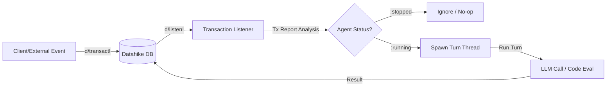
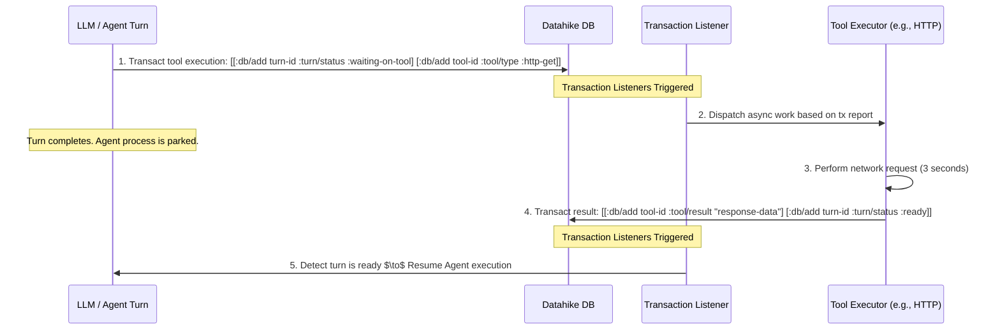
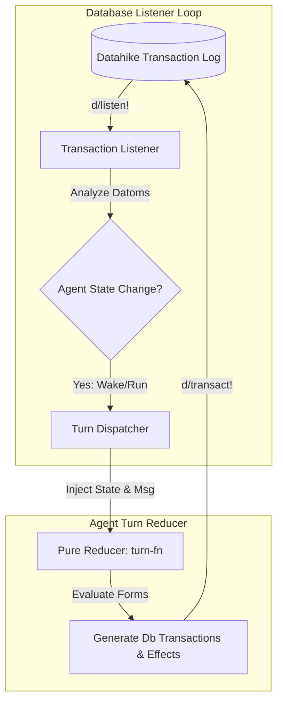

# Seon Architecture & Design Research: Agentic Loops & State Management

This document provides a rigorous architectural evaluation of state management patterns, event-driven concurrency, and transaction-driven loop systems in the Clojure(Script) ecosystem to inform the design of **Seon**, an AI agent runtime.

---

## Architectural Context & Constraints

- **Runtime**: ClojureScript running on Node.js (with a future compilation path to WASM/WASI).
- **Database**: Embedded Datahike (EAV bitemporal datom DB with transaction listeners via `d/listen!`).
- **Concurrency**: $N$ concurrent agents operating on a single shared Datahike instance.
- **Agent State**: Simple state machines transitioning primarily between `:running` and `:stopped`.
- **Execution Turn**: Single LLM call evaluated against an ephemeral execution surface.
- **Resumability**: The Datahike transaction log is the authoritative source of state. Interrupted turns must recover gracefully to `:interrupted` upon restart.

---

## Section A: Message-Driven Dispatch & Elm/re-frame Adaptations

This section analyzes Clojure projects adapting the Elm Architecture (TEA) or `re-frame`-like message-driven dispatch outside of traditional browser UI contexts.

### 1. Citrus

- **URL**: [clj-commons/citrus](https://github.com/clj-commons/citrus)
- **Status**: **Active (Maintained)**. Originally created as `scrum` and later renamed to `citrus`. Currently maintained under the `clj-commons` organization.
- **Architectural Model**: Re-frame-inspired state management designed for the Rum UI library. It decouples state into a single atom managed by a `Reconciler`. Logic is structured into "controllers" that define pure multi-methods for actions. Side effects are returned as data (effects) and executed by an effect handler.
- **Fit for Seon**: **Fair**. While Citrus successfully decouples side effects from state reduction and supports asynchronous, batched updates, it remains tied to Rum's reconciliation lifecycle and is designed around human-in-the-loop frontend updates.

### 2. re-frame-side-server (and Server-side re-frame)

- **URL**: N/A (No active public repository)
- **Status**: **Abandoned / Conceptual**. The concept of running re-frame on the server has been discussed in Clojure groups, but no standalone, production-ready backend framework exists.
- **Architectural Model**: Attempts to run re-frame's global `app-db` atom and event dispatch queue on a JVM backend. It relies on Reagent reactions which are not optimized for concurrent multi-tenant execution.
- **Fit for Seon**: **Poor**. re-frame's global, single-atom state model is designed for a single-user browser session. Forcing it to handle $N$ concurrent agents on a backend leads to severe thread contention, state leakage, and memory management issues.

### 3. Missionary

- **URL**: [leonoel/missionary](https://github.com/leonoel/missionary)
- **Status**: **Highly Active**. Maintained by Leo Talbot and serves as the core execution engine of Hyperfiddle Electric.
- **Architectural Model**: A functional effect and streaming library. It models asynchronous operations as `Task` (single-value producer) and continuous state transitions as `Flow` (multiple-value producer). It provides a custom functional compiler that evaluates reactive directed acyclic graphs (DAGs) with strict process supervision, glitch-free propagation, and automatic cancellation.
- **Fit for Seon**: **Good**. Missionary is highly suited for managing asynchronous tasks (like LLM calls and file I/O) and coordinating complex reactive state pipelines. However, it is not a message-driven dispatch system. Its dataflow model requires declaring the system as continuous-time signals rather than discrete state machines. The cognitive load and learning curve are steep.

### 4. refx / rfx

- **URL**: [factorhouse/rfx](https://github.com/factorhouse/rfx) / [fbeyer/refx](https://github.com/fbeyer/refx)
- **Status**: **Active**. Factor House's `rfx` is a modern, hook-based alternative to re-frame.
- **Architectural Model**: Implements re-frame's subscription and event pattern but replaces Reagent with modern React Hooks.
- **Fit for Seon**: **Poor**. Tightly coupled to React 18+ runtime environments and browser execution semantics.

### 5. Hyperfiddle Electric

- **URL**: [hyperfiddle/electric](https://github.com/hyperfiddle/electric)
- **Status**: **Highly Active**.
- **Architectural Model**: A compiler and runtime for full-stack reactive applications. It compiles a single Clojure program into coordinated client and server processes that stream state changes over WebSockets using Missionary DAGs.
- **Fit for Seon**: **Fair**. Electric is a paradigm shift for client-server sync but is not designed to model long-running, autonomous background agents that execute LLM loops and write to a bitemporal database.

---

## Section B: Datomic / Datahike + Effects & Saga Patterns

This section evaluates Clojure projects leveraging Datomic/Datahike/Datascript log streams, reactive queries, and transaction listeners as event buses.

### 1. Biff Web Framework (XTDB/Crux Transaction Listeners)

- **URL**: [jacobobryant/biff](https://github.com/jacobobryant/biff)
- **Status**: **Highly Active**.
- **Architectural Model**: Biff structures backend services around XTDB. It features a transaction listener component (`use-xtdb-tx-listener`) that subscribes to XTDB’s transaction log. Modules register `:on-tx` hooks. When a transaction completes, the hook receives the transaction operations. It inspects them and triggers asynchronous effects, denormalizes views, or schedules background worker jobs.
- **Fit for Seon**: **Great**. Biff's pattern of using transaction listeners as a wake bus for asynchronous backend processes is directly applicable to Datahike. It enables a pure event-sourced agent loop where database writes trigger execution turns.

### 2. Posh

- **URL**: [mpdairy/posh](https://github.com/mpdairy/posh)
- **Status**: **Abandoned**. Last major updates were in 2018.
- **Architectural Model**: Binds Reagent views directly to a DataScript database via reactive pull queries. It listens to DataScript transactions and automatically recalculates queries that overlap with modified datoms.
- **Fit for Seon**: **Poor**. It is designed strictly for UI rendering updates and suffers from performance degradation with large schemas or complex queries.

### 3. Datsync

- **URL**: [metasoarous/datsync](https://github.com/metasoarous/datsync)
- **Status**: **Abandoned / Prototype**. Inactive for several years.
- **Architectural Model**: Syncs a central Datomic database with local client-side DataScript databases. It computes transaction diffs, translates Datomic IDs to DataScript temporary IDs, and handles optimistic writes.
- **Fit for Seon**: **Poor**. While the diffing concepts are valuable, the library is outdated and is not built to act as an agent runtime.

### 4. Walkable

- **URL**: [walkable-server/walkable](https://github.com/walkable-server/walkable)
- **Status**: **Dormant**.
- **Architectural Model**: A SQL querying library using Datomic pull syntax.
- **Fit for Seon**: **Poor**. No agentic or state-machine patterns.

### 5. Hodur

- **URL**: [hodur-org/hodur-engine](https://github.com/hodur-org/hodur-engine)
- **Status**: **Dormant**.
- **Architectural Model**: Declarative data-driven domain modeling engine that compiles schema definitions to Datomic, Lacinia (GraphQL), and spec.
- **Fit for Seon**: **Poor**. Focuses entirely on static schema compilation, not active runtimes.

### 6. Hypercrud

- **URL**: N/A
- **Status**: **Archived**. Precursor to Hyperfiddle, abandoned around 2017.
- **Fit for Seon**: **Poor**.

---

## Section C: core.async.flow in Practice

This section evaluates the practical viability of `clojure.core.async.flow` for managing the execution topology of long-running agent workflows.

### 1. Library Maturity & Status

`clojure.core.async.flow` was introduced in April 2025 (in `core.async` version `1.9.808-alpha1`). It is currently in **Alpha** status. The API is subject to change, and community adoption is sparse, limited to experimental monitoring tools like `core.async.flow-monitor` and plugins for FlowStorm.

### 2. Execution Architecture

A flow is defined as a directed graph (a topology map) of processes. Each process wraps a "step function":
$$\text{step-fn}: (\text{state}, \text{input-msg}) \to (\text{new-state}, [\text{output-msgs}])$$
Step functions are pure, communication-free, and decoupled from channels and threads. The `flow` runtime handles the orchestration, injecting inputs from source channels and routing output messages to destination channels.

### 3. Analysis of core.async.flow Questions

- **Real-world stateful workflows**: There are few to no documented production systems using `core.async.flow` for long-running workflows. It remains an experimental utility.
- **Agent/Actor lifecycle**: `flow` provides explicit functions (`start`, `stop`, `pause`, `resume`) to control process execution. However, these are managed via Java-centric threading policies and thread pools.
- **Parking**: Processes park when their input channels are empty. When an external event arrives, the core.async runtime schedules the process's thread to execute the step function.
- **Persistent State**: The `flow` runtime stores process state in memory. If the state must live in a database, the step function must return the database write as an output message (an effect), which is routed to a specialized "database sink" process. This maintains the purity of the step function.
- **Observability**: Features like `:flow/ping`, `ping-proc`, and the `flow-monitor` UI are mature for debugging, but they rely on JVM execution inspection.
- **Per-Namespace organization**: There is no native namespace mapping. The topology is declared as a single flat data structure.
- **WASM / Distributed deployment**: **This is the critical failure point.** `clojure.core.async.flow` relies heavily on JVM executor services (`java.util.concurrent`). It does not run in ClojureScript (Node.js or browser) because CLJS lacks multi-threading and blocking operations. There is no cross-process or distributed support.

### Fit for Seon: **Poor**

Due to its JVM lock-in, alpha status, and lack of ClojureScript compatibility, it cannot be used in a CLJS/WASM pod environment.

---

## Section D: Agent / Actor Frameworks in Clojure

This section looks at historical and current actor frameworks, process lifecycle managers, and LLM-centric loops.

### 1. Quasar / Pulsar

- **URL**: [puniverse/pulsar](https://github.com/puniverse/pulsar)
- **Status**: **Abandoned**. Superseded by virtual threads (Project Loom) in JDK 21.
- **Architectural Model**: Provided lightweight threads (fibers), Go-like channels, and actor models on the JVM using bytecode instrumentation.
- **Fit for Seon**: **Poor**. Relies on a Java Agent runtime and bytecode manipulation; incompatible with CLJS and WASM.

### 2. Stuart Sierra's Component / Integrant

- **URL**: [stuartsierra/component](https://github.com/stuartsierra/component) / [weavejester/integrant](https://github.com/weavejester/integrant)
- **Status**: **Active (Stable)**. Industry standard.
- **Architectural Model**: Manages the dependency injection and lifecycle (`start`, `stop`) of system state.
- **Fit for Seon**: **Good (Infrastructure only)**. These libraries are excellent for managing the runtime environment of the pod (e.g., database connections, file system handles, API client lifecycles), but they do not provide the execution loop or state reduction engine for the agents themselves.

### 3. Bosquet

- **URL**: [zmedelis/bosquet](https://github.com/zmedelis/bosquet)
- **Status**: **Active (Experimental)**.
- **Architectural Model**: An LLMOps library featuring prompt templating (using Selmer) and prompt chaining/composition (using Pathom). It includes abstractions for simple agent tool-calling loops.
- **Fit for Seon**: **Fair**. Bosquet provides useful references for prompt generation and tool parsing, but it does not address persistent state, bitemporal queries, or multi-agent execution loops.

---

## Section E: Architectural Scenario Walkthroughs

We evaluate how the three most promising design patterns handle Seon's core execution scenarios.

| Scenario | Pattern 1: Pure TEA / re-frame on Pod | Pattern 2: DB Tx-Log Event-Sourcing (Biff-like) | Pattern 3: Missionary Reactive Flow |
| :--- | :--- | :--- | :--- |
| **(i) Waking a `:stopped` agent** | Event queued in memory $\to$ process wakes and runs Turn. | `d/transact!` message $\to$ `d/listen!` triggers listener $\to$ transacts status to `:running` $\to$ spawns Turn. | Reactive query detects new datom $\to$ wakes signal stream $\to$ executes Turn. |
| **(ii) Resolving an async Turn fn** | Turn emits `[:fetch-url]` effect $\to$ callback dispatches `[:fetched-result]` event back to loop. | Turn writes async job to DB $\to$ runner completes fetch $\to$ transacts result to DB $\to$ listener resumes agent. | Flow awaits a Missionary task $\to$ resolves natively $\to$ propagates result downstream. |
| **(iii) Agent-to-Agent communication** | A emits effect $\to$ transacts message $\to$ B's queue receives event. | A transacts message to B $\to$ DB listener detects write $\to$ wakes B $\to$ B runs and transacts reply. | A's flow output is bound to B's flow input $\to$ reactive graph propagates values. |
| **(iv) Cycle prevention** | Queue maintains a recursion depth counter in event metadata. | Transaction metadata holds origin tags; listener rejects recursive triggers. | Stream operators include rate-limiters or cycle detectors to halt loops. |
| **(v) Pod restart recovery** | Reads DB checkpoint $\to$ replays event log to reconstruct active state. | Queries DB for incomplete Turn markers $\to$ transitions them to `:interrupted`. | Must rebuild in-memory flow graph by querying database from scratch. |

### Detailed Execution Trace of Scenario (ii): Async Turn Resolution

---

## Evaluation Summary Matrix

| Library/Pattern | CLJS/WASM Ready? | Concurrency Support | Resumability / Crash Safety | Architectural Fit | Overall Rating |
| :--- | :--- | :--- | :--- | :--- | :--- |
| **Citrus** | Yes | Fair (Single-atom bottleneck) | Poor (Requires manual persistence) | UI State Manager | **Fair** |
| **Missionary** | Yes | Great (Glitch-free DAGs) | Poor (Requires graph rebuild) | Reactive Pipelines | **Good** |
| **Biff (Tx Listeners)** | Yes | Excellent (DB-backed queues) | Excellent (Tx log is authoritative) | Event-Driven backend | **Great** |
| **core.async.flow** | **No** (JVM only) | Good | Poor (In-memory state) | Concurrency manager | **Poor** |
| **Pulsar / Quasar** | **No** (JVM only) | Excellent | Poor (In-memory fibers) | Actor Model | **Poor** |
| **Integrant / Component** | Yes | N/A | N/A | Lifecycle Management | **Good (for infra)** |

---

## Top-Line Recommendation

Seon should adopt a **Hybrid Architecture** combining **Datomic/Datahike Transaction-Log Event-Sourcing (Biff-inspired)** with a **Pure Elm/re-frame Reduction Pattern** for individual turn execution.

### Justification

1. **Alignment with ClojureScript and WASM Constraints**
   By relying on Datahike and standard ClojureScript primitives (atoms and core.async channels), this architecture avoiding JVM-specific libraries like `core.async.flow` or Quasar. It compiles to Node.js and is ready for WASM-wasi.

2. **The Database is the Message Bus**
   In Seon, agents are collaborative and operate on a shared DB. By treating the Datahike transaction log as the message bus:
   - **No duplicate messaging queues**: A message transacted from Agent A to Agent B is stored durably, and B's wake-up trigger is driven by the same transaction.
   - **Bitemporal Auditing**: The entire history of agent interactions is queryable at any point in time.

3. **Pure Functional Core, Imperative Shell**
   Each Turn of an agent is run through a pure reducer function:
   $$\text{turn-fn}: (\text{agent-db-slice}, \text{incoming-event}) \to (\text{new-datoms}, \text{effects})$$
   This makes debugging and testing straightforward. You can mock any agent turn by feeding it a snapshot of database datoms and asserting on the returned transactions and effects.

4. **Resumability & Crash Safety**
   If the pod restarts mid-turn, there is no volatile, in-memory state to reconstruct. On boot, the runtime queries Datahike for any agent entity marked `:running` but lacking a matching completed turn transaction. The runtime marks those turns as `:interrupted` and writes a system message to the log, allowing the agent to resume execution from a clean bitemporal checkpoint.

### Implementation Checklist

- [ ] Use **Integrant** to manage the lifecycle of the Datahike connection and the event-loop listener threads.
- [ ] Implement a single centralized `d/listen!` hook on the Datahike connection.
- [ ] Filter transaction reports for updates to agent status attributes (`:agent/status`, `:agent/inbox`).
- [ ] Dispatch tasks to a core.async thread/worker pool in ClojureScript to execute agent turns.
- [ ] Represent each agent turn as a pure function returning a vector of transaction data (datoms) and external effects.
