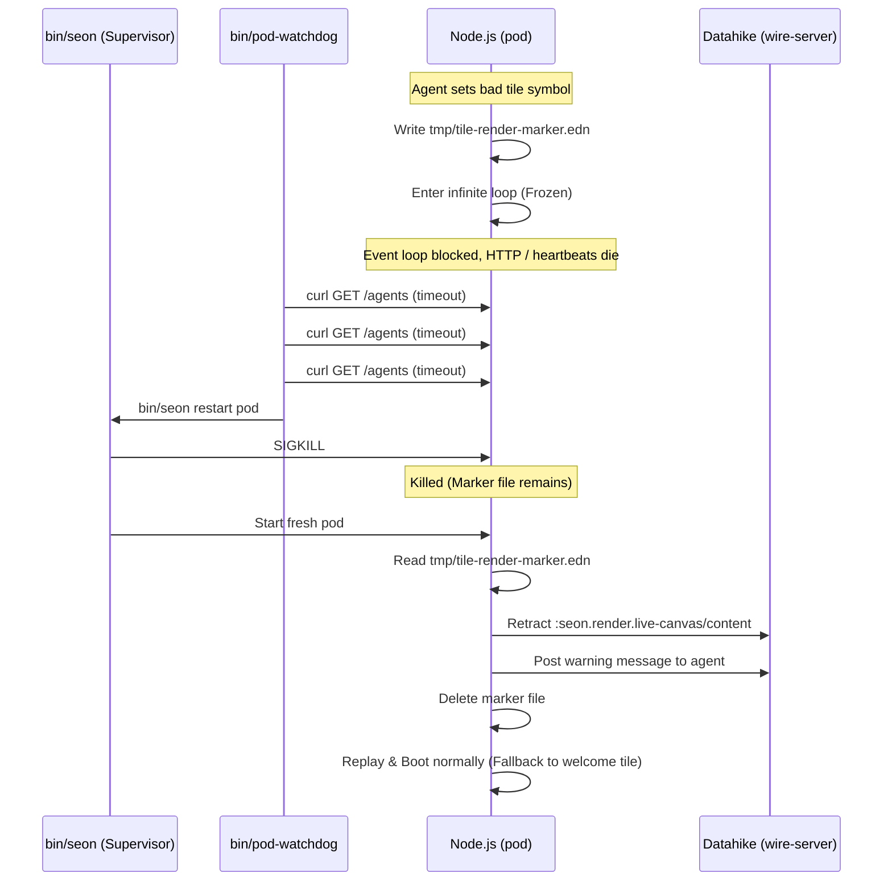

# Research Proposal: Live Tile Lockup Safety & Recovery

## TL;DR
A synchronous infinite loop in an agent's live-tile rendering function freezes the single-threaded Node.js event loop, disabling HTTP, SSE, and the supervisor heartbeat. Since synchronous hangs cannot be interrupted from within the same JS thread, we propose an **external watchdog + crash-marker recovery** system:
1. **Watchdog:** A simple supervisor-managed background process (`bin/pod-watchdog`) that polls the HTTP surface. If it gets no response after 3 retries (with a grace period for booting), it triggers `./bin/seon restart pod`.
2. **Crash-Marker:** Before calling `html-render` in `render-agent-tile`, the pod writes a lightweight marker (`tmp/tile-render-marker.edn`) containing the offending agent and tile function symbol. The marker is deleted on completion. Cost is zero for welcome/static tiles.
3. **Boot Recovery:** On boot, before starting the web server or booting agents, the pod checks for the marker. If found, it retracts the offending tile attribute from the DB, posts a warning message to the agent, and deletes the marker—breaking the crash loop.

---

## 1. The Reliability Problem (How the freeze occurs)

The Seon agent runtime utilizes a single-threaded Node.js event loop:
- In [client.cljs:L1872-2018](file:///Users/sean/src/seon/src/seon/client.cljs#L1872-2018), `start-agent!` boots the pod and spins up the HTTP/SSE server [serve.cljs:L531-590](file:///Users/sean/src/seon/src/seon/web/serve.cljs#L531-590).
- If an agent points `:seon.render.live-canvas/content` at a symbol that performs a non-terminating synchronous loop (such as runaway recursion or a `while` loop), that execution blocks the single JavaScript execution thread.
- Existing async timeouts (like `!timeout-ms` in [eval.cljs:L74](file:///Users/sean/src/seon/src/seon/eval.cljs#L74) and `race-timeout` in [eval.cljs:L115-125](file:///Users/sean/src/seon/src/seon/eval.cljs#L115-125)) rely on `js/setTimeout` and Promises. Because the event loop is blocked, the timer events never fire.
- The render path in `render-agent-tile` in [render.cljs:L376-435](file:///Users/sean/src/seon/src/seon/render.cljs#L376-435) has no protection. The entire process hangs, and the shell supervisor's heartbeat in [client.cljs:L184-193](file:///Users/sean/src/seon/src/seon/client.cljs#L184-193) stops.

---

## 2. Recommended Solution: Watchdog + Boot Recovery

We recommend a two-part recovery mechanism:
1. An **External HTTP Watchdog** daemon monitored by the process supervisor `bin/seon`.
2. A **Durable Crash-Marker File** written in ClojureScript just before executing dynamic tile rendering, checked and cleaned on boot.



---

## 3. Concrete Implementation Steps

### Step 1: Create the Watchdog Script
Create a new bash script `bin/pod-watchdog` that checks if the pod is running, ignores it during the 2-minute boot sequence (via standard `find -mmin` check), and polls the HTTP port. If the poll fails 3 times, it triggers a pod restart.

Create [bin/pod-watchdog](file:///Users/sean/src/seon/bin/pod-watchdog):
```bash
#!/usr/bin/env bash
# bin/pod-watchdog — HTTP health checker for the pod.
set -euo pipefail

SEON_ROOT="$(cd "$(dirname "$0")/.." && pwd)"
cd "$SEON_ROOT"

INTERVAL=15
TIMEOUT=5

is_pod_running() {
  [ -f tmp/proc/pod/pid ] || return 1
  local pid
  pid="$(cat tmp/proc/pod/pid 2>/dev/null || true)"
  [ -n "$pid" ] || return 1
  kill -0 "$pid" 2>/dev/null
}

check_pod_http() {
  [ -f tmp/seon-port ] || return 1
  local port
  port="$(cat tmp/seon-port 2>/dev/null || true)"
  [ -n "$port" ] || return 1
  curl -fsS -m "$TIMEOUT" -o /dev/null "http://127.0.0.1:$port/agents" 2>/dev/null
}

echo "Watchdog started. Monitoring pod..."
while true; do
  sleep "$INTERVAL"
  if is_pod_running; then
    # Skip if pod was started less than 2 minutes ago (grace period for compile/boot)
    if [ -n "$(find tmp/proc/pod -name pid -mmin -2 2>/dev/null)" ]; then
      continue
    fi
    
    if ! check_pod_http; then
      echo "Watchdog: Pod HTTP unresponsive, retrying in 5s..."
      sleep 5
      if is_pod_running && ! check_pod_http; then
        echo "Watchdog: Pod HTTP still unresponsive, final retry in 5s..."
        sleep 5
        if is_pod_running && ! check_pod_http; then
          echo "Watchdog: Pod is frozen. Restarting..."
          ./bin/seon restart pod
        fi
      fi
    fi
  fi
done
```

### Step 2: Register Watchdog in `bin/seon`
Modify [bin/seon](file:///Users/sean/src/seon/bin/seon) to add `watchdog` to the stack of processes, so `bin/seon start all` and `bin/seon stop all` manage it automatically.

Edit [bin/seon](file:///Users/sean/src/seon/bin/seon#L163-197):
```diff
     # out/'s location and would otherwise only see seon's node_modules).
     # SEON_EXTRA_SRC itself needs no mapping here: it inherits through
     # nohup to the pod, where the boot indexer's read-src-file probes it.
     # SEON_DEBUG_CAPTURE=1 — per-turn prompt+response capture ON by default for
     # EVERY agent (logs/turns/<agent>/<turn-idx>-<id>/: prompt.txt, response.txt,
     # response.edn). NOTE: currently UNBOUNDED — nothing calls seon.debug/prune!
     # yet; add a per-agent keep-N cap before long-running production use.
     pod)         echo "npm run css:build && exec env SEON_FS_ROOT=\"$SEON_ROOT\" SEON_FS_READ_ONLY=1 SEON_DEBUG_CAPTURE=1$(extra_npm_node_path) node out/client/main.js" ;;
+    watchdog)    echo "exec env SEON_ROOT=\"$SEON_ROOT\" bash bin/pod-watchdog" ;;
     cljs-watch)  echo "clj$(extra_src_sdeps) -M:cljs watch client$(extra_preload_merge)" ;;
```

Edit [bin/seon](file:///Users/sean/src/seon/bin/seon#L211-219):
```diff
 stack_processes() {
   # Dependency-ordered stack for `start all` (stop reverses the order):
   # cljs-watch builds out/client/main.js which the pod execs; the pod's
   # boot ping is fail-loud (bounded ~10s retry, seon.store.wire/ping!)
   # against the wire-server's socket. `jvm` is deliberately NOT in the
   # stack — it hosts the shared nREPL 7888 that every agent depends on and
   # has no dependency on these processes; see the header comment.
-  echo "cljs-watch wire-server pod"
+  echo "cljs-watch wire-server pod watchdog"
 }
```

### Step 3: Implement Crash-Marker writing in `render.cljs`
Modify [src/seon/render.cljs](file:///Users/sean/src/seon/src/seon/render.cljs) to write a marker file containing `{:agent-id id, :value value}` before rendering a custom function, and delete it upon completion.

Edit [src/seon/render.cljs](file:///Users/sean/src/seon/src/seon/render.cljs#L376-435):
```diff
+(defn- write-marker! [id value]
+  (let [fs (js/require "fs")
+        path "tmp/tile-render-marker.edn"
+        data (pr-str {:agent-id id :value value})]
+    (.writeFileSync fs path data)))
+
+(defn- clear-marker! []
+  (let [fs (js/require "fs")
+        path "tmp/tile-render-marker.edn"]
+    (try
+      (.unlinkSync fs path)
+      (catch :default _ nil))))
+
 (defn render-agent-tile
   "Render the agent's live tile — the one HTML surface the agent
    dynamically rewrites (by transacting a qualified fn symbol or
    literal hiccup onto `:seon.render.live-canvas/content` on its own
    agent entity; see seon.render.live-tile's ns docstring for the
    full contract).
 
    Returns `:seon.render/html-response`. A renderer that THROWS does
    NOT vanish: the response is `seon.render.live-canvas/error-response`
    — fallback card for the human, `:seon.render/ai` twin for the agent.
    nil hiccup only when the agent entity doesn't exist (the tile never
    crashes its caller)."
   {:malli/schema [:=> [:cat :seon.render/tile-request] :seon.render/html-response]}
   [{:seon.agent/keys [id] :seon.db/keys [db]}]
   (let [db  (or db @db/*conn*)
         ;; Guarded pull (seon.db/pull, 65dfc90): registered-but-never-
         ;; installed attrs (e.g. ::content on a fresh store) are
         ;; filtered, typos throw legibly. The remaining try covers only
         ;; the unresolvable-lookup-ref throw (missing agent → nil
         ;; hiccup, the documented contract).
         ent (try (db/pull db tile-entity-pattern [:seon.agent/id id])
                  (catch :default _ nil))]
     (if (nil? (:seon.agent/id ent))
       {:seon.render/hiccup nil}
       (let [{:seon.render.live-canvas/keys [value]}
             (live-canvas/wired-content {:seon.render/entity ent})
             input {:seon.db/db         db
                    :seon.agent/id      id
-                   :seon.render/entity ent}]
+                   :seon.render/entity ent}
+            custom-fn? (and (qualified-symbol? value)
+                            (not= value 'seon.render.live-canvas/welcome))]
         (try
-          (let [resp   (html-render value input)
-                hiccup (:seon.render/hiccup resp)]
-            ;; SERIALIZATION joins the same guarded path as invocation
-            ;; (serialization-boundary hardening): a structurally-broken hiccup (e.g. a
-            ;; vector-of-vectors child) doesn't throw at html-render —
-            ;; it used to escape here and detonate LATER at page
-            ;; serialization, 500ing /agent/<id>, the grid, and
-            ;; mid-boot-replay renders. Two layers, one catch:
-            (when (some? hiccup)
-              ;; (a) serializer-faithful structural walk — a legible
-              ;;     message locating the defect (path included);
-              (when-some [{:seon.render.live-canvas/keys
-                           [structure-path structure-message]}
-                           (live-canvas/hiccup-structure-error hiccup)]
-                (throw (ex-info (str "invalid tile hiccup — "
-                                     structure-message
-                                     " (at path " (pr-str structure-path)
-                                     ")")
-                                {:seon.render.live-canvas/structure-path
-                                 structure-path})))
-              ;; (b) backstop: PROVE the hiccup serializes. ->string is
-              ;;     pure + deterministic, so success here guarantees
-              ;;     the page render embedding this hiccup cannot throw
-              ;;     on this tile.
-              (html/->string hiccup))
-            resp)
+          (when custom-fn?
+            (write-marker! id value))
+          (let [resp   (html-render value input)
+                hiccup (:seon.render/hiccup resp)]
+            (when custom-fn?
+              (clear-marker!))
+            ;; SERIALIZATION joins the same guarded path as invocation...
+            (when (some? hiccup)
+              (when-some [{:seon.render.live-canvas/keys
+                           [structure-path structure-message]}
+                          (live-canvas/hiccup-structure-error hiccup)]
+                (throw (ex-info (str "invalid tile hiccup — "
+                                     structure-message
+                                     " (at path " (pr-str structure-path)
+                                     ")")
+                                {:seon.render.live-canvas/structure-path
+                                 structure-path})))
+              (html/->string hiccup))
+            resp)
           (catch :default e
+            (when custom-fn?
+              (clear-marker!))
             (live-canvas/error-response
               {:seon.db/error                 (err/->map e)
                :seon.render.live-canvas/content value})))))))
```

### Step 4: Implement Boot Recovery inside `client.cljs`
Define `recover-tile-crash!` in [src/seon/client.cljs](file:///Users/sean/src/seon/src/seon/client.cljs) and invoke it inside `start-agent!` before evaluating any replayed code namespaces.

Edit [src/seon/client.cljs](file:///Users/sean/src/seon/src/seon/client.cljs#L1872-2018):
```diff
+(defn ^:async recover-tile-crash!
+  "Checks for the crash-marker file. If it exists, reads the agent-id
+   and the hung tile value, retracts the live tile content from the database
+   (falling back to welcome), writes a warning message to the agent,
+   and deletes the marker."
+  [conn]
+  (let [fs   (js/require "fs")
+        path "tmp/tile-render-marker.edn"]
+    (when (.existsSync fs path)
+      (try
+        (let [content (.readFileSync fs path "utf8")
+              marker  (cljs.reader/read-string content)
+              {:keys [agent-id value]} marker]
+          (log/info-console! "seon.client/recover-tile-crash!"
+                             (str "CRASH DETECTED: agent " agent-id
+                                  " hung on tile value " (pr-str value)))
+          (let [db  @conn
+                ent (db/pull db [:db/id :seon.render.live-canvas/content] [:seon.agent/id agent-id])
+                val (:seon.render.live-canvas/content ent)]
+            (when val
+              (log/info-console! "seon.client/recover-tile-crash!"
+                                 (str "Retracting tile content: " (pr-str val)))
+              (await (db/transact! conn
+                                   [[:db/retract (:db/id ent) :seon.render.live-canvas/content val]]
+                                   {:seon.db/origin :system})))
+          (log/info-console! "seon.client/recover-tile-crash!" "Posting warning message to agent...")
+          (await (agent/message!
+                   {:seon.agent.message/from    [:seon.user/id "user"]
+                    :seon.agent.message/to      [[:seon.agent/id agent-id]]
+                    :seon.agent.message/content "your tile fn hung the render; it was reset; tile fns must be pure, fast, terminating db->hiccup renders — no loops, blocking, or writes"
+                    :seon.agent.message/force   true})))
+        (catch :default e
+          (log/error-console! "seon.client/recover-tile-crash!" "Recovery failed" e))
+        (finally
+          (try (.unlinkSync fs path) (catch :default _ nil)))))))
+
 (defn ^:async start-agent!
   "Bring up the pod's agents: open conn, init bootstrap-CLJS, then
    RESUME every active agent in the cluster store — the agent entities
    WITHOUT `:seon.agent/completed-at` (see `seon.agent/complete!`) —
    re-arming each one's user-message trigger. A fresh agent is minted
    ONLY when the store has zero resumable agents (genuine first boot)
    or on the explicit create path (`:mint? true` — POST /agents/new).
    Identity is durable: restarting the pod does NOT accumulate agents.
...
                 prune-stats   (await (prune-core-ghosts! conn))
                 _             (log/info-console!
                                 "seon.client/start-agent!"
                                 (str "boot-index GC: "
                                      (count (:seon.client/pruned prune-stats))
                                      " ghost row(s) pruned"))
+                ;; Boot Recovery: Wires out offending tiles that crashed the event loop
+                _             (await (recover-tile-crash! conn))
                 ;; Load the agent-authored DB LAYER on top of the compiled
                 ;; package: each agent ns's reconstituted whole source, in
                 ;; dependency order. GLOBAL (not per-agent) — runs ONCE per
                 ;; boot, before any per-agent setup.
```

---

## 4. Specific Design Answers

### 1. Simplest reliable DETECTION of a frozen pod
- **Detection Method:** A simple HTTP poll (`curl`) against `http://127.0.0.1:<port>/agents`. This endpoint is handled by Node's single thread. If that thread is in an infinite loop, TCP connections will queue up or fail immediately.
- **Location:** The loop runs inside `bin/pod-watchdog` (spawning background tasks managed by the supervisor).
- **Interval/Threshold:** Check every 15s. Retries twice after 5s intervals. If all 3 fail, it triggers `restart pod`.
- **Uptime Grace Period:** We query `find tmp/proc/pod -name pid -mmin -2` to check the age of the `pid` state file. If modified within 2 minutes, the poll is bypassed to allow compiling and bootstrap to finish.

### 2. The crash-MARKER file
- **Recording content:** `{:agent-id agent-id, :value value}`.
- **Node `fs.writeFileSync` flushing:** In Node, `fs.writeFileSync` is a synchronous block that commits the write to the operating system's write queue before resolving. Even though a subsequent sync loop blocks Javascript execution, the filesystem write is completed at the system call layer. It will reliably survive process termination (`SIGTERM` or `SIGKILL`).
- **Cost Negligibility:** Gated on `(and (qualified-symbol? value) (not= value 'seon.render.live-canvas/welcome))`. Welcome tiles and static hiccup vectors bypass file writing completely.

### 3. Boot RECOVERY ordering
- **Placement:** Placed inside `start-agent!` right after `prune-core-ghosts!` and before `replay-program-graph!`.
- **Reasoning:** 
  1. `conn` and `db/*conn*` are bound, so we have DB write access.
  2. Runs before `replay-program-graph!`, ensuring we clean the bad tile attribute before compile loads.
  3. Runs before `boot-one-agent!`, so agent message triggers are not yet installed and won't double-fire during boot.
  4. Runs before `web.serve/start!`, meaning the HTTP server isn't listening yet, preventing any incoming web or SSE render requests from causing a race.

### 4. Avoiding supervisor conflicts
- **Managed Lifecycle:** Spawning `watchdog` as a standard registered supervisor process via `bin/seon` guarantees it is started and stopped alongside the stack.
- **Mutex Isolation:** The watchdog triggers a restart by calling `./bin/seon restart pod`. Since `bin/seon` manages restarts atomically via directory-based locks (`tmp/proc/<name>/lock`), this does not race with manual or agent-originated restarts.

### 5. Why other options are rejected
- **Worker thread isolation:** Moving compilation and HTML rendering to a Node `worker_thread` is possible, but complex. Resolving ClojureScript namespace scopes, lazy state lookups, and Datahike connection serialization across threads is heavy and prone to compile issues.
- **Loop Counters / Code instrumentation:** Injecting loop counters into user ClojureScript during `eval` does not catch recursions or functions defined in libraries. It is slow and intrusive.

---
