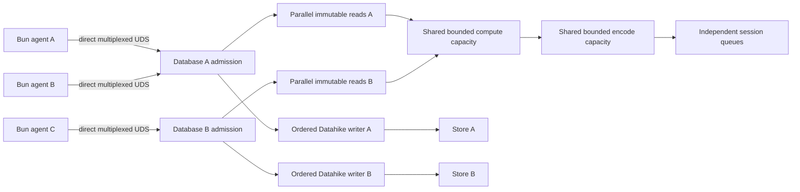

# Database authority mesh recommendation — 2026-07-15

## Decision posture

This is the integrated recommendation after the source audits and disposable
falsifiers. It is deliberately not a settled architecture or implementation
authorization. Sean owns the product tradeoffs collected below. The boundary is
now sufficiently grounded to write the final PRD after those decisions.

The evidence comes from [[datahike-cache-identity-2026-07-15]],
[[datahike-resource-lifetime-2026-07-15]],
[[datahike-capability-boundary-2026-07-15]],
[[bun-jvm-parallel-transport-2026-07-15]],
[[direct-vs-broker-density-2026-07-15]],
[[replica-lifetime-fairness-2026-07-15]], and
[[protocol-encoding-framing-2026-07-15]], plus the outside-proposal audit in
[[gemini-isolation-ipc-audit-2026-07-15]].

## Recommended architecture

Use one JVM process as a host for many independent Datahike database owners,
not as one global execution lane. Each active physical database/branch owns its
existing Datahike connection, connection reference count, immutable values,
query/cache scope, listener key, and ordered writer. Independent databases have
independent writers and may commit concurrently.

Immutable query, pull, index, history, and temporal work runs concurrently over
captured database values. Exact identical requests at one exact value join one
Datahike-owned single-flight computation. Different requests, values, and
databases never inherit that coordination. Per-database admission queues feed
shared bounded compute and encoding capacity through fair or weighted
round-robin selection; there is no global request FIFO.

Each active agent runs in its own supervised Bun child and owns one persistent,
multiplexed, native Unix-domain socket directly to the authority. Bun IPC is the
supervisor control plane, not the database data plane. A child crash affects its
session; a supervisor or broker is not inserted into every query path.

The existing Babashka operator remains the outer process owner through
`babashka.process`: it starts and observes the one JVM authority and top-level
Bun cluster processes, owns logs and terminal results, and performs normal
tree-aware shutdown. Inside a Bun cluster, `Bun.spawn` owns agent children.
Babashka process orchestration and GraalVM native packaging are independent
choices; this architecture requires no per-database native image.

Datahike remains transport-free. Its existing declarative API specification
describes capabilities and operation schemas; ordinary Datahike functions are
the in-process execution interface. Seon owns authenticated sessions, durable
coordinates, request identities, fair admission, transport, backpressure,
encoding, provenance, fencing, and errors-as-values.

The initial protocol uses Transit JSON with linear framing, exact partial-write
queues, semantic pages, and shared encoded result bodies. One exact completed
Datahike result is encoded once and sent through independent session cursors.
Codec replacement remains versioned and reversible.

## Parallelism model

No global ordering exists. Shared capacity is a hardware bound selected fairly
across ready database queues. Reads overlap writes because they target captured
immutable values. Response delivery releases compute capacity before waiting on
a socket.

## Datahike changes at the closest seam

Strengthen the maintained Datahike source in place:

1. Replace `[hash max-tx max-eid]` with exact connection scope plus immutable
   value/view identity. The current key has a demonstrated cross-database false
   cache hit.
2. Retain the completed-result weighted cache and add exact-key single-flight,
   generation-fenced scoped eviction, and data-returning metrics.
3. Expose ordinary functions for exact value identity/resolution, cancellation
   signals, cache evidence, and scoped release. Never expose database values or
   synchronization objects remotely.
4. Extend `datahike.api.specification` with the new capabilities rather than
   creating a parallel remote API catalog.
5. Keep real connection acquisition/reference counting and final release as the
   lifecycle authority. Couple final release to listeners, retained value
   handles, in-flight work, and scoped caches without creating another lease
   count.
6. Make committed-report listener handoff bounded and non-blocking so network
   delivery cannot execute in the writer callback.

## Seon authority changes

1. Replace one-database process assumptions with an attachment registry whose
   entries own Datahike references and per-database queues.
2. Extend the one `seon.db.protocol` with capability, acquire, execute-many,
   query/pull/index/history, transact, listen, cancel, page, and release data.
3. Resolve one durable coordinate to one immutable database value per request or
   batch. Never silently reread a moving head inside a derivation.
4. Add request correlation and out-of-order responses over one direct persistent
   socket per child, with bounded in-flight work and bytes.
5. Select ready database work fairly before it acquires shared compute permits.
   Writes enter their own Datahike writer and never wait behind another
   database's read queue.
6. Encode completed shared results once, then deliver through independent
   session cursors and byte budgets.
7. Derive remote listener ownership from `(session, subscription)` keys and
   database interest. Do not broadcast unrelated transactions.
8. Release idle resources through the existing Datahike lifecycle with exact
   generation fencing and observable release evidence.

## Read interface and batching

Per-leaf RPC is rejected. The checkout contains roughly one thousand lexical
references to the synchronous read family. Remote children use honest async
operations plus `execute-many` against one coordinate. Each batch contains
ordinary independent Datahike query/pull/index requests, not an imperative
mini-language. Members may run concurrently and return in deterministic ID
order.

Top-level agent evaluation can auto-await one remote result. Authored functions
that compose remote reads use `^:async` and `await`; core hot paths issue one
batch or a measured named projection rather than a sequence of network awaits.
Lazy remote entities are not emulated.

The strongest initial topology removes Datahike replicas from agent children.
Whether the active web UI retains exactly one cluster-local replica remains a
measured product decision. Headless clusters never retain a UI replica.

## Evidence that selects this candidate

- Four separate 500 ms CPU-bound Bun children completed in 515 ms; child abort
  left the parent and sibling alive.
- Eight simultaneous identical Datahike misses performed eight complete query
  computations. Single-flight belongs beside Datahike's canonical cache key.
- Datahike's current cache key produced a deterministic false result across two
  database values with the same key.
- Datahike already owns an independent transaction and commit queue per
  connection. It does not require a global write queue.
- At 32 children with 256 KiB results, a decoded cluster broker was 2.72 times
  slower at median latency and 2.26 times slower in wall time than direct
  sessions, while queuing 31.9 MiB versus 0.99 MiB at the authority.
- Increasing bounded per-child multiplexing from one to sixteen reduced delayed
  workload completion about 5.5 to 6.4 times without materially worsening p99.
- In the adversarial fairness model, global FIFO made short-database tail
  latency about 517 to 527 ms. Equal per-database selection reduced it to 90 to
  171 ms; bounded priority reduced it to about 19 to 20 ms. Virtual threads did
  not repair FIFO unfairness.
- A cluster-local replica duplicates primary/temporal index roots and its own
  store, search, and query working sets. Direct children retain none.
- Transit MessagePack saved only 9% on the measured large pull but decoded three
  times slower and allocated far more. Generic CBOR failed exact round-trip.
- Encoding one measured pull once for 32 readers could avoid about 29 ms of JVM
  encoding and 126.6 MiB of allocation, a larger win than changing codecs.

## Alternatives and tradeoffs

### One cluster broker for all database traffic

Benefits: fewer authority sessions and one cluster authentication owner.
Costs: an extra process/hop, parse and encode work, a shared byte queue, higher
large-result latency, and a cluster-wide data-plane failure. Total socket
endpoints increase from `2N` to `2N + 2`; they do not decrease.

Recommendation: reject as the default data plane. Retain Bun supervisor IPC for
control and consider opaque routing or bounded broker lanes only if measured
authority session memory dominates at much higher child counts.

### One Datahike replica in every agent child

Benefits: synchronous local reads and no read RPC latency.
Costs: one index/cache working set and full transaction feed per agent, exactly
opposite the shared-computation goal.

Recommendation: reject.

### One replica in the cluster supervisor

Benefits: one shared cluster read copy, existing synchronous UI/render behavior,
and low latency for highly reused local views.
Costs: duplicate indexes/cache versus the authority, full-delta traffic,
replay/recovery machinery, no JVM query sharing, and a supervisor read
bottleneck if agent work is routed through it.

Recommendation: allow only as an active-UI exception if real render benchmarks
beat direct `execute-many` enough to pay for its memory and complexity. Never
route heavy agent work through it by default.

### Direct individual RPC for every database function

Benefits: simplest wire operation mapping.
Costs: broad async contagion and multiplied latency over hundreds of read call
sites.

Recommendation: retain individual operations for ad hoc agent calls but make
coordinate-pinned `execute-many` foundational for core paths.

### Named JVM projections only

Benefits: few calls and maximum server-side optimization.
Costs: moves application/render policy into the database authority and grows a
curated RPC catalog.

Recommendation: add a named projection only when profiling proves one stable,
heavy derivation deserves an owner. Ordinary Datalog/pull plus batching remains
the default.

### Global FIFO plus virtual threads

Benefits: mechanically simple and cheap parked requests.
Costs: does not provide fairness, bound CPU/memory/results, or isolate cluster
tail latency.

Recommendation: reject. Virtual tasks may host admitted blocking lifetimes, but
fair per-database selection precedes all shared capacity acquisition.

### Immediate CBOR or binary protocol

Benefits: potential future mobile/Rust size and decode improvements.
Costs: current generic CBOR is not semantically exact; cross-language schemas,
debug tooling, and migration add substantial surface.

Recommendation: keep versioned Transit JSON until encoding exceeds ten percent
of end-to-end CPU or bytes bind latency/memory after linear framing and byte
sharing. Require at least a 25% realistic win for whole-protocol replacement.

### Chronicle Queue or mmap as the primary protocol

Benefits: Chronicle Queue is strong for ordered append-only persisted JVM event
streams, and immutable mmap bodies may reduce repeated delivery copies for very
large shared results.

Costs: `io.zalky/cues` wraps the Java Chronicle implementation and does not give
Bun a maintained compatible reader. Chronicle adds rolling-log, cursor, wire,
locking, retention, and total-order semantics that do not supply query
correlation, cancellation, per-database fairness, or independent response
backpressure. A shared ordered queue could become another global gate.

Recommendation: do not replace direct UDS with Chronicle Queue. Retain one
narrow experiment: deliver an already-encoded immutable 256 KiB to 4 MiB result
body through mmap, using UDS for the descriptor, cancellation, release, and
errors. Adopt a mapped-body capability only if it materially reduces end-to-end
CPU/copies and remains generation-fenced under 1/8/32 readers, slow readers, and
crashes.

### One authority JVM versus a small number of authority shards

One JVM maximizes shared runtime, cache, encoded-result, and operational
efficiency. Its honest cost is a shared fatal OOM, GC-pause, and native-crash
domain. One process per database maximizes containment but discards density and
shared computation.

Recommendation: make database-to-authority assignment protocol data so the
default one-JVM service can later become two or four authority shards without a
new database interface. Price that choice with an 8/32-database blast-radius
and density experiment. Use `babashka.process` to supervise shards if they win;
do not introduce a Clojure master JVM.

## Decisions reserved for Sean

### Decision 1 — UI replica exception

Recommended default: no Bun Datahike replica. Permit exactly one replica only
while a real active UI workload demonstrates materially better p95/p99 render
latency than direct batches and remains inside an explicit memory budget.

Alternative: retain one UI replica from the first cut to reduce migration risk.
This preserves more existing code but delays maximum memory reduction.

### Decision 2 — fairness weights

Recommended default: equal weight per active database, never per agent or
connection, plus a separately bounded lifecycle/cancellation lane. Add a modest
interactive weight only with a guaranteed background service floor.

Alternative: strict equal service everywhere. It is easiest to reason about but
may make the active UI feel slower during heavy experiments.

### Decision 3 — idle retention

Recommended default: immediate release proof first, then a global weighted LRU
of idle database resources driven by measured retained weight and cold-open
cost. Interactive priority is policy over the same lifecycle.

Alternatives: always immediate release minimizes RSS but raises cold latency;
fixed grace is simpler but treats tiny and expensive databases equally.

### Decision 4 — async API naming

Recommended: preserve the same namespaced request/result schemas but make remote
timing explicit in function names where shared code could otherwise mistake a
Promise for a value. Top-level agent eval remains auto-awaited.

Alternative: keep `db/query` and `db/pull` names platform-dependent. It is more
familiar but makes `.cljc` composition less honest.

### Decision 5 — first cache coverage

Recommended: exact branch-scoped committed raw values first. Add speculative and
temporal-view caching only after their identity, retention, and release proof.
Content sharing across sibling branches is a later explicit optimization.

Alternative: cover every view immediately. It offers a larger first win but
expands the correctness and memory-risk surface of the foundational cache cut.

### Decision 6 — abandoned single-flight work

Recommended: detach one canceled waiter without canceling other waiters. When
the last waiter leaves, use an internal operation policy: cancel expensive
early work, finish near-complete cacheable work. Measure before fixing the
threshold.

Alternative: always finish for cache simplicity, at the risk of wasting CPU
after agent cancellation.

### Decision 7 — authority shard policy

Recommended first implementation: one JVM authority hosting many databases,
with protocol-level assignment that does not assume one process forever. After
resource bounds are real, compare one JVM with two and four shards and choose a
blast-radius budget from aggregate RSS, cache reuse, p99, GC interference, and
recovery evidence.

Alternative: one process per database. It provides the smallest failure domain
but is rejected as the default because it restores fixed runtime overhead and
prevents sharing across databases.

## Implementation order after decisions

1. Correct Datahike cache/value identity and add exact scoped metrics/eviction.
2. Add Datahike single-flight and waiter-aware cancellation with focused
   concurrency proofs.
3. Define the capability data and ordinary-function boundary from
   `datahike.api.specification`.
4. Build the multi-database Seon authority registry and per-database fair
   admission over bounded shared compute/encode capacity.
5. Replace the request socket with persistent multiplexed Bun-native direct
   sessions, linear framing, partial-write queues, cancellation, and pages.
6. Add `execute-many` and migrate one real context/render/turn path to prove
   async ergonomics and one-coordinate consistency.
7. Add shared encoded bodies and scoped release, then run 1/8/32 fanout and
   slow-client/crash evidence.
8. Run direct batches versus one active-UI replica on real pages and make the UI
   exception decision from p95/p99 and retained RSS.
9. Remove replica/feed/broadcast/broker/adaptor mechanisms made unreachable by
   the chosen topology.
10. Graduate with 1/2/4/8 databases, 1/4/16/32 agent children, adversarial
    fairness, no-source packaging, restart, and resource-release proof.

## Final PRD readiness

The architecture is ready for Sean's seven decisions. After those choices, the
final PRD can freeze exact contracts, owners, deletion inventory, stages, and
graduation gates. Remaining measurements are implementation proofs, except the
real UI replica comparison, which intentionally remains a decision gate before
deleting the current replica path.
