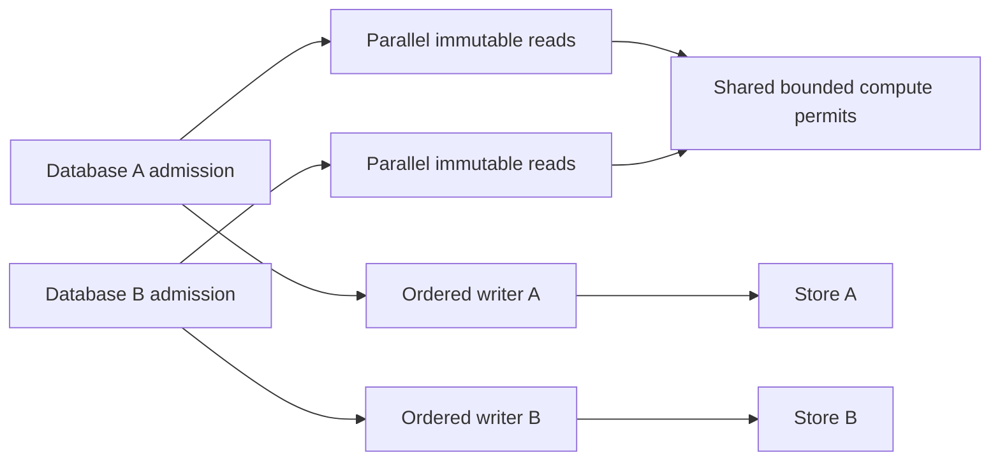

# Replica lifetime and authority fairness research — 2026-07-15

## Scope and posture

This report investigates two connected decisions without selecting them:

- authority-direct reads versus one cluster-local UI replica; and
- maximum cross-database parallelism with bounded, fair JVM admission.

It uses source inspection and disposable process-local models only. It does not
change Seon source, tests, or lifecycle. Selected source revisions are Datahike
`9ada755087228e10cfb179fa5779ce227a6ed220`, the root `:writer` dependency
basis, and the containing Seon checkout.

The product constraint is stronger than “one JVM accepts requests.” The JVM must
not become a global gatekeeper. Datahike-required ordering stays per connection;
independent database reads, pulls, history work, and ordered write lanes must
make parallel progress up to explicit CPU, memory, storage, and result-byte
bounds.

## Source-grounded current behavior

### One local replica duplicates database resources

`stored->db` constructs a fresh database value, creates an empty database, and
attaches copies of EAVT, AEVT, AVET, and three temporal index roots when history
is enabled (`reference-code/datahike/src/datahike/writing.cljc:227-285`). Deeper
persistent-set children remain lazy, but the roots are rebound to that
connection's store and working-set nodes populate its process-local caches
(`writing.cljc:248-265`).

Each decorated Datahike store receives its own LRU with configured
`:store-cache-size` (`datahike/store.cljc:25-35`). Defaults are a 10,000-entry
search cache and 1,000-entry store cache per database connection
(`datahike/config.cljc:18-24,115-124`). A replica in another process cannot
share these heap objects, index-root copies, query-result cache, query plans, or
restored values with the authority. Immutable persistent nodes may represent
the same content and come from the same durable backing, but each process pays
its own object/cache residency and deserialization.

The CLJS restore path does not restore JVM-only secondary-index handles
(`writing.cljc:183-225`), so “full replica” here means Datahike primary and
temporal indexes plus store/search/query working sets, not a duplicate of every
JVM-native secondary index.

Seon's existing replica consumes every committed transaction for its one
database, performs bounded replay after gaps, buffers live events during replay,
and feeds the local connection's native listener bus
(`src/seon/db/replica.cljs:761-781,1195-1258`). The publisher already protects
the writer with one fixed 16-frame queue per subscriber and disconnects a slow
subscriber so replay repairs the gap (`src/seon/db/transport/uds.clj:53-54,
267-357`). This is reliable full-delta replication, not selective query result
delivery.

### Direct reads remove indexes but make the API honestly asynchronous

Direct authority reads leave all Datahike indexes and completed query-cache
entries in the JVM. A Bun child retains request/result data and whatever
application projection it explicitly caches, but no Datahike connection,
primary index roots, store/search cache, or query cache.

The cost is a request/response boundary for every remote operation. The current
UDS client is synchronous per channel and the server loops one request at a time
per connection (`transport/uds.clj:127-170`). Different accepted channels have
different worker threads (`transport/uds.clj:181-232`), so the transport does
not inherently impose one global request sequence. The future Bun interface
must be asynchronous and should multiplex or use enough connections to avoid
head-of-line blocking within one child.

An integration inventory reported about 866 synchronous local database read
call sites. A deliberately broad lexical count in `src/` and `test/` found
1,296 matching lines, including helpers, tests, and duplicate references. The
exact migration set requires semantic inventory, but either count establishes
that replacing every leaf with an RPC would impose substantial cognitive and
latency overhead. Direct reads should therefore preserve the namespaced request
shape at a higher seam and support executing a whole derivation/query batch at
one coordinate.

### Datahike ordering is per connection

Each `LocalWriter` owns its own transaction queue, commit queue, processing
loop, commit loop, and in-flight asynchronous-operation set
(`reference-code/datahike/src/datahike/writer.cljc:76-99,194-251,264-288`).
Ordinary mutations are staged in order and committed through that connection's
commit loop. Creating another connection creates another writer and queues.
Therefore Datahike requires one ordered write lane per connection/branch, not a
single ordered lane across every physical database.

The current Seon handler resolves a database-scoped request and calls that
connection's operation directly (`src/seon/db/writer.clj:1107-1180`). There is
currently no global request executor or fairness queue. The UDS server creates
an unbounded platform thread per accepted connection and runs its handler on
that thread (`transport/uds.clj:181-232`). This permits cross-connection
concurrency but has no global capacity bound, cost admission, or database
fairness.

## Replica versus direct resource and traffic model

### What is duplicated

| Shape | JVM authority | Bun cluster process | Update traffic |
|---|---|---|---|
| Full cluster-local replica | Connection, primary/temporal indexes, store/search/query caches, JVM secondary indexes | Another connection value, six primary/temporal roots, store/search/query working sets; no JVM-only secondary handles | Every committed public datom plus coordinate and replay |
| Direct agent reads | One authority copy | No Datahike indexes; request/result values only | Requested inputs and results only |
| UI-only replica plus direct agents | One authority copy | One replica copy in UI/supervisor process; agent children have none | Full deltas once per cluster plus agent query results |
| Supervisor broker over one replica | One authority copy | One supervisor replica copy; children receive derived values | Full deltas once plus child request/results over another hop |
| Authority execute-many | One authority copy | No Datahike indexes; one batched result | One request and selected results at one coordinate |

The table counts object/index families, not exact bytes. Persistent-set laziness
makes retained memory depend on the accessed working set; RSS cannot be derived
from database cardinality or root count. A proper comparison must run equivalent
render/agent workloads and measure both processes after GC and steady-state
cache warming.

### Disposable Transit encoding probe

A process-local probe used the current `seon.db.transport.uds/encode` under the
root `:writer` basis. It compared a protocol-like committed event containing
full datom maps with a query result containing the selected string values. After
100 warmups, each shape was encoded 1,000 times on JDK 26.0.1:

| Items | Full transaction event bytes | Event encode µs | Selected result bytes | Result encode µs |
|---:|---:|---:|---:|---:|
| 1 | 568 | 18.0 | 83 | 7.5 |
| 10 | 1,144 | 24.5 | 191 | 4.3 |
| 100 | 7,084 | 58.7 | 1,361 | 6.8 |
| 1,000 | 68,284 | 478.1 | 13,961 | 39.9 |

This synthetic shape demonstrates the direction, not production bandwidth. A
replica pays for all public datoms even when the next render needs only a small
projection. Direct reads can send substantially less when selectivity is high.
Conversely, if many local reads reuse most of the changed facts, one delta can
be cheaper than many request/response frames. The probe excludes socket
syscalls, decoding, Datahike update/query time, compression, shared encoded
bytes, and real value distributions.

### Per-leaf RPC multiplication

If a render performs `N` leaf reads, naive direct execution pays roughly
`N × (dispatch + framing + UDS round trip + decode)` even when every read uses
the same immutable coordinate. That latency is absent from local synchronous
reads. The protocol should test an `execute-many`-style operation carrying one
coordinate and a vector or dependency graph of ordinary database requests. It
can execute independent reads concurrently, reuse one resolved database value,
share encoding, and return one data envelope. It must remain bounded by query
work, result nodes, result bytes, and cancellation.

This is not a second query language: the members are the same `seon.db`
operations and data shapes. It is transport composition.

## Topology options for Sean

### A — direct authority reads everywhere

Advantages:

- one index/cache owner across every agent and UI reader;
- identical queries at one database value can share JVM cache and single-flight;
- no transaction broadcast or replica replay in Bun; and
- lowest retained memory per cluster process.

Costs:

- synchronous local CLJS interfaces become honestly asynchronous;
- naive leaf conversion creates latency and cognitive overhead;
- UI responsiveness depends on authority and transport; and
- result encoding and JVM admission become product-critical.

This option is reversible if request shapes remain implementation-neutral.

### B — one UI replica per cluster, direct agent children

The supervisor/web UI retains the current local synchronous read and reactive
render model. Agent children query the authority directly and receive no index
copy. This limits duplicate indexes to one set per active UI cluster rather than
one per agent.

It is attractive if UI reads are numerous, latency-sensitive, and reuse much of
the database while agent queries are selective or expensive. It still sends all
commits to every active UI replica and prevents query-cache sharing for UI work.
An idle or headless experimental cluster should not retain a replica merely
because its database exists.

### C — supervisor broker over one replica

Agent children ask the Bun supervisor, which executes reads against its one
cluster replica. This avoids one replica per child and can preserve familiar
local semantics behind asynchronous IPC. It also centralizes all cluster reads
on one Bun event loop/process, prevents JVM query-cache sharing, adds another
hop, and can recreate the CPU bottleneck that process isolation was meant to
remove. It should remain a measured fallback for cheap UI-shaped reads, not the
default heavy-query path.

### D — authority execute-many at one coordinate

Children and UI send one composed read request. The authority resolves one
immutable value and executes independent queries/pulls/history projections in
parallel under one request budget. This minimizes round trips and retains one
index/cache owner without embedding application render code in the JVM.

The tradeoff is a stronger batching interface and potentially large responses.
Cancellation, partial errors, per-member identity, work/result bounds, and
deterministic ordering need explicit semantics.

### E — adaptive UI replica

Start direct, admit a UI replica only after measured repeated local-read demand,
and release it after bounded idle. This optimizes headless experiments but adds
mode transitions and two read paths. It violates the one-mechanism goal unless
both modes consume exactly the same `seon.db` request data and the cutover is
transparent at one owner.

**Decision brief 1:** compare A+D against B+D first. C should be rejected unless
the supervisor remains below explicit event-loop and memory budgets under heavy
agent concurrency. E is only justified if measurements show both headless
density and active-UI latency cannot be met by one static choice.

## Idle release and grace

Replica lifetime and authority attachment lifetime are separate:

- a UI replica exists only while a local UI/read owner needs synchronous data;
- an authority connection may remain warm for direct agent sessions, queued
  work, replay, or a bounded idle policy; and
- query-result buckets may have a different measured retention policy from the
  connection and Konserve resources.

Options:

1. **Immediate release at zero demand.** Lowest idle RSS and best experiment
   density; highest reconnect, root restore, and cache-warm latency.
2. **Fixed bounded grace.** Cancels release if the exact attachment generation
   is reacquired. Simple, but one duration poorly fits tiny and expensive
   databases.
3. **Budgeted LRU of idle attachments.** Retain recent connections until global
   idle weight reaches a cap. Better density/performance balance, but requires
   Datahike resource metrics rather than counting connections equally.
4. **Priority grace.** Interactive UI databases receive more idle weight/time
   than background experiments. Better perceived latency, but priority must be
   explicit policy and must not starve experiment admission.

Every option uses generation-fenced release. No stale timer may evict a newly
opened connection, listener, or query bucket. Immediate release and grace are
policy changes over the same lifecycle state machine, so they remain reversible.

**Decision brief 2:** do not set a grace duration from intuition. Measure cold
open, first query, first render, steady RSS, cache weight, and reopen frequency.
Start graduation evidence with immediate release and a global idle-weight cap;
add priority only if interactive cold latency misses its target.

## Fairness and admission model

### Required shape

There is no global request queue in this model. Each admitted database has its
own queue(s), cancellation owner, and ordered Datahike writer. A fair dispatcher
selects ready work across databases only when shared capacity is available.
Reads over immutable values may run concurrently; a read permit does not enter
the write order. Independent writes enter their respective Datahike writers and
may commit concurrently subject to storage and CPU contention.

### Disposable adversarial scheduler probe

The model submitted 24 long database-A tasks of 80 ms and eight short
database-B tasks of 2 ms with four concurrent permits. It compared FIFO arrival,
equal database interleaving, and short-work priority on a four-thread fixed pool
and on JDK 26 virtual threads behind a fair four-permit semaphore:

| Executor | Admission | B p50 ms | B p95/max ms | Total ms | Peak |
|---|---|---:|---:|---:|---:|
| Fixed 4 | Global FIFO | 515 | 517 | 517 | 4 |
| Fixed 4 | Equal interleave | 88 | 171 | 512 | 4 |
| Fixed 4 | B priority | 12 | 19 | 511 | 4 |
| Virtual + 4 permits | Global FIFO | 527 | 527 | 528 | 4 |
| Virtual + 4 permits | Equal interleave | 87 | 90 | 506 | 4 |
| Virtual + 4 permits | B priority | 12 | 20 | 513 | 4 |

The model is deliberately simple and ran once after class loading. It uses
sleeping tasks, so it represents blocking/cold-I/O occupancy rather than CPU
query throughput. It does not model GC, storage queues, query cache, response
bytes, writes, or cancellation. Its decisive result is structural: bounded
virtual threads preserve capacity but do not repair FIFO starvation. Fairness
must precede permit acquisition.

### Executor choices

**Bounded shared platform pool.** Appropriate for CPU-heavy Datalog work when
size is tied to measured cores. It needs per-database fair admission; submitting
all database-A tasks into its global queue recreates the probe's 517 ms tail.

**Virtual threads behind bounds.** Appropriate for authority request lifetimes
that block on UDS, Konserve, or remote storage. They reduce the cost of parked
requests, but every CPU/database operation still acquires bounded permits after
fair admission. An unbounded virtual-thread executor is not a memory, database,
result-byte, or storage bound.

**Explicit per-database queues over shared permits.** This is the strongest
control seam. A dispatcher can use deficit round robin so each database receives
service proportional to weight while expensive jobs consume estimated or
measured cost. It exposes queue depth, wait time, work, cancellation, and
starvation evidence by database.

**Per-database executors.** Strong isolation but reserves threads for idle
databases and makes global CPU/memory control harder. Virtual per-database task
scopes can be cheap, but capacity must still converge on shared global bounds.

### Equality versus priority weights

Equal database weights are the safest default: every active database receives a
turn even if another database has many sessions. Per-session equality would let
one cluster gain capacity by spawning more children.

Priority is useful only as explicit product policy:

- tiny control/health/cancellation work may bypass ordinary query queues through
  a small independently bounded control capacity;
- interactive UI work may receive a modest weight or latency reservation;
- writes should enter the per-database writer promptly but must not consume all
  shared read/encode capacity; and
- background experiments must retain a nonzero service floor.

Strict priority can starve. Weighted deficit round robin with aging is more
reversible: weights alter shares while deficits and age preserve eventual
service. Work estimates must be charged against Datahike's existing query work,
result-node, result-weight, and timeout budgets, then corrected by observed CPU
and bytes. A request that lies about cost cannot receive unlimited service.

**Decision brief 3:** default to equal weight per active database, not per
connection or agent. Evaluate one modest interactive weight only against a
documented background service floor. Keep lifecycle/control capacity separately
bounded. Sean should choose whether interactive latency is worth unequal shares
after seeing p95/p99 and experiment throughput under the same host budget.

## Maximum parallel data-flow candidate

This is a research candidate, not a frozen design:

1. Decode and validate on a virtual connection task with strict frame and
   session bounds.
2. Route immediately to an attachment-owned admission queue; never enqueue all
   database work globally.
3. Select databases fairly when the relevant shared capacity has permits.
4. Run immutable queries/pulls/history concurrently up to CPU, in-flight work,
   and result-byte limits.
5. Send mutations directly into that connection's existing ordered Datahike
   writer; different databases retain independent lanes.
6. Encode completed results under a distinct byte/allocation permit so large
   clients cannot monopolize compute workers or heap.
7. Write responses on virtual tasks or Bun-native socket machinery without
   holding database compute permits.
8. Record queue wait, execution, cache/single-flight, encode, bytes, cancellation,
   and total latency at every boundary.

No global ordering exists except shared capacity accounting. Shared permits are
not a queue and are acquired only by the fair dispatcher.

## Required measurements before the final PRD

### Replica decision

- authority and Bun RSS after cold open, warmed root view, agent page, and data
  view;
- store/search/query cache occupancy and retained weight per process;
- index restores and Konserve backend reads;
- commit datoms/bytes and replay bytes per active replica;
- direct request/result bytes, encode/decode CPU, UDS p50/p95/p99;
- local render latency versus leaf RPC versus execute-many;
- repeated identical-query compute/cache evidence across agents;
- active UI, idle UI, and headless experiment density; and
- migration inventory and complexity for the synchronous call surface.

Run at 1/2/4/8 physical databases and at least 1/4/16 agent children per active
cluster. Separate the UI-active and headless cases.

### Fairness decision

- per-database admitted, queued, running, cancelled, and completed counts;
- queue wait and execution p50/p95/p99 by operation and database;
- CPU time, work units, result nodes/weight/bytes, allocations, and encode time;
- query cache and single-flight hit/wait evidence;
- ordered writer queue depth, commit latency, and independent-database progress;
- platform/virtual thread count and pinning evidence;
- store/backend latency, GC pauses, heap/RSS, and secondary-index contention;
- slow socket and oversized-result behavior; and
- minimum service received by a background database during interactive load.

Adversarial cases must include long cold A reads, short cached B reads, B writes,
large A encodes, blocked A sockets, cancellation, one database with many agent
sessions, and connection release/reopen while queued work exists.

## Decisions to review with Sean

1. Prefer no Bun Datahike replica, or retain exactly one replica only for an
   active cluster UI?
2. Is `execute-many` at one coordinate the acceptable seam for replacing
   hundreds of synchronous leaf reads without moving render logic into the JVM?
3. Does an interactive UI receive equal database weight or a measured bounded
   priority over background experiments?
4. Should idle resources release immediately, by weighted global LRU, or with an
   interactive grace policy?
5. Which result-size and work bounds define “maximum parallel” on modest
   hardware without allowing memory amplification?

The final PRD should not settle these from the synthetic numbers. It should use
the numbers to select the live experiments and present Sean with measured
latency, density, memory, and interface tradeoffs.
