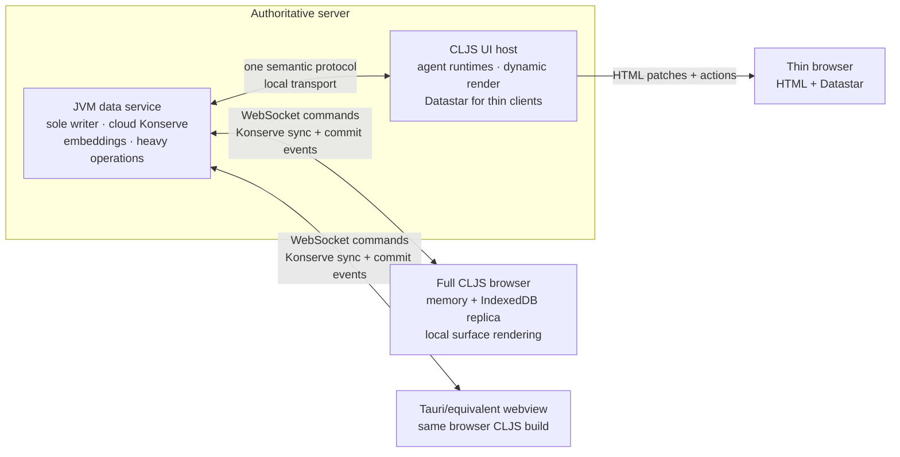

# Client distribution and server-rendering boundary audit

## TL;DR

Seon should have one authoritative JVM data service and one canonical CLJS
render/runtime source. The JVM owns ordered database writes, durable storage,
embeddings, and other heavy work. A CLJS UI host runs beside it when server-side
agents or server-rendered web pages are needed. Browser and native-shell clients
reuse the same CLJS surface/render code; they do not introduce a second UI
framework or a JVM renderer.

The firm server-rendering recommendation is:

- Keep `seon.render`, `seon.ui.agent-view`, the dynamic CLJS program graph, SCI
  bounding, Hiccup serialization, and Datastar patch semantics as the one render
  implementation.
- Run that implementation in the existing Node CLJS runtime for server-hosted
  agents and thin web clients. The JVM can supervise or reverse-proxy that
  process, but must not reimplement rendering.
- Extract Node-specific adapters from the portable CLJS render/runtime core so
  the same source can later compile into a browser build. A Tauri or equivalent
  native application is a webview around that browser CLJS build, not a WASM
  pod and not a Rust rendering implementation.
- Do not revive the paused `.clj` web/render path. Dynamic agent-authored canvas
  functions are CLJS forms compiled into JavaScript and resolved through
  `globalThis`; recreating that behavior on the JVM would duplicate the
  compiler, runtime namespace, SCI safety boundary, and render semantics.

The current local Unix-socket wire already has valuable semantics: one writer,
idempotent request IDs, authoritative receipts, ordered commit events, basis
watermarks, bounded replay, and read-your-own-write completion. Those semantics
should become one namespaced protocol with local Unix-socket and remote
WebSocket bindings. Datahike/Kabel/Konserve Sync should supply remote immutable
store replication rather than becoming a second update architecture.

For a real local read replica, "stream the datoms" is incomplete. Datahike's
distributed immutable storage requires ordered immutable Konserve nodes and the
new branch head, with the head published last. Effective datoms and changed
attributes are still useful, but as the commit-notification plane that drives
listeners and render invalidation. Datastar remains the HTML delivery plane; it
is not database replication.

The old `pod-host/wasm-tauri`, `client-runtime`, and
`pod-host/libdatahike-cljs` trees are prototypes to archive after their findings
are captured. None should be evolved into the product client.

## Scope and settled constraints

This audit assumes the following decisions are already made:

- The paused JVM main application is being archived. The JVM remains important,
  but as the authoritative database/heavy-service process rather than a second
  application runtime.
- Server agents must work with no user computer online.
- An optional local all-in-one deployment runs the same JVM writer and CLJS
  agent/UI processes on loopback. It is a deployment composition, not another
  architecture.
- A client may be a browser, macOS/Windows desktop shell, or iOS/Android shell.
  The device is assumed to be resource-constrained relative to the server.
- Durable authoritative storage can live behind the JVM on an object-store
  Konserve backend. Cloud credentials never ship to a client.
- `canvas` means the focal agent-controlled area, `surface` means a renderable
  context view, and `card` is only a visual CSS component. Historical
  `tile`, `live-tile`, `world`, and `inspector` vocabulary is not part of the
  target API.
- Browser reconnect state and unsent submissions are local, bounded, and
  expire. They do not become a second authoritative database.
- There is no WASM runtime in the target architecture.

The audit does not design authentication or authorization. It does identify the
places where an internet-facing deployment must eventually enforce them; that
is a shipping gate, not a reason to add identity machinery to this refactor.

## Current implementation inventory

### Active local runtime

The active system is already divided at a useful boundary:

- `src/seon/server/wire.clj` is the sole-writer transaction endpoint. It
  fingerprints requests and preserves idempotent results
  (`src/seon/server/wire.clj:193-220`), emits compact authoritative transaction
  events (`src/seon/server/wire.clj:430-452`), implements deterministic bounded
  replay (`src/seon/server/wire.clj:454-638`), and recovers or rejects reused
  request IDs (`src/seon/server/wire.clj:703-840`).
- `src/seon/store/wire.cljs` is a Node CLJS Datahike peer. Reads use a local
  immutable Konserve file store and writes cross a Unix socket
  (`src/seon/store/wire.cljs:1-39`). It reconnects the transaction feed,
  detects gaps, requests pages, validates basis continuity, and drains events
  received during replay (`src/seon/store/wire.cljs:666-840`).
- `src/seon/server/broadcast.clj:27-116` currently sends transaction events to
  every connected feed and lets clients demultiplex them. That is acceptable
  for one local cluster but is not a remote, multi-database subscription model.
- `src/seon/server/boot.clj:87-109` exposes the useful transaction replay
  operation. The same file's query-subscription and changed-summary machinery
  (`src/seon/server/boot.clj:111-209`) overlaps the normal Datahike-listener and
  changed-attribute render path. It should not become a second remote update
  system.
- `shadow-cljs.edn:43-77` builds one CommonJS Node target. `package.json:1-40`
  only runs Node entry points. There is not yet a browser application build.
- `seon.client`, `seon.store.wire`, `seon.db.internal`, `seon.eval`, and
  `seon.web.serve` currently use Node facilities such as filesystem access,
  Unix sockets, `Buffer`, `node:async_hooks`, and Node HTTP. A browser target is
  therefore an extraction of platform adapters, not a new Shadow build pointed
  at the entire current namespace graph.

The coordinated dependency pins matter. The active aliases use the same Seon
Datahike revision and the same Konserve revision (`deps.edn:81-105` and
`deps.edn:238-328`). A client cutover must preserve this one-version rule; a
stale browser or desktop spike must not select its own storage implementation.

### Canonical render path

The active render design is already the right source of truth:

- `src/seon/render.cljs:1-27` defines one guarded recursive engine with
  `:seon.render/ai` and `:seon.render/html` projections. Render functions are
  late-bound qualified symbols, resolved through the same `globalThis` path for
  precompiled core code and agent-authored `cljs.js/eval-str` code.
- The HTML response is one data envelope: `:seon.render/hiccup` plus optional
  `:seon.render/ai` and `:seon.render/error`
  (`src/seon/render.cljs:58-91` and `src/seon/render.cljs:374-402`).
- The canvas is a stored qualified function symbol or literal Hiccup on
  `:seon.render.canvas/content`; the dynamic function receives the current
  database and agent coordinate (`src/seon/render.cljs:730-807`).
- Agent-authored canvas functions are re-evaluated from stored source under an
  SCI wall-clock interrupt. Core functions and literal Hiccup remain on the
  compiled fast path (`src/seon/render.cljs:808-844` and
  `src/seon/render/sci.cljs:18-64`).
- `src/seon/ui/agent_view.cljs:448-559` derives context surfaces and canvas
  selection from a frozen database value. It builds a cheap surface catalog and
  materializes the selected surface on demand
  (`src/seon/ui/agent_view.cljs:570-630`). It also records renderer read sets so
  changed attributes can invalidate only dependent views
  (`src/seon/ui/agent_view.cljs:662-760`).
- `src/seon/ui/html.cljc:1-20` is already a portable Hiccup-to-HTML serializer.
  `src/seon/web/datastar.cljs:218-244` owns complete-element Datastar SSE
  patches. `src/seon/web/datastar.cljs:1040-1075` derives a feed from one frozen
  database coordinate and changed-attribute routing.
- `src/seon/web/reactive/call.cljs:1-50` turns an authored interaction into a
  capability-checked function call with data arguments. The call writes through
  the normal database path; a successful Datastar request returns no redundant
  page payload because the database listener owns the visible update
  (`src/seon/web/reactive/call.cljs:188-197`).

One portability defect is already visible: stable view coordinates use
`js/Buffer` (`src/seon/web/view_unit.cljs:37-48`). The coordinate algorithm is
otherwise platform-independent. This should become a portable CLJS encoding
adapter, not a browser-specific second coordinate scheme.

### Obsolete WASM/Tauri prototype

`pod-host/wasm-tauri` is not the basis for the future native client:

- Its workspace wraps CLJS as `wasm32-wasip2` with `wasm-rquickjs`, Wasmtime,
  and WASI (`pod-host/wasm-tauri/Cargo.toml:1-45`).
- Its Tauri process assumes a Seon source checkout, runs `bin/seon start all`,
  polls a loopback `/agents` route, and opens the external loopback UI
  (`pod-host/wasm-tauri/src-tauri/src/main.rs:23-77` and
  `pod-host/wasm-tauri/src-tauri/src/main.rs:111-142`). It is a launcher demo,
  not a self-contained client.
- `pod-host/wasm-tauri/src-tauri/src/pod.rs` is a custom Wasmtime/WIT host.
  `pod-host/wasm-tauri/src-wit/seon-pod.wit:1-208` carries obsolete WASM-world,
  old ID, and old debug vocabulary. `pod-host/wasm-tauri/mcp-server-seon` embeds
  the same WASM pod and duplicates execution/protocol concerns.
- `pod-host/wasm-tauri/src-tauri/tauri.conf.json:7-29` only points at a splash
  directory and bundles a desktop application. It does not establish the
  browser CLJS runtime, mobile targets, replica, or offline behavior.

The useful residue is limited to packaging lessons, icons, and launch UX. A
future Tauri 2 or equivalent shell should load the canonical browser CLJS build
in its webview and expose only narrowly justified device capabilities. It must
not embed Wasmtime, WIT, the old pod, or a second transaction protocol. Because
native product packaging is consumer-specific, the shell should normally live
in a downstream product repository; Seon core should publish the browser bundle
and protocol it consumes.

### Superseded client/runtime spikes

Two other directories preserve useful experiments but are not active paths:

- `client-runtime/docs/README.md:7-31` marks the Rust/WASM client runtime as
  superseded. Its Rust host supervises the JVM writer and implements a custom
  CBOR-plus-Transit snapshot/feed protocol
  (`client-runtime/host/src/main.rs:37-101` and
  `client-runtime/docs/PROTOCOL.md:40-125`). Its WIT database contract
  (`client-runtime/host/wit/db.wit:1-150`) is a parallel runtime boundary.
- `pod-host/libdatahike-cljs` proves old Datahike CLJS combinations could run in
  memory, Node files, IndexedDB/tiered storage, and experimental SQLite. It pins
  Datahike `0.7.1624` (`pod-host/libdatahike-cljs/deps.edn:1-9`) and contains
  compatibility patches now superseded by the coordinated forks
  (`pod-host/libdatahike-cljs/REPL-WORKFLOW.md:88-138`). Its handwritten SQLite
  Konserve implementation and reconnect polling must not become production
  dependencies.

Archive these trees after retaining benchmark results and decisions in research
documents. Keeping them buildable imposes a permanent dependency and test tax
for architectures that are explicitly rejected.

## What the current Datahike and Konserve sources support

### Immutable-store replication is the data plane

Datahike's distributed immutable storage model writes immutable index nodes and
atomically advances a mutable database root (`reference-code/datahike/doc/distributed.md:3-20`).
The documented browser topology combines a memory/IndexedDB tiered store, a
Kabel writer, and Konserve Sync (`reference-code/datahike/doc/distributed.md:147-231`).
The database store and branch are the replication unit; the mechanism is not an
arbitrary attribute-filtered replica (`reference-code/datahike/doc/distributed.md:234-243`).

The current fork already includes important correctness work: ordered commit
batches, branch-head-last publication, gating database exposure until the
initial sync is fully drained, cache warming, and shutdown-race fixes. The
frontend-only connector builds a local tiered reader rather than granting the
browser access to the shared backend
(`reference-code/datahike/src-kabel/datahike/kabel/connector.cljc:159-267`).

This yields a crucial separation:

- **Replica data plane:** transfer missing immutable Konserve objects in order,
  then publish the branch head and declare the handshake complete.
- **Commit-notification plane:** publish the previous and new basis/commit,
  effective datoms, changed attributes, request ID, and transaction metadata.
  This drives native listeners, UI dependency invalidation, and diagnostics.
- **HTML delivery plane:** Datastar sends complete-element HTML patches to a
  client that is not rendering locally.

Sending only effective datoms can update reactive consumers, but it does not
reconstruct the authoritative immutable Datahike indices or make a durable local
replica. Conversely, syncing immutable objects without commit notifications
does not provide the exact listener semantics the UI expects. They are two
planes of one commit, not two competing state systems.

### Kabel is the foundation, not yet a drop-in replacement

The Datahike Kabel connector creates a local connection only after the initial
sync completes and then routes writes to the remote writer
(`reference-code/datahike/src-kabel/datahike/kabel/connector.cljc:199-323`).
The writer waits for the local replica to observe the accepted transaction
before completing a caller's write
(`reference-code/datahike/src-kabel/datahike/kabel/writer.cljc:83-136`). That is
the correct read-your-own-write semantic.

The source and tests also show remaining production gaps:

- The catch-up wait has no explicit deadline
  (`reference-code/datahike/src-kabel/datahike/kabel/writer.cljc:128`). A dropped
  sync must become a typed timeout/reconnect outcome rather than an unbounded
  promise.
- The transaction broadcast subscriber exists
  (`reference-code/datahike/src-kabel/datahike/kabel/tx_broadcast.cljc:98-155`),
  but the main connector does not wire it into the normal connection path.
  Foreign commits therefore need explicit proof that they advance the local
  connection and fire listeners once with useful transaction data.
- Browser integration tests cover remote connection, a client's own writes,
  local queries, and basic reconnect, while multi-client behavior, page reload,
  resilience, and performance remain listed as future work
  (`reference-code/datahike/test/datahike/kabel/BROWSER_TESTS.md:130-180`).
- The JVM reconnect test skips a concurrent server transaction because of an
  unsubscribe/write-hook race
  (`reference-code/datahike/test/datahike/kabel/integration_test.clj:403-559`).

The right migration is therefore to harden and adopt Kabel/Konserve Sync behind
the same Seon protocol semantics, then retire equivalent custom feed/replay
code once parity is mechanically proven. Running Kabel beside the Unix-socket
feed indefinitely would create exactly the parallel update paths this refactor
is intended to remove.

### Cloud storage and write cost

Datahike documents S3, GCS, IndexedDB, and tiered stores
(`reference-code/datahike/doc/storage-backends.md:1-17`). S3 and GCS are external
Konserve plugins, not built into core
(`reference-code/datahike/doc/storage-backends.md:130-171`). The JVM writer must
own the selected plugin and its credentials. Remote clients receive only the
objects authorized through the sync service and store them in memory plus
IndexedDB.

`konserve.tiered` supports a frontend-only read-through cache whose reader never
writes the shared backend (`reference-code/konserve/src/konserve/tiered.cljc:21-31`
and `reference-code/konserve/src/konserve/tiered.cljc:182-279`). That can support
both a browser cache and a server-side hot cache over object storage.

Datahike's write-amplification notes describe diff buffering, root fusion, and
commit-graph opt-out (`reference-code/datahike/doc/write-amplification.md:1-110`).
Commit-graph opt-out is not appropriate for Seon's authoritative store because
it gives up ancestry/audit and branch-from-commit behavior. Diff buffering and
root fusion are candidates only after representative measurements and crash
recovery tests. Cheap immutable storage does not eliminate ordering, atomic
head publication, or object-store request latency.

## Target topology

### Authoritative server

The server has one ordered writer per database/branch ordering domain. It owns
the durable Datahike/Konserve store, transaction metadata, idempotency receipts,
branch/fork/restore operations, embeddings, and expensive parallelizable work.
Read workers may use local or tiered caches, but only the writer publishes an
authoritative branch head.

Server agents are CLJS processes attached to the same writer/replica boundary.
They can run continuously without a user's computer. The CLJS UI host runs the
same agent-authored code, SCI guard, surface projections, and Hiccup/Datastar
pipeline that work today.

### Thin client

A thin browser receives HTML patches and posts actions. It does not open a
Datahike replica or compile agent-authored source. This is the lowest-resource
and fastest first remote deployment. All rendering remains in the server CLJS
UI host.

### Full and offline-capable CLJS client

A full client attaches to one authorized database/branch, synchronizes missing
immutable nodes into a memory-plus-IndexedDB tiered store, and renders surfaces
from the local database value using the canonical CLJS render source. It still
sends authoritative actions and writes to the server.

Datahike's optimistic overlay can make accepted UI intents visible immediately
while the server transaction and replica catch-up complete
(`reference-code/datahike/doc/optimistic-overlay.md:1-45`). The overlay is not a
conflict-free replicated database and its pending entries are currently
in-memory only (`reference-code/datahike/doc/optimistic-overlay.md:411-461`). For
reload/offline behavior, IndexedDB may persist a bounded queue of idempotent
submission intents with expiry and retry state. Those are commands awaiting an
authoritative receipt, not committed facts. On reconnect, the client resubmits
the same request ID; the server's recovered receipt and basis determine truth.

Arbitrary agent action handlers can continue to run in the server CLJS agent
runtime through the one action endpoint. A local renderer does not imply that
server-only side effects run on the device. Offline actions should initially be
limited to explicitly serializable transaction/fact intents; other actions can
report that a connection is required.

Because Datahike replication is store/branch scoped, a "full client" stores the
authorized database, although memory use remains lazy and tiered. A severely
constrained phone should use thin mode or attach to a smaller per-user/per-cluster
database. Partial attribute replication should not be invented before those
simpler partitions prove insufficient.

### Native shell

Tauri 2 or an equivalent native shell packages the browser CLJS build and adds
only OS integration such as secure credential storage, notifications, file
pickers, and lifecycle hooks. The webview talks to the same remote service as a
browser. It does not contain a WASM pod, JVM, Rust database implementation, or
separate renderer. Desktop and mobile packaging can vary without changing the
Seon protocol or surface model.

### Local all-in-one

`bin/seon up` can compose the JVM writer, Node CLJS agents, and Node CLJS UI host
on loopback. The local transport may remain a Unix socket for efficiency while
it implements the same message schemas and state machine as the remote
WebSocket transport. A local deployment is therefore the server topology on one
machine, not a special development-only code path.

## One semantic protocol

The protocol should be defined as namespaced data with shared Malli schemas.
Transport framing is an adapter. Unix sockets may remain optimal locally and
WebSockets are appropriate for browser/native remote clients, but both carry the
same operations and outcomes.

The semantic messages are:

1. **Attach/hello** — requested database/store, branch, last known basis or
   commit, client protocol capabilities, and client request ID. The response
   selects an explicit attachment mode and begins a resumable handshake.
2. **Replica sync** — immutable Konserve objects in dependency order, then the
   branch head, then a handshake-complete marker. A branch head is never exposed
   before all referenced objects are locally readable.
3. **Command** — an idempotent transaction/fact intent or named heavy operation,
   with a request ID and transaction metadata. The server is the only authority
   that accepts it.
4. **Receipt** — accepted, recovered, or rejected; authoritative basis/commit;
   effective datoms; generated identity/tempid resolution; and a typed error
   when applicable.
5. **Commit notification** — database/branch, previous and new basis/commit,
   effective datoms, changed attributes, request ID when one caused the commit,
   and transaction metadata. This is the input to listeners and render
   invalidation.
6. **Resume/control** — bounded gap pages, explicit continuation cursors,
   heartbeat, deadline, backpressure, and terminal errors. No silent replay
   truncation and no unbounded catch-up promise are permitted.

The current full-Transit, fully namespaced wire is the correct encoding model.
The old Rust CBOR envelope and WIT contracts should not be retained. Storage
objects may use their native binary encoding inside a framed protocol message;
that does not justify a second control envelope.

The migration should preserve current Seon guarantees while replacing
implementation duplication:

- One client request ID has one durable result. Retrying after disconnect
  recovers the result; reusing the ID for different content is rejected.
- A write completes only when the authoritative receipt exists and the local
  view has reached its basis, or returns a typed deadline/reconnect result.
- Every accepted commit advances one branch head and produces one ordered
  commit notification. Consumers deduplicate by commit/basis, not by timing.
- Reconnect first establishes the last known basis, then replays or performs a
  differential store sync, then exposes the caught-up database.
- Subscriptions are scoped by database and branch. Remote deployment must not
  retain the current global fan-out.

## Canonical rendering boundary

### Decision: CLJS is the render source on server and client

Do not build a JVM renderer.

The reason is not merely code reuse. The thing being rendered includes dynamic
agent-authored CLJS functions. Their source is stored in the database, compiled
by the CLJS self-host analyzer into JavaScript, installed at munged
`globalThis` paths, and late-bound by `seon.render`. Agent code is then
reinterpreted under the CLJS SCI interrupt boundary when it controls the
canvas. A JVM implementation would need a second execution model for those
forms or a remote callback into CLJS, plus a second namespace environment,
Malli instrumentation path, SCI policy, error envelope, Hiccup behavior,
dependency tracker, and action router. It could pass static-Hiccup examples
while diverging on the actual programmable UI.

The server therefore runs a canonical CLJS UI host beside the JVM. That host:

- reads a local or remote Datahike replica at a frozen basis;
- restores and compiles the program graph needed by active agent namespaces;
- resolves and bounds agent-authored canvas and surface functions;
- produces the existing `:seon.render/html-response` data envelope;
- serializes Hiccup with the canonical serializer; and
- sends complete-element Datastar patches to thin clients.

The JVM remains free to supervise this process, serve static assets, terminate
TLS, or reverse-proxy its routes. None of those roles makes it a renderer.

### Portable split within the CLJS source

The existing Node application must be separated by responsibility in place,
not copied into a `browser-v2` implementation:

| Layer | Shared CLJS source | Platform adapter |
| --- | --- | --- |
| Surface coordinate and catalog | frozen database coordinate, surface IDs, read attributes, recency | portable base64/text encoding instead of Node `Buffer` |
| Render engine | dual AI/HTML dispatch, response envelope, Hiccup, errors, clipping | none beyond timing/runtime facilities |
| Dynamic code | stored program graph, `cljs.js` compile state, qualified-symbol lookup, SCI-bounded canvas invocation | runtime initialization and permitted host capabilities |
| Database view | Datahike query/pull/listen semantics | Node file/Unix socket or browser memory/IndexedDB/Kabel |
| Interaction | one namespaced action/command description and result envelope | Node HTTP/Datastar route or browser fetch/WebSocket submission |
| HTML delivery | complete-element patch semantics | server SSE for thin mode or local DOM patch application for full mode |

Node-only state such as `AsyncLocalStorage`, Unix sockets, filesystem handles,
HTTP request objects, and `Buffer` must stop leaking into the shared layers.
Runtime state that is genuinely local, such as a CLJS analyzer compile state or
SCI context support, may remain local state; it must be reconstructible from the
database program graph rather than becoming a second source of truth.

A browser-local render should invoke the same surface function with the same
frozen database coordinate and produce the same Hiccup response. It may apply
that complete element directly through Datastar rather than round-tripping an
SSE event. That is a delivery-adapter difference, not a render difference.

### Dynamic-code consequence for deployment order

Thin server rendering should ship before full browser rendering. It uses the
already-proven Node analyzer/global environment and gives server agents a
complete UI without waiting for browser portability work. Full browser/Tauri
rendering follows after the shared render namespaces compile without Node
facilities and the client can restore the required program graph into its own
analyzer/global environment.

This order does not establish a temporary JVM renderer or alternate component
model. Both modes use the same CLJS implementation; only its process location
changes.

## Keep, archive, and delete implications

| Disposition | Code | Reason |
| --- | --- | --- |
| Keep and evolve | `src/seon/server/wire.clj`, `store.clj`, `registry.clj`, `codec.clj`, `transit.clj` | Preserve sole-writer, idempotency, receipts, replay, and full-Transit semantics; separate semantic messages from local transport. |
| Keep and evolve | `src/seon/store/wire.cljs` | Preserve proven peer state-machine behavior, but split portable protocol/replica logic from Node Unix-socket and file adapters. Retire equivalent custom paths only after Kabel parity. |
| Keep and harden | `reference-code/datahike/src-kabel` and coordinated Datahike/Konserve forks | They provide the right distributed immutable-store and browser replica foundation; close the multi-client, listener, deadline, reconnect, and page-reload gaps. |
| Keep and evolve in place | `src/seon/render.cljs`, `src/seon/render/canvas.cljs`, `src/seon/render/sci.cljs`, `src/seon/ui/agent_view.cljs`, `src/seon/ui/html.cljc`, `src/seon/web/view_unit.cljs`, Datastar/reactive namespaces | This is the one render source. Rename obsolete vocabulary in place, isolate platform adapters, and retain one action/update path. |
| Archive | `pod-host/wasm-tauri` | Historical WASM/Wasmtime/WIT/MCP launcher prototype, incompatible with the settled no-WASM architecture. Retain only documented packaging lessons/assets. |
| Archive | `client-runtime` | Explicitly superseded Rust/WASM/CBOR parallel protocol/runtime. |
| Archive | `pod-host/libdatahike-cljs` | Old Datahike/CLJS feasibility and benchmark spike pinned to obsolete dependencies. |
| Archive | paused `.clj` web/render/reactive application path | A second renderer would diverge from dynamic CLJS/SCI behavior. Harvest only genuinely portable data contracts before removal. |
| Delete after archival | generated WASM builds, backup artifacts, nested dependency/build caches, handwritten SQLite CLJS backend, custom Rust CBOR/WIT/MCP bridge | They are rebuild products or rejected implementations with ongoing audit/test cost. |
| Delete after parity proof | global query-subscription/changed-summary fan-out and any custom transaction replay duplicated by the adopted Kabel path | Keep one listener/changed-attribute update mechanism and one replica state machine. |

Archival should remove these trees from normal dependency resolution, builds,
tests, startup, skills, and runbooks. A directory merely moved under an
`archive/` path but still compiled or tested has not reduced system complexity.

## Cutover sequence and mechanical proofs

### 1. Freeze one set of contracts

- Inventory the active wire, transaction receipt, commit event, render response,
  surface coordinate, and action schemas.
- Name them once with fully namespaced keys and move transport framing behind
  adapters without changing behavior.
- Remove the dormant query-subscription path from the target design before
  remote sync work begins.

Proof: the existing local all-in-one runtime still creates an agent, accepts a
write, observes one receipt, advances one basis, and produces one reactive UI
update.

### 2. Harden the Datahike replica path

- Add bounded catch-up deadlines and typed reconnect outcomes.
- Prove two clients see each other's commits exactly once with useful listener
  transaction data.
- Prove interruption during object transfer never exposes a branch head whose
  objects are absent.
- Prove disconnect during a commit, bounded replay, IndexedDB page reload,
  storage pressure, backpressure, branch attach, writable fork, restore, and
  as-of reads.
- Route subscriptions by database/branch rather than global socket fan-out.

Proof: one behavioral suite drives local and WebSocket transport adapters
against the same state-machine expectations. It does not assert context wording
or rendered prose.

### 3. Isolate the canonical CLJS UI core

- Make coordinate encoding and other leaf utilities browser-safe.
- Separate Node HTTP, filesystem, Unix socket, and async-context facilities from
  database projection, dynamic-code restoration, render, Hiccup, and Datastar
  patch construction.
- Rename active `tile`/`live-tile` APIs to `surface`/`canvas` in place; do not
  leave compatibility aliases as a permanent second vocabulary.

Proof: structural render fixtures invoke core and agent-authored canvas
functions at the same frozen database basis in Node and a headless browser and
compare the response data/DOM result. A nonterminating agent canvas is bounded
in every runtime that permits local agent-code rendering.

### 4. Ship thin remote mode

- Run the CLJS UI host beside the JVM writer in a server deployment.
- Serve the existing agent pages and action route over the remote boundary.
- Keep database replication off for thin clients.

Proof: a fresh browser with no local database can operate a server agent,
disconnect/reconnect its Datastar feed, and observe an action-driven update
without the user's computer hosting any Seon process.

### 5. Add full browser replica mode

- Add the browser Shadow target over the portable namespaces.
- Attach a memory/IndexedDB tiered store through the hardened sync path.
- Restore required program-graph forms and render surfaces locally.
- Add the bounded IndexedDB submission queue and optimistic overlay
  reconciliation without creating local authoritative commits.

Proof: two browsers, a server agent, and a writer exchange commits across forced
disconnects; reload resumes from IndexedDB; duplicate submissions resolve to one
authoritative transaction; a rejected optimistic write rolls back visibly.

### 6. Package downstream native shells

- Wrap the browser build in Tauri 2 or the selected equivalent for desktop and
  mobile.
- Keep device capabilities behind a narrow bridge; keep data, render, and
  protocol code in CLJS.

Proof: the same browser behavioral suite runs in the webview, supplemented only
by lifecycle and device-capability tests.

### 7. Move authoritative storage to the selected backend

- Evaluate S3 and GCS Konserve plugins with the actual commit mix, branch/fork
  workload, crash recovery, conditional-write behavior, latency, and cost.
- Add a server-side hot tier only if measurements justify it.
- Keep commit ancestry enabled; consider diff buffering/root fusion separately.

Proof: cold server recovery from cloud storage, writer fail/restart, client
resync, writable fork/restore, and server-agent continuation all preserve the
same authoritative basis.

### 8. Archive rejected paths and clean operations

- Archive prototypes, remove them from builds/tests/docs/skills, and delete
  generated artifacts.
- Make `bin/seon up` the one robust local composition and document the same
  services used in remote deployment.

Proof: a clean checkout has one supported client build, one server composition,
one render implementation, and one protocol state machine; searching active
code finds no WASM/WIT runtime and no old UI vocabulary.

## Open decisions with recommendations

### Which client mode ships first?

Recommendation: ship thin server-rendered web mode first, then the full local
replica. Design one CLJS application with explicit attachment modes so this is
sequencing, not two UI systems.

### What is the client replication boundary?

Recommendation: replicate an authorized database/branch. Scale by the existing
per-cluster/per-user database boundary before inventing filtered partial EAV
replication.

### S3 or GCS?

Recommendation: leave the provider open until a focused backend proof measures
durability, conditional head publication, latency, operational tooling, and
cost. Both require external Konserve plugins and server-only credentials.

### Unix socket or WebSocket locally?

Recommendation: keep the Unix-socket transport while it is useful and make it
implement the shared semantic schemas. Reconsider one loopback WebSocket only
after parity and profiling. Transport uniformity is less important than one
state machine.

### Should the JVM ever render HTML?

Recommendation: no. Run the canonical CLJS UI host beside it. Revisit only if a
measured deployment constraint cannot host JavaScript; even then, first test a
process boundary rather than reimplement dynamic CLJS rendering on the JVM.

### How much offline mutation is supported?

Recommendation: bounded retryable transaction/fact intents plus Datahike's
optimistic overlay. Do not add CRDT/conflict semantics until a concrete domain
requires them. Arbitrary server action functions may require connectivity.

### When is remote security designed?

Recommendation: do not mix a full authorization model into this cleanup, but do
not call an internet deployment production-ready without authenticated
transport, database/branch grants, and server-side command validation. The
current Kabel store identifier and current `/call` namespace checks are not by
themselves a remote security boundary.

### What happens on restore or branch movement?

Recommendation: make the attached branch and basis explicit. A restore or
branch switch triggers a fresh differential handshake to a known head; it does
not overwrite an IndexedDB cache in place based on timing. Prove writable fork,
restore, and as-of behavior before declaring offline replication complete.

## Conclusion

The reusable core is already visible: Datahike's immutable-store model, Seon's
sole-writer/idempotent transaction semantics, one database-derived surface
catalog, one dynamic CLJS render engine, and one Datastar complete-element
delivery model. The refactor should connect those pieces at explicit adapters,
not preserve every prototype that once explored them.

The architectural boundary is therefore simple: the JVM owns authoritative
facts and heavy work; CLJS owns agent execution and rendering wherever it runs;
Datahike/Konserve Sync owns replica state; commit notifications own reactive
invalidation; Datastar owns HTML delivery; and Tauri is only a native webview
shell. Every implementation that duplicates one of those roles should be
archived or eliminated after its useful evidence is captured.
