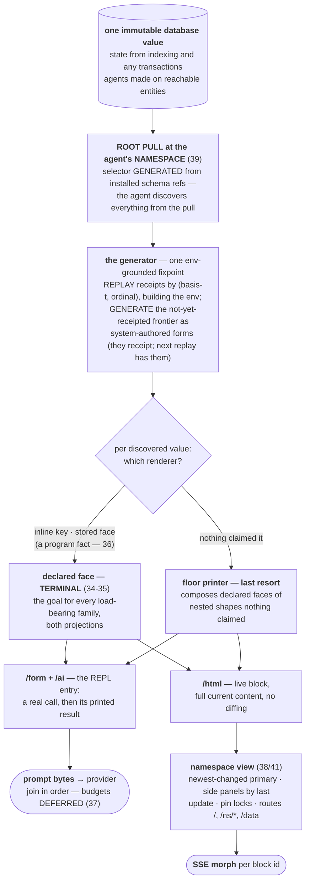

# Context generation — THE program document

*The one authority (owner ruling 42a, 2026-08-17): this document
REPLACES the one-renderer PRD (2026-08-14) and the runtime-first
vision PRD (2026-08-17); both are deleted, git is the archive. Binding
decisions live in the [rulings ledger](design-ideas-ledger-2026-08-13.md)
(17–42); evidence lives in `../research/`. The name for one walked
piece of pull data remains DELIBERATELY UNSETTLED (§11.5).*

## 0. The system on one page

**Agents ARE namespaces (40).** An agent's context is a pull of its
namespace's data — that's it (39), with no manual membership, ever
(39-amendment). One mechanism generates the agent's prompt and the
human's page; the two seams are 2D and 3D of one derivation. And the
system is **runtime-first**: it designs itself at runtime; facts are
the program; files are an export for building a jar; `current-src` is
the one system-wide fork point; every environment is REBUILDABLE from
what we can serialize and re-execute.

Worked evidence: [the live root context walked step by
step](../research/root-context-example-2026-08-14.md) (including the
wrong-root capture that 39 kills) and [three agents, one
mechanism](../research/three-perspectives-2026-08-14.md) — a fleet
console, a chat app, and a maintainer's workbench from nothing but the
pull root and the reachable faces.

## 1. The two axioms — and why they are one

**Runtime-first:** store GENERATORS, never object graphs. A ctx is a
pure function of facts (source rows, requires, defs, the projection);
rebuild = re-execute in dependency order. Live host references
(connections, channels, executors) are `:seon.schema/identity-only` —
identity plus rebuild recipe. "Last referenced" is a Datalog question,
never a heap walk.

**One renderer:** one derivation, three faces, two seams; every stage
total, honest, bounded, contract-checked; a value that skips a stage
is unconstructable.

These are the same axiom at two scales — ruling 36 states it at the
function level (a function renders through a default face that outputs
its GENERATING FORM) and runtime-first states it at the system level
(everything durable is its generator). The transcript, the page, the
environment, and eventually the exported jar are all evaluations of
stored generators.

## 2. The five stages

### 2.1 Collect

One Datahike pull rooted at `[:seon.ns/name <agent>]`, selector
generated from installed schema refs (forward + reverse) at
config-derived distance. What appears is decided by exactly two
things: the namespace root and the schema's declared refs. All needed
edges are installed today. Rendering starts at the database value;
how facts got written is not this pipeline's business; derived renders
are never stored.

### 2.2 Generate — replay + frontier, one algorithm, three cases

**Ruled constraint (owner, 2026-08-17): context is FULLY REGENERATED
from the database — dependency resolution PRODUCES the transcript;
nothing hand-maintains it.**

- **Replay:** the session's receipted entries — system reads, agent
  evals, arrivals — ordered by **(basis-t, ordinal)** (form sources
  freeze atomically in one basis with ordinals; execution receipts
  climb ascending bases — confirmed correct as built, ruling 42d).
  Each renders at its RECORDED basis. Agent-authored forms NEVER
  re-execute (authorship law); their results render from receipts.
  Result-chain provenance is the `uses-result` edge family, with the
  durable `result/<id>` handle derived from receipt identity (§4).
- **Frontier:** the env-grounded fixpoint — a candidate form is ready
  when its parse-closure, ALIAS-RESOLVED THROUGH THE LIVE ENV the
  replay itself rebuilt, resolves, and its subject stands in a settled
  value; unresolvable symbols generate their enabling forms (require,
  then dir — names before use, constructively); executing the ready
  batch mints receipts and advances the env. Substrate verified
  buildable, mostly by subtraction: `::prefix-drift` already asserts
  reproducibility; the flow-state prompt order is DELETED, demoted to
  pure memo ([substrate](../research/regeneration-substrate-2026-08-17.md),
  10 determinism threats + 15 gaps enumerated there).
- **How an edge becomes a call — the reader-selection rule (owner
  dialogue, 2026-08-17):** the pull discovers EDGES and identities,
  never content. The call that materializes an edge is selected like
  every face: (1) EXPLICIT — the attribute schema names its reader;
  (2) DERIVED — the producers-of-key query: functions whose declared
  OUTPUT refs (alias-chased through the registry) cover the discovered
  identity attributes, filtered to those whose declared INPUTS are
  satisfiable from ambient bindings (db, self-id, discovered
  identities); unique fit wins, ambiguity is a loud error; (3) FLOOR —
  the identity pull. The message case: `my.message/inbox` declared
  outputs over `:my.message/id` (≡ `:seon.cluster.message/id`) and
  inputs `[db agent-id]` — so discovering messages addressed to me
  selects `(my.message/inbox db me)` with NOTHING wired anywhere: the
  contract IS the registration (36 at the query level). Delete the
  reader and the edge falls honestly to the floor; define a better
  one and it wins. Faces then attach to the CALL'S RESULT, so the
  same discovery that found the call found the rendering.

  **Refinement — stored provenance outranks inference (owner,
  2026-08-17):** receipts accrete the STRUCTURED call pair —
  `:seon.fn/sym` + `:seon.render/inputs` (named non-ambient args;
  ambient db/self supplied by call preparation, so rebuilt forms are
  portable across namespaces; the recorded basis is the db arg's
  serialization). Reversal becomes a splice, not a parse. The full
  selection ladder, priority-ordered, all queries: (0) STORED
  PROVENANCE — this data came from this call, no inference; (1)
  explicit attribute-declared reader; (2) contract inference
  (producers-of-key, alias-chased, input-satisfiable),
  DISTANCE-WEIGHTED — the nearest declared reader/face wins,
  in-namespace before N-hops, equal distance a loud ambiguity; (3)
  the floor identity pull. Robustness ladder for inputs: none/
  ambient-only → admissible named-map EDN → `result/<id>` handles
  (provenance chains = the uses-result edges by storage rather than
  extraction) → non-admissible degrades honestly to inference/floor.
  Guard: provenance of CALLS is stored; derived VIEWS never become
  authority — regeneration re-derives at current basis using the
  stored inputs to know what call to re-derive. **Write-provenance ≠
  read-recipe:** tx-meta explains how data got INTO the database
  (attribution; renderable history) — it never prescribes how the
  current agent reads an edge, because reads are derived, not stored.

  **Ruling 44 — the `/form` face DIES; the ladder is THREE tiers.**
  Forms are CONSTRUCTED, never authored: spliced from provenance
  (replay), built from contracts + call preparation (first reads —
  output-refs cover the edge's identity attributes with SHAPE
  participating: collection-shaped outputs win collection edges,
  single-entity outputs win dig-ins), or the floor's mechanical
  identity pull. Hard constraints: `:seon.render/form` is removed
  from the grammar (unconstructable); equal-distance ambiguity is a
  loud error fixed ONLY by refining contracts — no tiebreaker
  declaration exists; the floor census names every family without a
  qualifying reader. Two authored faces remain: `/ai` and `/html`.

  **Ruling 43 hardens the ladder:** a winning reader must satisfy BOTH
  criteria — auto-injectable-only required inputs AND offered render
  faces — so the agent gets the designed view, never the dense map,
  by construction; the view is NO MAGIC (an ordinary composition,
  `(render-x (reader …))`, the agent could type; raw data one call
  beneath); NO hardcoded bootstrap forms exist anywhere; ONE NAME PER
  ATTRIBUTE — surface functions return storage keys, the `my.*` alias
  key mirrors die (deletion register; rename sweep rides wave D;
  message entities rename in the same sweep; alias-chasing survives
  only the transition), enforced by **P-NAME-ALIGNED**: every reader's
  output-refs are stored attributes of the family it reads, every
  writer's inputs likewise, drift is red. tx-meta joins discovery:
  the receipt stamp makes "what this agent wrote" a derivable edge,
  and written entities enter the neighborhood and render like
  everything else.
- **Three cases, one function:** initial context = empty settled set
  (bootstrap is the fixpoint's first iteration, no init function);
  turn N = replay + the small frontier (diff-stale reads re-enter;
  new arrivals sort after by basis — **prefix stability is a theorem
  of monotonicity**, not maintained state); compaction = replay
  filtered by dataflow liveness (§5), the one priced cache break.
  Rebirth = the same function, fresh session.

### 2.3 Face

Three projections per value — `/form` (the real call producing the
rendered value), `/ai` (its printed result), `/html` — one chain:
inline key on the value → stored face (an ordinary defined function
whose contract fits — defining IS registering, 36 — or the
schema-declared face; ambiguity is loud) → the floor, which composes
declared faces of nested shapes nothing claimed (35: a selected face
is TERMINAL). Faces for every load-bearing family, both projections,
are the goal (34); the floor is the honesty net; prose only in
instruction entities. **Form honesty** is the façade invariant: every
entry is a call the agent could make, whose eval at its basis prints
to its `/ai` bytes — narration cannot satisfy it, which is why
narration confabulated.

### 2.4 Print

The floor synthesis
([archaeology](../research/value-printer-archaeology-2026-08-14.md),
[prior art](../research/value-browser-prior-art-2026-08-14.md)):
sample→emit; tee sinks (one traversal, REPL text + structural hiccup);
guarded realization (never throws); inline-when-fits via an O(width)
probe; payload-first degradation; the derived table face; the verbatim
probe. **One shape-bearing elision face (33)** firing only at
extremes; generous defaults so ordinary content prints whole; parity
means framing fidelity, not stock elision bytes; bare `...`/`#` and
the `::length`/`::level` defaults die. The elision's `next-offset` is
the Datastar scroll contract. **The printer has no budget.**

### 2.5 Deliver

**AI seam:** join in order; budgets deferred entirely (37) — the
interim knob is acquisition depth; wrong context at a depth is fixed
by MOVING DATA (the live proof: the hourly-failure repetition that
drove two budget-exceeded deaths — register #23). **HTML seam:** no
diffing, no budget; routes are `/`, `/ns/<full.ns.symbol>`, `/data`
(41); layout = newest-changed primary, side panels by last update,
browser-local pin (38); an agent surfaces anything by defining a face
— recency promotes it; chat face with bottom message bar and
inline-expanding chips.

## 3. The graph the system reads

At HEAD the program graph already records: fn→ns, fn→fn calls
(first-party), fn→keywords (kondo-resolved literals), arity contracts
WITH `:seon.fn.arity/output-refs` (populated + regression-guarded —
already landed, do not rebuild), ns requires/refers/aliases, test→ns
and test→subject, and Datahike's own AEVT for data-side keyword usage.
Five enrichment deltas are ruled in scope, each derived at an existing
seam with its query and drift regression
([verification](../research/graph-enrichment-verification-2026-08-17.md)):

1. **Core-call edges** — widen the filter at `fn.clj:247` AND its
   hot-reload twin `fn.clj:531`; name-only `:seon.fn/fn` rows for
   core/library vars (42b). Measured today: 26,411 dropped usages
   incl. `pr-str`×275 — the seam censuses are verifiably vacuous
   until this lands. → the "no printing outside the printer" census.
2. **`:seon.schema/references`** — persist the reference graph already
   computed on every projection activation (3,655 edges / 2,360
   schemas) as same-family refs, with the drift regression that makes
   the stored edge legal under derive-or-die. → schema closure and
   impact analysis as Datalog.
3. **Producers-of-key query** — the edge exists; the work is the query
   owner + alias chasing + typed-unknown for undeclared outputs.
4. **Session dataflow edges** (§4) — the one genuinely new family.
5. **Test→schema edges** — a 3-hop join today; an attribute would be a
   pre-installed derive-or-die defect. Deferred with its consumer, the
   merge gate (§11, O-8 recommendation).

## 4. The session dataflow graph

Per receipt, as ordinary facts (uses-var is already partly on the form
row; the deltas): **uses-result** (references to prior results; needs
the durable `result/<id>` derived from receipt identity — no such
identifier exists today), **reads** (stored but opaque — needs
queryable form), **writes** (`:seon.db/receipt` stamped into
transaction metadata at the run loop's transact seam, UNSKIPPABLE —
42c), **defines/requires** (one hop from settlement). Two
absent-signal traps are design constraints, not follow-ups: an `:all`
read plan and an unstamped transaction must be LOUD (a typed marker),
or liveness silently collects live entries — the house failure class.
Liveness, importance, and "last referenced at basis t" are then pure
Datalog.

## 5. Compaction, teaching, and help — need-weighted recipes

**Liveness roots are DERIVED, not enumerated** (resolving the ruling-39
collision, §11 O-3): the open run (presence), plan `:about` refs,
standing defs (`:seon.def` facts), and UNDISPOSED errors are each a
schema edge; the only dial is the arrival-tail recency floor — which
is MEMBERSHIP, not budget (ledger 12c), so ruling 37 does not block
it. An error entry is live while its problem-routing fact is
undisposed; disposal or a superseding fix retires it, and unreferenced
resolved errors age out by unreachability — the owner's exact case.
**Compaction never paraphrases:** it re-derives live facts at the
current basis and drops the dead; form honesty survives.

**`(help)` IS the queries** — the world from the pull, importance as
reference-frequency with basis-recency decay, error-adjacency joining
through the keyword graph to the refusing contract, its schemas, real
usage sites, and `tests-reaching` as executable examples. Help teaches
RECIPES; the generated context then DEMONSTRATES per derived need —
error-adjacent need emits dir + doc + in/out schemas + a usage
demonstration with schema-GENERATED inputs run in a bounded candidate
fork; repeated-correct-use emits almost nothing. Help re-derives by
STALENESS (a new error fact stales it), auto-surfaced only at the
opening and on a derived error-streak trigger; otherwise one call
away.

## 6. The failure policy — three faces, one fact

Development PANICS at the stage boundary naming function, value, and
contract; no degraded output exists in dev; the `renderer unavailable`
placeholder is banned. Production emits ONE `:seon.error` fact that
renders through the pipeline itself — a designed, deduplicated card
for the human; the flat value in the agent's context, naming the
failing function so agent-authored defects close their own repair
loop. The R41 dial selects the half; panic-on is the dev default.
**Unconstructability, three layers:** typed seams (prompt assembly and
the web writer refuse raw strings/bare hiccup); graph-query censuses
asserted empty (non-vacuous once §3.1 lands); grammar (the bare
elision, the un-identified block, the budgetless-profile NPE are
unrepresentable). The [seam-hole
census](../research/seam-hole-census-2026-08-14.md): 48 holes → seven
choke points, four of them deletions.

## 7. The rip-out register

The 23 verified rows stand as written in the 2026-08-14 register
(git: one-renderer PRD §3) with their evidence links; re-derivation at
HEAD rides wave C's settle task. Headline arithmetic
([deletion register](../research/deletion-register-2026-08-14.md)):
1671 removed vs 1347 revived+new (−324, conservative); seven elision
phrasings → one, six bounding owners → one, two chains → one, two
private fit engines → zero. Wave assignments: #14–15 (agent-entity
root, dead routes) → wave D; #1–5, #18 (narration, results-as-data) →
wave E; #6–12, #21–22 (printer) → wave F; #16–17, #19 (web parallel
paths, transcript HTML) → wave G; #13 (two chains) → waves B+F; #20
(unbounded print output) → wave C; #23 (repetition data-model) →
wave D. Additional deletion under the regeneration constraint: the
render proc's `::ai-entries` retained prompt order (authority → memo).

## 8. Revivals

Quarry `9e44815f5:src-old/`: the 192-line highlighter verbatim;
sample→emit; `fits?`/`emit` layout; `dominant-string-entry`; lazy
guards; drill hints; opaque/datom/shape tokens; the capped writer (via
`reduced`, never a throw); per-block chain hashes; the drill protocol;
`strict-fail!` catch order; chat bubbles. Keep from current: sinks/
tee, table face, elision-as-node, namespace lift, `references`. From
vendored prior art: reveal's single-traversal `reduced` bound and
O(width) probe; orchard's independent atom/value bounds and page+1
probe; malli's relevance masking.

## 9. The property suite

Generative, seeded, shrinking; banned: exact strings, pinned counts,
golden HTML; tests protecting defects are rewritten. The eleven from
the 2026-08-14 suite stand: totality; **form honesty**; round-trip;
one elision face; no function-side bounding; results are data; P-TEE;
membership is derived; face equivalences; failure faces; page lint.
Eight join from the execution draft, bound to waves:
**P-CENSUS-NONVACUOUS** (a planted `pr-str` violation is FOUND — a
census answering empty on a planted violation fails) · **P-NO-REBUILD**
(each enrichment family states what exists at HEAD before any schema
edit) · **P-SCHEMA-CLOSURE** (Datalog closure ≡ walking stored forms;
drift = red) · **P-PRODUCERS-OF-KEY** (typed unknown, never empty, for
undeclared outputs) · **P-DATAFLOW-COMPLETE** (every edge family
present or typed-unknown per receipt; silent absence would make
liveness over-collect) · **P-ONE-ALGORITHM** (initial context ≡
compaction-with-empty-live-set, byte for byte) · **P-LIVENESS-DERIVED**
(planted dead subtree collected; planted later reference keeps it; a
MISSING edge family yields a typed refusal, never a smaller "healthy"
set) · **P-COMPACTION-PRICED** (every compaction records its prefix
break and token delta; non-compaction turns satisfy prefix-stability
as a property) · plus **P-NO-PARAPHRASE** (every surviving entry is a
re-derived form; no survivor is neither printed value nor instruction).
Standing additions from tonight's REPL work: the simultaneity
regressions ([fork isolation](../../../..//test/seon/sci/fork_isolation_test.clj),
[db immutability](../../../../test/seon/db_immutability_test.clj)) and
a future derived census: "what does a fork inherit and when" as one
program-graph query.

## 10. The waves

No wave beyond A starts before the owner's markup of THIS document
(42d scopes the hold: verified background graph work proceeds).
**File fence (README fuckup #6, twice):** `src/seon/render/walk.clj`
is owned by ONE lane at a time — wave D's #14 rewrite and wave B's
B1–B3 are sequenced D-then-B or B-then-D by explicit ruling at
launch, never parallel.

- **A — graph enrichment** (RUNNING, three lanes launched
  2026-08-17): A1 core-call edges (both twin sites, init timed,
  >2× degradation = stop-and-report); A3 `:seon.schema/references`
  (with the drift regression that legalizes the stored edge); A5a the
  write carrier (unskippable receipt stamp; honest-boundary stop);
  then A5b the remaining dataflow deltas (uses-result + `result/<id>`,
  queryable reads, defines/requires) — L, blocks wave B; A4 the
  producers query — S. A6 deferred (O-8).
- **B — the regeneration generator:** B1 env-grounded readiness in
  `ordered-episode` (sci/resolve + namespace-bindings exist); B2
  settled-as-input, three modes one function; B3 liveness reachability
  (blocked on O-1/O-2 markup); B4 regeneration at the prompt seam +
  the priced cache break (blocked on O-1); B5 no-paraphrase. Deletes
  the flow-state prompt order.
- **C — stage contracts + the panic seam** + catch-site census + the
  test audit + fix-on-sight items (`print.cljc:572`; #20).
- **D — the namespace root:** pull re-root, routes to `/`, `/ns/*`,
  `/data`; the session family (§11.1); the repetition defect (#23);
  agent-entity data-model step per the owner's §11.1 markup.
- **E — results are data:** narration dies; face conversions per 34;
  the face census (which families still ride the floor, both
  projections).
- **F — the printer synthesis** (no budget machinery anywhere).
- **G — the views:** layout 38, chat face + chips, honest view as
  in-page toggle, highlighter revival, web parallel-path deletion.
- **H — hygiene:** block identity, chain hashes, calibration, orphan
  CSS.

## 11. Open decisions for the owner

1. **The session family** (proposed schema stands: `session/agent`,
   `opened-at`, `archived-at` absent = current, ONE forward
   `agent/session` ref as the invariant; runs repoint `run/session`;
   messages stay agent-addressed, interval-derived) — **plus O-5
   pulled forward: compaction emits a `supersedes` revision of the
   session (recommended yes — nothing is deleted, the generation is
   superseded), and §11.1 cannot be marked up without that answer.**
2. **Regeneration cadence (O-1):** (a) append-only until an explicit
   compaction trigger — prefix stability stays an invariant; triggers
   are agent request + root-maintenance schedule (recommended, and
   consistent with the monotone-regenerator theorem); (b) always
   fully regenerate — simpler mentally, cache-hostile every turn.
   Also: what may trigger compaction while budgets stay deferred.
3. **Errors in liveness (O-2):** recommended — an error is LIVE while
   its problem-routing fact is UNDISPOSED (derived, no enumeration);
   disposal/superseding-fix retires it; unreferenced resolved errors
   age out. This replaces both conflicting sentences.
4. **Liveness floors' config placement (O-9):** recommended
   per-cluster fact with per-agent overlay, the existing pattern.
5. **The name** for one walked piece of pull data — still open by your
   instruction; the data says each piece is one (form, value) pair
   from one pull edge.
6. **Drive 2 vs wave B (O-10):** recommended — drive after B1/B2 (the
   regenerated opening is measurable) and before B3/B4 (compaction
   tuned against drive evidence, not ahead of it).
7. Panel mechanics, `/form` timing, new-chat mechanism — carried
   unchanged from the 2026-08-14 §7 (git).

Resolved by ruling 42: replace-not-index (a); core-var row
representation (b); the unskippable write carrier (c); the background
start gate (d). Resolved by construction: `:seon.schema/references`
stored-with-drift-regression satisfies derive-or-die (O-4); the
enumerated-roots collision dissolves via §5's derived roots (O-3
recommended form).

## 12. Deferred by ruling

Budgets and member-level whole-or-chip selection (37 — the design is
ruled, not built); the merge/candidate-branch lifecycle + the contract
accretion differ (the isolation-and-merge design, 2026-08-17
dialogue: identity-keyed fact merging, accrete=automerge /
narrow=refuse, gates as derived queries); the host-namespace generator
inversion (facts → exported file) and what `bin/seon init` becomes;
test namespaces relocating to `.test` sub-namespaces (leaning yes —
one ownership unit, one-hop pull reach).

## 13. Sources

[Rulings ledger](design-ideas-ledger-2026-08-13.md) ·
[closed question record](open-questions-2026-08-14.md) · Evidence:
[root-context example](../research/root-context-example-2026-08-14.md) ·
[three perspectives](../research/three-perspectives-2026-08-14.md) ·
[renderer re-audit](../research/renderer-reaudit-2026-08-14.md) ·
[seam-hole census](../research/seam-hole-census-2026-08-14.md) ·
[deletion register](../research/deletion-register-2026-08-14.md) ·
[parity-elision collision](../research/parity-elision-collision-2026-08-14.md) ·
[printer archaeology](../research/value-printer-archaeology-2026-08-14.md) ·
[prior art](../research/value-browser-prior-art-2026-08-14.md) ·
[graph-enrichment verification](../research/graph-enrichment-verification-2026-08-17.md) ·
[regeneration substrate](../research/regeneration-substrate-2026-08-17.md) ·
[execution structure draft](../research/execution-structure-draft-2026-08-17.md) ·
day-round audits and the UI/ablation/drive records per the research
index. The replaced PRDs live in git history at `1086a3c35`
(one-renderer) and `f815eebfc` (runtime-first).
