# The context pipeline, end to end — methods and measured costs

*Companion to [context-pipeline-ideal](context-pipeline-ideal-2026-08-17.md).
Every cost below is O(-) plus, where probed, a REAL measurement taken
2026-08-17 on the live `default` cluster (root's neighborhood: 126
installed ref attributes, 103 inbound datoms). Ruling carried from the
owner: data without a renderer does not render (no floor spam in
context); any function can be a face — the schema contract says
"processes this, renders it."*

```mermaid
flowchart TD
    SNAP["<b>0 · SNAPSHOT</b> — db = @conn<br/>method: persistent value deref · cost: O(1), free"]

    RESOLVE["<b>1 · RESOLVE SELF</b> — [:seon.ns/name me] → eid<br/>method: AVET identity lookup · cost: O(log n), ~µs"]

    subgraph ACQ["2 · ACQUIRE — three index scans, no queries, no discovery"]
        direction TB
        OWN["<b>own datoms</b> — EAVT slice at eid<br/><b>measured: 11 µs</b> (4 datoms)"]
        INB["<b>inbound</b> — one AVET slice per SCHEMA-KNOWN ref attribute<br/>(the set is cached per schema generation — never queried per turn)<br/><b>measured: 735 µs for ALL 126 attributes</b> → 103 datoms,<br/>already grouped by attribute by the scan itself"]
        OUTB["<b>outbound</b> — own datoms whose attribute is ref-typed<br/>method: schema-map lookup per datom · cost: O(own), ~µs"]
    end

    GROUP["<b>3 · GROUP + WINDOW</b> — one render target per attribute group<br/>method: group-by :a (free from the scan);<br/>sort each group by DATOM :tx DESCENDING, take width<br/>— newest-first is a FREE sort key on the datom (fixes M1);<br/>most-recently-changed = most volatile = nearest the turn<br/>cost: O(group·log group)"]

    HYD["<b>4 · HYDRATE members</b> — pull-many with the identity-leaf selector<br/>(every ref leaf carries its identity attribute — pull-shape rule)<br/>cost: O(kept-members × attrs), ~µs–ms per group"]

    subgraph FACE["5 · FACE RESOLUTION — per group, least→most specific"]
        direction TB
        C["candidates map: {schema-key → faces-by-level}<br/>BUILT ONCE per (schema generation × code generation),<br/>from contracts: input schema matches the group shape<br/>cost per turn: O(1) map lookup per group"]
        L["level order: global schema default →<br/>required-namespace face → own-namespace face →<br/>explicit keys on the data (always wins)<br/>tie within a level = loud error"]
        NOFACE["<b>no face → NOT RENDERED</b> (owner rule)<br/>— reachable by query, absent from context;<br/>the floor census lists unfaced families as visible debt"]
        C --> L --> NOFACE
    end

    REND["<b>6 · RENDER groups in parallel</b> — faces are pure fns of<br/>(group value) → /ai string · /html hiccup<br/>method: :compute executor, no interdependencies<br/>cost: face cost × groups, parallel"]

    PARSE["<b>7 · PARSE</b> — edamame over forms, references over results<br/>→ every symbol + namespaced keyword mentioned<br/>cost: O(output bytes)"]

    EXPL["<b>8 · EXPLAIN</b> — first-seen references minus already-settled<br/>→ generated introductions: require → dir → schema doc<br/>method: set difference vs receipted symbols · cost: O(refs)"]

    ORDER["<b>9 · ORDER</b> — explanations before referents ·<br/>pull-tree groups · datom-:tx age (newest nearest the turn) ·<br/>alphabetical ties · cost: O(entries·log entries)"]

    REC["<b>10 · RECORD</b> — derive once, never twice:<br/>each entry's FORM (the mechanical query) + its RESULT<br/>(already in hand from step 2-4) freeze together as receipts<br/>— acquisition IS the execution; nothing re-runs<br/>cost: one transaction + admission"]

    AI(["<b>/ai</b> — join entries in order → prompt bytes"])
    HTML(["<b>/html</b> — same blocks → namespace view<br/>(newest-changed primary, panels, pin)"])

    SNAP --> RESOLVE --> ACQ --> GROUP --> HYD --> FACE --> REND --> PARSE --> EXPL --> ORDER --> REC
    REC --> AI
    REC --> HTML

    subgraph TURNN["Turn N — the only differences"]
        direction TB
        REPLAY["REPLAY receipts by (basis-t, ordinal) — renders from stored<br/>results, agent forms NEVER re-execute · cost: O(entries), no reads"]
        STALE["STALENESS — listener intersects changed attributes with<br/>retained group interests → only stale groups re-run steps 2-6<br/>cost: O(changed ∩ interests)"]
        DIFFC["ARRIVALS — the stale group re-queries; when prior state<br/>matters the form composes the diff EXPLICITLY over printed<br/>bases: (diff &lt;query at t₁&gt; &lt;query&gt;) — agent-typeable"]
        REPLAY --> STALE --> DIFFC
    end
    REC -.-> TURNN
```

## The two questions this diagram answers by measurement

**"Do we first have to query what attributes are inbound?"** No. The
ref-attribute set is a property of the SCHEMA, cached per generation;
per turn, inbound acquisition is one AVET slice per ref attribute —
all 126 of them cost 735 µs measured, and the scan returns datoms
already carrying their attribute (the grouping) and their `:tx` (the
age). Nothing is discovered at runtime; everything is index reads.

**"Do we then have all the data to run everything and sort it?"** Yes
— after step 4 every group holds complete member maps, every datom
carries its transaction, and faces are pure: steps 5-9 touch no
database. The single execute-once rule (step 10) makes the whole
pipeline read the database exactly one time per fresh generation, and
turn N reads only the stale intersection.

## Standing costs to watch (from the mechanics register)

M2 per-edge expansion policy (which groups hydrate deeper) remains the
one unruled acquisition dial; M11 (render-time transactions) must be
gone before step 6 is trusted pure; M12 (failed-target retry only on
input change) guards step TURNN; M13 (the diff face) is required
before DIFFC output is presentable. The measured baseline above is a
~1 ms acquisition on a small neighborhood — re-measure at 10k inbound
datoms before declaring the windowing rule final.
