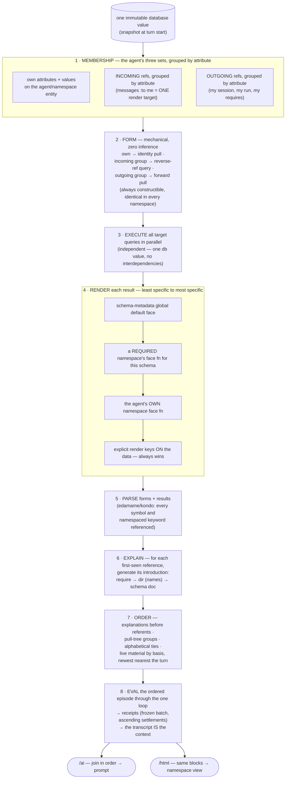

# The context pipeline, idealized — from zero, universal in every namespace

*Owner + orchestrator, 2026-08-17 night. This supersedes the
reader-inference ladder (the "producers-of-key" tier is DELETED — the
owner's objection was correct: nothing needs to produce data the pull
already holds). Acquisition is mechanical; curation lives in
rendering; verbs belong to agents.*

## The story in six sentences

The pull gives the agent three sets — what it is, what points at it,
what it points to — and each ATTRIBUTE GROUP is one render target (all
messages-to-me are one unit, not one per message). The form for every
target is mechanical — identity pull, reverse query, forward pull —
so acquisition never infers anything and is identical in every
namespace. All target queries run in parallel against one snapshot
(no interdependencies), and each result renders through the four-level
face resolution: global schema default, then a required namespace's
face, then the agent's own face, then explicit keys on the data —
most specific wins, ties are loud. Parsing the forms and results
yields every symbol and keyword referenced; each first-seen reference
generates its introduction (require, dir, schema doc), and ordering
places every explanation before its first use. Evaluating the ordered
episode through the ordinary loop produces the receipts, and the
transcript IS the context — the same blocks feeding the prompt and
the namespace view. Functions like `my.message/inbox` are VERBS the
agent discovers via `dir` and calls itself — receipted, replayed,
never part of generation.

## The face contract, confirmed against real data (2026-08-17 probe)

A live pull of root's inbound edge returns the group as a VECTOR OF
COMPLETE MESSAGE MAPS under the reverse-attribute key
(`:seon.cluster.message/_to [...]`). So a verb like `inbox` IS a
face: contract `[:vector <message>] → :seon.render/ai` — an
input-shape match against exactly the pulled group, resolved at level
2 (required namespace). The face eats what the pull caught; nothing
re-queries. Two pull-shape rules the real data demands: (1) the
GROUP'S NAME is the reverse attribute — ruling 43 renaming makes the
whole chain legible; (2) EVERY REF LEAF CARRIES ITS IDENTITY
ATTRIBUTE — a bare `{:db/id N}` in a pulled value is a defect (the
production selector already asks identities; ad-hoc subselectors must
too).

## Turn N and message arrival

Replay all receipts by (basis-t, ordinal) — byte-identical prefix.
A new inbound message makes exactly one target stale (the messages
attribute group); the system re-runs THAT query and appends, and when
prior state matters it composes the diff EXPLICITLY over printed
bases — `(diff <query at t₁> <query>)` — a form the agent could have
typed itself, since every result prints its basis. Batteries-included
means NOW; time travel is always spelled in the form.

## What this dissolves and what remains

DISSOLVED (from the mechanics register): producers-of-key inference,
the shape index (M6), the reader-faces predicate (M7), colocation
weighting (M8), auto-run-vs-offered (M9) — acquisition has no readers
to select. The register rows that REMAIN are acquisition- and
render-real: M1 (edge windows must keep the NEWEST members — proven
oldest-first today), M2 (per-edge expansion policy), M11
(render-time transactions), M12 (failed-target retry only on input
change), M13 (the diff face), plus rename/naming (43) so reverse-ref
queries read cleanly. Face-resolution ambiguity is scoped by
construction: levels are strict, and a tie WITHIN a level is a loud
error fixed by removing one claimant.
