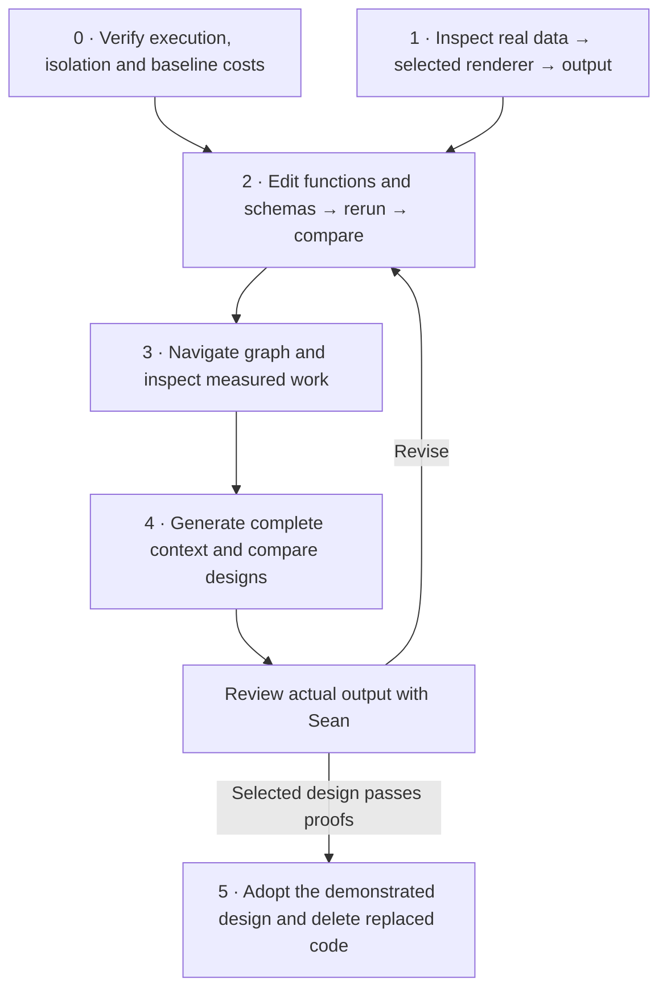

# The Design Lab — inspect data, renderer selection, and generated context

*Revised proposal, 2026-09-05, following the owner's clarification and an
independent source/browser/REPL investigation. This is a plan for review and
iteration, not a declaration that the final context design is settled.
[Evidence and dependency ledger](../research/design-lab-investigation-2026-09-05.md).
Earlier versions remain in Git history.*

## 1. What we are trying to make possible

Every namespace can have an agent responsible for improving it. The agent sees
the database from its own perspective: its code, data, messages, plans, callers,
failures, and the needs of other agents and users. Good defaults bootstrap that
perspective. The agent can then write queries and render functions in its
namespace to change what it sees and how it is presented.

Context should look and behave like a Clojure REPL: explanatory comments,
actual forms, actual results, and usable ways to investigate further. HTML is
another rendering of the same underlying data. Root needs summaries of other
agents, not copies of all their contexts. The agent responsible for my.plan
needs implementation and usage evidence; an agent using my.plan needs its plans
and enough functional understanding to use them.

The lab makes these choices visible. Select a viewing agent and an entity,
inspect the stored datoms and refs, see the applicable functions and preference
order, run a candidate, and see its output in context. Change a function and
repeat. This is ordinary Datahike data and Malli-contracted Clojure functions,
executed through the existing SCI owners.

**Latest owner clarification:** the starting point may be ANY entity. The
existing walk and renderer discovery are not assumed correct. Compare recursive
function composition, Ring middleware, Pedestal interceptors and graph resolvers
before selecting the traversal mechanism. This PRD's implementation sequence
is provisional until that design pitch is discussed; retaining infrastructure
does not require retaining the current walk or dispatch algorithm.

my.note is only an optional small specimen. Nothing in discovery, selection,
layout, or acceptance may depend on that namespace's name.

## 2. Scope and decisions already supplied by the owner

- Use the existing operator, cluster, debug routes, Clojure render owners and
  Datastar delivery. No lab-specific namespace, command, route, or registry.
- Keep actual storage visible: entity ids, fully namespaced attributes, values,
  outgoing and incoming refs, and assertion transaction provenance.
- Defaults render connected data automatically. An applicable renderer in the
  viewing agent's namespace is preferred over general renderers.
- Explicitly selected renderers and renderers from other namespaces must be
  visible in the preference order. Fine-grained tie rules remain experiments.
- Agents may customize queries as well as render functions.
- The current Web UI is not a design requirement. Retain useful mechanisms,
  redesign its information hierarchy and layout.
- Work with real program rows and data. Agent-authored functions used as proof
  must have settled through the existing turn path; no reliance on unsettled defs in the shared SCI context.
- First graph expansion is one hop, with further expansion on demand. Context
  traversal depth is a separate explicit input; a depth config may follow.
- No paid model calls for inspection. A generated-form proof can use
  system-authored forms through the existing execution path.
- Inspect root, other agents, and namespaces with the same observation
  functions. A cluster has no invented global SCI environment.
- Keep decisions and reproducible experiment definitions in tracked source;
  clusters remain disposable. Do not refactor the agent/run storage model just
  to build an inspector.

## 3. The first useful page

The page should answer one connected question without sending the user through
several unrelated dumps:

> Where is this value stored, why am I seeing it, which functions can render it,
> why did this one win, and what changes when another one is used?

The persistent header shows the viewing agent/namespace, selected subject,
database branch and basis, and observed program identity. Subject and viewer
are independent: changing viewer must not silently change the selected entity.

The main area has three coordinated parts:

| Part | Contents |
|---|---|
| Data and connections | Compact datom table; identity assertions; ref attributes and bounded endpoint pages; graph/table toggle once graph support lands. |
| Render functions | AI/HTML selector; ordered candidate rows; function and arity; input/output schemas; supplied arguments; why accepted, rejected, preferred, or tied; selected function source. |
| Results | Raw query result alongside actual rendered output. Later, select its location in the assembled prompt or HTML page. |

Clicking an attribute/ref follows that actual connection. Clicking a function
shows its stored definition and contract. Selecting a candidate previews its
output without silently making it the new permanent preference. Editing and
settling a renderer in the viewing namespace demonstrates persistent preference.

Use readable text, sufficient contrast, resizable areas and deliberate
disclosure. Datoms and Clojure source use monospace. Avoid a scroll box for every
value, giant unbroken schema listings, and the existing one-primary/all-others-
in-a-narrow-column arrangement. Keep exact values/source reachable; disclosure
is not data deletion. Retain browser-local selection, scroll and graph position
across ordinary updates.

The existing prompt remains available as comparison evidence. A historical
capture and a newly computed preview are separate labelled values; neither
silently substitutes for the other.

## 4. Data and functions at each boundary

### Stored facts

Reuse existing agent/namespace refs, domain attributes, function/arity/contract
rows, eval results, schema rows and transaction provenance. The lab initially
adds no stored inspector state, candidate roster, graph edges, or duplicate
domain records. Function definitions are stored through the existing program
publication/settlement path.

The same entity may carry several identities and satisfy several Malli schemas.
Show them. Do not force an entity kind or select one identity merely to draw it.

### Observation

A contracted function receives one explicit immutable database value and subject
lookup. It returns a bounded ordinary-data page of actual E/A/V/tx assertions,
identity assertions, selected ref endpoints, continuation, and snapshot identity.
Implementation belongs with existing data observation under seon.render.data;
bounded raw index consumption, if needed, belongs inside seon.db.

Reuse EAVT for outgoing assertions and AVET for incoming refs; do not store
reverse edges. Decode through the existing seon.db owner. Distinguish physical
stored representation from decoded value where an attribute stores EDN.

Do not implement paging by taking after seon.db/datoms: it currently realizes
the whole match. Use index continuation or a proven resource-bounded query;
consume before decoding/collecting. Continuations carry their snapshot and
selected index prefix; a stale cursor returns an explicit diagnostic.

Initially show bounded pages and honest 'more available' evidence. Exact counts
are separately requested and bounded. A database-side count is not automatically
cheap. Distinguish exact total, known lower bound, no refs, missing subject, and
unavailable observation.

Schema candidate discovery and actual validation are separate observations.
Reuse projection-scoped validators. A partial page is not the full entity:
unacquired required data means validation has not been established, not that the
entity fails the schema.

### Candidate explanation and invocation

Expose one contracted explanation from seon.render and make selection use that
same decision. Reuse existing call-static-evidence and retained-call evidence.
The UI must not recreate the selection algorithm.

Every candidate identifies ONE arity whose actual supplied inputs and requested
output are compatible. Input-ref facts narrow discovery; Malli establishes
compatibility. Inspect both supplied inputs and any defaults from the environment.

Proposed preference to test:

1. Explicit renderer on the value, then explicit renderer in the request.
2. Compatible functions in the viewing agent's namespace.
3. Compatible functions in other namespaces, ranked by a declared relationship
   distance that the page explains.
4. Schema-declared default.
5. Structural floor.

This order extends current code; it is not a claim about HEAD. The lab must
show current behavior before applying the proposal. Distance means traversing
named program/database refs, never splitting namespace strings. Which refs and
direction define distance, and how specificity and definition recency settle
ties, must be visible experimental inputs. Use immutable publication/transaction
evidence for recency, not wall-clock time or unordered collection iteration.

Carry the viewing perspective through nested render calls. A parent renderer
can explicitly invoke a child renderer; if it requests generic rendering for a
child, the same preference rules apply. A selected renderer's final output is
terminal, avoiding re-selection of its already rendered text/Hiccup.

Run candidates through existing SCI invocation, call preparation, time bound,
admission and print fit. Show thrown/refused output as evidence. Rendering cost
recording must not make diagnostic reads write facts.

The old PRD used external-sink/projection-boundary tags as a purity guarantee;
those tags describe output crossings and do not provide that guarantee. Do not
enable arbitrary candidate execution labelled read-only until the actual
execution boundary enforces it and a deliberate effect attempt proves it.
Inspection and source-reviewed pure experiments can proceed first. SCI fork
alone does not undo external effects.

### Forms, results, prompt, HTML, SCI

For every generated observation, expose the actual query/form, raw result,
selected renderer and output, explanatory comment, prerequisite facts, basis,
and destination. These are ordinary values passed between functions; do not
persist every intermediate merely because the inspector displays it.

A displayed REPL result must come from executing that displayed form. If the
form is a query, its result handle denotes its data and rendering is shown
separately. If the form calls a renderer around the query, its actual return is
rendered text/Hiccup; it cannot simultaneously be a handle to the query data.
Demonstrate both honestly, then choose with the owner.

The prompt and page may share the values they need; do not impose identical
intermediate entries on SCI bindings. Inspect SCI requires/aliases, defs, result
bindings and contracts through the existing seon.sci.eval/kernel owners. A
read-only description is distinct from installing bindings in a fork.

## 5. Proposed implementation sequence

### Visual overview

**Data presentation clarification — 2026-09-05:** reuse the existing floor
functions `seon.render.value/render-ai` and `seon.render.value/render-html`.
These implement the `:seon.render/ai` and `:seon.render/html` outputs; they
are not additional output types. Both use `seon.render.value/prepare` and
the existing print/fit functions. Improve structural HTML formatting there
instead of creating a debug-only data renderer. The schema still admits
`:seon.render/form`; its removal remains unfinished, not evidence of a new
approved output type.

The owner proposes selecting an attribute to inspect its applicable render
functions, ranked choices and outputs, and following refs to navigate the
graph. Preserve the starting entity and viewing namespace when inspecting a
different entity; changing the starting entity must be explicit. Placement
of the graph, rendered entity and selection details remains a design proposal.
The existing Cytoscape atlas is a prototype with authored data, not evidence
that the live debug UI already supports graph inspection.

The owner explicitly authorizes resetting and rebuilding experimental databases
as often as useful, and requested a fresh main development database now.
Reset-to-running verification remains required; a stopped old JVM or an attempted
publication is not a successful reset. Coordinate source stability with active
agents so the operator does not load an incomplete edit during cleanup or boot.

**Performance and mutable state — owner clarification, 2026-09-05:** atoms
require a demonstrated lifecycle need; persist durable facts and derive other
values wherever possible. Removing a counter does not justify invalidating all
rendered output on every wake. An unchanged input with unchanged rendering code
and unchanged read dependencies must reuse its retained result. Verify relevant
data changes, unrelated transactions, code changes and repeated unchanged reads
separately, including query and renderer invocation counts. The owner observed
roughly 30-second debug navigation; this is a defect, not an acceptable baseline.

Initial HTTP probes of `/ns/seon.flow/debug` measured 2.674 seconds and then
0.030 seconds warm (2026-09-05). A separate SSE probe returned HTTP 200 headers
in 0.021 seconds but no data within its explicit 12-second observation window.
These measurements distinguish response startup from first useful paint; they
do not establish a healthy feed. A 15-second JFR profile was captured during
these probes. Schema validation/registry work appears in samples, but call-count
attribution and a successful rendering baseline remain outstanding.

Reset evidence: the main root was deleted and rebuilt on 2026-09-05, reclaiming
3,720,966,508 bytes. `default` forked publication
`6a9c91b4-b607-5c90-b8ab-1aa11323d8a5`; PID 65956 then booted and MCP evaluation
returned 42. Database pull found the new `seon.render/selection` contract and
SCI resolved that symbol. The explicit hook-equivalent publication command
`bin/seon init --changed src/seon/render.clj` subsequently exited successfully,
publishing `6a9c9226-898c-5ec3-9099-61f8b8d07878`. This proves publication and
fresh acquisition, not automatic adoption by existing cluster branches.

The browser exposed a render-proc state collision between the runtime revision
atom and the observed numeric revision. The numeric state now uses
`::observed-runtime-revision`; a restart is required for a proc that already
overwrote its atom. Bootstrap receipt settlement also produced an invalid
database-argument contract error; investigation remains open. These failures
prevent claiming the inspection milestone complete despite successful boot.

**Current verification checkpoint — 2026-09-06**

Actual entity data, refs, ordered paired candidate outputs, supplied arguments,
contracts, independent viewers and graph navigation now have focused and live
browser proof. Shared invocation reuse and invalidation on relevant facts and
SCI changes are verified. Agentless inspections leave the database basis and
agent population unchanged. The [completion audit](../research/design-lab-completion-audit-2026-09-06.md)
records the exact evidence and limits. The full goal stays open for actual
producing source with ordinary stored form/results; paused source-run work has
not been resumed or replaced with another evaluator. Later context-design and
consolidation milestones remain experiments, not prerequisites silently folded
into this inspection checkpoint.

**Earlier milestone status — 2026-09-05, implementation authorized**

- [x] Trace existing cluster/SCI/render ownership and record evidence.
- [ ] 0: Prerequisites — **in progress**. Same-arity renderer fix committed (`f0f28b086`), live-probed;
  SCI isolation awaits integration with the other session's turn-batching work;
  real-turn baseline remains unverified.
- [ ] 1: Real data, candidate and output inspection — **implementation active**.
  Bounded Datahike pages and entity observation are live-probed; selection
  explanation and debug-page/feed integration are being implemented.
- [ ] 2: Agent-driven function/schema edit, rerun, compare and revert.
- [ ] 3: Graph navigation and measured acquisition/render work.
- [ ] 4: Complete bootstrapped context experiments and owner review.
- [ ] 5: Generalization, adoption and deletion of replaced mechanisms.

Terminology review is complete; integration checks continue alongside milestone 0. Simple edits
and checks use smaller models; architectural and integration work retains
stronger review. The owner inspects and directs; Codex performs the changes.

**Agent-driven operation (owner clarification, 2026-09-05):** Codex drives
the experiments through MCP/REPL, database transactions, source edits and the
existing operator. Sean inspects outputs and directs design; manual editing of
forms, schemas or datoms is never required to complete an experiment. The web
controls expose the same functions Codex invokes, with inputs/results available
for inspection rather than a browser-only experiment mechanism.

Experiments include changing data shape and connections, not merely render
functions: move facts from an agent record to referenced entities, attach or
remove refs, change ownership/grouping and compare embedded EDN with entity refs
where appropriate. Define reproducible transaction data against the selected
experimental cluster, show before/after datoms and renders, and preserve the
recipe in source. Live compatible assertions/retractions use seon.db/transact!;
new schemas follow existing admission/installation. Incompatible persisted
attribute semantics use an explicit disposable reset/refork, automated by the
agent. No blanket promise that every schema change can mutate a live store.

For every change, distinguish loaded host Vars, committed program definitions,
Malli projections, and stored datoms. MCP JVM mode supplies explicit custody;
MCP evaluation in the shared SCI context mutates shared SCI state without creating ordinary run facts and is
not the adoption mechanism. Execution experiments use the existing real agent
path. File reload alone does not establish that an existing cluster adopted a
new program. Show the exact branch/program/basis and refresh the visible result
after each trial. Verify data/ref changes and runtime evaluation invalidate the relevant retained
render, and measure transaction-to-visible-result plus reset-to-visible-result
when a reset is necessary. The operational acceptance is: Codex performs a
data-shape change and a connection change, reruns, compares and restores the
baseline while Sean supplies only design feedback.

Status at this planning checkpoint (2026-09-05): source research and defect
inventory are recorded; prerequisite fixes and proofs are not complete. The
performance/turn-batch work is in flight in another session. Step 1's observation
and layout can proceed independently, but candidate execution depends on step 0.
This is a dependency plan, not a calendar estimate or authorization to start
unassigned implementation lanes. The step table below owns deliverables and
acceptance. Each demonstration records what passed, what failed and the next
owner decision; status never advances solely because code was written.

At step 4, compare bounded traversal before rendering, renderer-directed
expansion and recursive rendering with shared reads under the same inputs and
required-content checks. Examine ordering, omission, edit-to-result latency,
query/render costs and prompt tokens with the owner. Adopt changes into the
existing functions as evidence accumulates. Step 5 removes the remaining
superseded mechanisms after broader namespace and restart/scale proofs.

### Prerequisites for trustworthy experiments

These are checks on the existing system, not a prerequisite to settle the new
discovery/ordering design. The turn-batch owners are editing the execution and
settlement files as of 2026-09-05; assess the completed change, not a mixed
working tree. Read-only observation/layout work can proceed meanwhile.

Before executing/comparing alternative functions:

- Prove real turn execution: ordered dependent forms share real result bindings;
  raw replies (including prose-only) and actual returned values/errors settle
  through the completed batching path. A crash leaves honest interrupted facts
  and does not replay effects. Reuse that lane's regression and live evidence.
- Prove receiving-context coherence and candidate isolation: correct branch,
  namespace, projection, defaults and agent defs; changed/rejected candidate
  leaves parent Vars, program caches and projection unchanged. Reuse cluster,
  turn and candidate owners; sharing found in the audit must be addressed before
  candidate previews run against a parent we intend to preserve.
- Prove contract selection on one arity: the input-accepting arity must also
  declare the requested output, with call preparation included. Fix the known
  cross-arity false positive before treating candidates as valid comparisons.
- Establish a reproducible timing baseline through the real execution path:
  fixed nonempty fixture, source/program identity, cold/warm runs, eval versus
  preparation/analysis/database/settlement/render costs, transaction counts,
  output size and errors. Include a no-op repeat and a changed input; report
  unavailable measurements explicitly. A trivial MCP arithmetic timing alone
  cannot establish turn performance.

Before claiming the first complete lab experiment works (part of implementation,
not a separate infrastructure phase):

- Prove output truth: displayed form returns the displayed raw value; formatting
  is labelled separately; generated-but-unexecuted forms are not history. Debug
  and real prompt assembly share the relevant computation and identify captures
  versus prospective output. Comparing equivalent inputs yields the same
  provider-bound bytes without a paid model call.
- Prove edits take effect: same entity, two viewing agents, direct and nested
  values; change a local renderer/schema, rerun, revert. Show actual selected
  function/arity and changed output; unchanged agent remains unaffected. Repeat
  with retained calls enabled and bypassed to expose stale experimental inputs.
- Use one nonempty fixture with a shared ref, a cycle and a high-degree subject.
  Verify bounded acquisition, explicit missing subjects/prerequisites, requery
  for omitted data, and no inspection-only writes. These check honesty and
  termination without choosing the winning traversal or teaching order.

Not prerequisites: final graph traversal, distance/tie rules, perfect UI,
universal semantic teaching order, a new branch manager, or clearing unrelated
repository failures. Those are experiments or separate work. Readiness requires
the relevant existing gates and the concrete live proofs above, not a claim
that all historical tests are green.

First discuss the graph/function composition pitch in the investigation's
final section. Then use the sequence below for evidence, revising owners if the
chosen traversal dissolves the current walk. Only this section sequences this PRD. Each step ends with an owner-visible
demonstration before expanding scope. Necessary bounded contracts and focused
regressions belong inside each step, not a long invisible infrastructure phase.

| Step | Deliverable and owners | Acceptance |
|---|---|---|
| 1. Inspect one value end to end | seon.db/seon.render.data bounded datom/ref observation; seon.render selection explanation; web debug page with coordinated data, candidates and actual output for existing source-reviewed renderers. Reuse current snapshot/delta delivery. | Same entity inspected from two viewing agents; actual current selection explained; non-empty refs and values asserted; inputs/results readable; missing entity explicit; normal inspection adds no facts. A namespace with no agent is inspectable without creating one. |
| 2. Demonstrate renderer preference | Repair same-arity checks and carry viewing namespace through direct and nested selection; install a real compatible renderer in one agent's namespace through the normal turn path; test explicit, local, distant, schema and floor behavior. | Same stored value, two viewers, direct and nested rendering; local definition changes only the intended perspective; explicit preview works; changing/removing override reveals the next candidate. Ties and failures are visible. No copied data or special namespace dispatch. |
| 3. Add graph navigation and scale proof | Locally pinned Cytoscape asset, existing static route, graph fed by the exact observation used by the table; safe lifecycle and state preservation; separately bounded counts. | Incoming/outgoing refs and page continuations agree with datoms; large values have working requery; low/high-degree entities measured; deep page does not scan all earlier pages; ten updates retain one graph and selection; a script-closing string stays text. |
| 4. Construct and inspect context | Evolve existing generated-form/history owners; comments, executed forms, results and teaching prerequisites; editable layout functions; assembled prompt and HTML with per-entry selection and token evidence; SCI description. | Non-empty plan data shown to its user, root, and the namespace's responsible agent with different views. Queries/source/contracts/usage/failures derive from facts. At least three executed forms and a real dependency; aliases resolve in the actual fork. Layout edit changes order; the prompt can be traced to real results; prospective/captured bases are clear. |
| 5. Storage experiments and consolidation | Existing operator/registry publication and isolated worktrees/roots; branch compare only when needed; measured reset-to-page cycle; record chosen design and delete replaced mechanisms in place. | One schema/data-shape experiment before/after with real changed datoms, source identity and output evidence; crash proof before moving run/custody facts; recurring correctness and live UI proof before replacement paths are removed. |

Step 1 must include real output, not stop at drawing a graph. Step 2 is the
central proof of the owner's intended customization. We can use my.note to
establish a small value, but must also exercise a different schema and the same
plan from different viewers. Reproducible seed definitions belong in existing
source initialization, not a renderer's hard-coded namespace list.

The prospective-prompt defect from the prior PRD is no longer assumed to block
observation: the live page now emits a prospective prompt. Generated forms and
provider parity still need proof in step 4. The other agent's platform work
continues independently; only a concrete dependency blocks an affected step.

## 6. What to measure and preserve

### Experiment loop and ordering — proposal following owner feedback

The lab is the upgraded agent debug view. Its central action is rerunning a
reproducible experiment after changing ordinary functions or Malli schemas.
It exposes and improves the real cluster/agent execution and rendering owners;
it does not have its own SCI setup, session interpreter, settlement path or
context assembler. The forthcoming reply-batching changes determine the real
result bindings and settlement boundary used by experiments, too.
Hold subject, viewer, database value, program/projection identity and output
budget fixed when comparing discovery/rendering functions. Show actual changed
inputs when comparing storage schemas; that is a different experiment.

The earlier suggestion that evaluate-candidate already provides an isolated
complete-context preview was too strong. A followup audit found that its
fork retains shared Seon program-cache and environment/projection references,
and its returned ctx omits the evaluation-local agent scope and restoration
notices. Reuse and correct the existing owners; do not wire this path to a
shared live cluster as though complete preview parity were established.

Datahike branching, cluster-context forking and per-agent turn forking have
different jobs. Reuse the existing operator/registry and cluster acquisition
for an experiment with a different executable database program. A read-only
database comparison can use immutable database values. Replacing only the db
argument while retaining another program's SCI ctx/environment does not prove
coherence. The existing debug prospective prompt also bypasses part of the
real prompt path; the upgraded view must expose that path, not preserve the
divergence under a new name.

Compare bounded walk-first rendering, selection-before-expansion, and recursive
rendering with shared reads. Measure acquisition, validation, selection,
invocation, fit, context tokens and browser layout separately, with cold/warm
results and failures visible. A faster result that omitted the required plan,
an unresolved prerequisite, or missing measurements is not a successful result.
Time-to-edit-to-visible-result is also a measured cost.

The stored entity graph does not require a total order. Derive prerequisites
between generated forms; choose an ordered vector consistent with those edges.
Independent entries may follow the parent function's authored order, with a
stable identity tie-break where needed. Preserve actual effectful execution
order. Graph layout never determines execution or presentation order.

Distinguish executable prerequisites (resolved Vars, aliases and earlier result
bindings) from teaching prerequisites (which functions, attributes or concepts
the selected output explains). Clojure analysis supplies the former; functions
must express the latter. A symbol mentioned as quoted data can warrant an
explanation without being an executable dependency. Do not equate every symbol
found by tree-seq with a free Var or every transitive call edge with something
the reader needs taught. Definitions may be mutually dependent; group their
explanations or report an unsatisfied prerequisite rather than silently dropping
the remaining context. Existing ordered-episode is an experimental baseline,
not authority for these semantics.

Cytoscape.js supports the required attributed directed graphs, selection,
incremental batches and replaceable layouts. The atlas currently loads 3.30.4
from a CDN and builds elements from hand-authored MODEL data; it does not prove
live observation or performance. Pin the chosen asset locally during
implementation. Use graph views for stored refs and generated-form/call
dependencies, alongside the ordered transcript and cost table. Preserve graph
instances across Datastar updates and measure layout separately from backend
work. No extra charting library is required for the initial comparison table.

Record database and program identities independently. Hot-reloaded Var evidence
must say so; a file edit does not update an existing cluster's program rows.
For source-change proof, name the publication and cluster fork actually used.

Measure acquisition, schema checks, selection, invocation, fit, assembly and
browser delivery separately. Report cold/warm timings, subject degree, datom
population, returned work/weight, and p50/p95 where repeated measurements exist.
Compare page one and deep continuation; count separately from page acquisition.
The prior 71.9-second publication/start number is dated evidence, not a current
benchmark or an acceptance target.

Retain existing revisioned packages, gap keyframes, sliding buffers and http-kit
drain-or-close behavior. The skill prose calling these unbuilt is stale.
Graph cleanup must use Datastar's actual supported lifecycle; data-init does
not automatically retain a returned cleanup callback.

No read-only page or feed creates an agent, records render costs, or publishes
diagnostic artifacts. Verify exact basis/datom changes in an isolated cluster
rather than treating 'no exception' as success. Do not hide failed schema
validation, missing source identity or missing subject as an empty healthy view.

## 7. Choices for review

| Approach | Guarantee | Cost / what we give up |
|---|---|---|
| **Recommended: the sequence above, starting with one complete inspection loop** | The owner can inspect actual data and selection early, then test customization before context refactoring. | Full graph, arbitrary candidate execution and branch UI arrive later; first output uses existing reviewed functions. |
| Original PRD order: all observation machinery, then graph, then selection | Broad graph coverage before changing selection. | More work before the owner can test the central renderer preference; higher chance the inspector grows around an untested choice. |
| Build the complete context/SCI/UI replacement first | Can test the full intended experience together once complete. | Largest cross-owner change and slowest feedback; storage, selection and layout defects become harder to distinguish. |

No new owner decision is needed to restate the goal. The next useful review is
of a concrete step-1 screen and step-2 preference experiment. Distance/tie rules,
raw-result handle behavior and the common projection boundary are decided with
those outputs visible, not by treating historical prose as binding.

## Active completion goal — 2026-09-05

Keep implementation running until the first complete debug inspection is
working in the browser: actual data/connections, selection evidence and actual
output, with focused tests and live proof. Delegation and source edits alone
do not complete the goal. The owner additionally requires runtime eval changes
and data transactions to refresh the already-open view; a stale page is a defect
to diagnose and fix, not a reason to substitute manual browser refresh.

Current verification, 2026-09-05: the added runtime-revision atom was removed;
it collided with a number under the same key and duplicated derived state.
MCP evaluation currently offers the ordinary render wake. This does **not** yet
prove that a changed helper invalidates cached HTML: code invalidation remains
an explicit outstanding acceptance item.

Unchanged relevant data, program definitions, projection and render inputs must
reuse HTML before renderer discovery or invocation. Suppressing an identical
package after expensive recomputation is insufficient. Measure discovery and
invocation counts as well as request duration. An unrelated transaction must
not force the whole debug page to render again merely because basis-t changed.

The controlled real-socket regression
`canonical-debug-feed-repaints-when-the-subject-changes` passes: the same stream
receives a changed namespace doc after initial paint. The current default
process initially remained stale while recording repeated
`seon.render.data/at` input contract failures. Lifted error evidence named
the cursor contract and offending nil: older retained debug registrations
omitted the cursor. Normalizing the optional cursor at use fixed the pass.
The already-open browser tab then received a changed namespace-doc datom at
basis 536871434 and its restoration at basis 536871437 without a reload.
Temporary namespace-doc markers have been restored. The complete
`seon.render.data-test` gate passed: 5 tests, 107 assertions, no failures/errors.
Code-change invalidation, cache-work counts and final visual inspection remain
outstanding; this data-update proof does not complete them.
