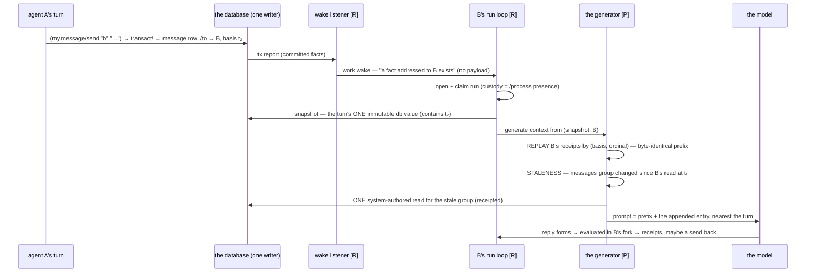

# The messaging loop — one message, birth to the model's eyes

*Companion to the [v0 minimal opening](agent-context-concrete-2026-08-17.md).
[R] = real at HEAD, [P] = the v0 generator target. The key fact: there
is NO checking mechanism — a message is a fact, a fact wakes the
recipient, and the next generation notices exactly one stale group.
Discovery at the opening and new-message checking at turn N are the
SAME staleness pass.*

The six steps:

1. **Send is a write [R]** — `(my.message/send "b" "…")` transacts one
   message entity through the serialized connection; basis t₂;
   receipt-stamped tx-meta. Nothing else happens at send time.
2. **The wake is event-driven and payload-free [R]** — the one
   listener sees the addressed datom (`/to` → B) and offers a wake to
   B's parked graph. The wake means "look," never "here is the
   message"; a lost or duplicate wake can corrupt nothing.
3. **The turn pins one world [R]** — B claims a run and snapshots the
   db once; mid-turn arrivals never move the ground and simply wake B
   again after settlement.
4. **Generation = replay + one stale group [P over R parts]** — replay
   renders receipts in (basis, ordinal) order (prefix byte-stable);
   staleness intersects changed attributes with retained read
   evidence; the generator emits ONE system-authored read for the
   messages group, composed over the PRINTED prior basis when prior
   state matters: `(seon.db/diff t₁ #'my.message/inbox "b")` [R —
   helper landed] — a form B could have typed itself.
5. **Prompt = prefix + suffix** — cache keeps paying; the new message
   sits nearest the turn, rendered through the message face; the full
   body is `(my.message/read id)` away, itself receipted.
6. **Reliability needs only generated lines** — the seven-sentence
   intro, help's affordance line for the messages group (count +
   newest + the read call), and `dir 'my.message` showing `send`. The
   live test asks whether that is enough; every failure names a
   missing GENERATED line, never new scenario prose.
