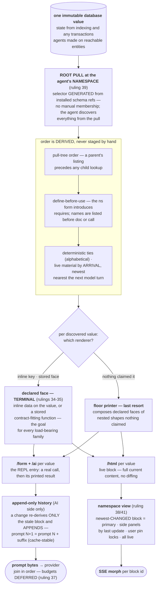

# The One Renderer

*Rewritten clean 2026-08-14 night against rulings 27-41
([ledger](design-ideas-ledger-2026-08-13.md)). This document states
current design truth only; the evening's evidence lives in the linked
research; superseded framings live in git history. Vocabulary:
"face" = a declared render function or inline render data for one of
the three projections; the name for one walked piece of pull data is
DELIBERATELY UNSETTLED (owner: understand the data first).*

## 0. The system on one page

**Agents ARE namespaces (ruling 40).** An agent's context is a pull of
its namespace's data — that's it (39). One mechanism generates the
agent's prompt and the human's page: the pull discovers everything (no
manual membership, ever), the walk fixes one derived order, each
discovered value resolves one renderer, and the two seams are 2D and
3D of the same block vector — text joined in order for the model,
space arranged by recency for the human.

**The worked example, live:** the running cluster's actual root
context, captured and walked step by step —
[root-context-example](../research/root-context-example-2026-08-14.md).
It proves the form+value façade runs in production, shows five
register defects at the bytes, and demonstrates the wrong pull root
(agent entity dragging in the cluster) that ruling 39 kills. **The
three-perspective study** — root, a temp chat agent, a `my.note`
maintainer; same mechanism, three different contexts AND three
different pages from nothing but the root choice and the reachable
faces — is
[three-perspectives](../research/three-perspectives-2026-08-14.md).

## 1. The five stages, precisely

### 1.1 Collect

One Datahike pull rooted at `[:seon.ns/name <the agent's namespace>]`.
The selector is generated from installed schema ref declarations —
forward and reverse — at config-derived distance; the pull result is
both the data and the membership index. NOTHING is manually specified:
what appears in a context is decided by exactly two things, the
namespace root and the schema's declared refs. All needed edges are
installed today (`:seon.ns/requires`; reverse `:seon.fn/ns`,
`:seon.test/ns`, `:seon.test/subject`; the agentic facts through the
namespace). Rendering starts at the database value; how facts got
written is not this pipeline's business, and derived renders are never
stored.

### 1.2 Order

Derived, never staged: pull-tree order (a parent's listing before any
child lookup); define-before-use anchored at the ns form (requires
introduce names; `dir` lists them; `doc` may then name one; a call
follows); alphabetical ties for byte-determinism; live material by
arrival with the newest nearest the next model turn.

### 1.3 Face

Three projections per discovered value — `/form` (the real call that
produces the rendered value), `/ai` (its printed result), `/html` (the
same value as hiccup) — resolved by ONE chain:

1. **inline** — explicit `:seon.render/*` data ON the value; data
   wins;
2. **stored** — the contract-fitting declared face: a program fact
   (an ordinary defined function whose input schema accepts the
   value — ruling 36: defining a function IS the registration) or the
   schema-declared face; ambiguity is a loud error, never a coin
   flip;
3. **floor** — the value printer, which COMPOSES the declared faces
   of nested registered shapes nothing claimed (ruling 35: this is
   the floor's mechanism; a selected face is TERMINAL and owns its
   subtree — bad nested rendering inside a face is a curation defect
   fixed at that face).

**Faces for every load-bearing family are the goal (ruling 34), in
both projections.** The floor exists for honesty and totality; a
family riding it in either output is an open census gap. Results are
data: prose is legal only in instruction entities. **Form honesty is
the façade invariant:** every context entry is a call the agent could
actually make; evaluating the entry's form at its basis produces a
value whose print equals the entry's `/ai` bytes. (Narration cannot
satisfy this — which is WHY narrating faces confabulated.) Functions
themselves render through a default face that outputs the generating
form (36).

### 1.4 Print

The floor printer's synthesis
([archaeology](../research/value-printer-archaeology-2026-08-14.md),
[prior art](../research/value-browser-prior-art-2026-08-14.md)):
sample→emit (bound the structure, then print — nothing oversized is
ever serialized), the tee sinks (one traversal, REPL text + structural
hiccup in lockstep), guarded realization (a poisoned lazy value
degrades to an opaque marker; the printer never throws),
inline-when-fits layout via an O(width) probe, payload-first
degradation (a map dominated by one string promotes the string),
the derived table face, and the verbatim probe for small values.
**One elision face (ruling 33):** compact and shape-bearing — type,
count, what remains, requery identity, AT the cut point, never a
trailing annotation — firing only at extremes. Ordinary generated
content (`help`, long inter-agent messages, openings) prints WHOLE
under generous defaults: this is a trustworthy DEFAULT printer. REPL
parity means framing fidelity (no comment scaffolding, no narration),
not stock elision bytes; bare `...`/`#` and the `::length 32` /
`::level 8` defaults die. The elision's `next-offset` is designed as
exactly what a Datastar scroll/intersect handler posts back — one
drill contract for both seams. **The printer has no budget.**

### 1.5 Update and deliver

**AI seam:** entries append under the diff/history discipline — a
transaction wake replays retained read evidence, only semantically
stale blocks re-derive, exactly once, appending basis-labelled
entries; prompt N+1 is prompt N plus a suffix (change-as-change for
the agent, byte-stable prefix for the provider cache). Assembly is a
join in order and NOTHING else: **budgets are deferred entirely
(ruling 37)** — the interim knob is acquisition depth config, and
wrong context at a depth is fixed by moving data around, never
clipping. When budgets return, the ruled design is member-level
whole-or-chip measuring AI text only with the observed calibration.

**HTML seam:** no diffing obligation, no budget, ever — every block
morphs to its full live state. **Routes (ruling 41): `/` (root's
namespace view), `/ns/<full.ns.symbol>`, and the already-written
`/data` global browser.** The `/agent/*` and `*/debug` routes at
`route.clj:13-22` encode the dead agent-entity model and are
deletions; the honest `/ai` view (ledger 31 — the trust surface:
character-faithful modulo whitespace/color, raw toggle) becomes an
in-page affordance. **Layout (ruling 38):** the newest-CHANGED block
holds the large primary position; remaining blocks sit in the right
side panel by last update (~3 visible on desktop), movable; a
browser-local pin locks primary. The transcript holds primary by
changing most; an agent surfaces anything by defining a face — its
block wins primary by recency. Chat face: newest at bottom, message
bar fixed at bottom, auto-expanding textarea, inline-expanding
pretty-data chips for entries without a designed html face.

## 2. The failure policy — three faces, one fact

**Development panics hard.** Any render-path contract violation — a
face failing its declared shape, a stage handed a value it cannot
face, a bare elision constructed, bounding outside the ruled seams —
panics at the boundary naming the function, the value, and the
contract. No degraded output exists in dev; the `renderer unavailable`
placeholder is banned.

**Production never crashes.** The same violation becomes one ordinary
`:seon.error` fact through the evidence-complete constructor, then
renders through the pipeline itself: a designed, deduplicated error
card for the human; the flat error value in the agent's context —
naming the failing function so an agent-authored defect closes its own
repair loop (redefine → green-to-install → the card heals). The R41
dial selects the half; panic-on is the development default; no-silent-
swallowing is a graph query over catch sites, never a convention.

**Unconstructability, three layers:** (1) typed seams — prompt
assembly and the web writer accept pipeline records, refusing raw
strings and bare hiccup; (2) graph-query censuses asserted empty —
callers of `emit-*`/`pr-str` feeding a seam outside the printer's
owners, hiccup-with-content in non-face functions, budget-shaped calls
anywhere (prerequisite: the analyzer must index core-call edges, the
precise reason today's `text-boundary-report` and `render.lint` are
blind); (3) grammar — the bare elision, the un-identified block, and
the budgetless-profile NPE become unrepresentable in the schemas. The
[seam-hole census](../research/seam-hole-census-2026-08-14.md) grounds
this: 48 live holes reduce to seven choke points, four of them
deletions.

## 3. The rip-out register

Verified at the bytes; ✓ = re-verified by the orchestrator; full LOC
arithmetic in the
[deletion register](../research/deletion-register-2026-08-14.md)
(1671 removed vs 1347 revived+new, conservatively −324; the deeper
win: seven elision phrasings → one, six bounding owners → one, two
chains → one, two private fit engines → zero).

| # | Dies | Where | Killed by |
|---|---|---|---|
| 1 | `project-node*` substituting `/ai` prose in result position (98.8% of an entity pull destroyed) | `render.clj:445-495` | results-are-data / form honesty |
| 2 | `seon.print` sink emitting raw `/ai` fragments below root | `print.cljc:107-112` | one printer |
| 3 | The narrating faces (census: 20 of 42; ~37 of 51 graded good convert to DATA faces, not deleted) — worst: the run face that printed the WRONG run's id on three live runs ✓ | `cluster/run.clj:1913-1966` et al.; [capture](../research/root-context-example-2026-08-14.md) | ruling 34 + form honesty |
| 4 | The floor's second map face (braceless `nominal-at:` pseudo-EDN) ✓ live | `render/value.clj:365-398` | one printer |
| 5 | Four+ independent elision phrasings incl. `render-elision-ai`'s narrated sentence (violates live ruling #25) | `print.cljc:283-304`, `db.clj:1666`, `transcript.clj:741`, `source.clj:54` | ruling 33 — one face |
| 6 | Residual function-side bounding (~24 sites, 9 files; worst: `lint.clj:320` local subs+"…", `ns.clj:95` cap-40, `transcript.clj:27` policy-6, silent `take` in `db.clj:580`/`test/*`) | [reaudit §3](../research/renderer-reaudit-2026-08-14.md) | ruling 32 — two seams only |
| 7 | The emitter's `::length 32`/`::level 8` bare-`...`/`#` default path ✓ (8 sites; one caller nils it) | `print.cljc:383-557` | ruling 33 |
| 8 | `fit`'s re-emitting convergence loop + `fit-terminal`'s second character pass (pr-str-chops hiccup ✓; chopped `(dir 'my.background)` live ✓) | `print.cljc:908-943, 829-839`, `render.clj:524` | sample→emit; printer has no budget |
| 9 | Both private fit engines and the dead `:summary` tier (byte-identical to `:full` ✓) and the budget self-raise | `render/ns.clj:490-506`, `transcript.clj:792-861` | one printer; ruling 37 |
| 10 | The prompt distance-decrement budget loop (branches vanish with no elision) + markup bytes evicting prompt entries | `prompt.clj:225-272`, `transcript.clj:792` | ruling 37 |
| 11 | Silent unprojected-node return on face-contract failure | `render.clj:468-474` ✓ | §2 stage contracts |
| 12 | Bare elision markers rendering as FABRICATED sentences; `enrich-elisions` single-caller patchwork | `admit.clj:107-140`, `print.cljc:287-295` | grammar requires the facts |
| 13 | The second resolution chain and the dead owning-namespace plumbing (4 suppliers repo-wide ✓) | `render.clj:301-320` vs `:457-459` | one chain (ruling 36 makes stored faces ordinary program facts) |
| 14 | The agent-entity pull root and the cluster drag-in (config, instruction dump, `:seon.cluster/toolkit` + `toolkit-namespaces` as membership) ✓ live | `walk.clj:83-153`, `seon.cluster.edn:8-15` | rulings 39-40 |
| 15 | Routes `/agent/{id}`, `/agent/{id}/debug`, `/agent/{id}/message`, `/ns/{ns}/debug` (live today ✓) | `route.clj:11-17` | ruling 41 |
| 16 | `web.clj`'s parallel content path: `session-timeline` + `pop`/`conj` splice, the second Clojure lexer, `generic-entity`'s private dump; 75/171 orphan CSS classes | `web.clj:316-510, 707-754` | blocks all the way down |
| 17 | The transcript's `<pre><code>` AI-text-as-HTML and the missing per-entry html faces | `transcript.clj:550, 774` | ruling 38 + ledger 30-31 |
| 18 | Hand-written `<dt>/<dd>` twin cards with hardcoded key lists; the one-generic-card-for-327-error-classes asymmetry | `config.clj:76-90`, `cluster.clj:182-187`, `effect.clj:104-112`, `db.clj:1944-1952`, `error.clj:1068` | ruling 34 + `declared-attributes` |
| 19 | Dead documented assembly (`walk/prose` — no production caller; `effect/context-suffix` never delivered ✓) and the live string assembly in `web.clj/history-text` | `walk.clj:606-709`, `web.clj:1340-1350`, `effect.clj:724-812` | one assembly at the seam |
| 20 | Unbounded stored agent print output (docstring claims a cap that does not exist) | `sci/eval.clj:299-306` vs `:69` | admission owns stored strings |
| 21 | `::truncated-string` printing its ellipsis INSIDE the quoted string; unquoted strings in printed maps ✓ live (broken read-back) | `print.cljc:529-531`; capture | round-trip honesty |
| 22 | Calibration split (shipped vs observed) and the `:?_current-ns_?/face` alias botch (its test only checks the key name) | `print.cljc:931, 572` ✓, `print_test.clj:240` | one calibration; fix on sight |
| 23 | The maintenance repetition data-model defect: hourly failure re-pulled as 5 entities with the agent's full opening text EMBEDDED per request row — drove two live `budget-exceeded` deaths ✓ | capture; `seon.maintenance.request/agent` | coalesce facts; reference, never embed |

## 4. Revivals — the archive built the hard parts

Quarry root `git show 9e44815f5:src-old/`; verdicts and excerpts in
[render archaeology](../research/render-archaeology-2026-08-14.md) and
[value-printer archaeology](../research/value-printer-archaeology-2026-08-14.md).
Revive verbatim: `seon/ui/clojure.cljc` (192-line highlighter; classes
→ `seon-print-*`; degrade routes through the strict dial). Revive
adapted: sample→emit; the `fits?`/`emit` layout; `dominant-string-entry`;
guarded lazy realization; drill hints; opaque/datom/shape tokens; the
capped writer (via `reduced`, never a throw); per-block output-byte
chain hashes (stale-package invalidation becomes unconstructable); the
drill protocol; `strict-fail!`'s catch order; `render/chat.cljc`
bubbles. Keep from current: the Sink/tee, the derived table face,
elision-as-node, the namespace-map lift, `references`. From vendored
prior art: reveal's `reduced`-propagating single-traversal bound and
O(width) width probe; orchard's independent atom/value bounds and
page+1 probe; malli's relevance masking.

## 5. The property suite — properties, not fragile tests

Generative wherever a value is an input; seeded; shrinking. Banned:
exact-string expectations, pinned counts, golden HTML. Tests that
currently PROTECT defects (`print_test.clj:240, 255-269`) are
rewritten, not preserved.

1. **Totality** — any generated value renders end to end in both
   sinks: a face or ONE error fact, never a throw, never absence.
2. **Form honesty** — evaluating any entry's form at its basis yields
   a value whose print equals the entry's `/ai` bytes.
3. **Round-trip** — a data face's text reads back equal modulo
   declared elisions; every elision carries shape + requery identity
   and requerying reaches the content.
4. **One elision face** — no output contains `...`/`#`/hand-rolled
   "N more" outside the one face; grammar rejects the bare marker.
5. **No function-side bounding** — the graph census: the ruled seams
   are the only bounding callers; subject-present by construction.
6. **Results are data** — prose only under instruction entities.
7. **P-TEE** — text and hiccup from one traversal agree structurally.
8. **Membership is derived** — for a generated schema population, the
   context of a namespace equals the schema-reachable closure of its
   root: nothing more (no cluster drag-in), nothing silently less.
9. **Face equivalences** — chat entries ∪ chips == the honest view ==
   capture content; block identities stable across faces.
10. **Failure faces** — generated defective faces: dev panics naming
    the stage; prod yields exactly one error fact whose faces render;
    the catch-site census holds.
11. **Page lint** — generated histories render pages passing
    `seon.render.lint/check`, shrinking to the minimal reproducer.

## 6. Waves

Re-scoped against rulings 33-41; each wave lands WITH its §5
properties; no wave starts before the owner marks this document up.

0. **Settle** — re-derive register marks at HEAD; fix-on-sight items
   (`print.cljc:572`; the two filed tool defects).
1. **Stage contracts + the panic seam** — §2; catch-site census;
   core-call edge indexing (the census prerequisite); the test audit.
2. **The namespace root** — pull re-root (rip-outs #14-15); route
   table to `/`, `/ns/*`, `/data`; agents-ARE-namespaces data-model
   step per the owner's chosen dissolution option (§7.1); the
   repetition defect (#23).
3. **Results are data** — #1-#5, #18; face conversions per ruling 34;
   the face census (which families still ride the floor, both
   projections).
4. **The printer** — sample→emit synthesis, one elision face, delete
   both fit paths and the private engines (#6-#12, #21-#22); no
   budget machinery anywhere (#10 dies without replacement until the
   owner reopens budgets).
5. **The views** — layout per ruling 38 (primary/panels/pin), chat
   face + chips, the honest view as in-page toggle, highlighter
   revival, `web.clj` parallel-path deletion (#16-#17, #19).
6. **Hygiene** — block identity unification, chain hashes, calibration
   unification, orphan CSS purge.

## 7. Open decisions for the owner

1. **The agent entity STAYS (owner, 2026-08-14 night, superseding the
   merge option): agents need a place to write their own data.** Two
   entities, two concerns, linked agent → namespace as today (one
   agent per namespace; the pull reaches the agent from the namespace
   root by the reverse ref in one hop): the NAMESPACE entity is the
   code's home (requires/refers/source; functions and tests
   reverse-ref it); the AGENT entity is the agentic life's home — its
   defs, notes, plan items, per-agent instruction refs (all
   agent-ref'd today), and messages (`/to`,`/from` address the agent).
   PROPOSED for markup — the session family (the one new schema):
   `session/agent` ref; `opened-at`; `archived-at` ABSENT = current;
   the agent carries ONE forward `/session` ref to the current
   session (the ref IS the one-current-session invariant); runs
   repoint `run/session` (agent derivable through it); a session's
   transcript derives from its runs' forms/receipts plus messages in
   its basis interval. The pull's forward `/session` edge puts exactly
   the current session in default context; archived sessions sit
   behind the reverse edge — reachable identities, requeried on
   demand, never flooding a fresh context. Archive = one transaction:
   assert `archived-at`, retract-and-replace `agent/session` — "new
   chat" and rebirth are the same move.

   **Companion piece — the fundamentals are Seon's clojure.core.**
   Base capabilities (`my.message`, `my.run`, the injected
   `help`/`dir`/`doc`, the `seon.db` read family — exact set to be
   ruled) are AUTO-REFERRED into every agent namespace, recorded as
   derived `:seon.ns/refers` facts at creation/index time — the
   attribute already exists, distinct from `/requires`. Membership
   stays pull-only (ruling 39): the refer facts are ordinary refs the
   selector follows, so the fundamentals reach every context by
   derivation while the authored ns form stays tiny and every
   explicit require remains visible genuine intent. No cluster-level
   injection — that is the drag-in ruling 39 killed.
2. **Panel mechanics (ruling 38 details):** what qualifies as a panel
   (recommend: blocks with a declared `/html` face outside the
   transcript spine); reorder damping (recommend: morph in place
   immediately, reorder only when a DIFFERENT block becomes newest);
   pin granularity (recommend: pin primary + optionally pin one side
   panel).
3. **`/form` projection timing** — join wave 3 (each entry carries its
   regenerating form — form honesty makes this nearly free) or wait
   for the drive series.
4. **New-chat mechanism** — message-to-root sugar (root creates the
   namespace; keeps the one-mutation rule) vs one creation route (a
   third route; faster first paint).
5. **The name** for one walked piece of pull data — deliberately open
   until the owner has sat with the worked example; the data says:
   each piece is one (form, value) pair derived from one pull edge.

## 8. Sources

- [Rulings ledger](design-ideas-ledger-2026-08-13.md) — 27-41, the
  binding decisions.
- [Open-questions ledger](open-questions-2026-08-14.md) — the
  iteration record; Q0-Q4 ruled, consequents tracked.
- Live evidence:
  [root-context-example](../research/root-context-example-2026-08-14.md) ·
  [three-perspectives](../research/three-perspectives-2026-08-14.md) ·
  [UI verification](../research/ui-verification-2026-08-14.md) ·
  [context ablation](../research/context-ablation-2026-08-14.md).
- Audits: [renderer re-audit](../research/renderer-reaudit-2026-08-14.md) ·
  [seam-hole census](../research/seam-hole-census-2026-08-14.md) ·
  [deletion register](../research/deletion-register-2026-08-14.md) ·
  [results-as-data](../research/results-as-data-audit-2026-08-14.md) ·
  [clipping census](../research/context-clipping-census-2026-08-14.md) ·
  [gap census](../research/one-renderer-gap-census-2026-08-14.md).
- Design lineage:
  [parity-elision collision](../research/parity-elision-collision-2026-08-14.md) ·
  [print-path design 2026-08-01](../../sci-execution-runtime/plan/print-path-design-2026-08-01.md) ·
  [value-printer archaeology](../research/value-printer-archaeology-2026-08-14.md) ·
  [value-browser prior art](../research/value-browser-prior-art-2026-08-14.md) ·
  [transcript view design](../research/transcript-view-design-2026-08-14.md).
  (The one-pipeline sketch is deleted — absorbed into §1-§2; git is
  the archive.)
