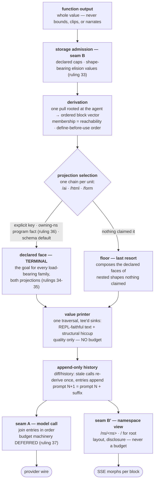

# The One Renderer

*Draft for the owner's markup, 2026-08-14. Sources: the day's four
audits, the archaeology of the first implementation, and the 47-row gap
census — linked in §9. Vocabulary note: "producer" is retired (it was
already a legacy spelling); this document says **function output** (what
any function returns) and **render output** (a declared cleanup face for
a shape — inline data or a function symbol).*

## 0. The problem and the scope

Every rendering defect found this cycle — silent truncation, narrated
results, placeholder swallows, split code fences, prompt bloat, stale
cached blocks, thousand-line garbage pages — is one disease: **there is
no single well-thought-out pipeline, so every blow-up was papered over
locally instead of fixed at the system.** The evening re-audit sharpened
the diagnosis ([renderer-reaudit](../research/renderer-reaudit-2026-08-14.md)):
the ingredients all exist — a tee'd two-sink printer, a composing nested
walk, the elision value, a four-step selection chain — and the code
defeats each one AT ITS MOUNT POINT. And the deepest hole is a **regime
collision**: the sealed 2026-08-01 REPL-parity print design (bare `...`
is a stock-Clojure face, byte-locked by `repl_parity_test`) and the
later elision-value law both live half-merged in `seon.print`, with no
seam deciding which regime a render request is under — that unowned
boundary is where most garbage fell through (open-questions Q0). This is
therefore a RE-PLUMBING program, net-deleting, not an invention program:
the [deletion register](../research/deletion-register-2026-08-14.md)'s
verified arithmetic is 1671 lines removed vs 1347 revived+new (−324,
stated conservatively — attribute-face conversions leave `src/` for
`resources/` EDN and test deletions are uncounted). The deeper win is
mechanism count: SEVEN independent English elision phrasings → one
face; six bounding owners → one seam; two resolution chains → one; two
private `fit` re-implementations → zero. The scope of this PRD is the
ENTIRE content rendering system for AI and HTML outputs, start to
finish: one coherent pipeline where nothing can go sideways, no data is
ever silently swallowed, development panics hard, and production
degrades to designed faces — never to garbage, never to absence.

Every stage is **total** (never throws into the pipeline), **honest**
(typed error values, never silence), **bounded** (declared budgets),
and **contract-checked at its boundary**. A value that skips a stage is
unconstructable, not discouraged.

## 1. The architecture

### 1.0 The big picture — context generation IS the renderer

**One mechanism generates the agent's context and the human's page.**
There is no context builder beside a UI renderer; there are five stages
over one substrate (ruled with the owner, 2026-08-14 late evening):

1. **Collect** — one Datahike pull rooted at the agent entity, its
   selector GENERATED from installed schema ref declarations; the pull
   result is both the data and the membership index. Nothing configures
   what blocks exist; reachability from the agent at one immutable
   database value decides. Authority:
   [context.md "Membership is the root pull"](../../../seon/architecture/context.md).
2. **Order** — the walk emits one deterministic ordered vector of
   blocks: pull-tree order, define-before-use, alphabetical ties, live
   material by arrival. This vector is the ONE shared substrate — the
   owner's "2D": the AI side is this vector reduced to text in order;
   the HTML side is the same vector arranged in space. Authority:
   [context.md "Order preserves the prefix"](../../../seon/architecture/context.md).
3. **Face** — each unit resolves `/form`, `/ai`, `/html` through the
   one selection chain. **Ruled (ledger 34): declared faces for every
   load-bearing family are THE GOAL** — the floor value printer is the
   safety net (honesty, totality), never the mechanism that decides
   what the agent or the human sees; a family riding the floor in
   either output is an open census gap, and neither output tolerates
   dumped shit. Faces are TERMINAL (ruling 35): a declared renderer
   owns its value's output; composition is the FLOOR's mechanism —
   for values nothing claimed, the floor walk detects nested
   registered shapes and composes their declared faces. Agent-authored
   render functions need no registration: a defined function is a
   program fact the pull acquires, with a default face that outputs
   its generating FORM (ruling 36).
4. **Update** — the diff/history model: the render proc retains each
   logical call's read evidence; a transaction wake replays it against
   the latest database value; only semantically stale calls re-derive,
   exactly once, APPENDING basis-labelled entries. History never
   edits: prompt N+1 is prompt N plus a suffix — so the agent sees
   change AS change, newest-basis material sits nearest the model
   turn, and the byte-stable prefix is the provider cache. Authority:
   [context.md "Read reuse…" / "Work wakes and render refresh are
   separate"](../../../seon/architecture/context.md).
5. **Deliver** — seam A joins the entries in order; ALL budget
   machinery is DEFERRED (ruling 37: nothing clips until the pipeline
   works — the interim knob is acquisition depth config, and wrong
   context at a depth is fixed by moving data around; when budgets
   return, the ruled design is member-level whole-or-chip). Seam B′
   arranges the same retained blocks on the namespace view
   (`/ns/<ns>`; `/` is root's) — newest-basis primary, disclosure and
   morphs, never a budget. The agent and the
   human hold the same retained artifacts at different fits, so "my
   human is seeing this" is structurally true. Authority:
   [ui.md "The render engine" / "The in-process render
   flow"](../../../seon/architecture/ui.md).

The recursive printer that dominates the rip-out register is stage 3's
FLOOR RUNG — load-bearing for honesty, deliberately boring: the vision
is that stages 1-2 and 4-5 carry the system and stage 3 is mostly
designed faces. End-to-end candidate mechanics:
[one-pipeline design sketch](../research/one-pipeline-design-sketch-2026-08-14.md).

### 1.1 The stage laws

**Function outputs flow whole.** No function bounds, truncates,
summarizes, or narrates what it returns.

**Budget is an LLM-call concern — it exists at exactly one seam
(owner correction, 2026-08-14 evening, superseding the earlier
"fit applies the budget" framing).** The pull/walk hands back a vector
of units — whole data. The VALUE PRINTER (the floor) has NO budget:
its only job is quality — honest, readable faces with no garbage —
and its elisions are STRUCTURAL PAGINATION for readability (windows
with cursors and requery identities, the drill discipline), identical
for both projections. HTML never has a budget at all; disclosure and
windowing are the browser's dimension. The one budget lives at
CONTEXT ASSEMBLY for a model call: the generator selects members
against the provider prompt budget
(`:seon.config.ai/prompt-token-budget`, the beyond-closure dial,
cheapest-form selection — machinery that already exists), and that
decision is MEMBER-LEVEL: whole blocks enter, or elide as whole chips
with requery identity. Token pressure can never reach inside a value,
so a mid-form cut is not guarded against — it is unreachable. The
only other place content legally shrinks is declared storage-admission
caps (seam B, the `seon.sci.admit` config-fact family), emitting
honest elisions. Any bounding call inside ordinary code is the
defect, asserted by graph query.

**Render outputs clean up; they never shrink.** A declared
`:seon.render/ai` or `/html` face exists so a shape shows something
designed instead of garbage. It may be declared **inline** (literal
template data in the schema props — the cheap common case) or as a
**function symbol** (the few surfaces that earn one). Most shapes need
neither: the derived floor renders any registered shape as a readable,
identity-first data face, and unregistered values as fitted printing.
Decency never requires a declaration.

**Results are data.** In result position the pipeline renders the
VALUE. Never an `/ai` prose face substituted for it — the audit's root
defect (`seon.render/project-node*`) put narration where data belongs,
destroying up to 98.8% of queried content. Prose belongs to declared
instruction entities alone; after the rip-out, "prose on purpose" =
"is an instruction entity" — a one-line predicate.

**One derivation, three faces.** The agent's **history unit** — the
ordered form+value entries derived at render time from
message/run-form/receipt facts, never stored as a transcript — feeds:

- the model's `/ai` context: a FLAT interleaved event log (no turn
  containers in the model's face — revived first-implementation
  ruling), with reserved result glyphs (`⟹` deliberately not
  comment-shaped: agents were observed fabricating results as `; ⟹`
  comments);
- the CHAT view: the `/html` projection per block; an entry with no
  real html face becomes a compact chip (value kind, size, basis) that
  EXPANDS INLINE to the full pretty-printed, highlighted data — same
  renderer as debug, same bytes, never a bounce, never dropped;
- the DEBUG view: always the `/ai` content, formatted — pretty
  spacing, syntax highlighting; character-faithful modulo whitespace
  and color, with a raw-bytes toggle underneath. Turn sections are
  HTML-face chrome derived from receipt facts, checked against the
  stored SHA — an unaligned hash renders one unsegmented block with a
  visible note, never a guessed boundary.

Same block identities across every face, so live morphs serve all of
them.

## 1.5 The HTML faces — the same pipeline, worn by humans

**Authority:** [docs/seon/architecture/ui.md](../../../seon/architecture/ui.md)
is the standing design (blocks, morphs, routes, layouts, the `/` cards,
the resolution chain). This section is a DELTA against it — the owner's
ruled corrections plus what this cycle's evidence demands. Read ui.md
END TO END before touching any of this; failing to was fuckup #5.

**The views** (all projections of the same blocks; ledger 30-32):

- **`/` — the system view.** The ruled ui.md layout stands: root's
  page plus one live-window card per attached agent (the tile view).
  Corrected framing: this is where you FIND YOUR WAY BACK, not the
  assumed destination; chatting with root is available here but a chat
  session with root is not presumed to be the goal.
- **The agent's namespace view — the conversation, the default view**
  (ruled R-a: the view IS `/ns/<ns>`; ruling 38 owns the layout
  model). The layout: **the most recently changed block holds the
  large primary position**; the remaining blocks sit in the right
  side panel ordered by last update, roughly three visible on
  desktop, all showing full live content (no diffing on the HTML
  side — morph to current state). The transcript naturally holds
  primary because it changes most; **an agent that wants to show the
  user something defines a function** (an ordinary program fact the
  pull acquires, ruling 36) **and its block takes primary by
  recency** — no dedicated present-to-user mechanism. The namespace
  layout render sets the panels up movable; a user PIN locks the main
  view in place (browser-local Datastar signal, never a fact —
  ui.md's rule stands). The chat face of the transcript: newest at
  the bottom, message bar FIXED AT THE BOTTOM with an auto-expanding
  textarea (enter sends, shift-enter newline) — a polished chat tool.
  Entries without a real html face render as chips that expand inline
  to pretty-printed highlighted data.
- **`/agent/{id}/debug` — the honest face.** Always the `/ai` content,
  formatted: pretty spacing, syntax highlighting, turn chrome from
  receipt facts; character-faithful modulo whitespace and color; raw
  bytes one toggle away. Made right and beautiful — it is the
  load-bearing trust surface.
- **New sessions — a non-programmer's flow.** "New chat" creates a new
  agent in its default `my.agents.<id>` namespace; the user NEVER
  chooses a namespace. Once root understands the agent's purpose it
  migrates it to a real namespace (the transition-when-understood
  flow). OPEN QUESTION (§8.4): the mechanism — "new chat" as sugar for
  a message to root (keeps ui.md's one-mutation rule; root does the
  creation) vs one new creation route (faster first paint, a small
  accretion).

**What we already know is broken on these surfaces** — do not
rediscover it: the six filed defects from the
[UI verification walk](../research/ui-verification-2026-08-14.md)
(session invisible on the agent page — a run renders as ONE SENTENCE;
hiccup painted as escaped EDN text; the run-name substitution; the
no-wrap debug pane), the
[owner's screenshot review](../../sci-execution-runtime/plan/unsettled.md)
(EDN-soup fire ids, dead left column, top message bar), the retained-
package staleness, and the placeholder residue. Every one is filed
under `docs/seon/issues/` with evidence; the fixes ride the wave plan
(§7), mostly waves 4-5.

**The polish bar** (owner: think the most beautiful apps): content is
the interface (the transcript owns the pixels; chrome earns its
place); speed is the aesthetic (morphs, optimistic input, streaming —
machinery ui.md already specifies); motion only communicates state;
one accent color, color reserved for meaning; keyboard-first;
honest empty states (never an anonymous spinner — that is
absence-as-health in a costume).

## 2. The failure policy — three faces, one fact, zero new machinery

**Development panics hard.** Any render-path contract violation — a
render output failing its declared shape, a stage handed a value it
cannot face, a budget applied outside seam A, a fence split — PANICS
at the stage boundary naming the function, the value, and the
contract. No degraded output exists in dev: the `renderer unavailable`
placeholder is BANNED (a swallow wearing a label), no partial pages,
no silently smaller results.

**Production never crashes.** The same violation becomes one ordinary
`:seon.error` FACT through the existing evidence-complete diagnostic
constructor — then renders like every other value through the pipeline
itself:

- the HUMAN face: one polite, concise, designed card (the `seon.error`
  card family): a plain sentence of what failed, the identity to
  requery or report, consistent styling, deduplicated on repeat;
- the AGENT face: the flat error value in its context — data it can
  query, diagnose, and act on. Agents never crash and can always fix
  their own fuckups: the error names the failing function; when it is
  agent-authored the agent redefines it and green-to-install gates the
  fix. The self-repair loop closes with zero new machinery.

The R41 dial (`:seon.config/on-core-error`) selects the half — inverted
from the archive's mistake: **panic-on is the development default**
(the old dial defaulted off: absence-as-health inside the guard
itself), and no-silent-swallowing is a GRAPH QUERY over catch sites,
never a convention (eleven old catch sites bypassed the dial).
`missing-render` is the model for the banned placeholder: name the
unresolved symbol so defining it self-heals the block on the next
render.

## 3. The rip-out register

Refs are repo paths at today's HEAD unless marked; ✓ = re-verified at
the bytes by the orchestrator, not relayed from a lane.

| # | Mechanism today | Where | Disposition |
|---|---|---|---|
| 1 | `project-node*` substituting `/ai` faces in result position (audit: 30.5% of result positions data, 66.7% prose; an entity pull reached the agent as a 79-char sentence — 98.8% of queried data destroyed) | `src/seon/render.clj:445-495` | DELETE — values render as data |
| 2 | `seon.print` sink emitting raw `/ai` fragments below root | `src/seon/print.cljc:107-112` | DELETE |
| 3 | Narrating faces — census: 42 declared `/ai` faces, 20 narrate; the audit's named seams: run `src/seon/cluster/run.clj:1913-1966` (pull → sentence), stale-var `src/seon/problems.clj:434-438` (pull → reboot instruction), message `src/seon/cluster/message.clj:460-471`, error `src/seon/error.clj:604-627`, cluster + config twin `src/seon/cluster.clj:155-168`; the remaining 12+ are enumerated in the census register. **Re-audit correction:** the face census graded ~37 of ~51 faces genuinely curated (the error/run/message/agent prose families are evidence-derived); the concentrated rot is the two private fit engines in `render/ns.clj` + `render/transcript.clj`. Narration-in-result-position dies everywhere; the graded-good faces are candidates for curated DATA faces (Q2), not wholesale deletion | audit + census docs, §9; [reaudit](../research/renderer-reaudit-2026-08-14.md) | REPLACE with attribute faces or inline render outputs, per Q2 |
| 4 | The floor's second map face (`:seon.schedule.fire/nominal-at` reaches the agent as unqueryable `nominal-at:`) | `src/seon/render/value.clj:365-372, 393-398` | DELETE — one readable EDN face, namespaces intact |
| 5 | Two elision representations + `render-elision-ai` English narration | `src/seon/print.cljc:283-301`, `src/seon/db.clj:1666` | UNIFY on the elision value |
| 6 | Function-side bounding, census tier 1-2 (12 sites) — worst: notes past #50 vanish uncounted (`src/my/note.clj:266` with private `notes-limit 50`; the compliant contrast is `src/my/plan.clj:810-818` in the same directory); agent print output cut unmarked (`src/seon/sci/eval.clj:299-308`); `[clipped]` token inventor that also rewrites real `…` to `...` (`src/seon/render/ns.clj:234-240`) | census doc, §9, per-site table | DELETE the bounds; values flow whole to seam A/B (in flight, corrected to boundary-only shape) |
| 7 | CSS content hiding — 4 rules, worst `max-height:10rem; overflow:hidden` clipping 55/138 units, ~80% of a unit unreachable | was `resources/public/css/input.css:1153-1158` + 3 siblings | DONE (`d294ac876`) ✓ archived |
| 8 | `subs` by character limit inside the fit owner (`::face ::truncated-string`), slicing serialized hiccup so fences/forms cut mid-content — this mangled the live agent's teaching demo | `src/seon/print.cljc:835, 850` ✓ | FIX inside the owner — form-aware fit (in flight, clip-ripout) |
| 9 | Hand `/html` declarations demanded for decency | — | DISSOLVED by the derived floor (`0f1374d5c`; 67→12 placeholders landed `8e85ea9dd`, cached-package residue → #10) |
| 10 | Retained packages serving replaced render functions (13 stale placeholder blocks after a hot fix) | filed: `docs/seon/issues/retained-render-packages-survive-producer-replacement.md` | Chain-hash invalidation (revival, §4) |
| 11 | NO contract check at any of the eight stage boundaries; on a render output failing `valid-projection?` the code RETURNS THE UNPROJECTED NODE silently — no error, no fact | `src/seon/render.clj:468-474` ✓ (`(if (valid-projection? …) … node)`) | BUILD the stage-contract layer (§2) |
| 12 | Block identity derived three ways: `block/surface-id`, `value/node-id` (`seon-value-<sha24>` per walk unit), and the debug pane's own ids | census register row, §9 | UNIFY on one derivation |
| 13 | The emitter's bare-cut default: `::length 32`/`::level 8` from `seon.print.edn` emit literal `"..."`/`"#"` at eight sites; ONE caller nils them out; direct `emit-*` callers all get bare truncation ✓ | `src/seon/print.cljc:383-557`; [reaudit §2.1](../research/renderer-reaudit-2026-08-14.md) | Resolve under Q0 (parity regime), then make the bare form unconstructable outside it |
| 14 | Bare admission markers render as FABRICATED elision sentences ("1 more subtree at path []"); `enrich-elisions` has one caller | `print.cljc:283-304`, `admit.clj:107-140`; reaudit §2.2 | Elision value becomes the only legal form; grammar requires the facts |
| 15 | Double fit: structural fit in `prepare`, then `fit-terminal` character-chops the flattened output (pr-str of hiccup) ✓ | `render.clj:524`, `print.cljc:829-839`; reaudit §2.5 | DELETE the second pass (budget moves to seam A) |
| 16 | Two resolution chains; the documented chain's owning-namespace step is dead for all but 4 call sites ✓; floor identified by hardcoded symbol set | `render.clj:301-320` vs `:457-459`, `:172-176`; reaudit §2.3 | UNIFY per Q1/Q3 |
| 17 | Nested composition mounted UNDER the floor (one caller ✓); a selected specialist swallows its whole subtree; error evidence flattened by raw `pr-str` | `render.clj:501-502`, `value.clj:494`, `error.clj:1019`; reaudit §2.4 | INVERT per Q1 — the walk composes at every node |
| 18 | The transcript's `:summary` tier is a provable no-op (all four text producers ignore `detail`), and it RAISES the budget it was handed | `transcript.clj:584-667, 804, 832`; reaudit §2.7-2.8 | DELETE with the transcript rebuild (Q6) |
| 19 | HTML markup bytes evict entries from the MODEL's prompt (`output-tokens` maxes AI and serialized-HTML estimates) | `transcript.clj:792-799`; reaudit §2.10 | Seam A measures AI text only |
| 20 | `web.clj` parallel content path: `session-timeline` private pulls + `pop`/`conj` splice into foreign hiccup, a second Clojure lexer, `generic-entity`'s private EAV dump; 75/171 CSS classes style UI nothing emits | `web.clj:316-398, 451-510, 707-754`; reaudit §2.12-2.13 | DELETE; blocks all the way down (R-a) |
| 21 | Fit calibration split (shipped vs cluster-observed tokens) and the `:?_current-ns_?/face` alias botch in the totality branch ✓ | `print.cljc:931, 572`; reaudit §2.14-2.15 | One calibration; fix the botch on sight |
| 22 | The DOCUMENTED AI assembly is dead code: `walk/prose` has no production caller; the live prompt is assembled by `web.clj/history-text` — and `seon.effect/context-suffix` (background-work guidance, written and tested) has therefore NEVER reached a live prompt | `walk.clj:606-709`, `web.clj:1340-1350`, `effect.clj:724-812`; [hole census](../research/seam-hole-census-2026-08-14.md) | DELETE dead prose; seam A becomes the one assembly; deliver or delete context-suffix |
| 23 | Agent print output is UNBOUNDED: `evaluation-output` concatenates the raw StringWriter with no cap while the namespace docstring claims a `max-string` bound that does not exist | `sci/eval.clj:299-306` vs `:69` | Route through admission (seam B) like every stored string |

## 4. Revivals — the archive already built the hard parts

Quarry root: `git show 9e44815f5:src-old/<path>` — the first
implementation's last content commit before the `099cdfa99` deletion
([full archaeology with per-item excerpts](../research/render-archaeology-2026-08-14.md)).

- **Revive verbatim:** `9e44815f5:src-old/seon/ui/clojure.cljc` ✓
  (exists, exactly 192 lines, ns `seon.ui.clojure` "Highlight Clojure
  source as server-rendered hiccup") — single-pass, total by contract
  (unterminated string degrades to EOF), morph-safe, dependency-free;
  the fresh tree has NO highlighter. Class rename `hljs-*` →
  `seon-print-*`; its degrade-to-plain fallback routes through the
  strict dial instead of swallowing.
- **Revive adapted:** the **sample → emit** two-phase bounding (bound
  the structure, THEN print — nothing oversized is ever cut); the
  Oppen-style `fits?`/`emit` printer; the capped Writer;
  `dominant-string-entry` (shape-general 70%-payload rule); per-block
  **output-byte chain hashes** (render output changes → text changes →
  hash changes → invalidation from exactly that block forward —
  rip-out #10 becomes unconstructable); the **drill protocol** (closed
  request map, four-axis bounds including bytes, clients may only
  narrow, indexed non-drillable keys); `strict-fail!`'s catch-site
  order (error fact classified agent-vs-core → dev panic → prod face,
  siblings untouched); `render/chat.cljc` bubbles. The orchestrator's
  own-eyes comparison of the 1927-line archive printer against current
  `seon.print` — including what each side has that the other lacks
  (keep the sinks/tee, table face, elision-as-node; revive lazy
  guards, drill hints, opaque/shape tokens, payload-first degradation,
  the verbatim probe) — is
  [value-printer-archaeology](../research/value-printer-archaeology-2026-08-14.md).
- **Revived rulings (code stays dead):** flat `/ai` event log;
  reserved glyphs as single-source defs; error-run coalescing with a
  teaching line; byte-stability above the cache breakpoint.
- **Correctly deleted, stays deleted:** the seven old render dials
  (today's single profile wins); the pod-fused transcript code.
- **Genuinely new work (no prior art):** form-aware fit (the old
  `clip-string` was the same bare `subs` we are removing); turn
  segmentation from contribution rows (needs one accretive key,
  `:seon.context.contribution/characters`, already computed and
  dropped today).

## 5. What stays exactly as is

Verified sound by the census: `seon.render` candidates selection; the
declared-render-output mechanism; the elision-value schema;
`seon.ai.tokens/estimate` as the size unit; the capture facts as the
honesty baseline. **Census corrections accepted:** the render
profile's *policy* stays but its `request-profile` derivation fallback
and the `default-agent-profile` namespace-load global are ledger-28
defects to delete; block identity is work (#12), not a stay; the
elision *schema* stays while its narrating face goes (#5).

## 6. The property suite — loud drift alarms, never fragile tests

The design defines its tests as PROPERTIES over the pipeline —
generative wherever a value is an input (registered schemas make
generators free; the green-to-install auto-check is the precedent),
seeded, with test.check SHRINKING every failure to the minimal
reproducing input. Banned outright: exact-string expectations, pinned
counts, golden HTML.

1. **Totality** — any generated value (adversarial unregistered ones
   included) renders end to end without a throw: a face or ONE error
   fact, never an exception, never absence.
2. **Round-trip honesty** — a data face's text reads back through the
   reader equal to the value modulo declared elisions; every elision
   carries count + requery identity; requerying reaches the content.
3. **Boundedness** — for any value and any budget: output ≤ budget AND
   no fence or form is ever split (whole-form elision only).
4. **No function-side bounding** — the graph-query census: the two
   seams are the only bounding callers; subject-present by
   construction.
5. **Results are data** — every generated result position reads back
   through the reader; prose only under declared instruction entities.
6. **Accounting exactness** — assembled prompt estimate == sum of
   per-contribution costs == wire bytes (the drive's 3-token proof
   becomes a property).
7. **Page lint** — for GENERATED agent histories, rendered pages pass
   `seon.render.lint/check` (no placeholders, splits, duplicated
   subtrees, soup) — the UI's generative test, shrinking to the
   minimal history that reproduces.
8. **Face equivalences** — chat entries ∪ chips == debug entries ==
   capture content; debug pretty face character-equal to `/ai` modulo
   whitespace/color; block identities stable across faces.
9. **Failure faces** — for generated defective render outputs: dev
   panics naming the stage; prod yields exactly one error fact whose
   three faces all render; the catch-site census holds.

The census's TEST AUDIT rides wave 1: existing tests these properties
subsume are DELETED (a smaller suite is a desired outcome), fragile
exact-shape tests are rewritten as properties, the rest stand.

## 7. The wave plan ([register + full plan](../research/one-renderer-gap-census-2026-08-14.md))

0. **Settle the in-flight tree** (re-derive census marks past snapshot
   `38f18880b`; the running fence-fix lands here).
1. **Stage contracts + the panic seam** — §2 implemented; the
   catch-site graph query; dial panic-on in dev; the test audit.
2. **Results are data** — rip-outs #1-#5 (project-node* and the 20
   narrating faces).
3. **Form-aware fit** — sample→emit revival + the new form-awareness
   (rip-outs #6, #8).
4. **Chat + debug faces** — tokenizer revival, chips, pretty-data,
   turn chrome (the §1 three-faces contract).
5. **One block identity + delivery** — rip-outs #10, #12; chain-hash
   invalidation.
6. **Derivation hygiene** — floating; the profile-fallback deletions.

Each wave lands WITH its §6 properties. Waves 3-4 are archaeology-
gated revivals, not fresh builds.

## 8. Open questions for the owner

The complete iteration ledger is
[open-questions-2026-08-14.md](open-questions-2026-08-14.md) — every
question stated neutrally with its evidence; the owner rules there. Two
rulings from the 2026-08-14 evening dialogue are already recorded in it:
the view IS the namespace render (`/ns/<ns>`, root's `/` — no layout
machinery), and the two seams are 2D/3D projections of ONE walk vector.
The structural questions that gate the wave plan:

- **Q0 — RULED** (ledger ruling 33): no regime bit. Parity = framing
  fidelity, never stock elision bytes; ONE compact shape-bearing
  elision face everywhere, firing only at extremes; generous defaults
  so ordinary generated content (`help`, agent messages, openings)
  prints whole — a trustworthy DEFAULT printer. Bare `...`/`#` and the
  `::length`/`::level` defaults die; #26/D5 superseded, #25 narrowed
  to "no trailing annotation." Unblocks rip-outs #13-#14 and the
  printer synthesis.
- **Q1 — RULED** (ruling 35): faces are terminal; composition is the
  floor's last-resort mechanism for unclaimed values, kept at its
  mount and made excellent. Nested quality inside a declared face is a
  curation duty, not machinery.
- **Q2 — RULED** (ruling 34): declared, thought-through faces for
  every load-bearing family in BOTH projections are the goal; the
  floor is the honesty net; a family riding the floor is a census gap.
- **Q3 — RULED** (ruling 36): agent-authored render functions are
  ordinary program facts the pull acquires — automatic, no
  registration; functions get a default face outputting their
  generating form.
- **Q4 — RULED** (ruling 37): budgets deferred entirely until the
  pipeline works; depth config is the interim knob; the four budget
  loops die now; member-level whole-or-chip is the design for when
  budgets return.

**All five structural gates are now ruled.** The wave plan (§7)
re-scopes accordingly: wave 3's fit work becomes the printer synthesis
WITHOUT budget machinery, and no wave builds seam-A selection until
the owner reopens budgets.

Longer-horizon questions preserved from the first draft (now ledger
Q9): the `/form` projection's wave, chat-default timing, and the
new-chat mechanism (message-to-root sugar vs a creation route).

## 9. Sources

Evening re-audit round (2026-08-14, four independent lanes + the
orchestrator's own-eyes verification):

- [renderer re-audit](../research/renderer-reaudit-2026-08-14.md) — the consolidated four-lane findings behind rip-outs #13-#21
- [value-printer archaeology](../research/value-printer-archaeology-2026-08-14.md) — current `seon.print` vs the archive's 1927-line `seon.render.value`, and the synthesis shape
- [print-path design 2026-08-01](../../sci-execution-runtime/plan/print-path-design-2026-08-01.md) — the sealed REPL-parity contract the current printer implements; the other half of the Q0 collision
- [open-questions ledger](open-questions-2026-08-14.md) — the iteration ledger; rulings land there first
- [one-pipeline design sketch](../research/one-pipeline-design-sketch-2026-08-14.md) — the candidate end-to-end shape (gated on Q0/Q1/Q4; shows where each defect class becomes unconstructable and what nets out deleted)
- In flight: [deletion register](../research/deletion-register-2026-08-14.md) (net-LOC arithmetic), [seam-hole census](../research/seam-hole-census-2026-08-14.md) (every pipeline bypass + the choke points that close them), [parity-elision collision](../research/parity-elision-collision-2026-08-14.md) (Q0's evidence), [value-browser prior art](../research/value-browser-prior-art-2026-08-14.md) (reveal/orchard/malli survey)

Day round:

- [results-as-data audit](../research/results-as-data-audit-2026-08-14.md) — the 30.5%/66.7% measurement and nine-seam list
- [context-clipping census](../research/context-clipping-census-2026-08-14.md) — 16 violations, the two-seams evidence (mostly landed; residue in reaudit §3)
- [render archaeology](../research/render-archaeology-2026-08-14.md) — the first implementation's pipeline, verdicts per item
- [one-renderer gap census](../research/one-renderer-gap-census-2026-08-14.md) — the 47-row register and wave plan
- [transcript view design](../research/transcript-view-design-2026-08-14.md) — the honest-faces mechanics and class vocabulary
- [UI verification walk](../research/ui-verification-2026-08-14.md) — the live-page evidence
- [context ablation](../research/context-ablation-2026-08-14.md) — live model behavior vs context composition
- Ledger rulings 27-32 in [design-ideas-ledger-2026-08-13.md](design-ideas-ledger-2026-08-13.md)
