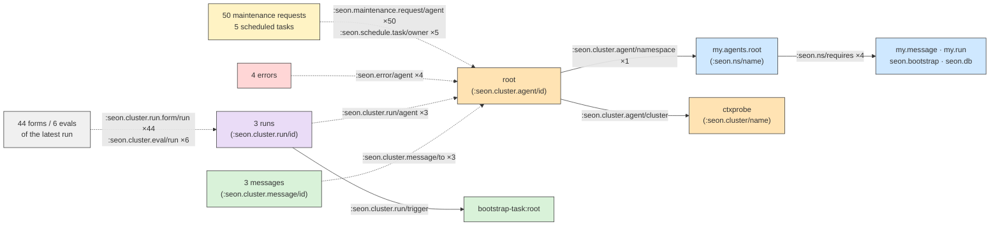

# REPL-first context — THE visual (reusable; improve it, never fork it)

*2026-09-04. One design language, three views, drawn from LIVE facts on
cluster `ctxprobe` (edge counts are a query result, not a sketch). The
transcript column uses forms the machinery emits or accepts today.
Behavior authority: [repl-first-behavior-2026-09-03.md](repl-first-behavior-2026-09-03.md);
platform: [repl-first-one-platform-2026-09-03.md](repl-first-one-platform-2026-09-03.md).
Chat renders no mermaid — read this file rendered.*

## 0. The design language (legend)

Three columns, always in this order, left to right:

| column | what a box is | what an arrow is |
|---|---|---|
| **GRAPH** (facts) | an entity, coloured by FAMILY (derived from its identity attribute); the label is its identity value | a ref attribute, labelled `:attr ×N` — forward solid, reverse dashed |
| **WALK** (forms) | one generated form: `;; intent` + the form, numbered in emission order | "this edge produced this form" |
| **TRANSCRIPT** (rendered) | the entry as the agent reads it: form, value, `;; result/<id>` | a lens ◐ = the render function that printed the value (derived: family → face; the agent's own wins) |

The watch is a dashed loop from the writer back into the WALK column.
Colours: namespace `#cfe8ff`, agent `#ffe3b3`, message `#d9f2d9`, run
`#eadcf7`, eval/form `#f0f0f0`, error `#ffd6d6`, schedule/maintenance
`#fff3c4`.

## 1. GRAPH — root's real neighbourhood (ctxprobe, basis 536871167)

Every edge below was counted with one query over the installed schema's
ref attributes (`[?attr :db/valueType :db.type/ref]`) around
`[:seon.ns/name my.agents.root]` and `[:seon.cluster.agent/id "root"]`.



Read it as the walk does: start at the namespace row, follow every ref
attribute forward and in reverse, one hop at a time, collection-first
(one form explains all 3 messages; one form explains all 50 maintenance
requests — and their COUNT is the fact the agent needs, not fifty rows).

## 2. WALK — the forms those edges generate (and how we reverse-engineer them)

The rule is mechanical, which is why no reader function is needed:

1. **edge → form.** A forward ref edge from entity E becomes a pull on E
   with a nested selector for that attribute; a reverse ref edge into E
   becomes a `q` whose `:where` names the attribute pointing at E's
   lookup ref, `:find [(pull ?x […]) ...]` (collection-first). The
   selector lists the family's attributes from the schema and puts the
   identity attribute on every ref leaf.
2. **intent comment.** The one-line `;; …` above each form is derived
   from the attribute's own name and direction — `;; messages addressed
   to root` from `:seon.cluster.message/to` reversed — never authored.
3. **value → lens.** The result's family (identity attribute → entity
   schema, proved unique) selects the render function by the one query
   (inline → the viewing agent's namespace → other agents by distance →
   the family's general face → floor).
4. **teaching first.** Every name the form or its printed value mentions
   that the agent has not seen demands its `doc`/`dir` BEFORE the entry.

```mermaid
flowchart TB
  classDef form fill:#ffffff,stroke:#555,stroke-dasharray:0
  classDef lens fill:#fdf2ff,stroke:#8a5

  E1[":seon.ns/name (root)<br/>+ :seon.ns/requires ×4"] --> F1
  F1[";; who am I, what do I require<br/>(seon.db/pull '[:seon.ns/name {:seon.ns/requires [:seon.ns/name]} {:seon.ns/refers [:seon.ns.refer/local]}]<br/>&nbsp;&nbsp;[:seon.ns/name 'my.agents.root])"]:::form
  F1 --> L1["◐ (doc *ns*) data → seon.ns/ns face"]:::lens

  E2[":seon.cluster.message/_to ×3"] --> F2
  F2[";; messages addressed to root<br/>(seon.db/q '[:find [(pull ?m [:seon.cluster.message/id :seon.cluster.message/at :seon.cluster.message/content]) ...]<br/>&nbsp;&nbsp;:where [?m :seon.cluster.message/to [:seon.cluster.agent/id \"root\"]]])"]:::form
  F2 --> L2["◐ my.agents.root/inbox-view (rung b) — else seon.cluster.message face"]:::lens

  E3[":seon.maintenance.request/_agent ×50"] --> F3
  F3[";; maintenance requests for root (count, newest)<br/>(seon.db/q '[:find (count ?r) (max ?at) :where [?r :seon.maintenance.request/agent [:seon.cluster.agent/id \"root\"]] [?r :seon.maintenance.request/at ?at]])"]:::form
  F3 --> L3["◐ floor (a 2-tuple)"]:::lens

  E4[":seon.cluster.run/_agent ×3 → :seon.cluster.run/trigger"] --> F4
  F4[";; my open run and what woke it<br/>(seon.db/pull '[:seon.cluster.run/id :seon.cluster.run/opened-at {:seon.cluster.run/trigger [:seon.cluster.message/id]}]<br/>&nbsp;&nbsp;[:seon.cluster.run/id \"…\"])"]:::form
  F4 --> L4["◐ seon.cluster.run face"]:::lens

  F1 -. "demands" .-> T1["(dir seon.db) (doc seon.db/pull) (doc seon.db/q)<br/>emitted BEFORE F1"]
  F2 -. "demands" .-> T2["(dir my.message) (doc seon.cluster.message/render-ai)<br/>emitted BEFORE F2"]
```

The custom readers die here: `(inbox)` IS F2, `(latest-messages)` IS F2
with `(max ?at)`, `(mark-read …)` IS a `transact!` form shown the same
way with its own intent comment. The agent never learns a private API —
it learns Datalog and pull once, from examples about ITS data.

## 3. WATCH — initial discovery, then the delta, event-driven

**Confirmed at HEAD:** the watch exists and is already the system's
nervous system. Datahike's `listen!`
(`reference-code/datahike/src/datahike/core.cljc:199`) fires a callback
per transaction report; Seon registers exactly one routing listener per
connection, `seon.cluster.wake/route!` (`src/seon/cluster/wake.clj:168-256`),
which never throws and never parks (both measured: a throwing listener
hangs the writer; an 800 ms listener made `transact` take 804 ms) and
delivers PAYLOAD-FREE wakes over `(sliding-buffer 1)` channels — a wake
means only "look", the woken pass derives from facts. Ruling 41 keeps
listeners out of `seon.db`: agents never get callbacks; the system
watches on their behalf. And the per-query interest ALREADY EXISTS: every
`seon.db` read records read-evidence (its dependency-plan attributes and
per-attribute revisions), and `route!` compares each commit's changed
attributes with the retained reads' attribute union (`:seon.render.web/interest`)
to decide whether to offer a render wake. So "watch this query" is not a
new mechanism — it is: settle the generated query as an eval (it carries
read-evidence), and let the existing interest fire.

```mermaid
sequenceDiagram
  autonumber
  participant W as Datahike writer
  participant L as wake/route! (listen!)
  participant G as generator (woken pass)
  participant R as render (query-selected fn)
  participant A as agent context

  Note over G,A: turn 1 — initial discovery
  G->>G: walk root's edges → forms F1..F4 (teaching first)
  G->>W: evaluate + settle each as an eval (form, result, basis 536870930, read-evidence)
  G->>R: render each result (family → lens)
  R-->>A: my.agents.root=> F2 … [3 messages] ;; result/b2

  Note over W,A: between turns — a planner message commits
  W->>L: tx-report (:seon.cluster.message/to root …)
  L-->>G: offer! wake (payload-free; sliding-1)
  G->>G: which settled queries are stale? read-evidence revisions ∩ changed attrs → F2
  G->>W: settle the diff eval: (seon.db/diff 536870930 <F2's query>) → +1 message
  G->>R: render the diff value (the same lens: inbox-view sees + and −)
  R-->>A: my.agents.root=> ;; new messages since t 536870930<br/>(seon.db/diff 536870930 '[…F2…])<br/>+ {…planner-1…} ;; result/d4

  Note over G,A: every turn is a FULL regeneration (58d): the diff eval is a fact, so it reappears exactly
```

Reading it: nothing polls; nothing carries a payload; the listener does
no work; the woken pass asks the facts which settled query is stale
(revisions, not guesses); the diff is one form the agent could type; and
the SAME render function that printed the inbox prints the delta, so the
agent's own `inbox-view` decides what "new" looks like. That is what the
render functions are for: the agent's context stays focused on exactly
what it chose to see.

## 4. TRANSCRIPT — what root reads (target shape; bytes from the live probe)

```clojure
;; (help) — the root commands this session uses, dependency order (generated, 58a)
seon.db/pull  ([selector eid] …)   pull one entity; refs carry their identity attribute
seon.db/q     ([query & args])     Datalog over the current database value
seon.db/diff  ([basis read & args]) what changed since a basis: + added − removed ~ changed
doc dir       explain / list — anything the program graph knows

my.agents.root=> (dir seon.db)
as-of basis-t … pull q since transact!

;; who am I, what do I require
my.agents.root=> (seon.db/pull '[:seon.ns/name {:seon.ns/requires [:seon.ns/name]} {:seon.ns/refers [:seon.ns.refer/local]}] [:seon.ns/name 'my.agents.root])
namespace my.agents.root
  requires: my.message my.run seon.bootstrap seon.db
  refers:   help dir doc
;; result/a1

;; messages addressed to root
my.agents.root=> (seon.db/q '[:find [(pull ?m [:seon.cluster.message/id :seon.cluster.message/at :seon.cluster.message/content]) ...]
                              :where [?m :seon.cluster.message/to [:seon.cluster.agent/id "root"]]])
2026-09-02T19:54:58Z  outside  Define a durable contracted function named largest …
2026-09-03T02:15:00Z  outside  seon.fs/delete-recursively! violated its contract …
;; result/b2  rendered-by my.agents.root/inbox-view

;; maintenance requests for root (count, newest)
my.agents.root=> (seon.db/q '[:find (count ?r) (max ?at) :where [?r :seon.maintenance.request/agent [:seon.cluster.agent/id "root"]] [?r :seon.maintenance.request/at ?at]])
[50 #inst "2026-09-03T02:15:00.000-00:00"]
;; result/c3  rendered-by seon.print/fit

;; --- turn 3: the watch fired ---
;; new messages since t 536870930
my.agents.root=> (seon.db/diff 536870930 '[:find [(pull ?m [:seon.cluster.message/id :seon.cluster.message/at :seon.cluster.message/content]) ...]
                                          :where [?m :seon.cluster.message/to [:seon.cluster.agent/id "root"]]])
+ 2026-09-03T18:40:11Z  planner  Can you review largest before I depend on it?
;; result/d4  rendered-by my.agents.root/inbox-view
```

## 5a. THE DATA — what the walk pulls out and renders (owner's question, 2026-09-04)

Derived from the edge counts in §1 and the families' schema files; the
"agent writes" column is ruling 62/63; smells are inputs to the
`context-data-census` research lane.

| family (identity) | what the walk shows | sort key | agent writes? | smell to fix first |
|---|---|---|---|---|
| namespace `:seon.ns/name` | requires, refers, owner agent, publics (`:seon.fn/ns` reverse) | — | its `ns` form (require) | — |
| function `:seon.fn/sym` | name, first doc line, arities in/out (`doc`) | — | a contracted `defn` | `sym` is a string (retype ruled 47) |
| **transcript** = form `:seon.cluster.run.form/id` (source, ordinal, author, ns) + result `:seon.cluster.eval/id` (result-edn/blob, error, at, read-evidence) | every entry: the parser-saved form + its result, `result/<id>` | run → ordinal; `eval/at` | its forms (by evaluating) | TWO families for one entry, joined by run+ordinal; family key named `receipt`; result bytes duplicated in read-evidence — merge candidate |
| message `:seon.cluster.message/id` | to, from, content, at, about, caused-by | `at` (inst ✓) | YES: transact to send (63a); `read-at` (❓ B15.2) | `to`/`from` are refs, `render-ai` narrates; no read-at |
| run `:seon.cluster.run/id` | the open run, its trigger, opened-at, disposition | `opened-at` | `complete`/`wait` as a fact? (B9/B15 follow-up) | custody attrs are system-only (correct) |
| the agent's defs `:seon.def/id` | restored scratch defs, atoms | ordinal | implicitly, by `def` | — |
| note `:my.note/id` | content, about | — (no `at`!) | YES: transact | no datetime; `agent` ref duplicates provenance the tx-meta already stamps |
| plan item `:my.plan.item/id` | label, after, children, about, completions | — | YES: transact | large derived surface (`ready`, `blocked`, diffs) — derive, don't store |
| error `:seon.error/id` | kind, message, at, run, signature | `at` | never (system) | `data-edn` is a print-node string (36 KB observed) |
| maintenance request / schedule task | count + newest per agent | `at` | never (root's portfolio) | 50 requests per agent → collection-first or the context drowns |
| program-graph rows mentioned by any form | `doc`/`dir` data | — | — | — |

The census lane proposes the smarter names and shapes (merges, renames,
missing datetimes) as EDN sketches with the exact forms the agent would
then type.

## 5. How to keep improving this file

Re-run the edge query (§1) at the current basis and replace the counts;
add a family by adding one colour and one box; add a generated form by
adding one edge→form row in §2; never draw an arrow the walk does not
take. A diagram that disagrees with `walk/root-selector`'s enumeration
of ref attributes is the defect, not the picture.
