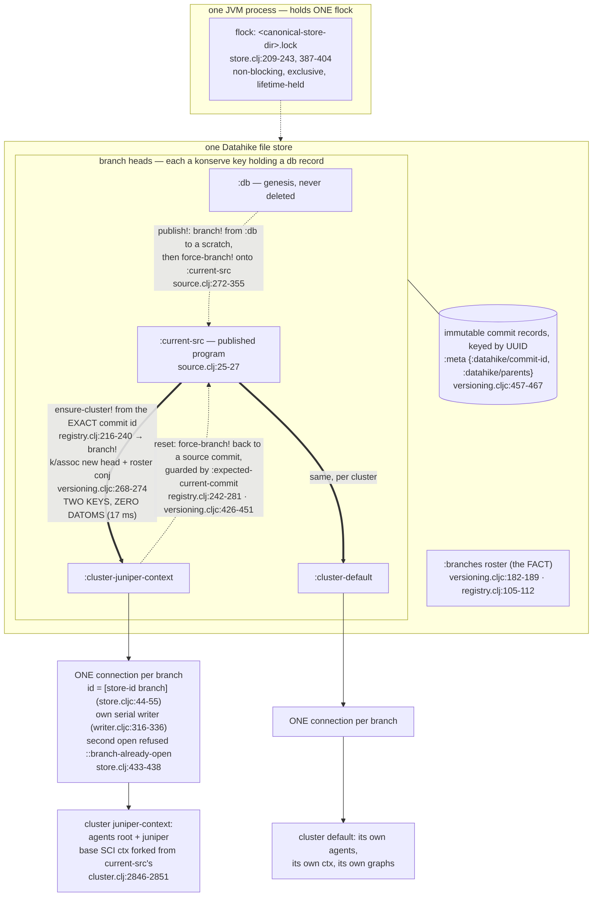

# Branches, shared cluster data, SCI forks, wakes, and which race fences are real

Orchestrator research pass, 2026-09-07, answering the owner's two questions
with source read end to end and four live probes on the running
`juniper-context` cluster (root `tmp/juniper-context-live`, `eval_clj` jvm
mode, read-only).

Authorities read end to end before any source: `AGENTS.md`,
`.agents/skills/datahike/SKILL.md`, `.agents/skills/seon-flow-architecture/SKILL.md`.

Source read: `reference-code/datahike/src/datahike/versioning.cljc` (entire),
`.../connector.cljc`, `.../store.cljc`, `.../writer.cljc`, `.../core.cljc`,
`.../api/specification.cljc`, `.../writing.cljc`, `.../connections.cljc`;
`reference-code/sci/src/sci/core.cljc`, `.../impl/utils.cljc`;
`src/seon/cluster/store.clj` (entire), `src/seon/cluster/registry.clj` (entire),
`src/seon/cluster/wake.clj` (entire), `src/seon/cluster/agent.clj` (entire),
`src/seon/cluster/work.clj`, `src/seon/cluster/run.clj`, `src/seon/cluster/loop.clj`,
`src/seon/sci/eval.clj`, `src/seon/schedule.clj`, `src/seon/effect.clj`,
`src/seon/error.clj`, `src/seon/env.clj`, `src/seon/bootstrap.clj`,
`src/seon/cluster.clj`, and the schema resources named inline.

---

## 0. The one-page answer

### Question 1 — "the sci evals are just taking the shared cluster data and adding whatever the agent is eval'ing, right?"

**Confirmed, with one precision.** The word doing the work is *fork*, and the
fork is over the SCI Var table, not over the database.

- The **database** is genuinely shared and is not forked per turn. Every agent
  in a cluster reads and writes the one branch connection. Live on
  `juniper-context`: two agents (`root`, `juniper`) share 4,300
  `:seon.fn/sym` rows and 2,453 `:seon.schema/key` rows on branch
  `cluster-juniper-context`.
- The **SCI context** is shared as a base and forked per turn.
  `cluster-ctx` builds and acquires it once at boot from program facts
  (`src/seon/sci/eval.clj:1806-1845`; boot call site
  `src/seon/cluster.clj:2846-2851`). Each turn calls
  `sci.eval/fork-for-turn` (`src/seon/cluster/loop.clj:1616-1620`), which is
  `sci/fork` plus that one agent's `:seon.def` rows rehydrated
  (`src/seon/sci/eval.clj:1721-1804`).
- `sci/fork` puts a **new atom** around the env map with a fresh generation
  (`reference-code/sci/src/sci/core.cljc:345-351`), and
  `bind-root!` **copies an inherited Var before mutating it** and writes the
  copy into the fork's own env
  (`reference-code/sci/src/sci/impl/utils.cljc:362-379`). That is
  copy-on-write: the fork sees every shared program Var and its writes are
  invisible to the base and to sibling agents.
- **Live proof** (jvm mode, `juniper-context`): base generation
  `sci-generation-19542`, fork generation `sci-generation-895547`,
  `(identical? (:env base) (:env fork))` → `false`; base namespace count
  103, fork 104; a `(def probe-only-in-fork 42)` evaluated in the fork
  resolves in the fork and resolves to `nil` in the base.

The precision is what happens at turn end. **The fork is discarded; only
committed rows are promoted back into the base.** After the batch settles,
`install-evaluated-rows!` installs exactly those rows for which
`committed-row?` is true against `:db-after`, into `base-ctx`
(`src/seon/cluster/loop.clj:1737-1750`). Everything else the fork accumulated
— `result/eN` bindings (`src/seon/sci/eval.clj:533-547`), interned
non-contracted defs, aliases — dies with the fork. What *persists* does so as
**facts**, not as ctx state: agent-scoped `:seon.def` rows
(`src/seon/sci/eval.clj:450-479`), program rows for contracted `defn`s
(`:396-448`), and evaluation rows. The next turn re-forks the then-live base
and rehydrates those rows.

So: *shared cluster data + a copy-on-write overlay of whatever this agent
evaluated, where the overlay is thrown away and re-derived from facts.* The
overlay is not the durable thing; the facts are.

### Question 2 — "we are doing a listen on the database transaction queue to trigger these wakes so we can add whatever we want, right?"

**Confirmed on mechanism, with two constraints and one caveat that changes
the design.**

- Yes: one `d/listen` per cluster on the branch connection
  (`src/seon/cluster/wake.clj:209-256`, installed at
  `src/seon/cluster.clj:2691-2703`). Datahike keeps listeners as a **keyed
  map in connection metadata** (`reference-code/datahike/src/datahike/connector.cljc:102`;
  `.../core.cljc:199-210`), so **any number of independent listeners can be
  registered under distinct keys**. This is not hypothetical — the per-agent
  schedule proc already registers its own second listener with its own
  attribute set (`src/seon/schedule.clj:739-742`, `:690-703`).
- Constraint 1 — **the handler runs before the caller's `deliver`**.
  `transact!` fans out to listeners at
  `reference-code/datahike/src/datahike/writer.cljc:414-415` and only then
  delivers the promise at `:416`. A listener that throws wedges the
  committing caller; a listener that parks charges its latency to every
  commit. Hence the two absolute prohibitions and `offer!`-only delivery
  (`src/seon/cluster/wake.clj:12-27`, `:146-164`).
- Constraint 2 — **a refused transaction does not wake**: the fan-out is
  gated on `(when (map? tx-report) …)` (`writer.cljc:401`), and an unchanged
  value emits no datom, so an idempotently re-asserted routed attribute
  produces zero wakes silently (`wake.clj:46-49`).
- **The caveat**: "add whatever we want" is true of the *listener*, but the
  current routing table is small and one of the three intended sources is not
  routed at all. `wake-attributes` is
  `#{:seon.cluster.message/to :seon.effect/to :seon.cluster.agent/id}`
  (`src/seon/cluster/wake.clj:93`; live-verified, and disjoint from
  `seon.cluster.loop/committed-attributes` → `true`). **Faults reach an agent
  by minting a `:seon.cluster.message/to` row** — `error/message-tx` at
  `src/seon/error.clj:911-930`, called by `tell` at `:1064-1076`. That is the
  overloaded queue the owner is asking to split, and it already has a
  measured incident: six faults in 1.5 s because error → message → wake →
  turn → error is a real cycle, bounded today only by a recurrence limit
  (`src/seon/error.clj:974-993`).

The good news is that the tree already contains a complete, working template
for a separate well-schema'd wake source: **`:seon.effect/to`** (§4.3).

---

## 1. Branching

### 1.1 What a store is, what a branch is, what a head is

One process root owns one Datahike store directory. The store's Konserve
`:id` is a **pure function of the canonical path** —
`(UUID/nameUUIDFromBytes (.getBytes canonical-path "UTF-8"))`
(`src/seon/cluster/store.clj:156-164`) — so two spellings of one directory
are one store, and a reopen presents the same identity.

A **branch** is a keyword in the store's `:branches` set
(`reference-code/datahike/src/datahike/versioning.cljc:182-189`). A **branch
head** is a Konserve key whose key *is* that keyword and whose value *is* a
full stored-db record — the same record shape written under the commit-id
key. Three independent write sites confirm it:
`versioning.cljc:270` (`branch!`), `:426-438` (`force-branch!`), and the
ordinary commit path at `reference-code/datahike/src/datahike/writing.cljc:506,526,556`.

A **commit id** is a UUID carried in that record's metadata:
`commit-id` = `(get-in db [:meta :datahike/commit-id])`
(`versioning.cljc:457-461`); `parent-commit-ids` =
`(get-in db [:meta :datahike/parents])` (`:463-467`). Under the default
`:commit-graph? true` the identical record is *also* written under the
commit-id key as immutable (`versioning.cljc:420`), which is what lets a
cluster fork from a commit rather than from a moving branch name.

Live on `juniper-context`: `(datahike.versioning/branches db)` →
`[:cluster-juniper-context :db :current-src :cluster-default]`;
`commit-id` → `6a9eec3b-5059-5b2d-9a0e-908d0f619e99`;
`parent-commit-ids` → `["6a9eec0f-df53-5317-9841-92192619d8c8"]`.

### 1.2 Fork is a head-pointer copy — proven at the source

`branch!`'s entire data work is two forms
(`reference-code/datahike/src/datahike/versioning.cljc:268-274`):

```clojure
updated-db (cond-> (assoc-in stored-db [:config :branch] new-branch)
             (seq branched-sec-keys) (assoc :secondary-index-keys branched-sec-keys))
(<?- (k/assoc store new-branch updated-db store-opts))
;; :branches is the GC discovery pointer and is published last.
(<?- (update-branches-held! gc-sid roster-permit store
                            #(conj (set %) new-branch) store-opts))
```

`stored-db` came from `(k/get store from nil store-opts)` at `:251` and
contains index **root addresses**, not index contents
(`writing.cljc:673-694`). So a branch creation writes **two keys** — the new
head record and the updated roster — and copies **zero datoms**.
`src/seon/cluster/registry.clj:9-11` records the measurement: "Branch-off is
17 ms and one blob."

The contrast that makes this sharp is in the same file: `fork-database`
(`versioning.cljc:550-732`) is the genuine data copy — it enumerates
`(k/keys src-store)` and `k/assoc`s every one (`:709-714`). **Seon never
calls it.** Seon forks by `branch!` only.

Ordering is load-bearing throughout: values first, head second, `:branches`
last, because `:branches` is the GC discovery pointer
(`versioning.cljc:271`; genesis does the same at `writing.cljc:717-721`, which
is exactly what Seon's `genesis-complete?` reads to detect a mid-create kill,
`src/seon/cluster/store.clj:261-269`).

### 1.3 `:current-src` → a cluster branch

`:current-src` is an ordinary branch keyword
(`src/seon/cluster/source.clj:25-27`). Boot's fork site is
`src/seon/cluster.clj:2920-2996`:

- `:2930` `cluster-branch` = `:cluster-<name>`
  (`src/seon/cluster/registry.clj:93-99` is the one derivation, so a cluster's
  name and its branch cannot disagree).
- `:2931` `existing-cluster?` is **roster membership** — the roster is the
  resume test (`registry.clj:105-112`: "The roster is the FACT").
- `:2932` a fork reads `source-base!` (`cluster.clj:1458-1497`), which opens
  `:current-src`, takes its **exact commit id**, its projection, and builds the
  acquired base SCI ctx; a resume does not read it at all.
- `:2933-2940` a GC roster reachability permit is acquired and threaded into
  `branch!` (`registry.clj:191-198` → `versioning.cljc:228-233`), so a
  concurrent sweep cannot race the fork.
- `:2941-2951` `registry/ensure-cluster!` (`registry.clj:216-240`) checks the
  commit is present and calls `registry/branch!` **from the commit UUID, not
  the branch keyword** — so publication may advance while this fork still
  gets the value its caller chose.
- `:2954-2955` `store/open-branch!` opens the cluster connection.
- `:2965-2968` the new fork **reuses `current-src`'s immutable projection**
  precisely because it names the exact commit just forked; a sovereign
  existing branch derives its own.
- `:2846-2851` the cluster's base SCI ctx is `fork-cluster-ctx` of
  `current-src`'s acquired ctx when forking, and a cold `cluster-ctx`
  otherwise.

Near-instant, and never a re-index: **the fork copies a pointer, and the SCI
base is forked from an already-acquired context.**

### 1.4 One connection per branch, and what the flock guards

Datahike's connection identity is `[store-id branch]`
(`reference-code/datahike/src/datahike/store.cljc:44-55`), keyed into
`datahike.connections/*connections*`
(`reference-code/datahike/src/datahike/connections.cljc:3`). A second
`connect` with the same identity is **reference-counted into the same
Connection object** (`connector.cljc:288-289`) — which would silently give
two cluster instances one writer. Seon refuses that by name:
`store/open-branch!` (`src/seon/cluster/store.clj:408-439`) checks the roster
(`::branch-absent`) and `@connections/*connections*` (`::branch-already-open`),
both inside `(locking branch-open-monitor)` so check and connect cannot
interleave.

Each connection owns its own serial writer (`writer.cljc:316-336`), so two
cluster branches in one JVM have independent writers and never serialize
against each other.

**The flock guards the store, not the branch.** It is `<canonical-store-dir>.lock`
(`store.clj:125-134` → `resources/seon/operator/state.clj:148-152`),
acquired non-blocking and exclusive by `acquire-flock!`
(`store.clj:209-243`), held for the store's whole lifetime
(`store.clj:317,381`), and released only after a *successful* Datahike
release (`store.clj:387-404`: "THE FENCE OUTLIVES A FAILED RELEASE"). It
answers three outcomes, not two — a real lock, `::held-by-this-process`, or
`nil` for a foreign holder — because fcntl cannot express self-collision and
close(2) drops **every** lock the process holds on a file as soon as **any**
descriptor closes (`store.clj:195-208`, falsified live: parent holds, parent
refuses its own second open, child JVM then acquires).

Nothing in Datahike stops a second process opening the same store; the flock
is ours.

### 1.5 Reset / refork

`registry/reset-cluster!` (`registry.clj:242-281`) refuses
`::cluster-connected` *earlier and by name* than Datahike does, materializes
the source commit with `d/commit-as-db`, then calls
`(d/force-branch! source-db branch #{source-commit} {:expected-current-commit current-commit})`.
`force-branch!` (`versioning.cljc:323-455`) writes immutable values first
(`:404-421`), flips the head under a recheck inside the `k/update`
(`:426-438`), and verifies by readback (`:444-451`). So a failed reset leaves
the old head reachable; the old tail becomes unreachable only after the
replacement commits, and the next `collect!` reclaims it
(`registry.clj:245-249`, `:503-531`).

`retire-branch!` (`registry.clj:283-314`) only removes the roster entry —
data survives until GC (`versioning.cljc:280-282`) — refuses `:db`
(`::cannot-retire-main`) and a live connection (`::cluster-connected`), and
treats Datahike's `:branch-does-not-exist` as **success** on a re-run.

Cluster isolation is structural, not conventional: **only this registry
namespace holds a connection that can call `branch!`, `delete-branch!`, or
`gc-storage`, and it is the store's flock-held main connection**
(`registry.clj:15-19`; verified — every such call passes
`(:seon.store/connection-object store)` at `:192,:198,:309,:457,:525`). A
cluster receives a *branch* connection and never the branch API, so cluster A
holds no handle that can delete cluster B. `delete-database` is never called
(`registry.clj:21-23`).

### 1.6 Diagram



---

## 2. The cluster's shared data

### 2.1 What every agent in a cluster shares

Everything on the branch. There is no per-agent partition of the database —
scoping is by **attribute and ref**, never by a separate store.

Live on `juniper-context` (branch `cluster-juniper-context`, one connection):

| shared | live count | grounding |
|---|---|---|
| program rows (`:seon.fn/sym`) | 4,300 | forked from `current-src` §1.3 |
| schema rows (`:seon.schema/key`) | 2,453 | `schema.edn/load!` + accretion, `cluster.clj:2975-2976` |
| agents (`:seon.cluster.agent/id`) | 2 (`root`, `juniper`) | `agent/creation-tx` `agent.clj:95-114` |
| messages (`:seon.cluster.message/to`) | 8 | routed wake attribute |
| faults (`:seon.error/id`) | 14, of which 10 carry `:seon.error/agent` | `error/commit-tx` `error.clj:932-1076` |

Config is a shared singleton read fresh per pass
(`config/effective`, e.g. `work.clj:441-443`, `agent.clj:856-857`).
Other agents' entities are ordinary shared rows: an agent's identity is three
attributes any agent can pull (`agent.clj:124-137`), and `owner-of`
(`agent.clj:304-315`) resolves any namespace to its assigned agent.

### 2.2 What is per-agent

Per-agent state is a **ref**, not a partition:

- **The agent's defs.** `:seon.def/agent` points at the agent entity;
  `fork-for-turn` selects exactly that agent's rows
  (`src/seon/sci/eval.clj:1736-1741`) and rehydrates them into the fork
  (`:1754-1802`). Live: zero settled def rows on `juniper-context` today.
- **The agent's runs and evaluations.** `:seon.cluster.run/agent` and the
  agent's own `:seon.cluster.agent/run` pointer, which *is* the open-run fact
  — retracted at close, so there is no status to read (`work.clj:74-89`).
- **The agent's messages, contributions, faults** — reverse refs, declared as
  render units on the agent entity itself:
  `resources/seon/schemas/seon.cluster.agent.edn:10-20` already lists
  `:seon.cluster.message/_to`, `:seon.cluster.run/_agent`,
  `:seon.context.contribution/_agent`, `:seon.error/_agent`. The fault
  attribute's own docstring says it: "The agent this fault happened to; its
  reverse is that agent's fault list"
  (`resources/seon/schemas/seon.error.edn:1-7`).

That last line matters for §4: **the agent record already has a faults
component.** What it lacks is a *routed* attribute and a handled-ness
derivation.

### 2.3 How `seon.env/scope` carries agent custody

`env/scope` (`src/seon/env.clj:250-273`) narrows an existing environment and
**refuses any member outside the turn layer** — a consumer cannot quietly
replace a connection, projection, or work launcher on its way across a
boundary. The agent graph blueprint scopes once and carries the result into
every proc:

```clojure
(let [environment (env/scope (env/of handle)
                             {:seon.cluster.agent/id agent-id})]
  … (seon.flow/var-process #'turn-step :io (env/carry {…} environment)) …)
```
(`src/seon/cluster/agent.clj:621-648`.)

`env/carry` puts it under the one carrier key `:seon.env/environment`
(`env.clj:279-282`, `:361-367`); `env/of` reads it back, preferring the
cluster's replacement state atom when present (`:288-298`). Call preparation
then supplies a declared `:seon.cluster.agent/id` argument from that
environment (`env/supplied-agent-id`, `:300-315`) — which is how `seon.db`'s
elided arities know *whose* cluster database to read. Custody travels with
the value; nothing fetches it at call time.

### 2.4 How two clusters in one JVM stay separate

Four independent mechanisms, all verified:

1. **Different `connection-id` tuples** → different `*connections*` entries →
   different Connection objects and different serial writers
   (`store.cljc:44-55`; `writer.cljc:316-336`).
2. **The only shared durable mutable key is `:branches`**, touched only on
   create/delete under a roster permit (`versioning.cljc:174-178`); an
   ordinary commit writes content-addressed values then its **own** branch
   head (`writing.cljc:506,526,556`).
3. **Capability separation** — only the registry's main connection can call
   branch/GC APIs (`registry.clj:15-19`).
4. **SCI separation** — `fork-cluster-ctx`
   (`src/seon/sci/eval.clj:1847-1883`) forks the acquired program ctx and
   *reconstructs* connection custody, schema projection, and supplied-default
   state from the receiving branch, with fresh atoms for
   `::kernel/installed-functions` and `::kernel/program-snapshot`. Its
   docstring states the property and the code implements it: program Vars stay
   copy-on-write, custody cannot leak.

The one genuine exception is the development cluster, which occupies its own
JVM because in-place source adoption updates process-wide Vars
(`seon-flow-architecture` SKILL.md:6-11).

---

## 3. SCI evaluations

### 3.1 The base context

`cluster-ctx` (`src/seon/sci/eval.clj:1806-1845`) builds the minimal base
(`build-base-ctx`, `:185`), stamps connection custody under `::custody`, and
calls `acquire!` (`:1451`), which intersects core-provenanced program
namespaces with the JVM's loaded set and binds their **actual compiled Vars**
— the set is computed, never listed (`eval.clj:85-94`). It is performed only
at cluster boot or recovery; the turn path never reacquires it
(`:93-94`). Boot's order puts it after recovery and config but before any
agent graph (`cluster.clj:2846-2851`).

### 3.2 The turn fork

`fork-for-turn` (`src/seon/sci/eval.clj:1721-1804`):

1. `(sci/fork base-ctx)` — new env atom, new generation
   (`reference-code/sci/src/sci/core.cljc:345-351`).
2. carries the environment state and stamps `::turn-fork? true` (`:1729-1734`).
3. queries the agent's `:seon.def` entries (`:1736-1741`), pulls and orders
   them by `:seon.def/ordinal` then `:seon.def/key` (`:1743-1747`).
4. ensures the agent's assigned namespace exists (`:1750-1753`).
5. interns each row: atoms are re-wrapped (`:1785-1790`), function roots are
   installed via `sci/install-var-roots!` (`:1794-1795`), unrestorable rows
   become a typed value plus a notice (`:1767-1783`) — never silence.

Copy-on-write is the dependency's own mechanism, not ours:
`bind-root!` compares the Var's generation to the env's and, on mismatch,
**copies the Var, binds the new root on the copy, and `swap!`s it into the
fork's env** (`reference-code/sci/src/sci/impl/utils.cljc:362-379`).

### 3.3 What an evaluation adds

- **`result/eN` bindings** — `bind-result!` interns each form's admitted
  value as `result/e<ordinal>` in the fork
  (`src/seon/sci/eval.clj:533-547`; called per form at
  `src/seon/cluster/loop.clj:1599`). The docstring is explicit that the fork
  supplies the agent/run portion of identity, so the ordinal alone
  distinguishes inside it. **These live only in the fork.**
- **`:seon.def` rows** — `defs` (`eval.clj:450-479`) diffs the fork's interns
  before/after, records atoms by their dereferenced value and functions by a
  durable SCI root (`durable-function-root`, `:386-394`), and these become
  agent-scoped facts at terminal settlement.
- **Program rows for contracted `defn`s** — `definition-row`
  (`eval.clj:396-448`) derives `:seon.fn/*` or `:seon.test/*` from the
  generation-stamped Var's metadata, including `:seon.fn/spec` from
  `:malli/schema` and `:seon.fn/workload` from `^{:seon.workload …}`.
- **Evaluation rows** — `:seon.cluster.eval/*` receipts committed by the run
  loop.
- **Namespace binding rows** — `binding-rows` (`eval.clj:549-580`) projects
  SCI's own aliases/refers/requires/imports into `:seon.ns/*` components, so
  a `require` inside a run is a fact, not hidden ctx state
  (`:488-503` explains why the reader must see the same table).

### 3.4 What is discarded

The fork. `resume-turn` binds it in a `let` (`loop.clj:1615-1620`) and never
stores it. After `settle-batch!`, exactly the **committed** rows are installed
into the *base* ctx:

```clojure
(sci.eval/install-evaluated-rows!
 {:seon.sci.eval/ctx base-ctx
  :seon.db/db (:db-after outcome)
  :seon.sci.eval/installations
  (… (when (and row (sci.eval/committed-row? (:db-after outcome) row)) …))})
```
(`src/seon/cluster/loop.clj:1737-1750`.)

So a `defn` whose terminal transaction was refused stays visible **for the
rest of that turn** and is gone at the next fork — "a refusal is durable
session state, not a REPL rollback" (`eval.clj:79-83`) is about the fork's
lifetime, and the base only ever learns what committed.

### 3.5 Verdict

The owner's statement is **confirmed**. Stated with the tree's own
vocabulary: *an SCI evaluation runs in a per-turn `sci/fork` of the cluster's
acquired program-only base context, rehydrated with the calling agent's own
`:seon.def` rows; the fork is copy-on-write over shared program Vars, reads
and writes the one shared branch database, and is discarded at turn end —
what survives survives as facts.*

The only correction worth making to the phrasing: it is not "adding to shared
data" in place. It is *overlaying*. The shared base is never mutated by an
agent's evaluation; it learns only what the terminal transaction committed.

---

## 4. Wakes

### 4.1 What exists today

**One listener per cluster.** `wake/route!` (`src/seon/cluster/wake.clj:209-256`)
is installed at `src/seon/cluster.clj:2691-2703` under key
`:seon.cluster.agent/route`. Its whole body is one `try`, and every delivery
is `offer!`.

**The routed set.** `wake-attributes` (`wake.clj:78-93`):

```clojure
#{:seon.cluster.message/to :seon.effect/to :seon.cluster.agent/id}
```

Live-verified on `juniper-context`, and live-verified disjoint from
`seon.cluster.loop/committed-attributes` (a 90-attribute computed set,
`src/seon/cluster/loop.clj:169-220`) → `true`. Both sets are **computed**, so
the disjointness property has two derivations to compare rather than one list
to believe (`wake.clj:79-90`).

**The routing decision, per datom** (`wake.clj:227-250`):

| datom attribute | delivery |
|---|---|
| `:seon.cluster.agent/id` | `offer!` to the **armer** channel — a committed agent creation *is* an arm wake |
| `:seon.cluster.message/to` | the datom's **value is the recipient's entity id**; one lookup in `(channels)` → that agent's mailbox; **no entry → the armer** (the created-and-messaged-in-one-commit belt) |
| `:seon.effect/to` | identical treatment — background effect results |
| anything else | `nil` (no-op) |

Plus two per-report decisions: the search index gets the whole report
(it needs exact `db-before`/`db-after` bases, `wake.clj:216-226`), and at most
one render wake fires if any changed attribute intersects the process-local
`:seon.render.web/interest` projection (`:214-215`, `:229-231`, `:251-253`).

**How a wake reaches a mailbox.** `arm!` (`agent.clj:815-899`) creates
`wake-channel` as `(async/chan (async/sliding-buffer 1))` (`:850`), registers
the routing entry keyed by **agent entity id** (`:892-896`), then primes it
once (`:898`). The mailbox proc takes that channel as an in-port
(`mailbox-step`, `agent.clj:321-347`) and forwards one payload-free
`::episode` downstream; the turn proc's `::episode` in-conn is also sliding-1
(`agent.clj:637`). Sliding-1 buffers are never full
(`wake.clj:135-137`), so a `nil` refusal is unrepresentable on a correctly
built mailbox, and coalescing is free because the woken pass derives
everything from facts.

**The unrouted recipient.** Both `/to` branches fall through to
`(async/offer! armer-channel ::wake)` when `(get (channels) eid)` is nil
(`wake.clj:241`, `:248`). The armer (`agent.clj:1001-1109`) then derives
`(agents in facts) − (armed set)` and arms each, sorted for determinism
(`:1053-1063`). Arming writes nothing and the prime is an `offer!`, so the
armer cannot wake itself (`agent.clj:1009-1010`).

**Closed-route classification.** `delivery` (`wake.clj:95-144`) turns
`offer!`'s three answers into `::delivered` / `::fenced` / `::refused`.
`::fenced` requires the *exact current* route to be closed
(`agent/fenced-route?`, `agent.clj:800-813`) — which is only reachable via
the terminal-settlement fence, because `disarm!` drops the routing entry
**before** closing the channel (`agent.clj:986-992`, and `:971-979` says the
order is load-bearing). `::refused` raises a fault fact
(`wake.clj:155-163`).

**What a woken turn derives.** `turn-step` (`agent.clj:527-599`):
settle this agent's own orphan (`work/interruption`, `work.clj:598-617`) →
pin **one** database value → `work/next-agent-work` → run
`cluster.loop/turn` → offer an armer wake on close → self-rewake into its own
mailbox when `work/more-agent-work?`.

`next-agent-work` (`work.clj:531-583`) is the **pure derivation over facts**
that decides what to handle, and its `cond` order is the priority rule:
a run this process holds outranks any trigger; an unheld run is wreckage, not
work; otherwise select an unanswered trigger under the episode gate, or an
unanswered background result.

**Unread/unhandled is already derived by ref absence:**

- a message is unanswered exactly when **no run names it as its trigger** —
  `(not [_ :seon.cluster.run/trigger ?message])`
  (`work.clj:619-650`, and the same clause for the rendered count at
  `src/seon/bootstrap.clj:55-63`);
- a background effect result is unhandled exactly when **no run names it in
  `:seon.cluster.run/background-results`** —
  `(not [_ :seon.cluster.run/background-results ?receipt])`
  (`work.clj:516-529`; the ordered version at `run.clj:484-498`).

### 4.2 Where faults sit today — the overloaded queue

A fault is committed as a durable fact by `commit-fault!`
(`src/seon/cluster.clj:2356-…`), and `error/commit-tx` then *tells* an agent by
minting a **message**:

```clojure
{:seon.cluster.message/id (str (:seon.error/id fact) "-" (name reason))
 :seon.cluster.message/to [:seon.cluster.agent/id recipient]
 …
 :seon.cluster.message/about (fact-tempid (:seon.error/id fact))}
```
(`src/seon/error.clj:911-930`; the three `tell` sites at `:1064-1076`.)

Consequences, all in the tree:

- **The fault fact alone wakes nobody.** `:seon.error/agent` is not routed, so
  the message is the only delivery.
- **The storm.** `error.clj:974-993` records the measurement: one injected
  throw produced six faults in 1.5 s, because committing the explanation
  message *is* a commit, and a commit wakes the loop. The fence is a
  recurrence limit plus deliberate silence past it — a bound on a cycle that
  a separated source would not have.
- **The episode-cap carve-out.** `outside-trigger?` (`work.clj:377-392`) has
  to special-case `:seon.cluster.message/about` so an agent in an error loop
  does not reset its own cap with its own failure notifications. That is a
  discriminator inside the message family standing in for a missing second
  family.
- **Drift.** `error.clj:986` still asserts `wake-attributes` is
  `#{:seon.cluster.message/to}`. It is three attributes (live-verified).

### 4.3 The template that already works — `:seon.effect/to`

Background effects are already a separate, well-schema'd wake source, and the
design of the other two should copy it exactly.

1. **Its own routed attribute**, declared optional on the receipt
   (`resources/seon/schemas/seon.effect.edn:37`), routed at
   `wake.clj:243-248` with identical delivery to the message branch.
2. **Delivery is gated by an edge move, not by creation.** While the effect is
   pending, the recipient rides `:seon.effect/notify`
   (`seon.effect.edn:76`, indexed). At settlement the transition function
   **retracts `notify` and adds `to` in the same transaction**:

   ```clojure
   (:seon.effect/notify receipt)
   (into [[:db/retract (:db/id receipt) :seon.effect/notify (:db/id (:seon.effect/notify receipt))]
          [:db/add (:db/id receipt) :seon.effect/to (:db/id (:seon.effect/notify receipt))]])
   ```
   (`src/seon/effect.clj:250-254`; identical in `interrupt-call` `:283-287`
   and `interruption-stamps` `:302-305`.)

   So the routed attribute appears **exactly at the instant the item becomes
   deliverable**, which sidesteps the unchanged-value trap by construction and
   makes "pending" and "ready" two different attributes rather than a flag.
3. **Handled-ness is an inbound ref, derived by absence.**
   `:seon.cluster.run/background-results` is `[:set :seon.db/ref]`
   (`resources/seon/schemas/seon.cluster.run.edn:10`), claimed atomically
   inside `open-call` (`run.clj:484-498` read at transaction time, attached at
   open). Unhandled = `(not [_ :seon.cluster.run/background-results ?receipt])`.
4. **Its own component on the agent record** — the reverse ref is already a
   declared render unit for messages (`seon.cluster.agent.edn:17`) and for
   faults (`:20`).

And the schedule proc is the template for the *transport* half: one
disposable Datahike listener under its own key, its own attribute set
(`relevant-attributes`, `schedule.clj:690-703`), its own sliding-1 channel,
acquired on `::flow/resume` and released on `::flow/pause`/`::flow/stop`
(`schedule.clj:729-757`).

### 4.4 Design — separate well-schema'd wake sources

Grounded in §4.1–§4.3, three sources become peers on the agent record. **No
new mechanism is introduced**; each is the `:seon.effect/to` shape applied to
one more family.

#### 4.4.1 The uniform shape

Every wake source is exactly four things:

| part | rule | precedent |
|---|---|---|
| **a routed attribute** whose *value is the recipient agent's entity id* | added by the transition that makes the item deliverable, never by creation; a new entity or an edge move, so the datom always exists | `effect.clj:250-254` |
| **a claim ref** from the handling run to the item | `[:set :seon.db/ref]` (or cardinality-one for a singular trigger); asserted inside the transaction that opens or advances the run | `run.clj:484-498`, `:trigger` `seon.cluster.run.edn:168` |
| **a derived unhandled query** | `(not [_ <claim-ref> ?item])` — absence is the state | `work.clj:619-650`, `:516-529` |
| **a render unit on the agent entity** | the reverse ref | `seon.cluster.agent.edn:10-20` |

Three rules that are not optional, each with its scar in the tree:

- **Every new routed attribute must be added to `wake-attributes`
  (`wake.clj:78-93`) and must stay disjoint from
  `committed-attributes` (`loop.clj:169-220`).** Both are computed; the
  disjointness is the property that keeps an idle cluster idle. A new source
  that a turn also commits routinely makes the loop wake itself.
- **The routed value must be the recipient's entity id**, because the handler
  does exactly one map lookup and no query (`wake.clj:237,244`).
- **A recipient with no routing entry falls through to the armer.** Every new
  branch needs that belt, or an agent created and addressed in one commit is
  never armed (`wake.clj:241,248`).

#### 4.4.2 `:seon.agent/inbox` — messages

Already exists as `:seon.cluster.message/to` + `:seon.cluster.run/trigger`.
The only accretion is naming it as one of three peers rather than the
universal queue, and — once faults leave — **deleting the
`:seon.cluster.message/about` carve-out in `outside-trigger?`
(`work.clj:377-392`)**, because the only reason it exists is that faults ride
this family. That is a mechanism dissolved, not added.

#### 4.4.3 `:seon.agent/faults` — faults to the steward

The fault fact already carries the two refs this needs:
`:seon.error/agent` ("its reverse is that agent's fault list",
`seon.error.edn:1-7`, indexed) and `:seon.instrument/fn`
(`seon.error.edn:79-81`).

- **Routed attribute.** A new `:seon.error/to` (ref to the agent entity),
  asserted by `error/commit-tx` (`error.clj:932-1076`) *instead of* the three
  `tell` calls. `commit-tx` already computes the recipient — `attributed`
  (`:1060`) and `escalate-to` (`:1002`) — so the recipient derivation moves
  unchanged; only the tx-data changes from a message map to one `:db/add`.
  Because a fault is always a new entity, the datom always exists and the wake
  always fires (`wake.clj:46-49`).
- **The steward derivation.** For a fault with **no** attributable agent
  (today's `:no-attributable-agent` escalation), route to the steward of the
  failing function's namespace. The query already exists as
  `agent/owner-of` (`agent.clj:304-315`): namespace name → the agent whose
  `:seon.cluster.agent/namespace` names it. The join for a fault is
  `:seon.instrument/fn` (a `:seon.fn/sym` string) → `:seon.fn/ns` →
  `:seon.ns/name` → `owner-of`.
  **Blocker, measured:** on `juniper-context` there are 14 faults, **0** carry
  `:seon.instrument/fn`, and 10 carry `:seon.error/agent`. The steward chain
  is declared but unpopulated — only contract-instrumentation faults set that
  key. So this source lands in two steps: (a) `:seon.error/to` from the
  existing attribution, which works today; (b) steward fallback, which first
  needs the fault seam to record the failing function. `:seon.error/proc` and
  `:seon.error/op` (`seon.error.edn:65-66`) are what a flow fault carries
  instead, and they name a proc, not a function — so (b) is a real piece of
  work at the fault seam, not a query change.
- **Claim ref.** `:seon.cluster.run/faults` `[:set :seon.db/ref]`, asserted
  inside `open-call` next to `background-results` and read by the same
  transaction-time pattern (`run.clj:484-498`).
- **What this dissolves.** The storm fence in `error.clj:974-993` exists
  because delivery costs a commit on the *routed message* attribute. A fault
  fact routed directly still wakes the recipient — but it commits **one**
  datom on a family the turn does not routinely write, and the recurrence
  limit becomes a bound on *notification volume*, not the thing preventing a
  self-feeding fire. The cycle error → message → wake → turn → error becomes
  error → wake → turn → error, which is the same shape; **the cap must stay**
  until the loop stops committing faults from inside the woken pass. Do not
  claim this deletes the fence.

#### 4.4.4 `:seon.agent/schedule` — timer firings

Structurally already separate: its own listener, attribute set, channel, and
proc (`schedule.clj:705-773`). Two gaps against the uniform shape:

- The fire's *result* reaches the agent as a message only on error
  (`schedule.clj:633-635` → `settle!`), so the schedule half of "what should
  I handle" is invisible to `next-agent-work`. Giving the fire receipt its own
  routed attribute (`:seon.schedule.fire/to`, moved from a `notify` ref at
  settlement, exactly `effect.clj:250-254`) puts it in the same derivation as
  the other two.
- Its listener is per-agent and per-proc; the message and effect listener is
  one per cluster. Both are legal — Datahike's listener table is a keyed map
  (`core.cljc:199-210`) and multiple registrations are already live — but the
  choice should be deliberate: **one cluster listener with a `case` over all
  routed attributes is cheaper** (one pass over `tx-data` per commit rather
  than N), and the per-agent listener is justified only when the interest set
  is genuinely per-agent, as the schedule's is not (`relevant-attributes` is a
  constant). Recommendation: fold the schedule's attribute set into the one
  cluster `route!` and keep the per-agent channel.

#### 4.4.5 What the loop handles first — a pure derivation

`next-agent-work` (`work.clj:531-583`) is already that function, and it
already reads three sources. The accretion is one more `cond` arm and one
richer value; **the shape does not change**:

```
1. a run this process holds          → :resume / :call / :generate / :close
2. an open run this process does NOT hold → nil (wreckage; interruption settles it)
3. otherwise, of the three unhandled sets, select ONE:
     faults      (unhandled by claim-ref absence)
     inbox       (unanswered triggers, under the episode gate)
     schedule    (unhandled fire results)
     background  (unanswered effect results)
   → :open, carrying which item it answers
```

Two properties to preserve, both already true:

- **The order is a consequence of what is committed, not a preference**
  (`work.clj:534-536`): finishing what is started is what makes the busy fence
  mean anything. Between the *unhandled sets*, the ordering is a genuine
  design choice and should be declared once here and nowhere else. Faults
  first is defensible (a broken agent should read why before doing more work)
  and is also the storm risk — so the episode gate must apply to faults
  exactly as it applies to messages, which is what `episode-capped?`
  (`work.clj:445-452`) and `outside-trigger?` are for. A fault is *not* an
  outside trigger.
- **Nothing is stored.** Deferred state is already a derivation
  (`deferred-triggers`, `work.clj:471-487`: "the refusal wrote nothing, so
  this derivation is the whole 'deferred' state").

#### 4.4.6 Marking handled: a claim ref, never a retraction

**Use a `handled-by` ref from the run to the item. Do not retract the routed
edge.** Grounds:

- The claim ref is the live pattern for both existing sources
  (`:seon.cluster.run/trigger` cardinality-one, `seon.cluster.run.edn:168`;
  `:seon.cluster.run/background-results` cardinality-many, `:10`), and both
  derive unhandled by absence.
- Retraction would destroy provenance: `unanswered-triggers`'s docstring says
  it plainly — "deleting a run would make its trigger live again, and …
  nothing deletes runs" (`work.clj:624-627`). An edge that is retracted cannot
  answer "which run handled this fault", which is exactly the query the fault
  family exists to support.
- Retraction is also a **routed-attribute datom**. A retraction of
  `:seon.error/to` would appear in `tx-data` with the same attribute, and the
  handler routes on attribute alone (`wake.clj:232-249`) without inspecting
  the datom's added? flag — so marking-as-handled would itself emit a wake.
  This is a concrete trap: any design that retracts a routed edge must first
  teach `route!` to read `(nth datom 4)`. The claim ref avoids the question.
- The `notify` → `to` edge move (`effect.clj:250-254`) is the exception that
  proves the rule: it moves an edge *into* the routed attribute to make the
  item deliverable, and never back out.

So: **routed attribute = "this is for you"; claim ref = "a run took it";
unhandled = the absence of a claim ref.** Three families, one derivation each,
no flags and nothing to keep in sync.

---

## 5. Races

The owner is right that most database operations here are not races, and the
tree states the reason twice: a database is a value, and every decision is
made *inside* the transaction against the mid-transaction database value.

`src/seon/cluster/run.clj:394-397`:
> "the writer aborts the whole transaction atomically … the serial writer
> makes the read atomic with the write; **no nested CAS is needed or wanted**."

Verified: **there is no `:db.fn/cas` or `:db/cas` anywhere in `src/`**
(`grep -rn "db.fn/cas\|:db/cas" src/` → empty). Every fence is a
`[:db.fn/call #'f request]` whose function reads the mid-transaction `db` and
**throws** to abort. There is no atom, volatile, `locking`, or
`compare-and-set!` used as a database fence in either file; `loop.clj`'s one
mutable cell is the thread-confined read-evidence sink
(`loop.clj:1562,1577,1597`).

### 5.1 Which concurrent actors actually exist

- **Two OS processes on one store: unrepresentable** while the flock holds
  (§1.4). Every `:seon.cluster.run/live-processes` value in `src/` is the
  singleton `#{process}` of the calling process — verified at all six call
  sites: `cluster.clj:2070`, `cluster.clj:3167`, `loop.clj:1161`,
  `loop.clj:1232`, `loop.clj:1785`, `run.clj:891`, `run.clj:1065`,
  plus the two render/problems readers `render/web.clj:2262`,
  `render.clj:154`.
- **A dead prior process: real.** This is the crash-model actor and the only
  reason custody takeover exists.
- **Two turns of one agent: excluded by construction** — one turn proc per
  agent graph, and an armed-ready completion permit of buffer 1 that the
  active transform holds and republishes in `finally`
  (`agent.clj:852,858,530,585`).
- **Two agents in one cluster: genuinely concurrent.** Independent graphs,
  independent virtual threads, one shared serial writer.
- **Other writers on the same connection: genuinely concurrent** — each
  agent's schedule proc (`schedule.clj:623-627`), the armer's supervision
  commit (`agent.clj:1097`), the fault committer (`cluster.clj:2662-2672`),
  `submit-source!` (`agent.clj:672-…`), and any MCP/REPL evaluation.

### 5.2 The complete fence inventory

Thirteen `:db.fn/call` transition functions in `run.clj` plus one in
`loop.clj`. Refusals all go through one constructor, `refuse!`
(`run.clj:404-411`).

| fence | file:line | asserts | protects against |
|---|---|---|---|
| `held-run` → `::not-the-holder` | run.clj:420-434 | run exists, open, `::process` = requester | a displaced or dead-then-resurrected holder writing into a run it lost. Shared by release/close/plan/append/generation-complete |
| `open-call` `::agent-already-running` | run.clj:531-534 | the agent's `:seon.cluster.agent/run` pointer is absent | **two writers opening a run for one agent** (turn proc vs schedule proc vs `submit-source!` vs armer supervision) |
| `open-call` `::run-exists` | run.clj:529 | run-id uniqueness | a concurrent opener with the same id |
| `claim-call` three-way | run.clj:587-598 | unheld → claim; held by a *live* process → `::run-held`; held by a *dead* process → takeover + interrupt stamps in ONE tx | a second process; and a survivor silently stealing live custody. `:574-575`: "the intermediate state never exists" |
| `close-call` `::agent-pointer-broken` | run.clj:652-653 | the agent's back-pointer still names this run | a concurrent close/open pair having re-pointed the agent |
| `plan-call` `::plan-frozen` | run.clj:824-825 | no `::plan-digest` yet | **two provider replies freezing two plans on one run** — reachable, because a refused plan tx re-derives `:call` |
| `plan-call` `::starting-namespace-changed` | run.clj:830-833 | the agent's assignment did not move since parse | a namespace reassignment racing a system submission |
| `append-generated-call` `::generated-ordinal` | run.clj:958-959 | expected ordinal, recomputed inside | gaps and double-appends; replaces a cursor |
| `append-generated-call` `::generated-prefix-unsettled` | run.clj:960-961 | the preceding ordinal is terminal | generating ahead of execution |
| `generation-complete-call` | run.clj:1022-1025 | `:generate` situation, prefix fully terminal; retract+add with no caller-supplied edge | an arbitrary situation transition |
| `refresh-call` `::refresh-successor-exists` | run.clj:1124-1125 | at most one refresh per prior form | two concurrent refresh requests |
| `receipt-start-call` `::receipt-exists` | run.clj:1218-1220 | identity `[run-id ordinal]` is fresh | **re-execution of a form across any custody change** — `:1158-1161`: "strictly stronger than the epoch this replaced" |
| `receipt-settle-call` `::receipt-terminal` | run.clj:2034 | a settled receipt never returns to running | a late committer from a displaced process; recovery double-writes |
| `receipt-settle-call` `::program-row-changed-after-open` | run.clj:1600-1609 | this declaration's content has not diverged since the run's opening basis, excluding writes the run made itself | **another agent redefining a function/schema between open and settle** — the one genuinely cross-agent race |
| `assert-schema-data-unused!` | run.clj:1338-1351 | no current datoms on attributes the change would retract | data integrity, not concurrency |
| `record-evaluated-call` `::recorded-content-conflict` | run.clj:1897-1900 | identical content replays as `[]`; divergent content refuses | two writers recording one cached run differently |
| `recover-call` (never refuses) | run.clj:2143-2146 | only an open run whose holder is not live is touched; returns `[]` otherwise | boot recovery vs a live holder. Deliberately total: `:2126-2131` "a boot that threw on it would wedge the cluster it was trying to rescue" |
| `open-trigger-call` `::trigger-already-answered` | loop.clj:1195-1200 | no run already names this trigger | **two wakes for one message** (mailbox + armer belt) opening two runs |
| terminal-settlement fence | loop.clj:768-773, :828-835 | the bounded refusal settlement itself was refused → throw | this agent taking another pass over a still-running receipt; see §5.4 |

### 5.3 Which are genuinely needed

**Must stay — every one of them protects a reachable actor:**

- `held-run` / `::not-the-holder`, `claim-call`'s takeover arm,
  `recover-call` — these *are* the crash model. Custody = process presence,
  and takeover-plus-interrupt-stamps in one transaction is what makes
  "nothing re-executes" true across a kill.
- `receipt-start-call`'s `::receipt-exists` and `receipt-settle-call`'s
  `::receipt-terminal` — the at-most-one-attempt and settle-once invariants.
  These are the strongest fences in the system and the reason no epoch or
  lease is needed.
- `open-call`'s `::agent-already-running` and `loop.clj`'s
  `::trigger-already-answered` — genuinely concurrent producers exist inside
  one process (schedule proc, armer, MCP submission), and two wake paths exist
  for one message.
- `plan-call`'s `::plan-frozen` — the model call is multi-second and a refused
  plan tx re-derives `:call`.
- `::program-row-changed-after-open` — the only fence whose actor is another
  *agent*, and the one that cannot be dissolved by the flock.
- The generated-run ordinal and prefix fences — they replace a stored cursor
  with a derivation; deleting them would require storing one.
- `assert-schema-data-unused!` — integrity, not concurrency; unrelated to this
  question.

**The one genuine simplification — `::live-processes` is a hand-passed mirror
of what the flock already establishes.** `claim-call` and `recover-call` both
take a `::live-processes` set and branch on `(contains? live-processes holder)`
(`run.clj:594`, `:2145`). Every call site in `src/` passes the singleton
`#{process}` (verified, eight sites, §5.1) — because the flock plus one
connection per branch makes a foreign live holder unrepresentable. So the
parameter has exactly one possible value, and the predicate it feeds is
equivalent to `(= holder process)`.

This is a "derive or die" violation of the shape AGENTS.md names: a
hand-maintained mirror of derivable state. Replacing the parameter with a
direct `(= holder process)` comparison inside the transition — held-by-me →
`::run-held`, held-by-anyone-else → takeover — deletes a request key, deletes
a class of caller error (a caller that passes the wrong set silently changes
custody semantics), and changes no behavior under the flock.

**The falsifier that must be run before doing it:** find every test fixture
that passes a multi-element `::live-processes` set. If a test models two live
processes to prove `::run-held`, that scenario has to be re-expressed (pass a
different `::process`) or the simplification loses a regression. Do not make
this change without that check.

**Reclassify, do not delete:** `close-call`'s `::agent-pointer-broken` and
`record-evaluated-call`'s `::recorded-content-conflict` protect against actors
that are not reachable today (the pointer cannot be re-pointed while the run
is open, given `::agent-already-running`; two processes cannot record one
cached run, given the flock). Both are cheap, both **refuse loudly**, and
neither reads absence as health — so they are honest integrity assertions, not
dead fences. Keep them; name them assertions in their docstrings rather than
implying they guard a live race.

### 5.4 The one real pre-read defect

AGENTS.md's owner law: *no seam may act on a pre-read or a mirror that its
authority will re-decide.* Eleven caller pre-reads exist in `loop.clj`; ten are
provenance-only or re-decided inside (`generate-turn`'s ordinal is recomputed
by `append-generated-call:958-959`; `close-turn`'s holder read only decides
*whether to attempt* a claim, `loop.clj:1778-1791`; boot recovery's open-run
list can only over-name, `cluster.clj:2052-2064`).

**The exception is `attempts`** (`loop.clj:1444`, contract at `:848-867`). It
counts prior `:seon.ai.attempt` rows for a run *before* the transaction and
derives the next attempt ordinal from that count; the attempt row is then an
upsert on `:seon.ai.attempt/id`. There is no inside-the-transaction recheck.
Two concurrent `:call` passes on one run would silently **overwrite the first
attempt's evidence** — and the reason that ordinal exists at all is that a run
whose plan tx refused re-reaches `:call`.

It is safe today only because a second concurrent `:call` on one run is
unrepresentable (one holder, one turn proc, custody claimed before the paid
call at `loop.clj:1209-1234`) — i.e. it is safe by an argument, not by
construction. **The fix is the shape every other fence already has:** move the
ordinal derivation into a `[:db.fn/call …]` that counts attempts on the
mid-transaction db. Cheap, and it removes the last read-then-write in the run
loop.

`close-turn`'s pre-read deserves a note because it is the *right* answer to a
measured livelock: `next-agent-work` derives `:close` for an open, fully
settled run nobody holds (released by `my.run/wait`, or a holder that died
after the last receipt); `close-call` refuses `::not-the-holder`; the
derivation kept saying `:close` and the self-rewake kept firing — twelve
passes, nine error facts (`loop.clj:1765-1777`). Taking custody first is the
fix, and the pre-read is only a hint; `claim-call` decides.

---

## 6. Defects and drift found while reading

Filed here as evidence; each needs a `docs/seon/issues/` note (this pass owned
only this file and wrote nothing else).

1. **Stale line citations in `src/seon/cluster/wake.clj`.** `:17` cites
   `writer.cljc:384-386` for the listener fan-out; the actual site is
   `reference-code/datahike/src/datahike/writer.cljc:414-415`, delivering at
   `:416`. `:52` cites `writer.cljc:372` for the `(map? tx-report)` gate; the
   actual line is `:401`. The claims are correct; the pointers are not.
2. **Stale fact in `src/seon/error.clj:986`** — asserts `wake-attributes` is
   `#{:seon.cluster.message/to}`. It is
   `#{:seon.cluster.message/to :seon.effect/to :seon.cluster.agent/id}`
   (`wake.clj:93`, live-verified). This is exactly the "hand-maintained mirror
   in prose" the derive-or-die law forbids.
3. **`:seon.instrument/fn` is declared on the fault fact
   (`resources/seon/schemas/seon.error.edn:79-81`) and has zero live
   population** — 14 faults on `juniper-context`, 0 carrying it. Any design
   that routes a fault to the steward of the failing function's namespace has
   no input today. `:seon.error/proc`/`:seon.error/op` (`:65-66`) name a proc,
   not a function.
4. **`route!` does not inspect the datom's added? flag** (`wake.clj:227-249`
   reads only `(nth datom 1)` and `(nth datom 2)`). Correct today because no
   routed attribute is ever retracted, but it is an undocumented precondition
   that any retraction-based "mark handled" design would silently violate.
5. **`::live-processes` is a hand-passed mirror** — §5.3.
6. **`attempts` is a read-then-write** — §5.4.

---

## 7. Open questions for the owner

1. **Ordering between unhandled sets (§4.4.5).** Faults-before-inbox is the
   obvious choice and also the storm risk. Does a fault count against the
   episode cap (recommendation: yes, treat it exactly as an agent-sent
   trigger, never as an outside trigger)?
2. **One listener or many (§4.4.4).** Recommendation: one cluster `route!`
   with a `case` over all routed attributes, per-agent channels; fold the
   schedule's `relevant-attributes` in. The per-agent listener is only
   justified when interest is genuinely per-agent, and the schedule's is a
   constant.
3. **Steward routing depends on populating the failing function at the fault
   seam (§4.4.3(b)).** Is that in scope, or does `:seon.error/to` ship first
   from existing attribution only?
4. **`::live-processes` simplification (§5.3)** — proceed after the fixture
   falsifier, or leave the parameter as a documented degree of freedom for a
   future multi-process story?
