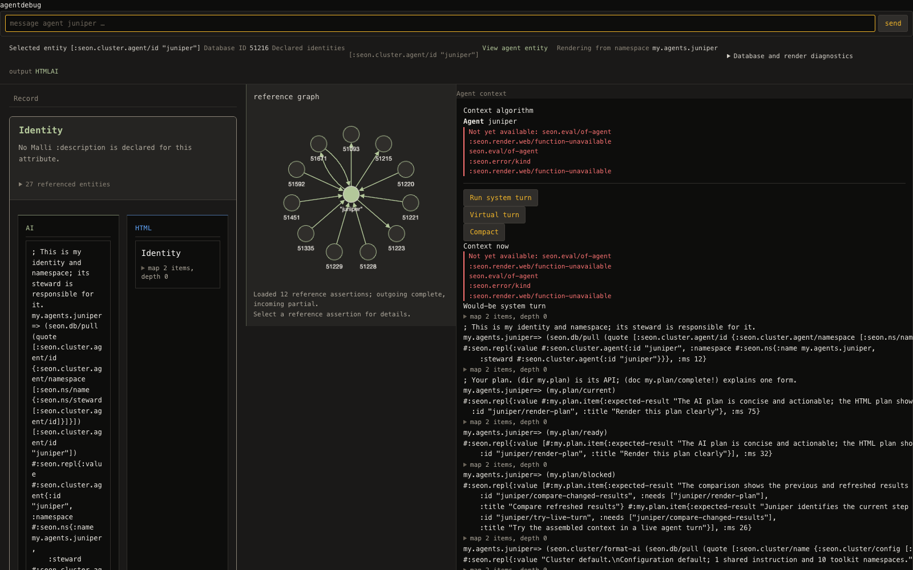
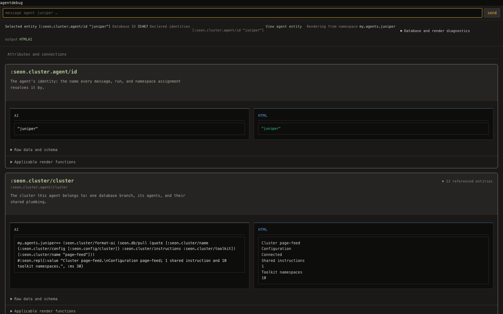

# Page and feed landing — 2026-09-08

Bounded ownership: `src/seon/render/*.clj`, public CSS, their tests, and
the web-server adoption hunk only in `src/seon/cluster.clj`.

Read the AGENTS.md lane rules, turn PRD §10 and §§13–17, the plan README
and working edge, and all three assigned issues end to end. No default
stop, refork, or restart was performed by this lane.

## Initial observations

- MCP answered on PID 45036. Readiness named port 7994; the advertisement
  still named 58444. The render proc's ping was unknown.
- The assigned Juniper debug GET returned **404 in 0.001537 s**, body
  `not found`. This is a failed page observation, not a latency pass.
- The next MCP evaluation reported `repl-unavailable`, advertisement
  missing. Browser MCP reported no browser available. Live verification
  will be retried without operating another lane's session.
- Shared working-tree edits were present in the runner, hooks, fixtures,
  and other namespaces. They were preserved; gates select owned paths.

## Dependency ledger and design

- http-kit accepts a Ring function and retains it for the server lifetime:
  `reference-code/http-kit/src/org/httpkit/server.clj:79–180`.
  `seon.render.web/start!` supplies the function and a virtual-thread executor.
- Adoption already reloads definitions and applies instrumentation in
  `seon.cluster/development-source-refresh!`; its source contains no server
  stop or start. Socket shutdown remains in cluster shutdown. There is no
  justified rebind to add to adoption.
- The server request closure now calls the `handler` Var, so an existing
  listener observes the current constructed handler after reload.
- core.async's mult/tap is the existing delta delivery owner. http-kit's
  `write-state` drain-or-close completion remains the backpressure owner
  (`reference-code/http-kit/src/org/httpkit/server.clj:321`).

## Verification

The armed fast socket regression passed: **1 test, 7 assertions, zero
failures/errors**. It starts the canonical web fixture's real HTTP server,
redefines the handler factory while retaining its actual implementation,
and verifies a subsequent request invokes that current Var on the same
listener. Instrumentation state is restored by the canonical fixture.

Default reappeared as PID 79120, correctly advertised on port 7994, without
this lane operating its lifecycle. The Juniper GET returned **200 in
1.065880 s**. The baseline Playwright screenshot at 1600×1000 confirms the
narrow paired previews and repeated unavailable-function output:

The committed `test/seon/render/page_feed_probe.py` launched curl every
200 ms for 60 seconds: **300 requests, zero non-200, maximum 5.292470 s**.
An existing publication held the lifecycle lock throughout that sampling;
the lane's explicit adoption was queued behind it. This establishes
availability under that observed load, not completion of the queued
adoption. The >5 s response is a performance defect still to resolve.

The isolated gate `SEON_TEST_WORKERS=3 bin/test --paths
src/seon/render/web.clj test/seon/render/web_adoption_test.clj --
seon.render.web-adoption-test` passed: **1 test, 7 assertions, zero
failures/errors**, exit 0; its successful root was removed by the runner.

Pending: completed-adoption coverage, first-event
load probe, and after screenshot. No completion claim is made yet.

## Feed implementation and probes

The first commit is `dd7fc589a`. A second 60-second curl sample during the
explicit adoption path recorded **300/300 HTTP 200**, maximum **6.403608 s**.
The listener's identity remained **254437913**, port **7994**. Adoption
reached reload, SCI acquisition, and instrumentation, then refused its final
publication marker with `Source changed during development adoption; the
next edit must converge it.` This is availability through an adoption
attempt, not a converged-source claim.

GET and SSE now call `current-page`, using the existing page derivation on
one captured database value. A connection taps before capture so it cannot
miss a racing publication; its independent first paint does not acquire a
proc revision. The first proc delivery therefore uses a complete keyframe;
later contiguous revisions retain the existing delta/drain semantics.
The proc no longer owns joins' first paint. The unbounded tap read and the
old proc-settlement join mechanism are removed.

The paused-proc real-socket regression passed under armed contracts:
**1 test, 8 assertions, zero failures/errors**. It verifies first paint
while the proc is paused and a `datastar-patch-signals` event containing
`seon.error/kind = :seon.await/backstop-fired` before EOF. The JSON event
preserves the namespace of the error kind and names the declared bound.
The same test passed the isolated `bin/test --paths src/seon/render/web.clj
test/seon/render/web_test.clj test/seon/render/web_feed_test.clj --
seon.render.web-feed-test` gate with `SEON_TEST_WORKERS=3`: exit 0,
**1 test, 8 assertions**. The runner removed its successful root.

A hot reload followed by re-arming **909 functions** served the full GET
in **1.119114 s**. A later three-tab probe timed out at **20 s** during
navigation under write load. The live thread dump located both the proc
and request in `seon.turn/system-plan` → `seon.db/read-evidence-changes` →
Datahike historical datom merging. A subsequent GET took **2.618699 s**.
These are failed latency probes, not evidence of a stopped HTTP listener.
The debug page still attempted a prospective turn while its evaluation
query was unavailable; the next UI slice handles that missing dependency.

## Immediate page repair after the 16:35 owner ruling

The expanded attribute page exposed a lane defect: `block-metadata` passed
scalar, absent, and collection values to `value/transacted`, whose contract
requires an entity map. It now transacts maps only; other values remain on
the ordinary value renderer path. The canonical, instrumented regression
includes nil, an integer, text, and a collection as well as schema metadata.

`SEON_TEST_WORKERS=3 bin/test --paths src/seon/render/web.clj
test/seon/render/web_debug_test.clj resources/public/css/input.css --
seon.render.web-debug-test`: **2 tests, 13 assertions, zero failures/errors**.
After reloading the web Var and re-arming **908 functions**, default debug
answered **200 in 1.454248 s, 776208 bytes**. The running server was preserved.
The unfinished walk optimization was shelved to `tmp/page-feed-walk-shelved.patch`;
further work proceeds in `tmp/page-feed-wt` and the requested scratch root.

I reread the updated feed issue end to end. The new priority is caller-owned
derivation with shared read-evidence caches and deletion of the context demand
channel, before further page layout work. The sub-second concurrent plain-page
and turn-context measurements remain outstanding.

## Caller-owned derivation, 2026-09-08

The render proc no longer accepts a context demand channel. GET and the
feed's virtual thread call `current-page`; the turn calls
`seon.render/acquire-context!` directly. They share retained calls,
invocations, acquisitions, and packages through the SCI environment's cache
atom. A retained acquisition pulls each distinct entity once and stores its
refreshed evidence after reuse. The remaining proc derives and publishes
packages for registered tabs after wakes. No lifecycle operation was applied
to default.

The dependency probe found repeated recursive acquisition through all
installed attributes. Request-thread samples after removing the proc wait
showed `read-evidence-current?` → `replay-read` → pull, and SCI
`call-preparation/current-snapshot`; they no longer showed `page-refresh`
waiting on `await!`. A wildcard-selector experiment did not improve the
write-load result and was removed.

Measured on scratch `page-feed`, PID 97986, HTTP port 7749, canonical Juniper
fixture, hot-loaded owned render Vars with 910 JVM contracts armed:

- Two real source turns, `source:ee3517c6-9636-4921-ba61-c8cdbddcb73e`
  and `source:fb27f621-e890-4b4d-a56f-84c98f7bf254`, were observed open
  in all 18 one-second observations. Three Playwright debug tabs were open.
  In the overlapping interval, 13 warm plain GETs took **54.959–81.029 ms**,
  HTTP 200. Two changed-content acquisitions took **2,080.724** and
  **2,365.156 ms**. Exact response sizes were **191,398** and **199,532 bytes**.
  This verifies the warm target; it does not claim every changed-content GET
  is below one second.
- In the separate 25-write, one-second-target probe, all writes succeeded;
  first and last completions were epoch milliseconds **1788909826463** and
  **1788909850472**. Three debug tabs stayed open. The 14 first-event probes
  overlapping writes all returned HTTP 200 and `datastar-patch-elements`,
  in **849.690–1,274.912 ms** (see raw measurements for exact values).
  No agent turns were open in this separate probe.
- On the same database value, 12 alternating historical `context-pass`
  derivations (commit `1806ee596`, excluding its old queue) and direct
  acquisitions returned identical **6,315-character** prompt text.
  Median historical derivation was **242.695 ms**; median direct acquisition
  was **246.307 ms**. The raw timings are retained below. Initial direct acquisition was
  **5,940.276 ms**; warm historical and direct timings overlap, without
  the former proc queue. This is a derivation comparison, not a claim that
  cold context construction is below one second.

Evidence and reproducible probes:
[turn GETs](page-feed-turns-only-2026-09-08.json),
[open turns](page-feed-turns-only-open-2026-09-08.edn),
[write-load HTTP](page-feed-cache-refresh-2026-09-08.json),
[writes](page-feed-cache-refresh-writes-2026-09-08.edn),
[context timings](page-feed-context-comparison-2026-09-08.edn),
[live probe](page_feed_live_probe_2026_09_08.clj).

Verification boundary: the unchanged prompt namespace failed at its HEAD
baseline with **15 failures and 1 error, 11 tests / 56 assertions**; the same
failures occurred with this lane's context transport removal. They include
old history/current-task expectations and budget-profile assertions. The
owned direct-context regression passes with the real proc paused. No foreign
session was resumed, messaged, or edited.

Platform verification at `2531b2e70` plus owned paths: **82 tests, 486
assertions, zero failures/errors**, 131 seconds in coordinator/tests.
Focused path gate: **17 tests, 72 assertions, zero failures/errors**.
`JAVA_TOOL_OPTIONS=-XX:ActiveProcessorCount=6 SEON_TEST_WORKERS=3` keeps the
existing platform worker-count boundary at three workers (see the existing
`platform-worker-count-exceeds-prepared-checkouts.md` issue). Integration
with landed agent-record commit `67fe1675d` also passed the focused path
gate: **17 tests, 72 assertions, zero failures/errors**.

## Final attribute-block slice

Every declared attribute stays in schema order, including absent values,
with one AI/HTML pair. The header uses the matching value schema's title
(or schema key), and its description. Components use their schema pair.
Reverse relationships are discovered from all installed ref declarations,
independently of the bounded graph page. Their declared attribute is carried
into the existing renderer's argument preparation; this is what supplies a
fault-list renderer with the actual list instead of a request envelope.
The history walk accepts numeric component entity IDs. A missing evaluation
query is one line naming the unavailable function.

The final page gate passed **6 tests / 25 assertions, zero failures/errors**
with `bin/test --paths src/seon/render/web.clj
 test/seon/render/web_debug_test.clj -- seon.render.web-debug-test`.
The regression includes two reverse relationships with graph limits set to
one, an absent declared attribute, and a real canonical normalized fault
rendered through its declared function and real SCI context.

Playwright measured **1,568 px** block width and **762.609 px** for each
AI/HTML column at a 1,600 px viewport, with identical column y-coordinates
and no horizontal page overflow. Scratch contains its historical probe
faults as well as the normalized preview fixture. The latest recorded debug
GETs returned HTTP 200, **1,113,094 bytes**, in **5,745.768 ms cold** and
**36.743 ms warm**. The cold diagnostic-page result is a remaining latency
defect, not a successful sub-three-second claim.

Before:

After:

[Plan pair](page-feed-after-2026-09-08-plan.png),
[fault pair](page-feed-after-2026-09-08-faults.png),
[measured geometry and GETs](page-feed-after-2026-09-08.json),
[reproducible browser probe](../../../../test/seon/render/page_feed_layout_probe.cjs).

## Default observations after the caller-thread commit

Shared commit **985a830b5** carries the caller-thread architecture. The
subsequent adoption reached reload, SCI acquisition and re-instrumentation,
but refused final convergence because source changed during adoption.
Its request first waited over **178 seconds** for the existing operator
lifecycle lock. No foreign process/session was operated.

The 120-second, 200 ms debug curl loop recorded **125 HTTP 200 responses and
475 curl deadline failures** (10-second limit), with no observed HTTP 500.
This falsifies availability under that load and is not a zero-outage proof.
[Raw continuity observations](page-feed-default-architecture-adoption-2026-09-08.json).
Later PID **91455** was absent and no HTTP listener remained. Its final
observed log line was a dev panic for `:malli.core/invalid-schema`; the log
and advertisement disappeared before the underlying schema could be
identified. The lane did not stop, refork, start, or restart default.
A replacement was then observed as PID **22932**, start instant
**2026-09-08T23:51:15.703Z**, HTTP **7994**, prepl **54281**. Its debug GET
returned HTTP 200 in **839.529 ms**, **477,960 bytes**, and the loaded
`acquire-context!` had the direct one-argument arity.

On that fresh default, three debug tabs plus 25 one-second-target writes
produced **20/20 HTTP 200 GETs and 20/20 HTTP 200 first SSE events**.
The first-event maximum was **1,941.973 ms**, meeting the feed target.
Plain GET median was **818.823 ms**, maximum **1,459.968 ms**. Both Juniper
and root had open ordinary turns in the first seven write observations;
GETs in that changing-content interval still exceeded one second. The
stricter plain-page load target therefore remains incompletely verified.
[Default HTTP measurements](page-feed-default-current-2026-09-08.json),
[write and open-turn observations](page-feed-default-current-writes-2026-09-08.edn).
