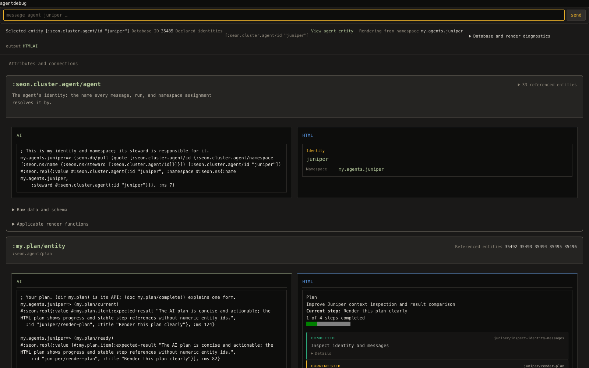
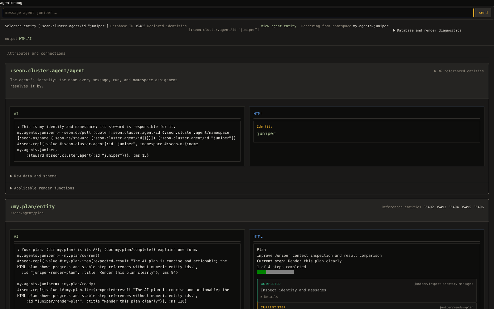
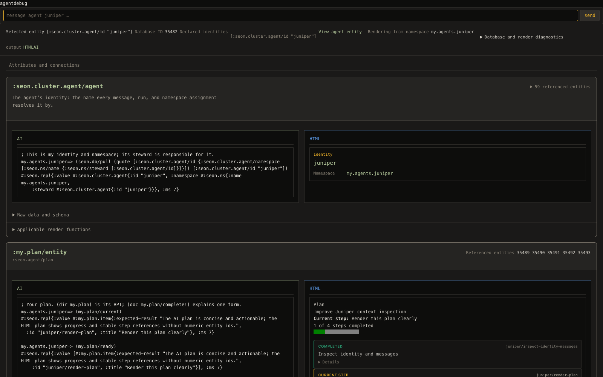

# Page and feed landing — 2026-09-08

Bounded ownership: `src/seon/render/*.clj`, public CSS, their tests, and
the web-server adoption hunk only in `src/seon/cluster.clj`.

Read the AGENTS.md lane rules, turn PRD §10 and §§13–17, the plan README
and working edge, and all three assigned issues end to end. No default
stop, refork, or restart was performed by this lane.

## Initial observations

- MCP answered on PID 45036. Readiness named port 7994; the advertisement
  still named 58444. The render proc's ping was unknown.
- The assigned Juniper debug GET returned **404 in 0.001537 s**, body
  `not found`. This is a failed page observation, not a latency pass.
- The next MCP evaluation reported `repl-unavailable`, advertisement
  missing. Browser MCP reported no browser available. Live verification
  will be retried without operating another lane's session.
- Shared working-tree edits were present in the runner, hooks, fixtures,
  and other namespaces. They were preserved; gates select owned paths.

## Dependency ledger and design

- http-kit accepts a Ring function and retains it for the server lifetime:
  `reference-code/http-kit/src/org/httpkit/server.clj:79–180`.
  `seon.render.web/start!` supplies the function and a virtual-thread executor.
- Adoption already reloads definitions and applies instrumentation in
  `seon.cluster/development-source-refresh!`; its source contains no server
  stop or start. Socket shutdown remains in cluster shutdown. There is no
  justified rebind to add to adoption.
- The server request closure now calls the `handler` Var, so an existing
  listener observes the current constructed handler after reload.
- core.async's mult/tap is the existing delta delivery owner. http-kit's
  `write-state` drain-or-close completion remains the backpressure owner
  (`reference-code/http-kit/src/org/httpkit/server.clj:321`).

## Verification

The armed fast socket regression passed: **1 test, 7 assertions, zero
failures/errors**. It starts the canonical web fixture's real HTTP server,
redefines the handler factory while retaining its actual implementation,
and verifies a subsequent request invokes that current Var on the same
listener. Instrumentation state is restored by the canonical fixture.

Default reappeared as PID 79120, correctly advertised on port 7994, without
this lane operating its lifecycle. The Juniper GET returned **200 in
1.065880 s**. The baseline Playwright screenshot at 1600×1000 confirms the
narrow paired previews and repeated unavailable-function output:

The committed `test/seon/render/page_feed_probe.py` launched curl every
200 ms for 60 seconds: **300 requests, zero non-200, maximum 5.292470 s**.
An existing publication held the lifecycle lock throughout that sampling;
the lane's explicit adoption was queued behind it. This establishes
availability under that observed load, not completion of the queued
adoption. The >5 s response is a performance defect still to resolve.

The isolated gate `SEON_TEST_WORKERS=3 bin/test --paths
src/seon/render/web.clj test/seon/render/web_adoption_test.clj --
seon.render.web-adoption-test` passed: **1 test, 7 assertions, zero
failures/errors**, exit 0; its successful root was removed by the runner.

Pending: completed-adoption coverage, first-event
load probe, and after screenshot. No completion claim is made yet.

## Feed implementation and probes

The first commit is `dd7fc589a`. A second 60-second curl sample during the
explicit adoption path recorded **300/300 HTTP 200**, maximum **6.403608 s**.
The listener's identity remained **254437913**, port **7994**. Adoption
reached reload, SCI acquisition, and instrumentation, then refused its final
publication marker with `Source changed during development adoption; the
next edit must converge it.` This is availability through an adoption
attempt, not a converged-source claim.

GET and SSE now call `current-page`, using the existing page derivation on
one captured database value. A connection taps before capture so it cannot
miss a racing publication; its independent first paint does not acquire a
proc revision. The first proc delivery therefore uses a complete keyframe;
later contiguous revisions retain the existing delta/drain semantics.
The proc no longer owns joins' first paint. The unbounded tap read and the
old proc-settlement join mechanism are removed.

The paused-proc real-socket regression passed under armed contracts:
**1 test, 8 assertions, zero failures/errors**. It verifies first paint
while the proc is paused and a `datastar-patch-signals` event containing
`seon.error/kind = :seon.await/backstop-fired` before EOF. The JSON event
preserves the namespace of the error kind and names the declared bound.
The same test passed the isolated `bin/test --paths src/seon/render/web.clj
test/seon/render/web_test.clj test/seon/render/web_feed_test.clj --
seon.render.web-feed-test` gate with `SEON_TEST_WORKERS=3`: exit 0,
**1 test, 8 assertions**. The runner removed its successful root.

A hot reload followed by re-arming **909 functions** served the full GET
in **1.119114 s**. A later three-tab probe timed out at **20 s** during
navigation under write load. The live thread dump located both the proc
and request in `seon.turn/system-plan` → `seon.db/read-evidence-changes` →
Datahike historical datom merging. A subsequent GET took **2.618699 s**.
These are failed latency probes, not evidence of a stopped HTTP listener.
The debug page still attempted a prospective turn while its evaluation
query was unavailable; the next UI slice handles that missing dependency.

## Immediate page repair after the 16:35 owner ruling

The expanded attribute page exposed a lane defect: `block-metadata` passed
scalar, absent, and collection values to `value/transacted`, whose contract
requires an entity map. It now transacts maps only; other values remain on
the ordinary value renderer path. The canonical, instrumented regression
includes nil, an integer, text, and a collection as well as schema metadata.

`SEON_TEST_WORKERS=3 bin/test --paths src/seon/render/web.clj
test/seon/render/web_debug_test.clj resources/public/css/input.css --
seon.render.web-debug-test`: **2 tests, 13 assertions, zero failures/errors**.
After reloading the web Var and re-arming **908 functions**, default debug
answered **200 in 1.454248 s, 776208 bytes**. The running server was preserved.
The unfinished walk optimization was shelved to `tmp/page-feed-walk-shelved.patch`;
further work proceeds in `tmp/page-feed-wt` and the requested scratch root.

I reread the updated feed issue end to end. The new priority is caller-owned
derivation with shared read-evidence caches and deletion of the context demand
channel, before further page layout work. The sub-second concurrent plain-page
and turn-context measurements remain outstanding.

## Caller-owned derivation, 2026-09-08

The render proc no longer accepts a context demand channel. GET and the
feed's virtual thread call `current-page`; the turn calls
`seon.render/acquire-context!` directly. They share retained calls,
invocations, acquisitions, and packages through the SCI environment's cache
atom. A retained acquisition pulls each distinct entity once and stores its
refreshed evidence after reuse. The remaining proc derives and publishes
packages for registered tabs after wakes. No lifecycle operation was applied
to default.

The dependency probe found repeated recursive acquisition through all
installed attributes. Request-thread samples after removing the proc wait
showed `read-evidence-current?` → `replay-read` → pull, and SCI
`call-preparation/current-snapshot`; they no longer showed `page-refresh`
waiting on `await!`. A wildcard-selector experiment did not improve the
write-load result and was removed.

Measured on scratch `page-feed`, PID 97986, HTTP port 7749, canonical Juniper
fixture, hot-loaded owned render Vars with 910 JVM contracts armed:

- Two real source turns, `source:ee3517c6-9636-4921-ba61-c8cdbddcb73e`
  and `source:fb27f621-e890-4b4d-a56f-84c98f7bf254`, were observed open
  in all 18 one-second observations. Three Playwright debug tabs were open.
  In the overlapping interval, 13 warm plain GETs took **54.959–81.029 ms**,
  HTTP 200. Two changed-content acquisitions took **2,080.724** and
  **2,365.156 ms**. Exact response sizes were **191,398** and **199,532 bytes**.
  This verifies the warm target; it does not claim every changed-content GET
  is below one second.
- In the separate 25-write, one-second-target probe, all writes succeeded;
  first and last completions were epoch milliseconds **1788909826463** and
  **1788909850472**. Three debug tabs stayed open. The 14 first-event probes
  overlapping writes all returned HTTP 200 and `datastar-patch-elements`,
  in **849.690–1,274.912 ms** (see raw measurements for exact values).
  No agent turns were open in this separate probe.
- On the same database value, 12 alternating historical `context-pass`
  derivations (commit `1806ee596`, excluding its old queue) and direct
  acquisitions returned identical **6,315-character** prompt text.
  Median historical derivation was **242.695 ms**; median direct acquisition
  was **246.307 ms**. The raw timings are retained below. Initial direct acquisition was
  **5,940.276 ms**; warm historical and direct timings overlap, without
  the former proc queue. This is a derivation comparison, not a claim that
  cold context construction is below one second.

Evidence and reproducible probes:
[turn GETs](page-feed-turns-only-2026-09-08.json),
[open turns](page-feed-turns-only-open-2026-09-08.edn),
[write-load HTTP](page-feed-cache-refresh-2026-09-08.json),
[writes](page-feed-cache-refresh-writes-2026-09-08.edn),
[context timings](page-feed-context-comparison-2026-09-08.edn),
[live probe](page_feed_live_probe_2026_09_08.clj).

Verification boundary: the unchanged prompt namespace failed at its HEAD
baseline with **15 failures and 1 error, 11 tests / 56 assertions**; the same
failures occurred with this lane's context transport removal. They include
old history/current-task expectations and budget-profile assertions. The
owned direct-context regression passes with the real proc paused. No foreign
session was resumed, messaged, or edited.

Platform verification at `2531b2e70` plus owned paths: **82 tests, 486
assertions, zero failures/errors**, 131 seconds in coordinator/tests.
Focused path gate: **17 tests, 72 assertions, zero failures/errors**.
`JAVA_TOOL_OPTIONS=-XX:ActiveProcessorCount=6 SEON_TEST_WORKERS=3` keeps the
existing platform worker-count boundary at three workers (see the existing
`platform-worker-count-exceeds-prepared-checkouts.md` issue). Integration
with landed agent-record commit `67fe1675d` also passed the focused path
gate: **17 tests, 72 assertions, zero failures/errors**.

## Final attribute-block slice

Every declared attribute stays in schema order, including absent values,
with one AI/HTML pair. The header uses the matching value schema's title
(or schema key), and its description. Components use their schema pair.
Reverse relationships are discovered from all installed ref declarations,
independently of the bounded graph page. Their declared attribute is carried
into the existing renderer's argument preparation; this is what supplies a
fault-list renderer with the actual list instead of a request envelope.
The history walk accepts numeric component entity IDs. A missing evaluation
query is one line naming the unavailable function.

The final page gate passed **6 tests / 25 assertions, zero failures/errors**
with `bin/test --paths src/seon/render/web.clj
 test/seon/render/web_debug_test.clj -- seon.render.web-debug-test`.
The regression includes two reverse relationships with graph limits set to
one, an absent declared attribute, and a real canonical normalized fault
rendered through its declared function and real SCI context.

Playwright measured **1,568 px** block width and **762.609 px** for each
AI/HTML column at a 1,600 px viewport, with identical column y-coordinates
and no horizontal page overflow. Scratch contains its historical probe
faults as well as the normalized preview fixture. The latest recorded debug
GETs returned HTTP 200, **1,113,094 bytes**, in **5,745.768 ms cold** and
**36.743 ms warm**. The cold diagnostic-page result is a remaining latency
defect, not a successful sub-three-second claim.

Before:

After:

[Plan pair](page-feed-after-2026-09-08-plan.png),
[fault pair](page-feed-after-2026-09-08-faults.png),
[measured geometry and GETs](page-feed-after-2026-09-08.json),
[reproducible browser probe](../../../../test/seon/render/page_feed_layout_probe.cjs).

## Default observations after the caller-thread commit

Shared commit **985a830b5** carries the caller-thread architecture. The
subsequent adoption reached reload, SCI acquisition and re-instrumentation,
but refused final convergence because source changed during adoption.
Its request first waited over **178 seconds** for the existing operator
lifecycle lock. No foreign process/session was operated.

The 120-second, 200 ms debug curl loop recorded **125 HTTP 200 responses and
475 curl deadline failures** (10-second limit), with no observed HTTP 500.
This falsifies availability under that load and is not a zero-outage proof.
[Raw continuity observations](page-feed-default-architecture-adoption-2026-09-08.json).
Later PID **91455** was absent and no HTTP listener remained. Its final
observed log line was a dev panic for `:malli.core/invalid-schema`; the log
and advertisement disappeared before the underlying schema could be
identified. The lane did not stop, refork, start, or restart default.
A replacement was then observed as PID **22932**, start instant
**2026-09-08T23:51:15.703Z**, HTTP **7994**, prepl **54281**. Its debug GET
returned HTTP 200 in **839.529 ms**, **477,960 bytes**, and the loaded
`acquire-context!` had the direct one-argument arity.

On that fresh default, three debug tabs plus 25 one-second-target writes
produced **20/20 HTTP 200 GETs and 20/20 HTTP 200 first SSE events**.
The first-event maximum was **1,941.973 ms**, meeting the feed target.
Plain GET median was **818.823 ms**, maximum **1,459.968 ms**. Both Juniper
and root had open ordinary turns in the first seven write observations;
GETs in that changing-content interval still exceeded one second. The
stricter plain-page load target therefore remains incompletely verified.
[Default HTTP measurements](page-feed-default-current-2026-09-08.json),
[write and open-turn observations](page-feed-default-current-writes-2026-09-08.edn).

## 18:00 follow-up: identity grouping and active-thread profile

Read `components-landing-2026-09-08.md` and its proposed web patch end to end.
The scratch browser probe falsified the patch's `db/q` of `:db/isComponent`:
that keyword is installed schema metadata, not a queryable application attribute.
The corrected grouping reads `(:schema (db/schema-database database))`, the same
Datahike authority used by the walk. It groups scalar identity through the agent
schema pair, retaining plan/settings in schema order and reverse concerns.
The duplicate `seon.render.ns/render-agent-*` pair is removed; its regression
calls the declared owner `seon.cluster.agent/render-identity-ai`.

Fresh `page-feed` scratch, Juniper seeded, Chrome at 1600 px: debug GETs were
200 in 1686.7465 ms cold and 11.507625 ms warm, 834181 bytes. Blocks measured
1568 px, each AI/HTML column 762.609375 px, matching vertical coordinates;
scroll width was 1600 px. The first probe lacked generated CSS and was rejected;
these measurements follow `npm run css:build` in the isolated checkout.

The old scratch dataset reproduced cold context at 6626.281125 ms, 30105
characters. A synchronized `jcmd Thread.dump_to_file -format=json` probe
captured 16 active acquisition stacks: 9 blocked in the synchronous transaction
at `seon.render/render-call`, and 5 rebuilding `call-preparation/current-snapshot`.
The dump-instrumented run took 10894.609834 ms; that is profiling overhead plus
work, not an acceptance timing. Exact active stacks are retained in
`page-feed-cold-context-stacks-2026-09-08.json`. The per-render cost writes
advance the database repeatedly and trigger intervening snapshot rebuilds.

### Completed default checks after `baa1dde54`

In-place adoption converged to source `6aa0cc22-3f59-529e-93a1-9a8abd170221`,
digest `e2f1e079784697d73d5de51ecdeeb6f51af5399d1e5fdff349bcbeeda7bb5b92`.
Default stayed PID 22932, HTTP 7994, prepl 54281. A 200 ms curl schedule across
that adoption made 600 requests to `/css/output.css`: zero non-200, maximum
9.165 ms. This verifies the listener across adoption, separately from dynamic
render latency; it does not erase the earlier failed debug-load probe.

With three debug tabs and two submitted source turns, 30 plain GETs all returned
200, maximum 790.504750 ms; the observer recorded both turns open in its first
three one-second samples. The first-event maximum was 1016.792625 ms. Turn ids:
`source:ed23bc35-be97-42f3-9ecd-d29fbf9c3299` and
`source:1a2a03cb-125d-4acd-a52b-9cd464fea1b2`.
A subsequent 25-write, one-per-second probe with three debug tabs returned
20/20 first events and plain GETs with status 200: first-event maximum
14.454500 ms, plain maximum 393.335459 ms. Writes completed without refusal
from epoch ms 1788923044465 through 1788923068476. These writes changed basis;
the separate changed-content target remains subject to the follow-up profile.
The `baa1dde54` platform gate passed 82 tests, 486 assertions, zero failures or
errors, with `SEON_TEST_WORKERS=3` (`page-feed-final-platform.log`).

Identity-grouping gate: `SEON_TEST_WORKERS=3 bin/test --paths
src/seon/render/web.clj src/seon/render/ns.clj test/seon/render/ns_test.clj
test/seon/render/web_debug_test.clj -- seon.render.web-debug-test
seon.render.ns-test` passed 16 tests, 113 assertions, zero failures/errors.
The namespace tests now verify unclipped HTML through the production renderer;
they no longer apply the AI-only fit operation to HTML or expect the retired
function-before-schema budget selection.

### Grouped default observation and performance correction

Commit `f518fd478` landed the grouping. Full development adoption was refused by
the concurrently edited evaluation boundary: `:seon.eval/entity` declared
`seon.repl/render-ai`, but its input `:seon.repl/entity-request` did not accept
that shape (`:seon.schema/render-contract-incoherent`). No foreign files or
sessions were operated. The committed web/ns Vars were loaded in default and
re-instrumented in place (911 registered/instrumented); this observation is a
**hot reload**, not successful program-fact adoption. Default remained PID 22932.
Its debug GETs returned 200 in 17.852125 and 8.227375 ms, 1328357 bytes. Chrome
verified identity, plan, settings, and reverse concerns at 1568 px with paired
762.609375 px columns.

On the fresh scratch dataset, a changed-plan-objective probe with three debug
tabs returned 16/16 plain GETs under 1 s (maximum 969.994333 ms), and 16/16
first events under 2 s (maximum 1760.146958 ms). Fifteen content writes succeeded;
the first landed at epoch ms 1788924378501, the last at 1788924404521. Their
one-second sleeps plus transaction time did not establish a write-per-second
cadence; the separate basis-write probe above owns that claim. A subsequent
GET profiled with virtual-thread-aware dumps returned 200 in 437.700 ms,
134664 bytes. Its active sample was in schema value decoding, not a proc wait
(`page-feed-changed-page-stacks-2026-09-08.json`).

The performance change carries each new render cost as `:seon.db/tx-data` in
the existing captured-call value. Context acquisition commits all such facts
once after derivation, then removes pending transaction data before retaining
calls. It no longer advances the connection between every renderer invocation.
The regression requires multiple cost facts and exactly one transaction.
Remaining render readers also derive cluster custody from the database's
cluster row rather than the retired agent/cluster ref, and identity rendering
no longer calls an agent idle because the retired agent/run field is absent.

After loading and re-arming these changes on scratch, cold acquisition was
429.214459 ms for 44124 characters. Twelve warm acquisitions took
25.651333–29.042375 ms and preserved exactly the same text in every comparison.
This is a fresh current-schema fixture, not a same-dataset speedup ratio against
the earlier long-lived scratch root. The old root's active stacks establish the
repeated-write cause independently of that dataset difference.

Cost-batching gate: path-limited `bin/test` with
`seon.render.web-context-test seon.render.root-pull-test
seon.render.web-debug-test` passed 20 tests, 81 assertions, zero failures/errors.
The canonical paused-proc fixture records multiple real cost facts in exactly
one transaction and independently obtains both context and HTTP200 on callers.

### Prompt history and render-cost feedback

The revised canonical prompt fixture evaluates a real read through SCI and records
it through the ordinary writer before opening the held prompt run. The first
fixture attempt incorrectly recorded while that run was already held: the writer
refused it, so empty history was not a valid observation. The regression now
refuses fixture setup loudly on that result. Assertions follow stored evaluations,
unchanged historical bytes, contribution hashes/costs, and informational budgets
under the settings component. They no longer expect a current-task slot or a new
message to rewrite an earlier observation.

History identity is the rendered entity, independent of reference path and a later
database basis. New identities append; previously shown bytes remain unchanged.
Repeated calls also exposed a feedback loop: recording another render cost for
identical output advanced the database and invalidated a namespace read again.
Cost recording now requires a non-nil changed output. The instrumented invocation
probe observes no additional SCI invocation once those facts have been observed.
The isolated pre-integration gate passed 26 tests, 160 assertions, zero failures
or errors; the combined committed evaluation renderer is gated separately below.

Default cold acquisition after the committed cost-batching hot reload measured
331.908041 ms for 45760 characters; 12 warm samples measured
28.306417–47.600458 ms with identical text in every comparison. This clears the
2 s cold target on that observed dataset. The ready-file mode in
`test/seon/render/page_feed_thread_probe.py` makes the virtual-thread sampling
reproducible without relying on sequential tool calls overlapping accidentally.

A CPU-heavy two-turn probe with three tabs and one-second basis writes falsified
the combined limits: plain maximum 1067.611334 ms, first-event maximum
2695.05625 ms, all HTTP200. A subsequent bounded shell-effect probe recorded both
turns open for four consecutive one-second writes. Its 30 plain GETs were all
HTTP200, maximum 757.632833 ms; the overlapping GET at epoch 1788926489545 took
757.632833 ms. Its first-event maximum was still 3510.913 ms, so this run does
**not** establish the SSE target under simultaneous turn traffic. Thread/sleep
SCI attempts that closed before observation were rejected as overlap evidence.
These negative measurements are retained alongside the passing isolated-write
measurements, not averaged away.

The additional scratch identity change passes only the scalar entity attributes
to the grouped identity pair, leaving components in their own blocks. Chrome
verified 1568 px blocks and two 762.609375 px columns, with no horizontal overflow.
The cache-cleared GET took 2628.648208 ms and the warm GET 19.146625 ms, both 200,
1004703 bytes. This older scratch code did not include the subsequently committed
lazy diagnostic-details change; it is not a latency claim for that combined page.

The protected evaluation/render edits landed as `adfdcc839` while this work was
isolated. The remaining hunks were applied against that commit after verifying
those paths had no uncommitted edits. No foreign session or file was operated.

Combined HEAD-plus-owned-paths gate after `adfdcc839`: 27 tests, 166 assertions,
zero failures/errors across prompt, web context, debug, and namespace renderers.

### Committed adoption and final acceptance measurements

`22f6163e5` landed the history/cost slice. Development adoption then completed
at source commit `6aa0db4f-b37a-5712-923e-f55a3828146b`, digest
`92a9486c3f7b9f02cfac9924abb5f600f0c5fc35424cffd55d613a9fe129f615`.
The operator reported schema declarations, program reconciliation, namespace
reload, SCI acquisition, JVM instrumentation, and convergence. Default stayed
PID 22932 throughout; no stop, refork, or restart was performed. The listener
probe spans reconciliation and reload: **900/900 HTTP200**, 200 ms target
intervals, maximum **4.508 ms**. It requests CSS to isolate socket availability
from page derivation; the dynamic page is measured separately.

Chrome observed adopted debug GETs **1534.247916 ms cold / 5.653625 ms warm**,
HTTP200, **279925 bytes**. All eight declared/grouped/reverse blocks remained
1568 px wide, with 762.609375 px AI and HTML columns and 1600 px document width.
The identity pair now shows its namespace as well as its id.

After clearing the shared render cache, default context acquisition took
**283.779208 ms** for **14164 characters**. Twelve subsequent direct samples
were **17.478542–24.612959 ms**, versus the historical queue-excluded derivation's
**17.479875–27.979208 ms**. Every pair produced identical text. The evaluation
pair now supplies REPL text, so character counts differ from the earlier raw
map fallback; these are observations on the named adopted source, not a claim
that shrinking bytes alone accounts for the speedup.

With three Chrome debug tabs, two submitted bounded turns, and one-second basis
writes, **30/30 changed-content plain GETs returned 200**, maximum
**689.743834 ms**. While both turns were observed open, GETs at epoch ms
1788926892742 and 1788926895738 took **614.589333 / 557.557542 ms** and returned
**242820 / 257902 bytes**, respectively. This verifies changed content below 1 s,
not merely a cached unchanged page. Cold context is below 2 s.

The required separate feed write-load proof has **20/20 HTTP200 first events**,
maximum **1699.843583 ms**, with three debug tabs and 20 successful writes from
epoch 1788927087664 through1788927106670 (19.006 seconds for 19 intervals).
The accompanying plain GET maximum was **615.926833 ms**. This verifies the
first-event target under one write per second.

The stronger simultaneous-turn-and-write probe still measured a **2994.7665 ms**
first event. Virtual-thread-aware sampling found 30 active page stacks: 13 entered
`debug-prompt`'s context algorithm functions, 8 entered source preview evaluation,
and the rest acquired/rendered page data. No sampled caller waited on the render
proc. The complete active stacks are retained. This additional load case remains
an explicit performance limitation, not a passing assertion for the separate
write-load target.

Platform verification initially ran 82 tests / 470 assertions with one cohost-boot
error: `A reachability sweep is in progress; retry start later.` The isolated
confirmation passed. A one-worker retry with six visible CPUs failed before
readiness because HEAD's coordinator launched `pool-2` against an unprepared
checkout; its stderr could not locate `seon/test/runner`. These are distinct
foreign boundaries in cluster/store boot and the concurrently owned runner.
The next retry uses one worker and two visible CPUs, aligning HEAD's derivation
without editing either owner.

Final platform retry: `JAVA_TOOL_OPTIONS=-XX:ActiveProcessorCount=2
SEON_TEST_WORKERS=1 bin/test --platform --paths <the six history-slice paths>`
passed **82 tests, 486 assertions, zero failures/errors**. The preceding
three-worker race and worker-launch refusal remain recorded rather than being
presented as passing runs. The path-limited prompt/page gate passed 27 tests,
166 assertions. All required gates used at most 3 workers; no all/full gate ran.

Cleanup used the operator only on the explicit page-feed scratch root. It
reaped the old recorded scratch JVM 97554, then the scratch-root operator stopped
page-feed and its empty JVM 36264. Both process identities were verified absent
before deleting the root. The four page-feed worktrees and this continuation's
failed test roots were removed after verifying no live JVM held them. Reference
and node-module links were unlinked without following their targets. Default
PID 22932 was untouched. Evidence scripts, measurements, and screenshots remain
committed under this research directory and test/seon/render/.

After scratch cleanup, a final default debug curl returned HTTP200 in
1498.884 ms, 292220 bytes; PID 22932 was still alive. The path-limited
evidence diff passed its whitespace check.

### 18:55 follow-up — adoption cache generation

Read the updated components landing note end to end, including its later
message/reverse-concern hunk and confirmed stale page after adoption. The first
identity grouping was already shipped in `f518fd478`; the later reverse-concern
filter is a separate pending slice. Prompt expectations were fixed in
`22f6163e5`, whose combined gate passed 27 tests/166 assertions.

The existing caches compared the SCI program-snapshot object. Adoption can
replace loaded functions without replacing that object. The generation now
also contains the cluster row's `:seon.source/commit-id`, which adoption writes
only after reload, SCI acquisition, and instrumentation succeed
(`src/seon/cluster.clj`, the final adoption transaction).
`seon.render/source-generation` queries those facts from the handed database;
page/context generation, selection inspection, and invocation evidence include
it. A changed page generation discards that page's retained calls/fragments
before deriving. No cache service, lock, or global registry was added.

The armed canonical regression pauses the render proc, retains the same SCI
snapshot object, warms a real HTTP debug page, and changes only the adopted
commit fact. The unchanged GET performs no new SCI invocations; the new commit
forces the real renderer to run. The fast test passed 2 tests / 18 assertions.

Live scratch proof: PID 61496, root `tmp/page-feed-root`, Juniper seeded from the
canonical fixture. The initial GET returned 200 in 1966.404 ms, 68157 bytes and
contained `Attributes and connections`, with no new heading. The cached page
was left in place. `debug-found-values-html` was edited to emit
`Entity attributes and connections`, then adopted through the ordinary operator.
Adoption converged at `6aa0df3e-6000-597b-8b12-a1114b3ad234`, digest
`def4e16d633262feece7b6dfbb5b77330a9833148e65c7f1c33834b1de7e6a3f`.
The next GET returned 200 in 1740.387667 ms, 80803 bytes and contained the new
heading. PID 61496 was unchanged; no cache reset or restart occurred.
`test/seon/render/page_feed_adoption_probe.py` verifies expected response bytes
and retains status, time, size, and SHA-256 evidence.

Adoption-cache path-limited gate: 23 tests, 96 assertions, zero failures/errors
across web context, debug, and root-pull namespaces.
