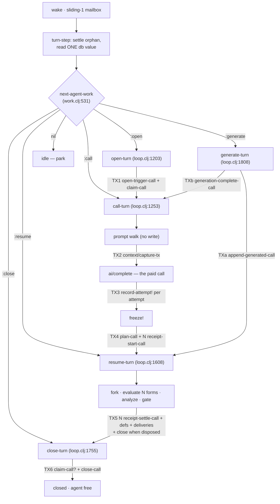

# The run loop, unpacked — 2026-09-07

## Question and method

The owner's direction: *"The agent runtime was a bitch to write the first time
and get it stable. Don't discard everything just because it's hairy. Unpack it
and do test runs and understand how we should properly utilize datahike's
features like CAS. But yes this seems overengineered and we've had slowness
issues since data was not being efficiently queried or written to the database
and it was a mess."* And: *"State is schemad data mostly stored in the database.
Most database ops are not race conditions since you have a copy of the database
frozen at whatever time you pull it… Functional programming is more about the
algorithm — find the optimal order to do things in and carry the data forward
transforming it as you need."*

Method: read `src/seon/cluster/{loop,run,work,agent}.clj` end to end; enumerate
every transaction and every in-transaction fence; then measure on two live
systems.

- **Reads** on the live development cluster `juniper-context`
  (root `tmp/juniper-context-live`, 9 runs / 27 forms / 27 receipts / 8
  messages, 2 agents) through MCP `eval_clj` jvm mode. Read-only; nothing was
  transacted there.
- **Writes and turns** on a lane-owned scratch cluster `loop-research`
  (`bin/seon --root tmp/loop-research-root start loop-research`, file store,
  `keep-history? true`, `:datahike.index/persistent-set`, 247,620 datoms at
  boot, 71,478 published program rows, 2,453 schema rows, 593 installed
  attributes of which 129 are refs and 41 are `:db.unique/identity`).
- Timings are `System/nanoTime` around the named function, warmed, on
  OpenJDK 26.0.1 / 18 available processors / macOS 25.6.0. Turn timings come
  from a Datahike `listen` on the cluster connection recording
  `(count (:tx-data report))` per committed transaction.

**The headline is not in the loop's shape.** The loop's own derivation costs
under a millisecond. 93% of a measured two-form turn's wall clock is one
per-call schema-projection rebuild inside `seon.db/transact!`, and the
prompt-side entity walk is linear in the agent's entire run history. Those two
facts, not the entity families and not the fences, are what "we've had slowness
issues" is made of. The fences are cheap, and most of them are load-bearing for
crash recovery rather than for concurrency.

---

## 1. The loop as data flow

### 1.1 Where the turn lives

There is no central loop. `seon.cluster.agent/turn-step`
(`src/seon/cluster/agent.clj:487-599`) is the per-agent `:io` proc: it consumes
its own turn permit, settles this agent's orphan, derives
`seon.cluster.work/next-agent-work` from ONE database value, calls
`seon.cluster.loop/turn` (`src/seon/cluster/loop.clj:1903-1934`), and offers one
payload-free wake back into its own sliding-1 mailbox when
`more-agent-work?` still says yes.

`turn` is a five-way `case` on `:seon.cluster.work/situation`
(`src/seon/cluster/loop.clj:1929-1934`): `:open`, `:call`, `:generate`,
`:resume`, `:close`.

### 1.2 One model turn, as (read db value → pure derivation → transaction)

| # | read | pure derivation | transaction (site) | writes | families | fence |
|---|---|---|---|---|---|---|
| 0 | `@connection` (`agent.clj:542,548`) | `work/interruption`, `work/next-agent-work` | — | — | — | — |
| 1 | `db/commit-id @connection` (`loop.clj:1219`) | open request | `loop.clj:1226` | run entity + agent pointer + custody | run | `[:db.fn/call #'open-trigger-call]` (`loop.clj:1182`) wrapping `run/open-call` (`run.clj:500`), then `run/claim-call` (`run.clj:561`) — one commit |
| 2 | `@connection` twice (`loop.clj:1383`), `run/opening-db` (`run.clj:376`) | `prompt/prompt` → `render/acquire-context!` → walk | — | — | — | — |
| 3 | the same opening db value | `context/capture-tx` | `loop.clj:1412` | prompt text + basis + ordered contribution rows | context capture, contribution | plain data (`:db.fn/call` inside `seon.context`, `context.clj:162`) |
| 4 | `@connection` (`loop.clj:1289`), `attempts @connection` (`loop.clj:1444`) | provider targets, attempt row, evidence projection | `loop.clj:1052` **per attempt** | attempt row + error facts + model gauges | ai attempt, error | none (upsert on derived `:seon.ai.attempt/id`) |
| 5 | `@connection` (`loop.clj:1328`) | `planned-sources` (reader + one Parinfer repair pass) | `loop.clj:1362` | plan digest, reply/blob, N form entities, N running receipts | run, form, eval | `run/plan-call` (`run.clj:781`) + N × `run/receipt-start-call` (`run.clj:1204`) — one commit |
| 6 | `@connection` (`loop.clj:1618,1633`), per form `@connection` (`loop.clj:1561`) | `sci.eval/fork-for-turn`, `evaluate-sources`, `seon.fn/analyze-forms`, `gate-function-install`, `problems/form-problem` | — | — | — | — |
| 7 | `@connection` **once per form** (`loop.clj:538`) | `evaluation-terminal-data` → receipt facts, def rows, delivery rows, close | `loop.clj:670` | N receipt settlements + program rows + def rows + read-evidence components + message deliveries + error facts + (close) | eval, def, program row, message, error, run | N × `run/receipt-settle-call` (`run.clj:1963`), and `run/close-call` (`run.clj:633`) when the last form disposed — ONE commit |
| 8 | `@connection` (`loop.clj:1778`) | — | `loop.clj:1792` | close + custody release + pointer retraction | run | `run/close-call` (`run.clj:633`), preceded by `run/claim-call` when unheld (`loop.clj:1781`) |

Steps 1–7 are one turn pass each for `:open` and `:call`; step 8 is a
**separate turn pass** reached through the self-rewake, and only when the
agent's last form disposed nothing.



### 1.3 Every place the loop re-reads the connection instead of carrying a db value

`src/seon/cluster/loop.clj` derefs the connection at 21 sites
(263, 538, 740, 810, 825, 979, 1168, 1219, 1289, 1328, 1383, 1444, 1505, 1561,
1618, 1621, 1633, 1778, 1822, 1827, 1888). The ones that matter:

- **`loop.clj:538`** — `evaluation-terminal-data` derefs the connection, and
  `settle-batch!` calls it once per form (`loop.clj:643`). Nothing is
  transacted between forms, so every deref after the first returns the same
  value; the batch could have carried one db value forward.
- **`loop.clj:1561`** — `evaluate-sources` derefs per form unless an explicit
  `:seon.db/db` snapshot is supplied. The docstring already names the
  alternative; the turn path does not supply it.
- **`loop.clj:1618` then `1633`** — `resume-turn` derefs twice in a row for the
  fork and then for the ordinal query.
- **`loop.clj:1289` / `1383` / `1444` / `1505`** — `call-turn` derefs four
  separate times inside one pass (settings, prompt basis, attempt count,
  failover notice render), and the surrounding comment at `loop.clj:1283-1288`
  explicitly claims "ONE TURN, ONE RESOLUTION … Both reads use this immutable
  database value" — which is true only for the first two.
- **`loop.clj:263`** — `gate-function-install` derefs again, per defining form.

None of these are correctness bugs (the writer is serial and nothing commits
between them), which is exactly the owner's point: they are algorithm shape.
Each deref is a fresh db value, and a fresh db value is what makes step 1.4's
projection cache miss.

### 1.4 Derived values the loop stores that a query could derive

- `:seon.cluster.run/plan-digest` (`run.clj:729-735`) — SHA-256 of the ordered
  sources, which are themselves stored as form entities. It is also used as a
  **state discriminator**: `next-agent-work` branches `:resume`/`:close` vs
  `:call` on its presence (`work.clj:556`).
- `:seon.cluster.work/situation` on the run entity — a stored `:call`/`:generate`
  label, transitioned by retract-then-assert in `generation-complete-call`
  (`run.clj:1026-1027`). This is the one place the model keeps a status field.
- `:seon.cluster.eval/result-size` (`run.clj:1275-1279`),
  `:seon.cluster.run/reply-size`, `:seon.def/size` — `(count …)` of a string
  that is stored beside them, except when the string went to a blob.
- `:seon.test.accretion/gate-test-count` / `gate-pass-count` / `gate-fail-count`
  / `case-count` / `executed-count` (`loop.clj:293-307`) — all derivable from
  the gate report that is stored in the same settlement.
- `:seon.ai.attempt/ordinal` — derived by counting attempt rows immediately
  before the write (`loop.clj:848-867`).
- `:seon.cluster.agent/run` — the pointer mirrors "this agent's run with no
  `closed-at`". It is deliberately the busy fence (`open-call` refuses
  `::agent-already-running`, `run.clj:512-514`), so it earns its place, but it
  is a mirror.
- `:seon.cluster.run/undisposed-at` (`loop.clj:622`) — a stamp for a condition
  the same transaction already derived from receipts and forms.

Deliberately **not** derivable, and documented as such:
`:seon.cluster.run/interrupted-at` (`run.clj:456-470`) — a process that died
before its first receipt row existed leaves nothing to derive from.

---

## 2. Entity families per turn

Measured on `loop-research` by submitting a two-form source through the
sanctioned path `seon.cluster.agent/submit-source!`
(`src/seon/cluster/agent.clj:672-762`), which uses `run/system-run-tx`
(`run.clj:862`) — the ordinary open/claim/plan/receipt-start transitions with no
model call — and letting the agent's own turn proc resume and settle it.

Source: `"(+ 3 4)\n(def probe-three (* 7 3))\n"`. Three committed transactions,
**60 datoms total**:

| tx | datoms | families | attributes |
|---|---|---|---|
| 1 — `system-run-tx` | 38 | run, 2 forms, 2 receipts, 2 namespace refs | `run/id`, `run/agent`, `run/process`, `run/opened-at`, `run/opening-commit-id`, `run/starting-ns`, `run/plan-digest`, `run/reply`, `run/reply-size`, `run/forms`×2, `work/situation`, `agent/run`, `run.form/{id,run,ordinal,author,source,ns}`×2, `eval/{id,run,ordinal,at,source,ns}`×2, `db/txInstant` |
| 2 — `settle-batch!` | 18 | 2 receipt settlements, 1 def row | `eval/result-edn`×2, `eval/result-size`×2, `eval/read-basis-transaction`×2, `sci.eval/ending-ns`×2, `def/{key,id,name,ns,agent,ordinal,size,value-edn}`, `schema.admission/source`, `db/txInstant` |
| 3 — `close-turn` | 4 | run close | `run/closed-at`, `run/process` (retract), `agent/run` (retract), `db/txInstant` |

Reproduced across five submissions; the 38/18/4 split was byte-stable, and a
form that produced an error settled 12 datoms in tx 2 instead of 18
(`eval/error`, `eval/triage-edn`, `error/kind` replacing the def row).

Wall time, five consecutive two-form turns:

| run | submit tx (ms) | whole turn (ms) |
|---|---|---|
| 1 | 85.5 | 1202 |
| 2 | 74.3 | 1105 |
| 3 | 588.1 | 1585 |
| 4 | 65.4 | 1050 |
| 5 | 566.4 | 1572 |

**A model turn adds** (not measured here — it would be a paid provider call):
one extra transaction each for open+claim, the pre-provider context capture with
its per-segment `:seon.context.contribution` rows, one per model attempt
(`:seon.ai/attempt` + any error facts + model gauges), and the plan freeze —
so **5 to 6 sequential commits per model turn** versus this path's 3
(`loop.clj:1226, 1412, 1052, 1362, 670, 1792`).

The read-evidence component family
(`:seon.cluster.eval/read-evidence`, `run.clj:1782-1804`) contributed zero
datoms in these turns because the forms read nothing. That owner carries its own
scar comment: rebuilding a projection inside it "paid 360--550 ms on every
ordinary form settlement" (`run.clj:1789-1796`) — the same disease §3 measures.

---

## 3. Where the time goes

### 3.1 The work derivation is not the problem

On `juniper-context` (9 runs, 27 forms, 27 receipts), 50 warmed samples,
medians:

| derivation | median | max |
|---|---|---|
| `work/next-agent-work` (`work.clj:531`) | **0.463 ms** | 0.946 ms |
| `work/episode-runs` (`work.clj:394`) | 0.161 ms | 0.464 ms |
| `work/unanswered-triggers` (`work.clj:619`) | 0.080 ms | 0.085 ms |
| `work/interruption` (`work.clj:598`) | 0.050 ms | 0.182 ms |
| `work/plan-settlement` (`work.clj:345`) | 0.111 ms | 0.115 ms |

These are index lookups, not scans: every clause is anchored on
`[?agent :seon.cluster.agent/id ?agent-id]` or
`[?run :seon.cluster.run/id ?run-id]`. Two are **O(agent's runs)** by shape and
will grow: `episode-runs` runs a `(min ?tx)` group over every run the agent ever
opened and then a `(count ?run)` over every run since the anchor
(`work.clj:413-433`); `unanswered-triggers` returns every message ever sent to
the agent and filters by the absence of an answering run, sorting in Clojure
(`work.clj:633-650`). At 9 runs both are sub-millisecond. See §6 for the
falsifier.

### 3.2 The transaction floor, and what is actually in it

On `loop-research`, same connection, same one-datom payload, 6–20 samples each:

| path | per commit |
|---|---|
| `datahike.api/transact` (raw, same connection, same 4 listeners) | **34.3 ms** |
| `seon.db/transact!` **inside** `schema/call-with-projection` | **32.3 ms** |
| `seon.db/transact!` with **no handed projection** | **514.3 ms** |

Alternating handed/unhanded in one loop reproduced it: unhanded 507.2 / 513.6 /
516.5 ms, handed 23.0 / 36.1 / 42.0 ms.

The 480 ms delta is `seon.db/transact-call`
(`src/seon/db.clj:2040-2057`), which does

```clojure
(or (schema/handed-projection)
    (when (seq (d/q '[:find [?key ...] :where [_ :seon.schema/key ?key]] database))
      (schema/projection-from-database database))
    …)
```

`schema/projection-from-database` (`src/seon/schema.clj:2479-2494`) caches on
`datahike.db/committed-value-identity` (`schema.clj:2425-2448`). **Every commit
mints a new commit identity, so the write path misses that cache by
construction** — the 2026-09-03 fix recorded in
[`docs/seon/issues/seon-db-reads-rebuild-the-projection-per-call-when-none-is-handed.md`](../../../seon/issues/seon-db-reads-rebuild-the-projection-per-call-when-none-is-handed.md)
repaired repeated reads of one value, not writes.

Measured on a fresh database value after each commit, four trials:

| | ms |
|---|---|
| `projection-from-database` on a **fresh** db value | **485.1 / 500.9 / 485.2 / 507.1** |
| the same function on the **same** value again | 0.088 / 0.026 / 0.023 / 0.028 |

And the cost is **not** database work. Timing the three queries inside
`derive-projection-from-database` (`schema.clj:2450-2476`) separately on one
fresh value:

| | ms |
|---|---|
| schema rows query (2,453 `:seon.schema/key` datoms) | 2.46 |
| function contract rows query | 1.56 |
| function source rows query (4,300 `:seon.fn/sym`, 3,593 `:seon.fn/source`) | 2.83 |
| **whole `projection-from-database`** | **478.5** |

≈ **472 ms is `projection-from-rows` — recompiling 2,453 Malli schemas and
4,300 function contracts, per transaction.** The queries are 1.4% of it.

### 3.3 The proof that the run loop pays it

Instrumenting `schema/projection-from-database` with `alter-var-root` for
exactly one two-form turn (restored immediately after):

```
turn total                       1050.0 ms
projection-from-database calls   5, all on thread
                                 "Clojure Connection seon.cluster/loop-research 7"
  0.027 ms  0.008 ms  0.016 ms   (cache hits)
  492.754 ms                      (cold db value — settle-batch!)
  483.888 ms                      (cold db value — close-turn)
total in projection rebuild      976.7 ms  =  93% of the turn
```

Two loop transactions, two full rebuilds. The turn's own work — fork, evaluate
two forms, analyze, gate, settle — is what remains of 1050 ms after 977 ms of
recompilation.

**This is AGENTS.md §2.1 exactly**: derived state that does not ride the value
it derives from, refetched at call time. The loop never hands a projection into
`db/transact!`, so every single one of its 5–6 commits per model turn pays
≈490 ms of pure CPU.

### 3.4 The commit itself batches; sequential commits do not

Eight one-datom transactions on `loop-research`:

| | total |
|---|---|
| submitted **concurrently** from 8 futures | **604.8 ms** |
| submitted **sequentially** | **4155.7 ms** |

Datahike's writer coalesces whatever is already queued into one commit
(`reference-code/datahike/src/datahike/writer.cljc:241`), and
`commit-wait-time` defaults to 0 (`writer.cljc:83`). So the unit of cost is the
**commit round**, not the transaction and not the datom. A turn's 5–6
*sequential* commits are 5–6 rounds by construction.

For scale, a bare Datahike file store with the same settings and no Seon:
**69.3 ms** per commit near-empty, **127.7 ms** per commit after 20,000 datoms.
The cluster store's 34 ms raw figure sits in that band; the 514 ms figure does
not, and the difference is entirely §3.2.

### 3.5 The prompt walk is O(the agent's history)

`prompt/prompt` (`src/seon/cluster/prompt.clj:193-226`) acquires one entity walk
through `render/acquire-context!`; the walk is
`seon.render.walk/root-acquisition` (`src/seon/render/walk.clj:377-409`) at
`:seon.render/distance 2` — the distance the loop hard-codes for generated
openings with a live-measured justification comment (`loop.clj:1836-1843`).

`root-selector` (`walk.clj:86-150`) expands **every installed ref attribute in
both directions at every level**. With 129 ref attributes and 464 scalar
attributes, the selector node counts are:

| distance | selector nodes |
|---|---|
| 0 | 11,559 |
| 1 | 2,982,988 |
| 2 | **769,611,627** |

(The selector is lazy — building it costs 0.30 ms — but the compiled pull plan
and the pull walk it.) Acquisition cost on the fresh cluster, one run:

| distance | members | ms |
|---|---|---|
| 1 | 10 | 21.2 |
| 2 | 33 | 240.0 |
| 3 | 176 | **8258.1** |

And with distance fixed at 2, growth per turn as runs accumulate — the agent's
runs, forms and receipts are all inside its distance-2 neighbourhood:

| runs | members | acquisition ms |
|---|---|---|
| 1 | 33 | 240 |
| 5 | 57 | 400 |
| 6 | 62 | 463 |
| 7 | 67 | 480 |
| 8 | 72 | 526 |
| 9 | 77 | 545 |
| 10 | 82 | 593 |

**+5 members and ≈ +39 ms per two-form run**, linear
(`acquisition-ms ≈ 195 + 39.4 × runs`, R² > 0.99 over these points). The full
prompt-side render at 5 runs measured: acquisition 400 ms, `walk/neighborhood`
in `/ai` 661 ms over 97 units, `walk/history` 18 ms — **≈ 1.08 s per prompt,
before the provider call**, growing linearly with the agent's lifetime.

### 3.6 Per-turn work that is O(forms²) by shape

Inside the settlement batch, `evaluation-terminal-data` runs **per form**
(`loop.clj:643`) and each pass issues its own `(max ?ordinal)` query over the
run's forms (`loop.clj:557-564`) and a `triggered-agent-form?` query
(`loop.clj:565-575`); `fold-namespace` (`loop.clj:1079-1102`) and `form-data`
(`loop.clj:1057-1077`) likewise run per ordinal from `resume-turn`
(`loop.clj:1654-1658`). All are anchored on `:seon.cluster.run/id`, so each is
cheap, but the count is quadratic in the reply's form count. At the measured
two-form scale this is noise; it is named here because it is algorithm shape,
not a fence.

---

## 4. CAS and transitions, honestly

**There is no `:db.fn/cas` anywhere in `src/`.** The only occurrence in the
tree is one regression asserting Datahike's rejection shape
(`test/seon/db_test.clj:874-891`). Datahike supports `:db.fn/cas` and `:db/cas`
(`reference-code/datahike/src/datahike/db/transaction.cljc:865-869,1148`); Seon
uses none of it. Every fence is a `:db.fn/call` transition function that reads
the mid-transaction database value and either throws (aborting the whole
transaction atomically) or returns plain tx-data
(`run.clj:386-401`).

The concurrency reality this must fence against: **one JVM per cluster under a
lifetime `flock`, one serial Datahike writer per connection, one turn proc per
agent, and a turn permit that admits exactly one active turn transform per agent
at a time** (`agent.clj:530`, `await-turn-permit!` at `agent.clj:390-427`). A
second live claimant for one agent's run is therefore unrepresentable — which
`claim-call`'s own docstring already states (`run.clj:571-575`).

| transition | site | who could actually race it | verdict |
|---|---|---|---|
| `open-trigger-call` | `loop.clj:1182` | Nothing concurrent. But a *sequential* re-entry after a refused plan transaction reaches `:open` again, and the trigger's answeredness is a fact the same transaction reads. | **Keep — sequential idempotence.** Not a race fence; it is what makes "one trigger, one run" hold across a retry that is not a retry. |
| `open-call` | `run.clj:500` | `::run-exists` and `::agent-already-running` are the busy fence. Nothing concurrent; a second *pass* is the real hazard. | **Keep — the busy fence and the pointer/entity coherence in one read.** |
| `claim-call` | `run.clj:561` | `::run-held` against a *live* holder can only fire against this same process. The live path that matters is the **dead-holder takeover**, which stamps `interrupted-at` on the run and its running receipts and swaps custody in one commit (`run.clj:600-604`). | **Keep — crash-recovery interleaving.** The `::run-held` arm is belt-and-braces within one JVM; the takeover arm is the reason the function exists. |
| `release-call` | `run.clj:609` | Nothing. `held-run` is a pre-read the same transaction performs. | **Keep as a total refusal, but it has no live caller in the turn path** — the loop closes rather than releases. |
| `close-call` | `run.clj:633` | Nothing concurrent. `::not-the-holder` fires against *this* process when it never claimed — the measured hot livelock at `loop.clj:1765-1777` (twelve passes, nine error facts) was exactly that, and the fix was to claim first, not to weaken the fence. `::agent-pointer-broken` catches wreckage. | **Keep — sequential custody law + wreckage detection.** |
| `plan-call` | `run.clj:781` | `::plan-frozen` is described as making "concurrent replies mutually exclusive" (`run.clj:786-788`). There are no concurrent replies: one turn permit, one provider call. What it really prevents is a **second pass after a refused settlement** re-freezing a different plan over the same run. | **Keep, but rename the reason.** The docstring's stated hazard does not exist; the real hazard (sequential re-entry) does. |
| `append-generated-call` | `run.clj:913` | Nothing concurrent. `::generated-ordinal` and `::generated-prefix-unsettled` enforce append-only prefix growth against a re-entered pass and against a reclaimed generated run after recovery. | **Keep — crash-recovery interleaving.** `recover-call` deliberately leaves generated runs open and attached (`run.clj:2157-2165`), so a fresh process appends into a prefix it did not create. |
| `generation-complete-call` | `run.clj:989` | Nothing. It exists so no other situation edge is constructible. | **Keep — but it is a status transition, not a fence.** See §5. |
| `receipt-start-call` | `run.clj:1204` | `::receipt-exists`, over an identity derived from `(run, ordinal)`. Nothing concurrent; this is the **nothing-re-executes** law made structural. | **Keep — the strongest fence in the model, and the cheapest.** |
| `receipt-settle-call` | `run.clj:1963` | `::receipt-terminal` prevents a settled receipt returning to running or changing outcome. Concurrently: impossible. Sequentially and after a crash: exactly the point. | **Keep — settle-once presence.** |
| `record-evaluated-call` | `run.clj:1854` | Two web/curation callers saving the same evaluated content. Same-JVM, but genuinely re-entrant from user action. | **Keep — idempotence with an honest conflict refusal.** |
| `clear-defs-call` | `run.clj:2061` | Nothing. | **Delete-able as a fence** (it is a query-then-retract that could be plain tx-data), though it is free. |
| `recover-call` | `run.clj:2087` | Boot recovery vs a live holder — the one place liveness genuinely varies, and it **never refuses**: a live holder, a closed run, and a missing run all return `[]` (`run.clj:2143-2147`). | **Keep — this is the crash-recovery fence, and its no-refusal totality is load-bearing** (a boot that threw on wreckage would wedge the cluster it is rescuing). |

### The minimal fence set consistent with "custody = process presence, nothing re-executes"

Keep, because each one makes an invalid *sequential or post-crash* state
unrepresentable rather than double-checked:

1. `receipt-start-call` / `receipt-settle-call` — the (run, ordinal) identity and
   the terminal-presence refusal. Nothing re-executes, and no form settles
   twice, forever.
2. `claim-call` — specifically the dead-holder takeover with `interrupt-stamps`.
3. `close-call` — the holder check and the pointer coherence check.
4. `open-call` + `open-trigger-call` — one open run per agent, one run per
   trigger.
5. `append-generated-call` — append-only prefix growth after a reclaimed
   generated run.
6. `recover-call` — total, never-refusing, idempotent.

Reclassify (they are cheap and can stay, but their justification should stop
claiming concurrency): `plan-call`'s `::plan-frozen`, `claim-call`'s
`::run-held`, `release-call`, `clear-defs-call`.

**Do not add CAS.** CAS is the fence for a lost-update race between concurrent
writers on one attribute. This architecture has no concurrent writers, and every
transition already reads the value it decides on *inside the same transaction* —
which is strictly stronger than CAS, because it can refuse on a derived
condition (terminal presence, prefix settledness, pointer coherence) rather than
only on a scalar's previous value. The one place CAS could shorten code is the
`:seon.cluster.work/situation` retract-then-assert
(`run.clj:1026-1027`), and §5 proposes deleting that attribute instead.

---

## 5. Simplification proposal

Grounded in §1–§4, in priority order. The first item is worth more than all the
others combined.

### 5.1 Hand the projection to the writer (not a redesign — a one-value change)

`seon.db/transact-call` (`db.clj:2040-2057`) must receive the projection, the
way §2.1 says every computation receives its world. The cluster environment
already carries `:seon.schema/projection` (verified live: the environment map
for `juniper-context` has keys `seon.boot/cluster-name`,
`seon.config/on-core-error`, `seon.db/basis-t`, `seon.db/connection`,
`seon.flow/work-launcher`, `seon.schema/projection`, `seon.sci.admit/caps`), and
the turn proc already holds that environment. Wrapping the turn transform in
`schema/call-with-projection` — or better, threading the projection into the
transaction request — turns ≈490 ms per commit into ≈32 ms.

Expected effect on the measured turn: **1050 ms → ≈ 100 ms**, without touching a
single entity family or fence. Everything below is optional next to this.

### 5.2 Collapse sequential commits, since the commit round is the unit

Given §3.4, the ordering question the owner named is literally the design
question. Two mergers are available with no loss of the crash model:

- **capture + first attempt.** The capture must precede the provider call
  (ruling 4, `loop.clj:1401-1410`) and the attempt row must follow it, so these
  cannot merge. Leave them.
- **plan freeze + settlement** cannot merge either: the freeze must be durable
  before any form runs, which is the whole intent/result set-difference property
  (`loop.clj:1323-1326`). Leave it.
- **settlement + close** already merge when the agent disposes
  (`loop.clj:613-625`). The separate `close-turn` pass exists only for the
  undisposed and system-source cases. Making close part of the settlement
  transaction whenever the fold is complete removes one commit round *and* one
  whole turn pass from every system-source and undisposed turn (measured: 4
  datoms and one wake round trip).
- **open + claim** already share one transaction (`loop.clj:1226-1234`). Good
  precedent; it is the shape the rest should follow.

Net: 5–6 rounds → 4–5 for a model turn, 3 → 2 for a source turn.

### 5.3 Collapse form + receipt into one evaluation entity

Today one `(run, ordinal)` pair mints **two** entities with **two**
`:db.unique/identity` attributes — the frozen form (`:seon.cluster.run.form/id`)
and its receipt (`:seon.cluster.eval/id`) — and `run.clj:694-718` documents the
bug that cost: every problem identity resolved ambiguously against both, so
`my.message/decline` refused for every problem that ever existed, and the fix was
to *qualify one of the two strings* rather than to stop minting twins.

The two entities carry disjoint attributes of one thing:

| form | receipt |
|---|---|
| `ordinal`, `author`, `source`, `ns`, `run` | `ordinal`, `at`, `source`, `ns`, `run`, `result-edn`/`result-blob`/`result-size`, `error`, `triage-edn`, `interrupted-at`, `output`, `ending-ns`, `read-evidence`, `read-basis-transaction`, gate facts |

`ordinal`, `source`, `ns` and `run` are already duplicated across both
(compare `receipt-row`, `run.clj:1190-1201`, with the form map in `source-rows`,
`run.clj:757-772`). **One `:seon.cluster.eval` entity carrying
comment/source/ns/author/value/out/error/ms/at** would:

- remove ~10 of the measured 38 datoms in tx 1 and the whole ambiguity class;
- make `receipt-start-call`'s `::receipt-exists` the single fence (it already
  is, structurally: the identity is `(pr-str [run-id ordinal])`);
- make `work/next-ordinal` (`work.clj:98-135`) one query instead of two joined
  in Clojure;
- make `form-data` (`loop.clj:1057`) and `fold-namespace` (`loop.clj:1079`)
  unnecessary — the resumed fold reads the entity it is about to settle.

The freeze then asserts N evaluation entities carrying source and no terminal
fact; **absence of a terminal fact is still exactly "running"**
(`run/terminal?`, `run.clj:312-322`), unchanged.

### 5.4 What the run becomes

A run is currently 12 stored attributes plus two derived-and-stored ones. Its
irreducible job is: **group an ordered set of evaluations, name the trigger they
answer, and hold custody while they run.** Proposal:

- the **id, agent ref, trigger ref, opened-at, closed-at, interrupted-at,
  opening-commit-id, reply/reply-blob/reply-size** stay on the run — they are
  facts about one bounded unit of work, and `interrupted-at` is not derivable;
- `:seon.cluster.work/situation` **goes away**. `:generate` is exactly
  "system-authored evaluations and no `plan-digest`"; `:call` is exactly "no
  `plan-digest`". `generation-complete-call` (`run.clj:989-1034`) then has no
  edge to write and deletes with it. `next-agent-work`'s cond
  (`work.clj:551-567`) reads authorship instead of a label — which is the
  no-`:kind`-stamp law applied to the one attribute that still breaks it;
- `:seon.cluster.run/plan-digest` **goes away as a state discriminator**;
  "the plan is frozen" is "this run has evaluation entities". Keep the digest
  only if a caller genuinely needs content-addressing of the reply, in which
  case it is a derivation, not a fence input;
- `:seon.cluster.run/forms` (the component ref list) **goes away** — the
  evaluation entities already point at the run, and `run.clj:777-779` writes the
  back-edge purely so the reverse walk is a component;
- **loop state moves to one `:seon.agent/loop` entity** per agent: the custody
  presence (`process`), the current run ref, and the turn permit's durable
  half. Today custody lives on the run and the pointer lives on the agent, and
  `close-call` must check that they agree (`::agent-pointer-broken`,
  `run.clj:656-658`). One entity holding both makes that check unwritable.

Deleted by the above: `generation-complete-call` + `generation-complete-tx`
(`run.clj:989-1040`), `fold-namespace` (`loop.clj:1079-1102`), `form-data`
(`loop.clj:1057-1077`), the `:seon.cluster.run.form/*` attribute family, one of
the two identity attributes, and the `::agent-pointer-broken` refusal.

### 5.5 Bound the walk instead of bounding the distance

§3.5 is a design defect, not a tuning problem: the selector expands all 129 ref
attributes in both directions at every level, and the agent's whole history is
one hop away. The distance dial (`loop.clj:1843`) is a tuned constant standing in
for "stop before the neighbourhood explodes". The observable event it stands in
for is *which* connections the agent needs — which is a declared fact
(`:seon.render/ai` properties already exist on families), not a hop count.
This is out of scope for the run loop and belongs to the context-generation
program; it is recorded here because it is the second-largest per-turn cost and
it grows without bound.

### 5.6 What must be preserved, with its implementation and its proof

| behaviour | implemented at | proven today by |
|---|---|---|
| Recovery of dead custody: stamp, release, close, retract pointer, never refuse | `run/recover-call`, `run.clj:2087-2164` | `recovery-preserves-terminal-receipts-exactly` (`test/seon/cluster/run_test.clj:1458`); `recovery-cannot-stamp-a-settled-receipt` (`:1551`); `restamp-recovery-test` (`test/seon/cluster/agent_test.clj:1570`) |
| Recovery marks what it interrupted, even with zero receipts | `run/interrupt-stamps`, `run.clj:456-475` | `recovery-marks-a-run-that-settled-no-receipt` (`run_test.clj:1595`) |
| Dead-holder takeover is one atomic stamp-and-swap | `run/claim-call`, `run.clj:600-604` | `transitions-agree-with-the-model` (`run_test.clj:1404`); `custody-mismatch-regression` (`agent_test.clj:1766`) |
| Only the holder may close; a broken pointer is loud | `run/close-call`, `run.clj:633-666` | `a-non-holder-refuses-every-held-run-transition` (`run_test.clj:776`); `close-refuses-a-broken-agent-pointer` (`run_test.clj:1680`) |
| Nothing re-executes: one settlement per (run, ordinal), ever | `run/receipt-start-call` `::receipt-exists` (`run.clj:1204-1226`); `receipt-settle-call` `::receipt-terminal` (`run.clj:1963-2058`) | `receipt-transitions-preserve-one-terminal-outcome` (`run_test.clj:818`); `kill-positions-per-agent-test` (`test/seon/cluster/loop_test.clj:1467`) |
| Interrupted stamping makes the fold move past a cut form | `work/next-ordinal`, `work.clj:98-135` | `a-planned-orphan-run-is-interruption-not-work` (`test/seon/cluster/work_test.clj:500`); `an-unplanned-orphan-run-is-settled-not-resumed` (`:489`) |
| The bounded episode rule, derived with zero stored counters | `work/episode-runs` + `episode-capped?` + `openable-trigger`, `work.clj:394-469` | `episode-cap-refusal-test` (`agent_test.clj:1385`); `answered-trigger-is-a-terminal-work-verdict` (`agent_test.clj:729`); `triggers-come-back-oldest-first` (`work_test.clj:537`) |
| One trigger can never open a second run | `open-trigger-call`, `loop.clj:1182-1201` | `one-trigger-cannot-open-a-second-run-after-the-first-closes` (`loop_test.clj:296`); `answeredness-is-a-recorded-run-ref` (`work_test.clj:512`) |
| Message delivery rides the SAME transaction as the reply settlement | `delivery-rows` + `side-tx` in `evaluation-terminal-data`, `loop.clj:469-514, 613-628` | `delivery-rows-and-refusal-facts-share-the-terminal-transaction` (`test/seon/cluster/turn_test.clj:3008`); `a-turn-delivers-what-a-form-asks-to-send-and-still-finishes` (`turn_test.clj:2933`) |
| The whole batch settles in one transaction | `settle-batch!`, `loop.clj:638-674` | assertion "the whole batch settles in one transaction" (`turn_test.clj:1994`) |
| A refused terminal transaction still settles every begun ordinal | `settle-batch-refusal!`, `loop.clj:731-776` | `install-gate-failure-settles-the-started-receipt-as-a-failure` (`loop_test.clj:1392`) |
| A refused phase escalates once and never to itself | `error-tx`, `loop.clj:426-450` + the scar at `loop.clj:676-696` | `a-refused-phase-escalates-once-per-signature-and-never-to-itself` (`loop_test.clj:1022`) |
| Everything the loop writes is installable by boot | `committed-attributes`, `loop.clj:169-220` | `everything-the-loop-writes-is-installable-by-boot` (`loop_test.clj:1217`); `a-boot-built-database-takes-every-row-the-turn-writes` (`:1228`) |
| A `wait` disposition frees the agent in the terminal transaction | `evaluation-terminal-data` close arm, `loop.clj:615-623` | `a-waiting-disposition-frees-the-agent-and-keeps-its-note` (`turn_test.clj:2318`); `wait-closes-in-terminal-tx-test` (`agent_test.clj:2016`) |
| The generated prefix grows only after its settled predecessor | `append-generated-call`, `run.clj:913-987` | `generated-system-runs-grow-only-after-their-settled-prefix` (`run_test.clj:290`); `a-generated-run-resumes-then-requests-one-more-form` (`work_test.clj:324`) |

Every one of these survives §5.1–§5.4 unchanged, because none of them depends on
the form/receipt split, on `:seon.cluster.work/situation`, or on where the
projection comes from.

---

## 6. Measured facts that would change the owner's mind

Stated so that either answer is decisive.

1. **"The projection rebuild is the turn."** Already measured: 976.7 ms of a
   1050 ms turn (§3.3). *Falsifier:* wrap the turn transform in
   `schema/call-with-projection` and re-run the identical two-form submission.
   If the turn does not drop below 200 ms, §5.1 is wrong and the cost is
   elsewhere. **This is the one experiment to run first**, and it is a few lines.
2. **"The commit round, not the datom, is the unit."** Measured: 8 sequential
   commits 4155.7 ms vs 8 concurrent 604.8 ms; 1 datom and 10 datoms cost the
   same (§3.4). *Falsifier:* if merging settlement+close does not remove
   ≈one commit round of wall clock from a source turn, the batching model is
   wrong and per-turn latency is dominated by something else.
3. **"The work derivation is O(runs) and will matter."** Today
   `episode-runs` is 0.161 ms at 9 runs (§3.1), and its shape is a `(min ?tx)`
   group plus a `(count ?run)` over every run since the anchor
   (`work.clj:413-433`). *Falsifier / confirmer:* synthesize 600 runs for one
   agent and time `next-agent-work`. If it stays under 5 ms, the derivation
   never needs touching and §5.4's simplification is about clarity only; if it
   passes 50 ms, the episode anchor needs to be a fact rather than a re-derived
   minimum. **Not measured here** — the scratch cluster reached only 10 runs.
4. **"The walk, not the loop, is the growth curve."** Measured linear:
   +39.4 ms per two-form run, `acquisition-ms ≈ 195 + 39.4 × runs` (§3.5).
   *Falsifier:* if an agent at 100 runs acquires in under 1 s, the extrapolation
   is wrong and the walk needs no redesign. The extrapolation says ≈4.1 s.
5. **"Collapsing form+receipt is worth it."** Measured: 38 datoms in tx 1, of
   which ~10 are the duplicated `ordinal`/`source`/`ns`/`run` pair (§2), plus
   one whole `:db.unique/identity` attribute and the ambiguity class documented
   at `run.clj:694-718`. *Falsifier:* if the resume path genuinely needs the
   *frozen* source to be immutable while the *result* is written later — i.e.
   if one entity would let a settlement rewrite its own source — the split is
   load-bearing and must stay. (It does not today: `receipt-settle-call` writes
   only terminal attributes, `run.clj:1747-1768`.)
6. **"CAS would help."** Measured: zero `:db.fn/cas` in `src/`; every transition
   already decides inside the transaction on the mid-transaction value (§4).
   *Falsifier:* exhibit one attribute in the run model where two writers can
   both be live in one JVM under one turn permit and one serial writer. If that
   exists, it is a bug in the permit, not a missing CAS.
7. **"The raw store is not slow."** Measured: bare Datahike file store, same
   settings, 69.3 ms/commit near-empty and 127.7 ms/commit at 20k datoms; the
   cluster's raw `datahike.api/transact` is 34.3 ms (§3.2, §3.4). *Falsifier:*
   if a store with 10× the program-graph rows pushes raw commits past ~300 ms,
   then store size — not Seon — becomes the ceiling and the answer changes from
   "hand the projection" to "shrink or split the store".

---

## Appendix — reproducing this

```bash
mkdir -p tmp/loop-research-root
bin/seon --root tmp/loop-research-root init            # publishes current-src into the isolated root
bin/seon --root tmp/loop-research-root start loop-research
# probe through MCP eval_clj, root=tmp/loop-research-root, cluster=loop-research, mode=jvm
bin/seon --root tmp/loop-research-root down
```

The turn probe used `seon.cluster.agent/submit-source!` with the instance's own
`:seon.cluster.loop/cluster` handle and `:seon.cluster.agent/routing`, a
`datahike.api/listen` on the cluster connection recording per-transaction
`:tx-data` counts, and a temporary `alter-var-root` on
`seon.schema/projection-from-database` (restored in the same session) to
attribute the 976.7 ms. All writes were confined to the lane-owned scratch root;
`juniper-context` and `default` were read only.
