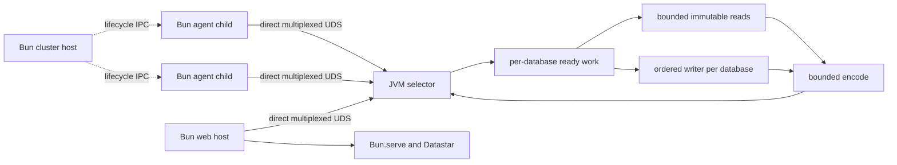

# Optimal integration seams — 2026-07-16

## Dependency ledger

- Seon `125997d617b6607cd9af7f8f1f9e47ebf639a252`.
- Datahike `d7ac886f333ed65b9205b5e3515897caafd4e33a`.
- Bun `be77b652884b16a103cfaa4af3c1102f72f2dcd3`.
- Konserve `df6818d43ea3363a808cd051c0d68917f1b987a9`.
- persistent-sorted-set `e1a17bbe767c7801e67407c81f64efabfd2f1601`.

## Decision

Use the narrowest owner that already has the information needed to make each
decision. The resulting system has five seams, not one universal runtime API:

1. Datahike owns immutable database values, indexes, query planning, exact
   duplicate computation, transactions, and final resource release.
2. The Seon JVM authority owns request admission, database fairness, bounded
   work classes, durable coordinates, cancellation, and ordinary result data.
3. One persistent native Unix-domain socket connects each Bun process directly
   to the authority. It carries database requests and completions only.
4. Bun's built-in child IPC carries low-rate lifecycle and control data between
   one cluster host and its agent children. It never brokers database traffic.
5. `Bun.serve` owns HTTP, static files, Datastar streams, compression policy,
   and browser backpressure at the final host boundary.

This topology shares expensive state without serializing unrelated work. One
physical Datahike connection shares its immutable index objects and
connection-scoped storage cache among all readers. Each database retains its
own ordered writer, while immutable reads from the same or different databases
run through fair bounded host capacity. Bun children execute JavaScript on
separate cores and query the authority directly.

## Why these are the closest safe seams

### Datahike operation seam

The maintained Datahike source already shares the real persistent index roots
and `CachedStorage` node cache through one physical connection and safely
published immutable database values. Query, pull, index, history, and temporal
operations should therefore execute inside the JVM against one captured value
and return ordinary namespaced data.

Do not expose `ISearch`, `IIndexAccess`, database records, datoms, or cache
objects over the wire. That would move planning and iteration into Bun, add
fine-grained round trips, and weaken Datahike's value lifetime without sharing
an additional expensive resource. It would also make a future authority
implementation imitate Datahike internals instead of implementing the stable
operation protocol.

Resolve a coordinate once for one request or `execute-many`, retain that exact
database value while its physical readers exist, and release it after the last
reader completes. Datahike's exact generation/commit cache identity and
single-flight mechanism remain the only completed-query and duplicate-work
owners.

### Completion seam

The authority entry point becomes callback-complete. The selector admits a
request and immediately returns to socket readiness. The executor reports each
physical completion through one runtime completion function; the writer owns
the request and converts that outcome to one canonical response. No socket,
per-job callback, Future, or Promise belongs in executor job data.

Datahike mutations can use the same shape without a parked virtual thread.
On CLJ, `d/transact!` returns Datahike's `throwable-promise`, which implements
core.async `ReadPort/take!`. The authority registers a nonblocking take and
keeps the mutation admission occupied until the actual transaction report or
failure arrives. This retains Datahike's public transaction path, secondary
index backfill scheduling, keyed listeners, batching, and commit ordering.
Calling the private writer dispatch directly is rejected because it bypasses
those semantics.

The decisive sources are
`reference-code/datahike/src/datahike/tools.cljc:91-124` for the returned
value's nonblocking `ReadPort`, and
`reference-code/datahike/src/datahike/writer.cljc:357-381` for the public
transaction completion order.

### Database transport seam

Use `Bun.connect` and one Java NIO selector over a four-byte big-endian length
plus Transit JSON payload. One process-local session multiplexes requests by
the existing request ID and returns responses in completion order. Exact frame
bytes, incomplete input bytes, admitted requests, and queued output bytes are
bounded independently. Query capacity is released before encoding or a slow
socket can retain it.

The selector owns channel readiness, parser positions, output offsets, and
close. It performs no Datahike work and no full-value Transit work. Bun's
`data` callback stays synchronous, advances a linear exact-size parser, and
does not start application work. Both sides retain the exact unwritten suffix
after a partial or zero write and resume only on readiness or `drain`.

### Bun child seam

Use `Bun.spawn`, not the Node child-process adapter. Built-in IPC provides
`onDisconnect` and `onExit` for normal lifecycle, and a `socket-fd` stdio mode
can create a caller-owned socketpair. These are useful control mechanisms but
are the wrong database data plane: the public IPC send operation exposes no
byte-budget/drain contract and the native implementation retains an internal
growable send queue. Routing database calls through the cluster host would
also recreate a measured broker hop and cluster-wide failure point.

Each agent child therefore owns its direct database session. The cluster host
uses Bun IPC only to start, stop, inspect, and report child lifecycle. A child
crash closes only its database session; sibling children and accepted durable
transactions continue.

Vendored Bun also provides opt-in `--no-orphans` / `noOrphans=true`. Linux uses
parent-death signaling and macOS watches the original parent through kqueue;
the setting propagates to nested Bun processes. Use this as parent-loss crash
containment after proving it on supported platforms, not as normal shutdown:
it deliberately sends `SIGKILL`, so durable request receipts remain the only
recovery truth for accepted mutations.

This behavior is grounded in
`reference-code/bun/src/io/ParentDeathWatchdog.rs:1-33,222-270` and
`reference-code/bun/src/runtime/cli/Arguments.rs:322-340`.

### Web seam

Use `Bun.serve` directly. Convert an incoming standard `Request` to ordinary
request data, keep routing/rendering as ClojureScript data transformations, and
construct one final `Response` at the host boundary. Direct readable streams
own Datastar connection backpressure, `Bun.file` owns static-file transfer, and
compression is a configurable response policy. The browser feed is not a
database transaction feed: one authority read can produce one shared render
event for only the interested browser sessions.

### Selective change seam

Use one authority consumer for Datahike's bounded committed-report source for
each connection generation. The commit path offers one durable report without
blocking the writer; the authority derives its changed attributes, compares
them with registered query/projection dependencies, and reruns only potentially
affected work. Delivery then targets only interested sessions. A source gap is
explicit and causes coordinate-based resynchronization.

Do not open one destructive report consumer per Bun connection and do not use
one synchronous Datahike listener per network client. The old listener-backed
publisher performs transport work after transactions and disappears with the
full transaction feed. Datahike's `query-attribute-dependencies` is a safe
conservative skip/rerun hint, not proof that a result changed.

## Parallel flow

The JVM is an authority host, not one execution gate. Database selection occurs
before shared worker acquisition. Ready work should retain each database once
and reappend it only while it still has queued work; retaining empty database
names makes selection cost grow with historical cluster churn.

## Interfaces to keep portable

Only protocol data crosses the authority boundary:

- operation, request ID, database name, attachment, and immutable coordinate;
- query/pull/index/history inputs and bounded resource options;
- transaction data, durable receipt, and committed coordinate;
- `execute-many` members and position-ordered results;
- cancel, lifecycle, capability, and health operations; and
- ordinary success/error values.

Bun-native sockets, Java channels, Datahike database values, callbacks, and
core.async values remain inside their process-local owners. A future Rust or
Bun database authority can implement the same operation and lifecycle
protocol without emulating JVM objects.

## Rejected seams

- **Bun parent as database broker:** adds a hop, parse/queue pressure, and one
  cluster failure point; built-in IPC lacks explicit byte backpressure.
- **Datahike indexes over the wire:** increases calls and leaks an unstable
  internal contract while sharing no more index state.
- **Chronicle Queue as primary IPC:** adds total-order log/cursor/retention
  semantics but not correlation, cancellation, fairness, or response
  backpressure. An immutable mmap result-body experiment remains optional only
  for measured 256 KiB–4 MiB one-to-many results.
- **Per-request sockets:** repeat connection, parser, timer, and kernel work and
  prevent useful multiplexing.
- **One replica per child or cluster host:** duplicates index/cache/storage
  working sets and restores transaction broadcast/replay machinery.
- **Blocking transaction adapters:** park one virtual thread for lifecycle that
  Datahike already exposes through nonblocking completion.
- **One global FIFO:** makes a busy database determine unrelated tail latency;
  virtual threads do not repair fairness or bound CPU/bytes.

## New risks and shortest falsifiers

1. **Ready-database churn:** admit and drain at least 10,000 distinct database
   names, then prove selection state is proportional only to currently queued
   databases and short-database latency does not grow with history.
2. **Nonblocking mutation completion:** block 1,000 accepted transaction
   completions within configured queue bounds and prove no matching thread
   growth, exact once completion, preserved ordering, and correct recovery after
   a lost client response.
3. **Session backpressure:** run 1/8/32 Bun processes with fragmented frames,
   partial writes, a stalled reader, reverse-order completions, and reconnect;
   prove bounded input/output bytes and sibling progress.
4. **Parent loss:** kill the cluster host under normal Bun lifecycle and
   `no-orphans` mode separately on Linux and macOS; prove descendants are
   reaped, the JVM survives, and durable mutations recover by request ID.
5. **Shared Datahike hot paths:** measure 1/2/4/8 workers over 1/2/4/8 databases
   for global query-cache CAS contention, same-database cold storage reads, and
   independent-database reads before adding any finer pool or cache.
6. **HTTP boundary:** compare native `Bun.serve` identity and configurable gzip
   against the removed Node adapter for Datastar latency, event-loop delay,
   allocation, queued bytes, disconnect cleanup, and browser correctness.

One older Datahike datom-search cache appears inactive because configuration
uses `:search-cache-size` while its reader asks for `:cache-size`. Do not repair
that spelling blindly. The old cache uses weaker hash identity, retains only
five database buckets, and overlaps the exact generation-scoped query cache.
Benchmark disabled, legacy-enabled, exact-identity, and query-cache-only modes
before deciding whether to modernize it or delete it.

## Implementation consequence

The callback-complete writer remains the active implementation boundary because
every native transport and capacity improvement depends on it. The executor now
keeps a returned core.async `ReadPort` physically active, and the maintained
mutation path now consumes `d/transact!` through that mechanism. The remaining
cut is:

1. migrate the writer to one active request map and one completion function;
2. replace execute-many's waiter loop with completion-driven member admission;
3. delete executor result promises, completed-job queues, blocking submit
   functions, and transport waiters; and
4. preserve the now-ready-only per-class database selection structure.

Then replace the request server and Bun client together with the persistent
selector session, migrate consumers to honest async database functions, delete
the replica/publisher/Node paths, and add Bun-native child and web owners.
