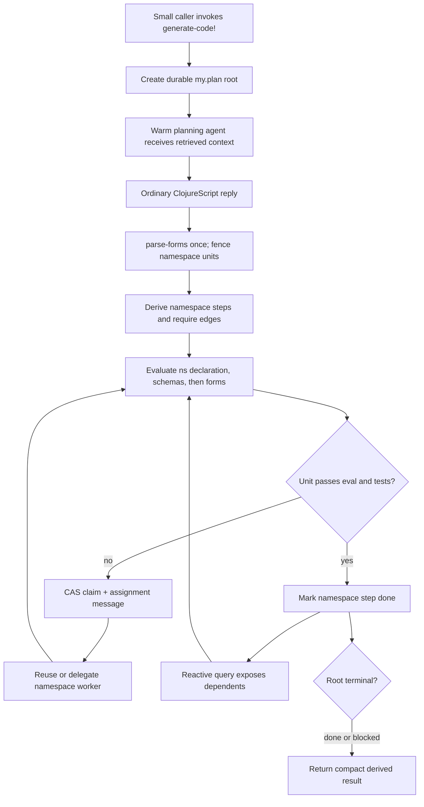

# Goal-driven code generation

## Outcome

`seon.ai/generate-code!` lets a small agent hand a difficult goal to a stronger
planning agent. The planning agent writes ordinary high-quality Clojure through
the existing REPL surface. Seon evaluates every mechanically recoverable schema
and namespace unit, derives namespace dependency order from `:require`, and
delegates failed units to reusable namespace-focused agents. The durable
`my.plan` graph allows recovery after interruption, while the caller receives a
compact database-derived change and verification result.

## Review status

This is a design proposal, not current behavior. The source audit, executable
probes, context measurements, and paid Kimi K3 results live in
[[research/design-seam-audit-2026-07-19]]. No production implementation begins
until the owner reviews the data model, namespace-symbol migration, evaluation
boundary, model routing, and staged proof plan.

## Settled design from the audit

- The public operation is `seon.ai/generate-code!`; it is explicit and
  side-effecting, never an automatic stage of every turn.
- The caller supplies existing `my.plan` concepts: goal, description, and
  falsifiable expectation.
- The planning model emits ordinary ClojureScript REPL input, not EDN plan data,
  JSON, Markdown, or a namespace manifest.
- The existing parser reads the reply once. One pure projection fences the
  parsed entries by actual namespace declaration.
- The namespace DAG derives from generated `(ns ... (:require ...))` forms.
- Schemas are ordinary `schema/register!` forms colocated with their owning
  namespace and evaluated before remaining forms in that namespace.
- Namespace leaves are ordinary `my.plan` steps. Only namespace ownership and
  a scalar claim token are new attributes.
- One database-reactive ready-frontier query schedules work. An atomic claim,
  not observation, grants ownership.
- Eval and behavioral-test evidence determines completion. Worker prose never
  does.
- The full original plan reply and durable steps remain available for recovery;
  the small caller receives a compact derived result.
- Kimi K3 is an explicit, high-latency planning option. It is not the default
  executor and never bypasses Seon's contracts or verification.

## Proposed interaction

The calling agent makes one small request:

```clojure
(await
  (seon.ai/generate-code!
    {:my.plan/goal "Add order validation."
     :my.plan/description
     "Reject invalid orders before inventory changes."
     :my.plan/expect
     "Behavioral tests prove invalid orders never reserve inventory."}))
```

The planning agent receives database-derived context and answers with ordinary
REPL input:

```clojure
; Define the shared order data before behavior.
(ns my.order.model
  (:require [seon.schema :as schema]))

(schema/register! ::id :string)
(schema/register! ::order
  [:map [::id ::id]])

(defn valid?
  "True when an order satisfies the registered order contract."
  {:malli/schema [:=> [:cat ::order] :boolean]}
  [order]
  true)

(ns my.order.service
  (:require [my.order.model :as model]
            [seon.schema :as schema]))

; Remaining schemas, functions, and behavioral deftests follow normally.
```

The planner does not separately name plan steps. The projection derives two
namespace leaves and makes `my.order.service` need `my.order.model`.

## Target flow



## Target data delta

After the namespace-symbol migration, extend the existing `my.plan/step` entity
with two optional attributes:

```clojure
(schema/register! :my.plan/namespace :seon.db/ref)
(schema/register! :my.plan/claim :string)
```

- `:my.plan/namespace` points to `[:seon.ns/name 'my.order.model]`.
- `:my.plan/claim` is the opaque preallocated assignment-message identity used
  by `:db.fn/cas`.
- `:my.plan/message` remains the assignment connection.
- `:seon.agent.run/cause` remains the connection from execution to that message.
- `:my.plan/needs` remains the only dependency representation.
- `:my.plan/status` remains the only work status.

Add `my.plan/blocked!` as the public transition for the already-supported
`:blocked` status. Do not add stored ready state, order numbers, worker state,
diffs, code blobs, or a generation entity.

## Target queries

The exact query forms should be finalized against the migrated schema, but the
relations are settled.

### Ready namespace frontier

Input: database value and generation root id. Output: a stable sorted vector of
step id and namespace symbol where:

- the step descends from the root;
- it has `:my.plan/namespace`;
- its status is `:open`;
- it has no `:my.plan/claim`; and
- no `:my.plan/needs` target is unfinished.

Use the existing `my.plan/rules` for descendant, unfinished, blocked, and ready
instead of copying their meaning into a second query rule set.

### Warm namespace worker

Input: namespace ref. Follow completed namespace steps to their
`:my.plan/message`, message recipients, and runs whose
`:seon.agent.run/cause` is that message. Prefer the newest successful recipient
whose derived agent state is idle. Absence delegates a new child. This is a
preference query, never ownership; the claim remains the fence.

### Root result

Input: generation root and one immutable database value. Derive:

- root and namespace-step statuses;
- changed namespace symbols;
- accepted and failed evals connected to the relevant worker runs/messages;
- behavioral-test outcomes; and
- unresolved blocked error handles.

Return the database value identity with the summary so later inspection reads
the same basis transaction.

## Planning context ladder

Use a stable-to-specific gradient:

1. complete production namespace name plus first docstring line, about 3,000
   estimated tokens in the current checkout;
2. exact `generate-code!`, schema, REPL, upsert, test, and deletion teaching;
3. 8–20 relevant compact namespace cards, initially about 4,400–11,000
   estimated tokens;
4. full source for the closest 1–3 owners and their `.internal` descendants;
   and
5. the caller's goal, description, and expectation nearest the response.

Deterministic retrieval is required. Optional embedding hits augment it only
when the one embedding feature is enabled and healthy. Measure recall before
adding namespace summaries to the existing embedding corpus.

## Model roles

Define model roles in the existing provider configuration rather than exposing
provider choices to calling agents:

- planning — strong model, large reasoning and context allowance, explicit
  `generate-code!` only;
- execution — low-latency small model for ordinary turns and mechanical repair;
- namespace repair — defaults to execution, overridable after evaluation shows
  a namespace class needs more capability; and
- summarization/embedding — existing specialized paths, not part of code
  generation scheduling.

The role config is data with a default plus an override. Provider-specific
options stay inside the adapter config. In particular, Kimi K3 always reasons,
currently accepts only maximal reasoning effort, and needs completion headroom:
the live 4,096-token probe returned no visible answer. K3 should have a
documented cost/timeout ceiling and should report an empty length-limited answer
as a normal error value.

## Implementation stages

### Stage 0 — approve contracts

Exit:

- owner approves the two-attribute plan delta;
- owner approves one coordinated namespace-symbol migration;
- owner approves schema-first per-unit evaluation;
- owner approves completion by observed eval/test evidence; and
- owner approves K3 as opt-in planning rather than the default executor.

### Stage 1 — namespace symbol foundation

Change `:seon.ns/name` and `:seon.ns.require/target` from keyword values to
symbols through the one indexing, config, render, eval, query, and test path.
Rebuild a disposable database; prove idempotent boot indexing and namespace
lookup. Do not support mixed representations.

Exit:

- source and runtime eval write identical symbol namespace values;
- requirement edges point to symbol namespace identities;
- config selection and context rendering consume symbols directly;
- a second index pass writes no changes; and
- the complete affected CLJS gate plus a fresh live cluster pass.

### Stage 2 — pure generation projection

Add one pure function beside the existing REPL parser that groups
`parse-forms` entries into namespace units, classifies actual aliased
`schema/register!` calls, and derives generated require edges.

Exit:

- multiline `#code`, comments, and spans survive;
- two valid namespaces become two units;
- a malformed first namespace cannot capture later forms;
- forms before a namespace remain explicit and unassigned;
- duplicate namespace declarations reconcile deterministically; and
- generated cycles return a structural error before evaluation.

### Stage 3 — schema-first evaluator composition

Compose the existing per-form evaluator over a namespace unit: declaration,
schemas, remaining forms, affected tests. Do not add another compiler state or
program recorder.

Exit:

- local `::schema` keys resolve correctly;
- valid forms on either side of a malformed form are retained;
- dependencies wait for a complete upstream gate;
- explicit `ns-unmap` deletes a function/test and omission does not; and
- all accepted forms appear once in the canonical program facts.

### Stage 4 — durable root and namespace steps

Extend `my.plan` with namespace and claim, add `blocked!`, and idempotently
reconcile the generated namespace DAG beneath one root.

Exit:

- repeated projection creates no duplicate step or edge;
- a changed planner reply revises open namespace leaves without losing done
  evidence;
- namespace steps point to real namespace entities; and
- blocked/reopen transitions preserve evidence and clear claims correctly.

### Stage 5 — reactive scheduler and atomic assignment

Register one root-frontier computation. Compose identity allocation, claim CAS,
assignment message, and step-message link in one writer transaction. Ensure the
worker only after commit.

Exit:

- two simultaneous callbacks produce one assignment;
- unchanged frontiers produce no callback;
- bursts converge on the newest database value;
- a restart after commit but before delegate ensures the same worker work;
- completion exposes the next namespace without polling; and
- releasing a terminal root removes the observer.

### Stage 6 — warm namespace repair

Build database-derived worker selection and the namespace-specific context
contract. Workers use the ordinary REPL and affected-test surface.

Exit:

- green first-pass units launch no worker;
- a failed unit receives exact original plan, accepted prefix, errors, target
  source, `.internal` source, neighbor contracts, and sibling status;
- a later request reuses an idle successful namespace worker;
- current database context overrides stale transcript assumptions; and
- impossible work blocks the step and wakes only its owner.

### Stage 7 — public function and model routing

Add `seon.ai/generate-code!` over the approved root, planner, projection,
scheduler, and result query. Add planning/execution role selection to the one
provider config mechanism.

Exit:

- a small calling model can correctly frame the three-field request;
- its transcript receives one compact result rather than the full planner
  context;
- provider failures, empty K3 output, deadlines, and budget exhaustion are
  error values;
- the default execution provider remains unchanged; and
- K3 is invoked only when the planning role explicitly selects it.

### Stage 8 — MVP live graduation

Run one two-namespace goal with a deliberate first-pass defect through a fresh
isolated cluster and a small calling model.

Exit:

- schemas and the valid namespace are accepted immediately;
- one warm repair worker fixes only the failed namespace;
- the dependent namespace starts only after the prerequisite passes;
- behavioral acceptance passes;
- coordinator restart recovery creates no duplicate message, run, or program
  fact;
- the caller receives an accurate compact result; and
- token, latency, provider cost, turns, retries, and context layers are recorded.

## Deferred until after MVP

- automatic planner selection on ordinary turns;
- deletion of registered schemas;
- semantic rewriting of cyclic namespaces;
- a second embedding corpus for namespace summaries;
- dynamic per-namespace model escalation;
- cross-root global concurrency policy beyond the current agent/run bounds; and
- accepting planner-generated filesystem patches instead of ordinary REPL code.

## Approval questions

1. Approve the namespace-symbol migration as Stage 1, knowing it requires a
   coordinated database rebuild rather than a rolling schema edit?
2. Approve the minimal `:my.plan/namespace`, `:my.plan/claim`, and
   `my.plan/blocked!` delta, with worker identity and results remaining derived?
3. Approve schema-first as declaration → registrations → remaining forms inside
   each dependency-ready namespace, not one global schema pass?
4. Approve Kimi K3 only as an explicit planning-role option until the MVP model
   battery justifies broader use?
