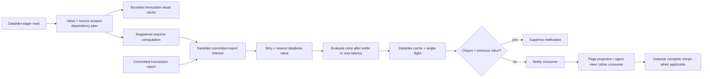

# Datahike reactive reads

## Outcome

Datahike is Seon's reactive computation authority. An eager read returns its
value and a Datahike-owned dependency plan derived from the parsed operation,
its inputs, and its database sources. Cached results remain immutable at exact
database values and are created only on demand. A registered reactive read
becomes dirty after a matching committed transaction, converges at bounded
latency on the newest database value, and notifies its consumer only when
Clojure value equality says the result changed. Page rendering and Datastar
delivery consume this protocol; they do not define it.

## Current state

The cache, transaction feed, and web subscription lifecycle provide strong
parts of the target:

- one JVM database authority owns committed reports and attribute-indexed
  interests;
- one Bun session multiplexes database-value-pinned reads and demanded
  normalized reactive registrations;
- equivalent sockets share a normalized subscription, render, and serialized
  event;
- reactive commits settle using ordinary, structural, and maximum-latency
  values resolved from database configuration, with manifest environment
  overrides;
- each subscription owns one active render plus the newest pending value;
- independent subscriptions and page reads already overlap through bounded
  async boundaries;
- identical query misses join Datahike single-flight and exact query results
  inherit across safe immutable database values; and
- complete Datastar snapshots use stable-ID outer morphs and latest-wins
  backpressure.

Current page invalidation is implemented but not yet proven sound live end to
end. The execution child
captures the Datahike-owned read evidence from successful query, pull,
pull-many, entity, schema, index, and mixed `execute-many` operations in one
fiber-local scope and returns it on the ordinary invocation result. The writer
can interpret and union that source-positioned evidence directly when
installing a committed-report interest. Datastar now consumes that evidence;
analyzer-derived `:seon.fn/read-attrs` is no longer an invalidation authority.

`seon.reactive` now implements the general registered-read lifecycle. Each
registration owns one Datahike writer interest, one active computation, and at
most one newest pending database value. Independent registrations start
without awaiting one another; configured settle and maximum latency bound
progress; plan replacement uses the listener acknowledgement database value
to close the evaluation race; Clojure `=` suppresses established-consumer
notifications; a fresh consumer receives the current value; and the final
consumer releases its timer, value, database reachability, and writer
interest. Sustained live/import proof remains the next ordered boundary.

Datastar now delegates live page demand to `seon.reactive`. The page computation
captures parent-process reads, unions execution-child evidence from the ordinary
result message, serializes one complete morph event, and compares that event as
the reactive value. The former Datastar attribute declarations, synthetic
dependency plan, global listener, coalescer, active/pending render queue, and
serialized-event cache are removed. Each socket remains an independent
latest-wins transport consumer keyed by its feed ID; equivalent sockets share
the normalized reactive computation and a fresh socket receives its established
value. Historical feeds still render once without installing an interest.

Live root-feed probes exposed and fixed two lifecycle defects: the live
observer sent an
invalid explicit nil database value, and the pre-registry socket descriptor
lacked the normalized registration key needed by final-consumer release. The
source-frozen rebuild at commit `b6961bac` then kept the actual Bun workload
alive and port 7890 bound across a three-second server-side root feed. External
readiness remained HTTP 200 after close; the final reactive registration,
consumer, active, pending, timer, Datastar view, and subscription counts were
all zero. The feed sent 31,722 bytes. Its cold render took 1,568.3 ms and the
later render took 39.6 ms; those diagnostic samples establish lifecycle truth,
not final latency graduation.

Bounded diagnostics now expose cumulative evaluation starts/completions,
delivered and equality-suppressed notifications, newest-pending replacements,
active/pending high-water marks, and only the numeric last completed/installed
basis transactions. They retain no event history, database values, results,
functions, or sockets. The reactive gate drives 100 newer transactions while
one computation is blocked and proves active/pending high-water marks of one,
99 obsolete pending replacements, and next computation only at the newest
basis transaction. That blocked-burst characterization remains part of the
focused gate.

The gate now also exercises the real timer rather than only the `due-at`
arithmetic. With a 1,000 ms moving settle edge and 20 ms maximum latency, a
120 ms continuous event stream completes repeatedly before the producer stops,
collapses obsolete database values, converges to the newest basis transaction,
and releases its registration. The focused reactive gate passes 7 tests and 42
assertions. Its repair regression begins with a visible failed value and
conservative `:all` interest, then proves a later transaction reruns the
computation, delivers the repaired value, replaces `:all` with exact read
evidence, converges at the repair basis transaction, and releases the
registration.

A disposable live `reactive-latency` cluster then resolved its policy from
database configuration seeded through environment overrides: 1,000 ms ordinary
and structural settle, 500 ms maximum latency. With a real root SSE feed open,
100 separately committed transactions ran for 7.3 seconds. Fourteen page
evaluations advanced at approximately the configured 500 ms deadline while the
producer remained active, 88 obsolete pending database values were replaced,
active and pending high-water marks stayed at one, and the final completed basis
transaction exactly equaled the newest committed `t`. After the feed closed,
reactive registration, consumer, active, pending, and timer counts; Datastar
view, subscription, active-render, and pending-render counts; and writer
interest references and committed-report queue depth all returned to zero.
This closes sustained-import, configured maximum-latency, newest convergence,
and pressure cleanup.

At source commit `9ab86700`, a disposable cluster rebuilt from the current
artifact and a real headless Google Chrome page opened the root view. A
supported `POST /agents` committed a child whose unique purpose marker then
appeared through the existing Datastar feed. The morph preserved the identical
`#app-view` DOM node, retained focus and the typed value in the namespace input
outside the morph, left exactly one `#app-view`, and produced no browser console
or page errors. A full reload opened a fresh feed and painted the newest marker
without an intermediate stale view. This closes current-source browser morph
and sole-connection reconnect correctness. Real slow-socket/fast-socket
independence and the live failed-render repair remain graduation gates.

The integrated Datastar/reactive gate now attaches two equivalent sockets to
one normalized computation. An equal later event performs one demanded render
and serialization but increments equality suppression and performs zero socket
writes; a changed event computes once and reaches both sockets byte-identically;
a fresh third socket receives the established event without recomputation; and
final release returns reactive registration/consumer counts to zero. The
focused Datastar gate passes 14 tests and 67 assertions. Datastar reload and
pod shutdown now use the same awaited close path: every socket closure releases
its exact reactive consumer before reload completes, so a surviving registration
cannot retain an obsolete renderer closure. The lifecycle regression raises the
focused Datastar gate to 15 tests and 72 assertions; the focused web-server gate
passes 24 tests and 93 assertions.

At the combined reactive/cache boundary, the complete Seon CLJS gate passes
1,203 tests and 5,379 assertions, and the complete JVM writer gate passes 227
tests and 1,849 assertions. The writer aggregation exposed two stale fixtures
that still redefined `datahike.api/pull`; both now exercise the maintained
`pull-with-evidence` result and dependency-plan shape.

Maintained Datahike revision `107bc8f6` passes the focused weighted-LRU and
query-cache suites in all persistent-set, spec-instrumented, and
hitchhiker-tree profiles: 162 tests and 990 assertions. This directly covers
count/weight eviction, overlarge-result rejection, exact immutable database
identities, safe inheritance, schema widening, generation close, stale-owner
fencing, cancellation, and single-flight ownership/waiter cleanup. The CLJS
gate passes 138 tests and 951 assertions.

Cache inheritance is demand-driven. A commit updates only attribute revision
facts and a conservative revision in its cache context; it never walks or
copies cached result rows. A later demanded read scans the bounded weighted
cache, accepts an older entry only when its source-scoped dependency plan is
unchanged since that entry's commit, and promotes the value under the exact
demanded database identity. A 100-transaction unrelated-write regression keeps
the cache at one row and constant retained weight, records one revised
attribute rather than one fact per transaction, and creates only the single
demanded child snapshot. An affected transaction misses and recomputes while a
held parent database value remains immutable and exact.

Datahike `main` now exposes an execution-aware, source-scoped query dependency
plan at maintained revision `107bc8f6`. It folds the typed parsed query and
PullSpec representations, resolves scalar `:in` bindings and supplied rules,
canonicalizes reverse pull attributes, and widens unknown behavior to `:all`.
The query cache stores and reuses that same plan; propagation selects only the
attributes for the database source that advanced, and schema transactions do
not inherit cached results. The former flat attribute helper remains only as a
projection of this plan for compatibility.

This closes the characterized query and pull false negatives, including nested
and reverse pulls, `missing?`, input-bound attributes, supplied rules, multiple
database sources, direct pull, and pull-many. Query, pull, pull-many, schema,
entity, and index protocol responses now carry ordinary dependency evidence;
unknown full-entity/schema/index behavior widens to `:all`. Query results retain
the maintained immutable weighted cache and single-flight owner. Direct pull
reuse has not been generalized without measurement. A sole socket reconnect
also normally rerenders because the last event is released with the final
subscription consumer; current HTML reuse applies to equivalent active
sockets, not a general reconnect cache.

The exact source audit, dependency ledger, parser probes, Datastar protocol
review, concurrency analysis, and proof matrix are in
[[research/datahike-reactive-page-protocol-2026-07-19]].

The formerly failing named aggregation surfaces are now green in both
persistent-set and hitchhiker-tree profiles: Stratum valid-time, Java bindings,
documentation transactions, HTTP transit/EDN/JSON, purge, secondary-index purge
propagation, and the planner probes. The 14-test named integration gate passes
196 assertions. The rerun exposed one reactive correctness defect: purge changed
current and temporal indexes without including those attribute retractions in
the committed transaction report, so lazy cache inheritance could return a
purged entity. Revision `107bc8f6` records purge retractions in `:tx-data`,
repairs finite-window Stratum predecessor inheritance, and closes the Java/HTTP
test connection leaks. The complete unfiltered maintained aggregation remains
the final Datahike proof and is tracked in
[[datahike-full-aggregation-integration-drift]].

## Settled decisions

1. **Datahike owns read semantics.** Seon never parses Datalog, pull selectors,
   entity references, index ranges, rules, predicates, or transaction datoms.
2. **One source-scoped dependency plan.** A plan is `:all` or canonical stored
   attributes associated with each parsed database source. Datahike derives it
   from its typed representation plus actual inputs. Dynamic behavior that
   cannot be proved widens to `:all`; the single-database Seon path consumes
   the natural one-source projection.
3. **Reads return value plus evidence.** Evidence is referentially transparent
   ordinary data and crosses the existing response protocol.
4. **Composition is union.** A computation unions evidence from reads that
   actually ran; `:all` absorbs. There is no semantic parser in Bun.
5. **One plan, three consumers.** Datahike result inheritance, committed-report
   interests, and reactive-read invalidation share one interpretation.
6. **Cache entries are immutable and lazy.** A cache entry belongs to the exact
   immutable database source identities in its key. A transaction does not
   update cached rows. A demanded later read may inherit a proven-unaffected
   result or compute a new entry. Bounded weighted retention drops entries no
   active owner or recent demand justifies.
7. **Only registered reactive reads recompute.** Ordinary cached reads can
   become irrelevant without scheduling work. A registered consumer owns one
   active evaluation and at most one newest pending database value.
8. **Clojure equality is notification authority.** `=` decides whether an
   established consumer receives a new value. Identity and persistent
   structural sharing may short-circuit it; cached hashes may accelerate it
   but never decide it. A new consumer always receives its first current value.
9. **Transaction truth is never dropped; obsolete computation work is.** A
   burst accumulates the union of changed attributes and advances to its newest
   `db-after`. Once a subscription is dirty it owns at most one active render
   and one newest pending database value. Completing a render reconciles its
   newly observed dependency plan from that render's basis transaction through
   the current branch head before declaring the subscription clean. This
   closes the race where a render discovers a dependency after a matching
   transaction has already committed.
10. **Bounded progress is configuration.** Sustained writes may produce
    periodic newest-value progress after
    `:seon.config/reactive-max-latency-ms`. The selected manifest owns the
    value, `SEON_REACTIVE_MAX_LATENCY_MS` is its launch-time override, and the
    resolved value becomes database configuration. There is no scheduler
    literal.
11. **Parallelism follows the dataflow.** Every dependency-ready read or render
    proceeds independently; data-dependent branches and one-subscription
    publication remain ordered.

## Target protocol

## Ordered implementation

### 1. Freeze the defects as failing characterization tests

Before implementation, add tests at the maintained Datahike boundary for the
known false negatives and conservative fallbacks:

- `missing?`, `get-else`, `get-some`, predicates, functions, rules supplied at
  `%`, recursive rules, attribute variables bound through `:in`, and multiple
  database sources;
- nested pulls, reverse references using their canonical forward attribute,
  recursion, wildcard, alias, default, limit, dynamic patterns, direct pull,
  and pull-many;
- schema-changing transactions, retractions, and inserts across cache
  inheritance;
- exact database-value keys, bounded weighted eviction, generation close,
  single-flight, and cancellation; and
- reactive burst collapse, maximum-latency progress, plan-replacement replay,
  first delivery, equal-result suppression, and consumer release.

Keep upstream Datahike conformance tests unchanged. Seon integration tests prove
only the protocol boundary and consumer behavior; they do not duplicate the
dependency's query semantics.

The fork's full JVM aggregation is the dependency conformance gate. Its CLJS
Node runner is intentionally smaller, and `bin/test-writer` runs Seon tests
rather than the fork's entire suite. Graduation records all three separately so
a green Seon gate cannot conceal a missing Datahike regression.

Current evidence for maintained Datahike `main` revision `2e6c7bcf`:

- focused JVM query and specification gate: 96 tests, 531 assertions, zero
  failures;
- full Datahike CLJS Node gate: 138 tests, 951 assertions, zero failures;
- Seon writer protocol and committed-interest gate: 25 tests, 128 assertions,
  zero failures; and
- Seon remote database plus execution-child capture gates: 51 tests, 225
  assertions, zero failures;
- general reactive lifecycle gate: 5 tests, 22 assertions, zero failures; and
- writer branch-relative evidence gate: 11 tests, 67 assertions, zero
  failures.

Exit: each known stale-result case fails for the intended reason before its
implementation changes, while the imported upstream suite still establishes
the ordinary Datahike contract.

### 2. Settle Datahike dependency semantics

Strengthen the maintained fork in place:

- fold the typed parsed query representation rather than maintaining a second
  raw-clause grammar;
- define explicit dependency semantics for Datahike database functions such as
  `missing?`, `get-else`, and `get-some`;
- recursively fold parsed PullSpec values using canonical option `:attr` fields;
- include every nested subpattern; a wildcard at any depth widens to `:all`;
- expose the same pull projection for query find-pull, direct pull, and
  pull-many;
- make schema-affecting transactions conservatively prevent cache inheritance;
  and
- add generated soundness tests comparing dependency selection with actual
  result changes.

Exit: every supported query/pull produces a sound concrete plan or `:all`, and
query cache inheritance has no nested/reverse-pull, database-function, rule,
variable-attribute, wildcard, or schema false negative.

### 3. Return evidence for eager reads

Expose one Datahike-owned read-evidence contract through the existing database
protocol:

- query returns its existing cache/dependency evidence;
- pull and pull-many return the recursive PullSpec dependency plan;
- entity access that can read arbitrary later attributes and schema reads
  return `:all`; an eager requested attribute set may remain concrete;
- exact safe attribute index prefixes may return their canonical attribute;
- unknown, malformed, temporal, or incomplete reads return `:all`; and
- execute-many preserves each member's evidence and positional result.

Do not create a server-side render session. Evidence belongs to each immutable
read result and requires no lifecycle cleanup.

Exit: one mixed execute-many response proves query, pull, pull-many, schema, and
index evidence at one database value, with cancellation/release leaving no
retained capture state.

### 4. Add the general reactive-read owner

Register an ordinary read function, its arguments/database sources, its last
delivered value, and its dependency plan. The owner:

- consumes the writer's existing committed transaction reports and reverse
  attribute interest index;
- marks a matching registration dirty without computing a result;
- advances one pending target to the newest database value while unioning
  changed attributes;
- evaluates at settle time or the configured maximum latency;
- uses Datahike cache inheritance and single-flight during that demanded read;
- compares the completed Clojure value with the last delivered value using
  `=` and suppresses an equal notification;
- delivers the current value unconditionally to a newly attached consumer;
- reconciles a new dependency plan from the evaluation's basis transaction to
  the current branch head before becoming clean; and
- releases registrations, retained results, and database-value reachability
  when the final consumer detaches.

Do not update cache entries during writes and do not enqueue one evaluation per
transaction.

Exit: a sustained import has bounded state, periodic configured progress, and
one final newest-value result; an unused cached read performs no work.

### 5. Make page rendering one reactive computation

Use the existing async-local accumulator around every parent page computation.
Every successful `seon.db` read unions the Datahike response plan. Nested and
concurrent operations compose safely; failed or incomplete operations widen the
render to `:all`.

Return the execution-child evidence on its ordinary result message and union it
with parent-process evidence after the completed page projection is serialized.
The normalized `seon.reactive` registration owns the computation and immutable
database value. Keep `:seon.fn/read-attrs` for discovery/focus hints, but delete
it from the correctness gate.

Exit: helper-indirected and conditional reads update an already-open page;
renderer source/configuration changes cannot be skipped; a branch change
atomically replaces the subscription's dependency union.

### 6. Send the dependency plan directly to Datahike interests

Send captured evidence directly through the existing listen request and delete
Datastar's synthetic dependency query. The writer retains one reverse scope /
attribute index and exact match filter. Bun retains no dependency parser or
page-wide interest union: each demanded normalized reactive computation owns
one writer interest.

Subscribe before initial read and use the acknowledgement database value so
interest replacement has no commit gap. The general owner serializes replacement
for one registration and schedules a newest-value evaluation when the accepted
branch head advanced during replacement.

Exit: unrelated commits produce no Bun event or page work; every relevant
commit is covered by the acknowledgement value or a later report.

### 7. Close failure and scheduling correctness

- A failed, canceled, timed-out, or malformed render installs `:all` rather
  than retaining stale narrow dependencies.
- One subscription retains one active render and only its newest pending value.
- Import pressure does not create one queued render per transaction: changed
  attributes are unioned, the pending target advances to the newest database
  value, and the maximum coalescing deadline still permits periodic progress
  during a sustained stream.
- Listener-plan replacement replays or checks commits from the completed
  render's basis transaction through the branch head; a transaction cannot be
  lost merely because the dependency was discovered during that render.
- Different subscriptions begin without awaiting one another.
- Independent page members continue through execute-many; selected functions
  continue through `Promise.all`; dependent reads remain ordered.
- Equivalent sockets receive one render's byte-identical event and maintain
  independent latest-wins pressure.

Exit: an error page repairs on a transaction outside its prior dependency set;
one slow page/socket does not block independent work; stale completions cannot
publish.

### 8. Measure before extending reuse or patch granularity

Profile the integrated protocol with current and grown databases. Record:

- writer interest candidates and delivered reports;
- query/pull operation time and cache/single-flight outcomes;
- execution-child queue wait and surface body time;
- page Hiccup/serialization time;
- event bytes, gzip/drain time, and socket fanout;
- browser parse/morph time; and
- final-consumer cleanup.

Only measured bottlenecks may admit these follow-ons:

- generalize Datahike's existing weighted query cache/single-flight owner to
  direct pull and other eager referentially transparent reads;
- correct cache propagation's survivor walk before adding a reverse cache
  dependency index;
- retain serialized output briefly with zero consumers;
- cancel superseded page work rather than merely fencing its completion;
- isolate pure page projection from a long same-agent turn; or
- split a page into independently addressable Datastar elements.

None is required for correctness.

## Acceptance matrix

| Boundary | Required proof |
|---|---|
| Parsed query | literal/source/boolean/join/predicate/database-function/rule/variable-attribute/multi-source forms are concrete or `:all`, never false-negative |
| Parsed pull | nested/reverse/alias/default/limit/recursion/wildcard/dynamic/malformed selectors use canonical attrs or `:all` |
| Cache inheritance | affected results do not propagate; unaffected query results hit at the child value; schema changes widen |
| Cache demand | undemanded commits create no result entry; bounded eviction permits an old held database value to recompute after a miss |
| Remote reads | query, pull, pull-many, schema, entity, and index responses carry sound ordinary evidence |
| Page capture | actual conditional/helper-indirected reads replace declared metadata as authority |
| Interest lifecycle | subscribe-before-read, acknowledgement fence, replacement, reconnect, resynchronization, unlisten |
| Unrelated commit | zero page acquisition, selected renderer, serialization, and SSE work |
| Affected commit | one normalized page rerender at exact `db-after`; cache evidence is truthful |
| Error recovery | failed render widens and later repair transaction rerenders it |
| Output | equal bytes require one comparison serialization but emit nothing; unequal complete event reaches every equivalent socket |
| Scheduling | independent reads/subscriptions/agents/sockets progress independently; one subscription stays coherent |
| Sustained import | bounded active/pending state, configured maximum-latency progress, no entry per row/transaction, final newest-value convergence |
| Equality | `=` suppresses established-consumer notification while advancing basis/dependencies; a fresh consumer receives once |
| Cleanup | final consumer releases subscription/output/dependency state; no database value or read-capture session remains |
| Live UI | browser and server-side stream agree after initial paint, mutation, reconnect, continuous writes, and pressure |

## Explicit non-goals

- A Seon query/pull parser or dependency taxonomy.
- Declared source keywords as invalidation authority.
- A second query, pull, HTML, listener, or event cache.
- Local replay of captured database reads.
- Per-surface render units before profiling.
- Browser transaction replay or delta patches.
- Database values, entities, functions, sockets, or Promises in cache data.
- Parallel execution of genuinely dependent branches.

## Graduation

This PRD graduates when Datahike produces and interprets one sound dependency
plan for every page read; actual page reads drive the one selective interest;
query/read reuse and independent scheduling are proven; unrelated transactions
do zero page work; affected and repair transactions converge through one full
Datastar morph; equivalent sockets share work; and live/browser/resource proof
shows no stale page, false-negative cache inheritance, unbounded queue, or
retained database owner.
