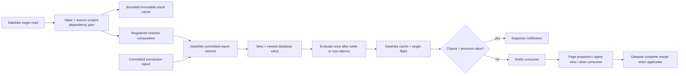

# Datahike reactive reads

## Outcome

Datahike is Seon's reactive computation authority. An eager read returns its
value and a Datahike-owned dependency plan derived from the parsed operation,
its inputs, and its database sources. Cached results remain immutable at exact
database values and are created only on demand. A registered reactive read
becomes dirty after a matching committed transaction, converges at bounded
latency on the newest database value, and notifies its consumer only when
Clojure value equality says the result changed. Page rendering and Datastar
delivery consume this protocol; they do not define it.

## Current state

The cache, transaction feed, and web subscription lifecycle provide strong
parts of the target:

- one JVM database authority owns committed reports and attribute-indexed
  interests;
- one Bun session multiplexes coordinate-pinned reads and one live page
  interest;
- equivalent sockets share a normalized subscription, render, and serialized
  event;
- web commits currently coalesce for hard-coded 16–500 ms intervals;
- each subscription owns one active render plus the newest pending value;
- independent subscriptions and page reads already overlap through bounded
  async boundaries;
- identical query misses join Datahike single-flight and exact query results
  inherit across safe immutable database values; and
- complete Datastar snapshots use stable-ID outer morphs and latest-wins
  backpressure.

The dependency contract is not sound. Current page dependencies are fixed
attributes plus analyzer-derived `:seon.fn/read-attrs`; helper-indirected reads
are invisible. The architecture says those declarations cannot veto actual
reads, but the removed runtime-observation engine is no longer in current
source. Renderer source changes can also be filtered when their declared read
set is unchanged.

Datahike's current query dependency helper is itself incomplete. It hand-walks
raw normalized `:where` forms rather than the typed parsed query, omits nested
pull attributes, records reverse pull display keys instead of stored datom
attributes, and misses database predicates such as `missing?`. Because the
query cache and selective listener both consume this result, the defect can
preserve stale cached query results as well as stale pages.

Direct pull, pull-many, schema, and index reads return no dependency evidence
and do not share the query result cache. A page rerun is therefore not
uniformly cheap. A sole socket reconnect also normally rerenders because the
last event is released with the final subscription consumer; current HTML reuse
applies to equivalent active sockets, not a general reconnect cache.

The exact source audit, dependency ledger, parser probes, Datastar protocol
review, concurrency analysis, and proof matrix are in
[[research/datahike-reactive-page-protocol-2026-07-19]].

## Settled decisions

1. **Datahike owns read semantics.** Seon never parses Datalog, pull selectors,
   entity references, index ranges, rules, predicates, or transaction datoms.
2. **One source-scoped dependency plan.** A plan is `:all` or canonical stored
   attributes associated with each parsed database source. Datahike derives it
   from its typed representation plus actual inputs. Dynamic behavior that
   cannot be proved widens to `:all`; the single-database Seon path consumes
   the natural one-source projection.
3. **Reads return value plus evidence.** Evidence is referentially transparent
   ordinary data and crosses the existing response protocol.
4. **Composition is union.** A computation unions evidence from reads that
   actually ran; `:all` absorbs. There is no semantic parser in Bun.
5. **One plan, three consumers.** Datahike result inheritance, committed-report
   interests, and reactive-read invalidation share one interpretation.
6. **Cache entries are immutable and lazy.** A cache entry belongs to the exact
   immutable database source identities in its key. A transaction does not
   update cached rows. A demanded later read may inherit a proven-unaffected
   result or compute a new entry. Bounded weighted retention drops entries no
   active owner or recent demand justifies.
7. **Only registered reactive reads recompute.** Ordinary cached reads can
   become irrelevant without scheduling work. A registered consumer owns one
   active evaluation and at most one newest pending database value.
8. **Clojure equality is notification authority.** `=` decides whether an
   established consumer receives a new value. Identity and persistent
   structural sharing may short-circuit it; cached hashes may accelerate it
   but never decide it. A new consumer always receives its first current value.
9. **Transaction truth is never dropped; obsolete computation work is.** A
   burst accumulates the union of changed attributes and advances to its newest
   `db-after`. Once a subscription is dirty it owns at most one active render
   and one newest pending database value. Completing a render reconciles its
   newly observed dependency plan from that render's basis transaction through
   the current branch head before declaring the subscription clean. This
   closes the race where a render discovers a dependency after a matching
   transaction has already committed.
10. **Bounded progress is configuration.** Sustained writes may produce
    periodic newest-value progress after
    `:seon.config/reactive-max-latency-ms`. The selected manifest owns the
    value, `SEON_REACTIVE_MAX_LATENCY_MS` is its launch-time override, and the
    resolved value becomes database configuration. There is no scheduler
    literal.
11. **Parallelism follows the dataflow.** Every dependency-ready read or render
    proceeds independently; data-dependent branches and one-subscription
    publication remain ordered.

## Target protocol

## Ordered implementation

### 1. Freeze the defects as failing characterization tests

Before implementation, add tests at the maintained Datahike boundary for the
known false negatives and conservative fallbacks:

- `missing?`, `get-else`, `get-some`, predicates, functions, rules supplied at
  `%`, recursive rules, attribute variables bound through `:in`, and multiple
  database sources;
- nested pulls, reverse references using their canonical forward attribute,
  recursion, wildcard, alias, default, limit, dynamic patterns, direct pull,
  and pull-many;
- schema-changing transactions, retractions, and inserts across cache
  inheritance;
- exact database-value keys, bounded weighted eviction, generation close,
  single-flight, and cancellation; and
- reactive burst collapse, maximum-latency progress, plan-replacement replay,
  first delivery, equal-result suppression, and consumer release.

Keep upstream Datahike conformance tests unchanged. Seon integration tests prove
only the protocol boundary and consumer behavior; they do not duplicate the
dependency's query semantics.

The fork's full JVM aggregation is the dependency conformance gate. Its CLJS
Node runner is intentionally smaller, and `bin/test-writer` runs Seon tests
rather than the fork's entire suite. Graduation records all three separately so
a green Seon gate cannot conceal a missing Datahike regression.

Exit: each known stale-result case fails for the intended reason before its
implementation changes, while the imported upstream suite still establishes
the ordinary Datahike contract.

### 2. Settle Datahike dependency semantics

Strengthen the maintained fork in place:

- fold the typed parsed query representation rather than maintaining a second
  raw-clause grammar;
- define explicit dependency semantics for Datahike database functions such as
  `missing?`, `get-else`, and `get-some`;
- recursively fold parsed PullSpec values using canonical option `:attr` fields;
- include every nested subpattern; a wildcard at any depth widens to `:all`;
- expose the same pull projection for query find-pull, direct pull, and
  pull-many;
- make schema-affecting transactions conservatively prevent cache inheritance;
  and
- add generated soundness tests comparing dependency selection with actual
  result changes.

Exit: every supported query/pull produces a sound concrete plan or `:all`, and
query cache inheritance has no nested/reverse-pull, database-function, rule,
variable-attribute, wildcard, or schema false negative.

### 3. Return evidence for eager reads

Expose one Datahike-owned read-evidence contract through the existing database
protocol:

- query returns its existing cache/dependency evidence;
- pull and pull-many return the recursive PullSpec dependency plan;
- entity access that can read arbitrary later attributes and schema reads
  return `:all`; an eager requested attribute set may remain concrete;
- exact safe attribute index prefixes may return their canonical attribute;
- unknown, malformed, temporal, or incomplete reads return `:all`; and
- execute-many preserves each member's evidence and positional result.

Do not create a server-side render session. Evidence belongs to each immutable
read result and requires no lifecycle cleanup.

Exit: one mixed execute-many response proves query, pull, pull-many, schema, and
index evidence at one database value, with cancellation/release leaving no
retained capture state.

### 4. Add the general reactive-read owner

Register an ordinary read function, its arguments/database sources, its last
delivered value, and its dependency plan. The owner:

- consumes the writer's existing committed transaction reports and reverse
  attribute interest index;
- marks a matching registration dirty without computing a result;
- advances one pending target to the newest database value while unioning
  changed attributes;
- evaluates at settle time or the configured maximum latency;
- uses Datahike cache inheritance and single-flight during that demanded read;
- compares the completed Clojure value with the last delivered value using
  `=` and suppresses an equal notification;
- delivers the current value unconditionally to a newly attached consumer;
- reconciles a new dependency plan from the evaluation's basis transaction to
  the current branch head before becoming clean; and
- releases registrations, retained results, and database-value reachability
  when the final consumer detaches.

Do not update cache entries during writes and do not enqueue one evaluation per
transaction.

Exit: a sustained import has bounded state, periodic configured progress, and
one final newest-value result; an unused cached read performs no work.

### 5. Make page rendering one reactive computation

Add one async-local accumulator around the execution-child page invocation.
Every successful `seon.db` read unions the Datahike response plan. Nested and
concurrent operations compose safely; failed or incomplete operations widen the
render to `:all`.

Return the union with the completed ordinary page projection. Install it only
when the normalized subscription still owns the render ID and database value.
Keep `:seon.fn/read-attrs` for discovery/focus hints, but delete it from the
correctness gate.

Exit: helper-indirected and conditional reads update an already-open page;
renderer source/configuration changes cannot be skipped; a branch change
atomically replaces the subscription's dependency union.

### 6. Send the dependency plan directly to Datahike interests

Extend the listen request to accept Datahike's normalized plan. Delete
Datastar's synthetic dependency query. The writer retains one reverse scope /
attribute index and exact match filter; Bun retains only the union of live page
plans needed to reconcile the one web interest.

Subscribe before initial read and use the acknowledgement database value so
interest replacement has no commit gap. Keep listener reconciliation serialized
and refresh subscriptions whose accepted value falls behind during replacement.

Exit: unrelated commits produce no Bun event or page work; every relevant
commit is covered by the acknowledgement value or a later report.

### 7. Close failure and scheduling correctness

- A failed, canceled, timed-out, or malformed render installs `:all` rather
  than retaining stale narrow dependencies.
- One subscription retains one active render and only its newest pending value.
- Import pressure does not create one queued render per transaction: changed
  attributes are unioned, the pending target advances to the newest database
  value, and the maximum coalescing deadline still permits periodic progress
  during a sustained stream.
- Listener-plan replacement replays or checks commits from the completed
  render's basis transaction through the branch head; a transaction cannot be
  lost merely because the dependency was discovered during that render.
- Different subscriptions begin without awaiting one another.
- Independent page members continue through execute-many; selected functions
  continue through `Promise.all`; dependent reads remain ordered.
- Equivalent sockets receive one render's byte-identical event and maintain
  independent latest-wins pressure.

Exit: an error page repairs on a transaction outside its prior dependency set;
one slow page/socket does not block independent work; stale completions cannot
publish.

### 8. Measure before extending reuse or patch granularity

Profile the integrated protocol with current and grown databases. Record:

- writer interest candidates and delivered reports;
- query/pull operation time and cache/single-flight outcomes;
- execution-child queue wait and surface body time;
- page Hiccup/serialization time;
- event bytes, gzip/drain time, and socket fanout;
- browser parse/morph time; and
- final-consumer cleanup.

Only measured bottlenecks may admit these follow-ons:

- generalize Datahike's existing weighted query cache/single-flight owner to
  direct pull and other eager referentially transparent reads;
- correct cache propagation's survivor walk before adding a reverse cache
  dependency index;
- retain serialized output briefly with zero consumers;
- cancel superseded page work rather than merely fencing its completion;
- isolate pure page projection from a long same-agent turn; or
- split a page into independently addressable Datastar elements.

None is required for correctness.

## Acceptance matrix

| Boundary | Required proof |
|---|---|
| Parsed query | literal/source/boolean/join/predicate/database-function/rule/variable-attribute/multi-source forms are concrete or `:all`, never false-negative |
| Parsed pull | nested/reverse/alias/default/limit/recursion/wildcard/dynamic/malformed selectors use canonical attrs or `:all` |
| Cache inheritance | affected results do not propagate; unaffected query results hit at the child value; schema changes widen |
| Cache demand | undemanded commits create no result entry; bounded eviction permits an old held database value to recompute after a miss |
| Remote reads | query, pull, pull-many, schema, entity, and index responses carry sound ordinary evidence |
| Page capture | actual conditional/helper-indirected reads replace declared metadata as authority |
| Interest lifecycle | subscribe-before-read, acknowledgement fence, replacement, reconnect, resynchronization, unlisten |
| Unrelated commit | zero page acquisition, selected renderer, serialization, and SSE work |
| Affected commit | one normalized page rerender at exact `db-after`; cache evidence is truthful |
| Error recovery | failed render widens and later repair transaction rerenders it |
| Output | equal bytes emit nothing; unequal complete event reaches every equivalent socket |
| Scheduling | independent reads/subscriptions/agents/sockets progress independently; one subscription stays coherent |
| Sustained import | bounded active/pending state, configured maximum-latency progress, no entry per row/transaction, final newest-value convergence |
| Equality | `=` suppresses established-consumer notification while advancing basis/dependencies; a fresh consumer receives once |
| Cleanup | final consumer releases subscription/output/dependency state; no database value or read-capture session remains |
| Live UI | browser and server-side stream agree after initial paint, mutation, reconnect, continuous writes, and pressure |

## Explicit non-goals

- A Seon query/pull parser or dependency taxonomy.
- Declared source keywords as invalidation authority.
- A second query, pull, HTML, listener, or event cache.
- Local replay of captured database reads.
- Per-surface render units before profiling.
- Browser transaction replay or delta patches.
- Database values, entities, functions, sockets, or Promises in cache data.
- Parallel execution of genuinely dependent branches.

## Graduation

This PRD graduates when Datahike produces and interprets one sound dependency
plan for every page read; actual page reads drive the one selective interest;
query/read reuse and independent scheduling are proven; unrelated transactions
do zero page work; affected and repair transactions converge through one full
Datastar morph; equivalent sockets share work; and live/browser/resource proof
shows no stale page, false-negative cache inheritance, unbounded queue, or
retained database owner.
