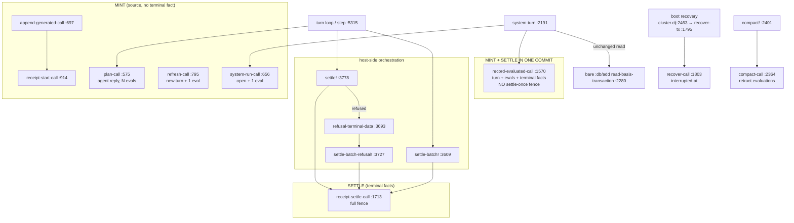

# The evaluation write path, the vanished turn, and retired program identities

Read-only investigation of three owner questions, from source at
`steward-platform` HEAD `cd6495f49`, plus git history, the gate log
`tmp/orchestrator/gate-results/batch-106.log`, and the vendored Datahike fork.
One live read-only evaluation was used (recorded in **Verification boundary**).

Defects first:

| # | Defect | Where |
|---|---|---|
| D1 | Six distinct writer calls mint a `:seon.cluster.eval` entity, and four distinct writers assert its terminal facts. There is no single evaluation write path. | table in §1.2, §1.3 |
| D2 | `seon.turn/system-turn` bypasses the settle-once fence entirely: `record-evaluated-call` writes source AND terminal facts in one commit, and the since-diff "unchanged" arm writes `:seon.cluster.eval/read-basis-transaction` onto an already-terminal evaluation with a bare `[:db/add …]`. | `src/seon/turn.clj:1570`, `src/seon/turn.clj:2280-2286` |
| D3 | The only observed producer of a vanished turn is a TEST FIXTURE running against the development cluster. It is not a production mechanism, and the research note that justified the code called compaction a legitimate producer — which the code refutes. | `test/seon/context_blocks_fixture.clj:288-301`; `src/seon/turn.clj:2364-2399` |
| D4 | Retracting a turn leaves every one of its evaluations violating its own declared entity schema, because `:seon.cluster.eval/run` is a REQUIRED key and Datahike's `retract-entity` retracts incoming ref datoms. Nothing detects this. | `resources/seon/schemas/seon.eval.edn:12`; `reference-code/datahike/src/datahike/db/transaction.cljc:998-1014` |
| D5 | Two retirement paths produce two DIFFERENT entity shapes for the same concept. A deletion tombstone is identity-only; a minted tombstone carries `:seon.schema.admission/source` and `:seon.fn/ns`. One needs a second validator; the other does not. | `src/seon/program.cljc:1007-1026`, `src/seon/cluster/source.clj:305-337` |
| D6 | Both batch-106 reds are the same signature: a retired `:seon.fn` row was refused by the ordinary `:seon.fn/fn` write validator and the tombstone escape hatch did not fire. | `tmp/orchestrator/gate-results/batch-106.log:280-310` |
| D7 | "Retired" is not a fact. It is inferred from the ABSENCE of definition attributes — the project's own named recurring failure class (AGENTS.md: a check that reads absence of signal as health). | §3.3 |

---

## 0. Vocabulary used here, and the one word the owner asked about

**Is "terminal writer" an invented concept?** No — it is already in the code,
as a phrase in two docstrings, not as a new noun for a new thing:

- `src/seon/turn.clj:3778-3779` — `(defn settle! "The sole terminal writer for
  one run. …")`
- `src/seon/turn.clj:419-421` — `open-run-tx-call`'s docstring opens with
  "THE TERMINAL WRITER'S REFUSAL ARM MAY NOT REPEAT WHAT THE REFUSAL DENIED."

The test phrase the owner quoted, `test/seon/turn_test.clj:244` ("the terminal
writer records the outcome, never a fault about recording it"), denotes exactly
one function: **`seon.turn/settle!`**, which the test calls through the private
var at `test/seon/turn_test.clj:286` (`(#'turn/settle! {…})`).

So "terminal writer" is a docstring adjective for `settle!` — the host-side
function that commits one evaluation's outcome and, when the turn is closing,
its close. The claim IN that docstring ("the sole terminal writer") is the part
that is false: §1 counts the others.

Other names used below, all taken from the code:

| Name | Meaning | Grounding |
|---|---|---|
| turn | an agent's ordered evaluations; `:seon.turn/id`; open means no `:seon.turn/closed-tx` | `resources/seon/schemas/seon.turn.edn:1-27`, `src/seon/turn.clj:193` |
| run | the LEGACY spelling of turn, still the live attribute prefix on the evaluation's ref: `:seon.cluster.eval/run` | `resources/seon/schemas/seon.cluster.eval.edn:23,33` |
| evaluation / receipt | one `:seon.cluster.eval` entity: one (turn, ordinal) pair, source + shown text + error. `receipt` is the legacy spelling still used for local names throughout `seon.turn` | `resources/seon/schemas/seon.eval.edn:11-38` |
| writer call | a `[:db.fn/call #'f …]` operation: a pure function of the mid-transaction database value that returns transaction data or throws a refusal | `src/seon/turn.clj:265-279` |
| settlement | asserting an evaluation's terminal facts | `src/seon/turn.clj:991-995` |

`:seon.cluster.eval/run` confirms the owner's reading. The evaluation's entity
schema declares it REQUIRED:

```clojure
;; resources/seon/schemas/seon.eval.edn:10-13
[:db/id {:optional true} :int]
[:t {:optional true} :seon.db/basis-t]
[:seon.cluster.eval/id :seon.cluster.eval/id]
[:seon.cluster.eval/run [:map [:db/id :int]]]      ; ← required, points at the turn
```

and the attribute itself is a plain ref, not a component:

```clojure
;; resources/seon/schemas/seon.cluster.eval.edn:23
:run [:and {:seon.wake/context-inert true} :seon.db/ref],
```

---

## 1. How an evaluation's facts reach the database today

### 1.1 The shape being written

An evaluation is ONE entity per (turn, ordinal), identified by
`seon.id/evaluation` (`src/seon/id.clj:55`) through
`seon.turn/receipt-identity` (`src/seon/turn.clj:502-509`). It is minted with
source and no terminal fact — that absence IS "running"
(`src/seon/turn.clj:873-874`) — and terminal facts accrete onto the SAME entity
later. The minted row is built by `seon.turn/receipt-row`
(`src/seon/turn.clj:892-911`):

```clojure
;; src/seon/turn.clj:896-902 — the minted row
(cond-> {:db/id            receipt-id
         :seon.cluster.eval/id      receipt-id
         :seon.cluster.eval/run     run-eid
         :seon.cluster.eval/ordinal ordinal
         :seon.cluster.eval/at      at}
  source  (assoc :seon.cluster.eval/source source)
  …)
```

The terminal facts are a declared list, `receipt-terminal-attributes`
(`src/seon/turn.clj:1452-1479`): `:seon.eval/shown`, `:seon.cluster.eval/error`,
`:seon.cluster.eval/interrupted-at`, `:seon.cluster.eval/output`,
`:seon.error/kind`, the renderer facts, the accretion-gate counts. `terminal?`
is presence of any of them; there is no status attribute.

### 1.2 Every writer call that MINTS an evaluation row

| # | Writer call | file:line | Mints | Requires the turn? |
|---|---|---|---|---|
| M1 | `seon.turn/plan-call` | `src/seon/turn.clj:575` (rows via `source-rows` `:528`) | the agent's reply + its N frozen evaluations on an already-open turn | yes — `require-open-run` `:296` |
| M2 | `seon.turn/system-run-call` | `src/seon/turn.clj:656` | opens the turn AND freezes one evaluation, one commit | it opens it |
| M3 | `seon.turn/refresh-call` | `src/seon/turn.clj:795` | opens a NEW turn and mints its one evaluation as an inline map (not via `receipt-row`) | it opens it |
| M4 | `seon.turn/append-generated-call` | `src/seon/turn.clj:697` | one appended generated form; delegates to M5 | yes — `require-open-run` |
| M5 | `seon.turn/receipt-start-call` | `src/seon/turn.clj:914` | one running evaluation | yes — `receipt-run` `:862` |
| M6 | `seon.turn/record-evaluated-call` | `src/seon/turn.clj:1570` | the turn, ALL its evaluations, AND their terminal facts, in one commit | no — it creates the turn |

M5's public wrapper `receipt-start-tx` (`src/seon/turn.clj:872`) has **no
production caller**: `rg` finds M4 plus ten test call sites and nothing else.

### 1.3 Every writer that asserts TERMINAL facts

| # | Writer | file:line | Fence |
|---|---|---|---|
| T1 | `seon.turn/receipt-settle-call` | `src/seon/turn.clj:1713` | full: turn must exist and be open (`receipt-run`), receipt must exist, ordinals must match, a terminal receipt refuses `::receipt-terminal`, a settle with no terminal fact refuses `::no-terminal-fact` |
| T2 | `seon.turn/record-evaluated-call` | `src/seon/turn.clj:1570`, assertions at `:1650` | NONE of T1's fences. It checks agent presence, no other open turn, ordinal contiguity, and `every? terminal?`; then writes source and terminal facts together |
| T3 | `seon.turn/recover-call` | `src/seon/turn.clj:1803` | stamps `:seon.cluster.eval/interrupted-at` on every non-terminal evaluation of an open turn, at boot |
| T4 | `seon.turn/system-turn`'s unchanged-read arm | `src/seon/turn.clj:2278-2286` | none — bare `[:db/add previous :seon.cluster.eval/read-basis-transaction …]` plus `[:db.fn/retractEntity …]` of the previous read-evidence rows, onto an evaluation that is already terminal |

T1 is reached through four host-side commit orchestrations, all in
`seon.turn`:

| Orchestration | file:line | Commits |
|---|---|---|
| `settle!` | `src/seon/turn.clj:3778` | one evaluation's settlement + close, with a refusal arm |
| `settle-batch!` | `src/seon/turn.clj:3609` | a whole turn's evaluations + close in one transaction |
| `settle-batch-refusal!` | `src/seon/turn.clj:3727` | the batch's fallback after a refused batch commit |
| `refusal-terminal-data` | `src/seon/turn.clj:3693` | builds the refusal settlement used by the two above |

`settle!` is called from eight sites in the turn loop (`src/seon/turn.clj:4208`
through `:4976`).

### 1.4 Retractors

| Retractor | file:line | What it removes |
|---|---|---|
| `seon.turn/compact-call` | `src/seon/turn.clj:2364-2399` | every EVALUATION of one agent. It REFUSES `::compaction-refused` while the agent has an open turn, decided inside the writer. It does not touch turns. |
| `seon.context-blocks-fixture/clear-history!` | `test/seon/context_blocks_fixture.clj:288-301` | every TURN and evaluation of agent `juniper`, with no idleness check |

### 1.5 The picture



### 1.6 Answer

**There is not one evaluation write path. There are two families plus two
side writers.**

1. The **fenced family** — mint with M1/M2/M3/M4/M5, settle with T1 — is the
   ordinary agent turn and is genuinely serialized by the writer: identity is
   `(turn, ordinal)`, an ordinal that ever had an evaluation refuses forever,
   a settled evaluation refuses a second settlement.
2. The **one-commit family** — M6/T2, `record-evaluated-call` — writes the
   turn, its evaluations and their outcomes together and keeps none of T1's
   fences. Its own idempotence device is a full content comparison
   (`stored-record-content`, `src/seon/turn.clj:1544-1568`) that refuses
   `::recorded-content-conflict` on any difference. This is the path the
   system turn uses (`src/seon/turn.clj:2332`).
3. `recover-call` (T3) and the since-diff refresh arm (T4) both mutate
   evaluation entities outside both families.

The owner's "we should have only one evaluation path" is not satisfied today.
The cheapest honest consolidation is to make the system turn mint through
M1/M2 and settle through T1 like every other turn, deleting `record-evaluated-*`
(M6/T2) and its content-comparison idempotence; that is a separate assignment
and is not costed here.

---

## 2. The "vanished run"

### 2.1 What the case is

`seon.turn/settle!` may find, at the moment it commits, that the turn entity
its evaluation points at no longer exists. Both of its run-dependent components
refuse in that case:

- `receipt-settle-tx` → `receipt-settle-call` → `receipt-run`
  (`src/seon/turn.clj:862-868`) refuses `::no-such-run`;
- `close-tx` → `close-call` → `require-open-run` (`src/seon/turn.clj:296-303`)
  refuses `::no-such-run`.

Before `9b7c764e4` (2026-09-16 09:51) the refusal arm re-issued both unchanged,
so the second refusal was byte-identical to the first and `settle!` threw
`:seon.turn.loop/terminal-refusal-settlement-refused` — a core fault about the
RECORDING instead of the turn's outcome. `seon.turn/open-run-tx-call`
(`src/seon/turn.clj:419-448`) now emits the run-dependent half only while
`current-run` and `open?` hold, at the writer:

```clojure
;; src/seon/turn.clj:446-448
[database run-id tx-data]
(let [run (current-run database run-id)]
  (if (and run (open? run)) (vec tx-data) []))
```

The error recording depends on no turn and commits either way. The test
`a-terminal-refusal-settles-when-its-run-has-vanished`
(`test/seon/turn_test.clj:243`) is the class regression for that.

### 2.2 Where the turn actually went — candidate by candidate

| Candidate | Can it vanish a turn under an in-flight evaluation? | Evidence |
|---|---|---|
| (a) live Juniper fixture history wipe | **YES — the only one measured** | `test/seon/context_blocks_fixture.clj:288-301` retracts every juniper turn and evaluation at the writer with no idleness fence, while `install-running!` (`:303`) deliberately leaves the ordinary graph running. Issue `docs/seon/issues/the-live-juniper-fixture-wipes-turns-under-a-running-agent-loop.md` |
| (b) compaction | **NO** | `compact-call` (`src/seon/turn.clj:2364-2399`) retracts EVALUATIONS only, never turns, and refuses `::compaction-refused` inside the writer while the agent has an open turn (`:2371-2394`) |
| (c) boot recovery | **NO** | `recover-call` (`src/seon/turn.clj:1803-1825`) only adds `closed-tx` and `interrupted-at`; missing and closed turns are no-ops. A closed turn yields `::run-closed`, not `::no-such-run` |
| (d) writer-log `no-such-run` rejections | same incident as (a) | `docs/prds/steward-platform/research/terminal-refusal-settlement-2026-09-17.md` lines 60-76: three `:datahike/write-rejected … "run transition refused: no-such-run"` at 15:33:01.267/.468/.521, then the fault at .527 |
| (e) an agent retracting its own turn | **YES in principle, never observed** | The agent's own opening teaches the form: `src/seon/bootstrap.clj:59` — "Remove an entity and its incoming refs with `(seon.db/transact! [[:db.fn/retractEntity lookup-ref]])`". Every function is callable (AGENTS.md §3); nothing forbids `[:seon.turn/id …]` as the lookup ref |
| (f) config reconciliation | **NO** | `src/seon/reconcile.cljc:405-416` retracts only entities whose identities the desired manifest no longer names; turns are not manifest-managed |

### 2.3 The measured incident

From the sibling note and the issue, both read from the durable datoms of
`default` (pid 30138):

| `:t` | instant | what |
|---|---|---|
| 536870999 | 2026-09-16T15:33:00Z | juniper turn `3f81dfc4c014` OPENED, situation `:call`, 8 datoms |
| 536871000 | 15:33:01Z | **933 retractions, 1 assertion** — all four juniper turns, their 20 evaluations, 18 read-evidence and 135 read-request entities |
| 536871001 | 15:33:01Z | 170 datoms |
| 536871002 | 15:33:01Z | the `terminal-refusal-settlement-refused` fault |

The turn was retracted whole ONE transaction after it opened.

### 2.4 What Datahike does to the neighbours

`retract-entity` (`reference-code/datahike/src/datahike/db/transaction.cljc:998-1014`)
retracts both the entity's own datoms and **every incoming ref datom**:

```clojure
(let [e-datoms (vec (dbi/search db [e]))
      v-datoms (into [] (mapcat (fn [attr] … (dbi/search db [nil a e])))
                     (dbi/-attrs-by db :db.type/ref))]
  [(transduce cat transact-retract-datom report [e-datoms v-datoms])
   (retract-components db e-datoms)])
```

and cascades into component values (`:830-836`). So:

- retracting a TURN retracts the `:seon.cluster.eval/run` datom on each of its
  evaluations. That attribute is a REQUIRED key of the evaluation entity map
  (`resources/seon/schemas/seon.eval.edn:12`), so every surviving evaluation of
  a retracted turn is invalid against its own declared schema, and nothing
  reports it — **D4**;
- it also retracts the incoming `:seon.runtime/turns` datom, which is declared
  `:seon.db/component true` (`resources/seon/schemas/seon.runtime.edn:3`), which
  is why the agent's runtime turn set went with it.

### 2.5 Answer: is this real?

**Today it is a fixture artefact, not a production situation.** The only
measured producer is a shared test fixture that a research script seeds into
the development cluster. The justification written into
`terminal-refusal-settlement-2026-09-17.md` ("PRD §14 compaction legitimately
retracts the agent's record") is **refuted by the code**: compaction retracts
evaluations, keeps turns, and refuses while a turn is open.

The one genuinely open production door is (e): an agent can retract any entity,
including its own turn, because `seon.db/transact!` is a function and every
function is callable. That is the only reason a turn can be absent under a
running evaluation once the fixture is fixed — and it is an agent mistake, which
by AGENTS.md §2.4 must become a flat `:seon.error` value the agent sees, not a
loop crash.

**Is `open-run-tx-call` therefore unnecessary?** No, and this is the important
distinction: `open-run-tx-call` is not the "record an evaluation with no turn"
behaviour. It is the writer deciding a fact the caller pre-read — the exact
shape AGENTS.md's owner law (2026-08-29) requires — and it makes the refusal arm
total for the `::run-closed` case too, which boot recovery and a concurrent
close both produce legitimately. What is questionable is only the FIXTURE that
produced the `::no-such-run` half, and the docstring claim that compaction
produces it.

### 2.6 Options

**Option 1 — fix the fixture; keep `open-run-tx-call`; correct the docstrings
(RECOMMENDED).**
`clear-history!` establishes the agent's idleness through bounded terminal
events, or makes the decision inside the writer the way `compact-call` does.
`open-run-tx-call` stays, because `::run-closed` remains reachable without any
fixture. The `a-terminal-refusal-settles-when-its-run-has-vanished` test stays,
but its comment stops citing compaction.
*Guarantee:* the loop is total against both refusal rules; the fixture no longer
races the running graph. *Cost:* one fixture change plus two docstring
corrections; the issue note already states the acceptance. *Gives up:* nothing.

**Option 2 — Option 1, plus make the turn's retraction impossible while an
evaluation is open.**
Add a writer-side guard so a `retractEntity` of a `:seon.turn/id` with a
non-terminal evaluation refuses, and delete the `::no-such-run` arm and its
test.
*Guarantee:* "record an evaluation with no turn" becomes unrepresentable.
*Cost:* Datahike has no entity-retraction hook — the guard cannot live at the
writer without routing every retraction through a Seon writer call, which
contradicts "an agent may call any function" and the agent opening at
`src/seon/bootstrap.clj:59`. *Gives up:* an agent's ability to retract its own
facts, and it does not remove the `::run-closed` arm anyway, so `settle!` stays
two-armed. **Not recommended:** the evidence does not support deleting the case,
because the case also covers `::run-closed`.

**Option 3 — Option 1, plus delete `record-evaluated-call` and route the system
turn through the fenced family.**
*Guarantee:* one evaluation write path, which is what the owner asked for; the
settle-once fence then covers every evaluation in the system. *Cost:* the system
turn's atomic "whole turn in one commit" behaviour has to be rebuilt as
open → plan → settle-batch, and `stored-record-content`'s content-comparison
idempotence must be replaced by the `(turn, ordinal)` identity fence.
*Gives up:* nothing durable; it is a strictly smaller mechanism. Worth doing,
but it is a separate assignment from the vanished-turn question.

---

## 3. Retired program identities

### 3.1 Ruling 47, quoted

`docs/prds/context-generation/plan/design-ideas-ledger-2026-08-13.md:563-580`:

> 47. **Program identities are symbols; the context and the population are one
> act** (owner, 2026-08-29): `:seon.fn/sym` and `:seon.test/sym` retype from
> string to `:symbol` … THE INVARIANT: every name the SCI context can resolve
> has a program row, minted where the context learns it … Identity rows never
> retract (unmap retracts definition facts, not identity), so lookup refs are
> stable forever.

Two consumers depend on that: `:seon.fn/calls` edges and `:seon.test/reach`
members, both refs into `:seon.fn` identities.

The ruling is not decoration. §2.4's Datahike behaviour is why: a plain
`retractEntity` of a function identity would not leave a dangling ref — it would
**silently retract the `:seon.fn/calls` datom on every caller**. The call graph
would quietly lose edges, and test selection (which derives from
`:seon.fn/calls` reach) would quietly select fewer tests. That is precisely the
project's named failure class.

### 3.2 How many paths retire an identity, and do they agree?

**Three**, and they do **not** produce the same entity.

| # | Path | file:line | Resulting entity |
|---|---|---|---|
| R1 | REPL deletion (`ns-unmap`, `seon.schema/unregister!`) → `seon.program/deletion-row` → `seon.turn/row-tx` deletion branch → `seon.program/exact-replacement-tx` | `src/seon/program.cljc:1049`; `src/seon/turn.clj:1281-1317`; `src/seon/program.cljc:1007-1026` | **identity only** |
| R2 | publication / edit-hook reconciliation: an identity present before and absent from the desired rows | `src/seon/fn.clj:2557-2596` (`reconcile-tx-in`), desired row built as `{attribute value}` at `:2564-2566` | **identity only** (same `exact-replacement-tx-in`) |
| R3 | writer-side minting for evidence that names an identity this database never had | `src/seon/cluster/source.clj:305-337` (`mintable-identity`), `:358-370` (`identity-tombstone-rows`) | identity **+ `:seon.schema.admission/source :core` + `:seon.fn/ns`** |

R1/R2's shape, confirmed live (see **Verification boundary**) — for a current
row `{:db/id 1 :seon.fn/sym "a/b" :seon.fn/ns {:db/id 2}
:seon.schema.admission/source :core :seon.fn/source "x" :seon.fn/private? false}`
and desired `{:seon.fn/sym "a/b"}`, `seon.program/exact-replacement-tx` returns:

```clojure
[[:db.fn/retractAttribute 1 :seon.fn/ns     {:db/id 2}]
 [:db.fn/retractAttribute 1 :seon.fn/private? false]
 [:db.fn/retractAttribute 1 :seon.fn/source "x"]
 [:db.fn/retractAttribute 1 :seon.schema.admission/source :core]
 {:db/id 1 :seon.fn/sym "a/b"}]
```

R3's shape, from `mintable-identity` (`src/seon/cluster/source.clj:328-337`):

```clojure
{:db/id "evidence-identity::seon.fn/sym:a/b"
 :seon.fn/sym "a/b"
 :seon.schema.admission/source :core
 :seon.fn/ns "evidence-identity-ns:a"}
```

R3's row is a **fully valid `:seon.fn/fn` row** under the ordinary write
validator. R1/R2's row is not — `:seon.fn/fn` declares
`:seon.schema.admission/source` and `:seon.fn/ns` REQUIRED:

```clojure
;; resources/seon/schemas/seon.fn.edn:110-119
:fn [:map {:seon.db/attributes true, …}
     [:seon.fn/sym :seon.fn/sym]
     [:seon.test/subject {:optional true} :seon.test/subject]
     [:seon.schema.admission/source :seon.schema.admission/source]   ; required
     [:seon.fn/ns :seon.fn/ns]                                        ; required
     [:seon.fn/source {:optional true} :seon.fn/source]
     …]
```

That mismatch is what `seon.db/write-tombstone-validator`
(`src/seon/db.clj:2913-2940`) exists to absorb. It builds a second validator
that keeps the identity attributes and any entry another writer owns
(`:seon.program/written-by`), and REQUIRES every indexer-owned attribute to be
ABSENT:

```clojure
;; src/seon/db.clj:2936-2939
(m/validator
 [:and (into [:map] (remove #(owned (first %))) entries)
  [:fn (fn [row] (not-any? #(contains? row %) owned))]]
 {:registry (:seon.schema.projection/registry projection)})
```

and it is only consulted when the entity already carried that identity BEFORE
the transaction (`src/seon/db.clj:2965-2973`).

### 3.3 The batch-106 reds

`tmp/orchestrator/gate-results/batch-106.log:280-310`, two failures, one
signature. The deletion writer they exercise is **not** `reconcile-tx`; it is
`seon.turn/row-tx` (`src/seon/turn.clj:1281`), reached directly in one test and
through `seon.turn/receipt-settle-tx` in the other.

| Test | Call | Refusal |
|---|---|---|
| `seon.program-test/runtime-deletion-preserves-identity-through-tuple-retractions` (`test/seon/program_test.clj:514-529`) | `((ns-resolve 'seon.turn 'row-tx) current {} {:seon.program/delete-identities [[:seon.fn/sym "seon.test/changed-since-green"]]})` | `seon.db/transact! refused … at [8576 :seon.schema.admission/source] … Entity: #:seon.fn{:sym "seon.test/changed-since-green"}`, `:entity-value #:seon.fn{:ns 9854, :sym "seon.test/changed-since-green"}` |
| `seon.program-test/typed-cross-namespace-deletion-retracts-function-and-test` (`test/seon/program_test.clj:~860-886`) | `(turn/receipt-settle-tx settlement)` carrying a deletion row | same refusal, `Entity: #:seon.fn{:sym "my.agents.registration-test/same-name"}` — here the row IS identity-only and was still refused |

Read together: the second failure proves the escape hatch did not fire even for
the exact shape it was written for. The first shows the resulting entity still
carrying `:seon.fn/ns` — neither a valid live row nor a valid tombstone. In the
working tree (uncommitted, another lane) both expectations are being changed to
identity-only:

```
-        (is (= (select-keys before [:db/id :seon.fn/sym :seon.fn/ns])
+        (is (= (select-keys before [:db/id :seon.fn/sym])
```

so HEAD's tests and HEAD's validator disagree about the retired shape, which is
the honest statement of **D6**: the defect is not one of the two writers, it is
that **there is no single declared answer to "what does a retired `:seon.fn`
row look like"**, and three code paths each answer differently.

Finally, the concept itself is unqueryable. Given a row `{:seon.fn/sym 'a/b}`
you cannot tell, with a query, whether it is:

1. a function that was defined and then deleted (R1/R2), from
2. an identity minted because some evidence referenced a name this database was
   never built with (R3 — which in fact looks like a live row), or
3. a partially-written row.

"Retired" is inferred from absence. AGENTS.md names that failure class
explicitly, and `open?` is the counter-example the codebase already trusts:
open means no `closed-tx` — a POSITIVE fact whose absence is the other state.

### 3.4 Is the second validator a hack?

Half. It is an honest local fix for a dishonest schema: it encodes exactly the
right invariant ("a retired row has its identity and none of the indexer's
definition attributes") and derives that set from the declared schema rather
than a hand list. What makes it feel like a hack is that the schema still claims
`:seon.schema.admission/source` and `:seon.fn/ns` are unconditionally required
while the system routinely and deliberately writes rows without them. The
validator then re-states, in Clojure, a truth the schema refuses to state in
data, and a second code path (R3) does not obey it at all.

The owner's alternative — "the honest schema is that a `:seon.fn` entity's
required keys are only its identity, with definition attributes present iff it
is currently defined" — is correct about what is true, but as a bare relaxation
it **loses real write validation on live rows**: making `:seon.fn/ns` and
`:seon.schema.admission/source` optional means a half-written live declaration
(the exact defect `seon.test-support/transacted!` was built to surface, AGENTS.md
§5 rule 8) validates silently. That is a strict loss on the property the owner
cares most about. Option B below keeps the strictness by making the state a fact
instead of an absence.

### 3.5 Options

**Option A — one shape, declared once; keep both validators.**
Make R3 mint the same identity-only row R1/R2 produce (drop the
`:seon.schema.admission/source`/`:seon.fn/ns` synthesis from `mintable-identity`),
fix whatever leaves `:seon.fn/ns` behind in R1, and keep
`write-tombstone-validator` as the one declared answer, with one regression per
path asserting the identical resulting entity.
*Guarantee:* exactly one retired shape; live rows keep their full strict
validation; both batch-106 reds die from the same fix.
*Cost:* small — one function, one writer, three regressions.
*Gives up:* "retired" stays unqueryable; you still cannot distinguish R1 from R3
or from a never-defined name.

**Option B — make retirement a FACT, then Option A's single shape follows
(RECOMMENDED).**
Declare one attribute on the identity — `:seon.fn/retired-tx` (a transaction
ref, exactly like `:seon.turn/closed-tx`) — asserted by the retirement writer.
`retired?` is presence, `defined?` is its absence, both are one clause of
Datalog, and R3's minted row is distinguishable because it carries no
`retired-tx` and no definition (its own state: "referenced, never defined",
which is worth its own attribute or simply its own absence of both).
The `:seon.fn/fn` entity map then honestly declares two arms — a defined row
requires `:seon.fn/ns` and `:seon.schema.admission/source`; a retired row
requires `:seon.fn/retired-tx` and forbids the indexer-owned attributes — and
`write-tombstone-validator` becomes the declared second arm rather than an
inferred escape hatch.
*Guarantee:* strictness on live rows is unchanged (arguably stronger, since the
retired arm is now selected by a POSITIVE fact rather than by "the ordinary
validator failed"); "which functions were deleted" and "which names were only
ever referenced" become queries; refs stay stable because nothing retracts.
*Cost:* one attribute, one schema arm, one writer change in each of R1/R2/R3,
a reset (database data is disposable by ruling — no migration).
*Gives up:* one attribute of storage per retired identity, and the schema entry
becomes a two-arm `:multi`/`:or` rather than one flat map — a genuine cost to
read.

**Option C — split the entity: the identity is the ref target, the definition
is a component.**
`:seon.fn/sym` + `:seon.fn/definition` (a `:seon.db/component` ref) holding
`source`, `ns`, `arities`, `spec`, `admission/source`. Retirement retracts the
definition component; Datahike cascades it
(`reference-code/datahike/src/datahike/db/transaction.cljc:830-836`); callers'
`:seon.fn/calls` refs point at the identity and never move.
*Guarantee:* no entity is ever "half a function" — the identity row is complete
by construction and the definition row is complete or absent. One validator,
no escape hatch.
*Cost:* the largest. Every query, pull pattern, render pair and index writer
that reads `:seon.fn/source` / `:seon.fn/ns` / `:seon.fn/spec` off the identity
has to hop one ref; `seon.fn/reconcile-tx`'s exact-replacement machinery is
rewritten; the program graph's shape changes under every consumer.
*Gives up:* the flat, one-pull `:seon.fn` row that `dir`/`doc`, test selection
and the namespace pages all read today. **Not recommended now** — it is the
right shape if the program graph is ever rebuilt, but it is not proportionate to
two reds.

Options B and C both satisfy "refs stable without an entity that is half a
function". B does it by declaring the half; C by removing it. B is recommended
because it is the smaller change and because it matches a construction the
codebase already trusts (`open?` = no `closed-tx`).

---

## Verification boundary

- Source read at `steward-platform` HEAD `cd6495f49`. `src/seon/turn.clj`,
  `src/seon/fn.clj`, `src/seon/error.clj` and four test namespaces carry
  another lane's uncommitted edits (`git status`); every `src/seon/turn.clj`
  line number above is HEAD's and may drift by up to three lines against the
  working tree. `src/seon/db.clj`, `src/seon/program.cljc`,
  `src/seon/cluster/source.clj` and the schema resources are clean.
- No test JVM was run. No gate was run. The batch-106 facts are read from
  `tmp/orchestrator/gate-results/batch-106.log`, not reproduced.
- ONE read-only evaluation against `default` (mode `jvm`), whose entire effect
  was to call two pure functions:
  `(seon.program/changed-attributes …)` returned
  `[:seon.schema.admission/source :seon.fn/ns :seon.fn/source :seon.fn/private?]`
  and `(seon.program/exact-replacement-tx …)` returned the four
  `:db.fn/retractAttribute` operations plus `{:db/id 1 :seon.fn/sym "a/b"}`
  quoted in §3.2. It wrote nothing.
- The reason `:seon.fn/ns` survived in the first batch-106 red is NOT
  established: `exact-replacement-tx` demonstrably emits its retraction in the
  running JVM. The suspect seam is `exact-replacement-tx`'s process-wide
  `(shapes)` call (`src/seon/program.cljc:1047`) versus the shape-carrying
  `exact-replacement-tx-in` (`:1027`) that AGENTS.md §2.1 requires — a worker
  whose process-wide shapes differ from its database's would emit a different
  retraction set. Confirming that needs a gate run and is left open.
