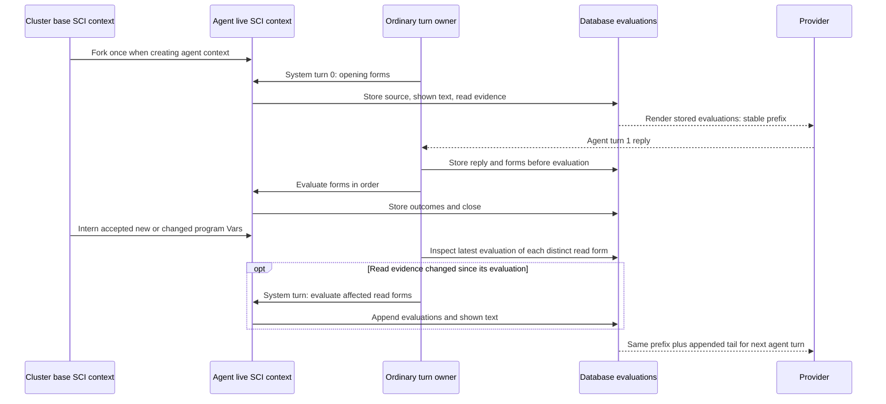
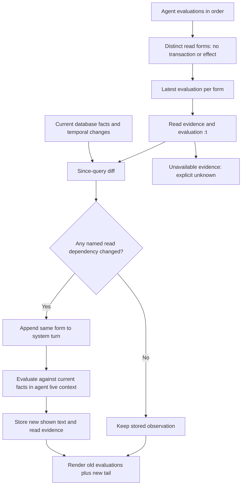

# Agent runtime — the agent record and the turn loop

> Target design. The [agent record and turn loop PRD](../../prds/context-generation/plan/agent-record-and-turn-loop-prd-2026-09-07.md)
> §13–§15 governs this contract. Its later sections supersede earlier
> fresh-fork, result-storage, opening-projection, and curation designs.
> Implementation state and ordering remain in the program roadmap.

Every agent owns one core.async.flow graph. The cluster owns a database
branch and a program-only base SCI context. Each agent forks that base once
and retains its own live SCI context across turns. The agent's private defs,
atoms, and result objects remain in that context; accepted program changes
reach it as base diffs. Neither a new turn nor a changed base rebuilds it.

## The record and its blocks

The record stores identity, namespace, and authored plan facts. Namespace
assignment is not identity: several agents may share a namespace; its
steward is the namespace's own ref. Scalars describe the entity, while
components hold whole concerns. History, unanswered wakes, and faults
routed to the agent are queries, never copied onto its record.

One entity schema declares one AI/HTML render pair. Its own block renders
its scalars together, followed by component blocks and derived blocks whose
query functions the schema declares once. The opening presents identity,
plan, unanswered wakes, routed faults, then history last. History is
chronological, oldest first, with every turn shown by default.

Render functions choose source from their data. An empty plan teaches its
API through executed `dir` and `doc` forms; a populated plan emits the
current, ready, and blocked queries. There is no separate teaching system.
An entity with no render pair uses the default attribute-map printer.
Every value inside a block goes through the one value renderer.

## Turns and evaluations

A turn groups ordered evaluations and any provider attempts. A system turn
is the ordinary source-submission shape: a reply and no provider attempt.
“System” is derived from those facts, never a stored discriminator.

Three transactions surround a turn: open; store reply, attempts, and form
entities; store evaluation outcomes and close. Source is durable before
execution. A transaction function refuses a second open turn for the same
agent at the writer. Refused outcome storage closes the turn with failure
evidence rather than leaving a path that repeats side effects.

The turn's basis is the transaction `:t` on its identity datom. An
evaluation retains its source, namespace, ordinal, comment, read evidence,
shown text, out, and error as applicable. Terminal evidence records what
happened; absence never proves success.

An evaluation's stable identity is
`(seon.id/evaluation branch-id turn-id ordinal)`: twelve hexadecimal
characters from the digest of those ordered identity parts.
`(seon.id/symbol-in "result" \\e id)` gives its `result/e<id>` handle.
Ordering remains turn order and ordinal, independent of digest order.

## Additive context

System turn 0 evaluates the opening forms and stores their evaluations.
Before each agent turn, the same algorithm appends a system turn for
changed reads. With no changed reads, there is no additional system turn.
Generated and agent-written reads belong to the same sequence.

The prompt renders stored evaluations in order. Earlier bytes do not
change when data, code, profiles, or live-object availability change.
Only the tail grows. The evaluation schema declares
`seon.repl/render-ai` and `seon.repl/render-html`; the walk renders those
entities through the pair, with `seon.repl/text` owning the REPL grammar.
There is no history-specific entry taxonomy or formatting assembler.

## Since-query diff over every read form

A read form reads database facts and neither transacts nor requests an
effect. Before the next agent turn, select the latest evaluation of every
distinct such form, including agent-written forms. Compare the facts named
by its read evidence against changes since that evaluation's `:t`.
Affected forms are evaluated afresh against current facts in the next
system turn; their old evaluations remain immutable.

This is the existing read-validity mechanism applied across the whole
history. It is not an inbox-only check or a set of block-specific refresh
handlers. Evidence must cover empty reads, additions, and retractions:
the disappearance of a formerly read fact is a change too. Missing or
unavailable evidence is unknown, never proof of freshness. Writes and
effects are never rerun by this algorithm.

## Results and private state

The agent's live context holds an evaluation-id-to-object map. Result
handles bind directly to actual objects, including atoms, functions,
channels, and lazy sequences. They are not serialized, admitted into a
storage node, or rehydrated. Requery reaches the actual live value.

The database stores what the agent saw: the value renderer's shown text,
including elisions and requery forms, plus source, out, and error.
The render profile is applied once at evaluation time. There is no
separate result `max-bytes` bound, stored print node, or result blob.
Evaluation deadlines and query-work bounds remain separate decisions.

HTML renders the live object without presentation clipping while it
exists, and uses stored shown text after a restart. The stored AI bytes
remain unchanged in either case. A saved requery form can outlive its
object; inspection says the object is gone rather than claiming it can
restore it.

The private layer is the agent's defs and atoms as objects. A contracted
function, schema, or test installed through the program gate becomes
shared program data. A plain `def` is temporary and its REPL response
says so. A `defn` without a Malli contract is refused at installation;
it does not publish a row or enter the base.

## Wakes and recovery

A wake is an asserted datom on a schema-declared listened ref attribute
addressed to the agent. Datahike's listener offers a payload-free signal;
the graph derives work from facts. Assertion happens once: retracting and
reasserting a wake would change its `:t`.

Answered status derives from transaction order. A system turn containing
the wakes' query results answers them under the `:t` rule. Failed provider
attempts or an arbitrary source submission are not evidence that a wake
was shown. The listened attribute's declared opening behavior determines
whether it can start a turn; the finite turn allowance derives from
turns and the latest outside wake, never a decrementing counter.

One JVM holds the process-root store lock. At boot every open turn is
closed and its unfinished evaluations marked interrupted. Recovery never
replays interrupted forms or effects. Program facts rebuild the base,
but the agent's previous private objects and result handles are lost.
The stored shown text still reconstructs the same history bytes.

Compaction explicitly retracts the agent's evaluations. The next system
turn regenerates its opening from the current record using the same
algorithm. There is no manual revision/proof/adoption curation path.

## Inspection and proof

`(my.turn/evals)` returns evaluation maps, filterable by turn or form.
`(my.turn/eval id)` includes the full evaluation and read evidence.
`dir` teaches these functions as data. The debug invocation cache serves
previews; `?prompt=true` previews stored history plus the would-be system
turn without writing.

Use virtual replies through the ordinary agent proc to prove three writes,
cross-turn object identity, isolation between agents and the base, base-diff
visibility, and post-crash progress. Prove the previous prompt is an exact
prefix, changed generated and authored reads append, unchanged reads do
not, and writes/effects never rerun. Prompt inspection makes no provider call.

See [context](context.md), [data model](data-model.md),
[UI](ui.md), and [observability](observability.md).
