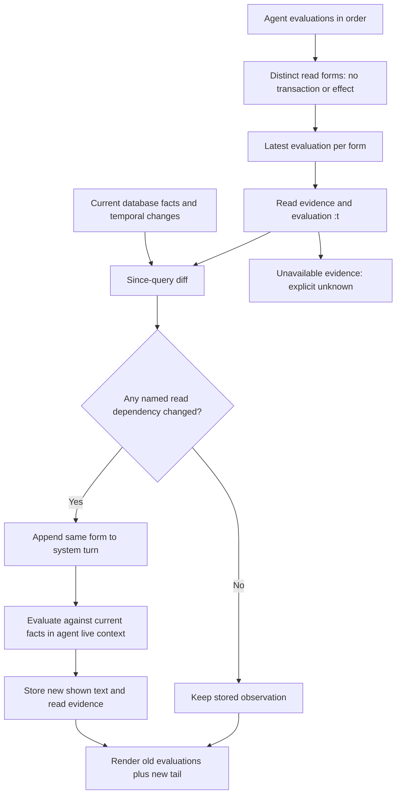

# Agent runtime — the turn loop as ruled

The binding design is the owner's 2026-09-08 rulings (carried in the
[goals note §2f and §3](../../prds/agent-platform/research/durable-goals-and-rulings-2026-09-21.md);
the source PRD is deleted at the clean write). In one paragraph: the
cluster's program-only base SCI context derives from one database value;
each agent holds a fork of it with a private layer; a turn's evaluations are
stored facts carrying the exact shown text; the prompt is those evaluations
rendered in order and only grows; before each agent turn a system turn
re-evaluates the reads whose facts changed; compaction wipes and regenerates;
results stay live objects in memory; the walk over the evaluation entities is
the only history; one render pair per entity schema; the value renderer and
the AI render functions are the only places presentation elides.

Marking is as in [README.md](README.md): *Current* cites HEAD `215447c46`.

## 1. Base context, agent fork, private layer

The cluster's base SCI context is derived from one database value: core
namespaces whose analyzed-source digest equals the loaded JVM root's are
copied from the JVM; genuine differences are interpreted from stored source.
Each agent forks that base once and keeps the fork across turns; base
changes reach it as a DIFF (the new or changed Vars interned), never a
re-fork from scratch. The private layer — the agent's own defs, atoms and
result objects — is exactly the Vars whose `:sci/generation` equals the
fork's, and is lost with the JVM; installed contracted functions, schemas
and tests are program facts and survive.

**Data flow.** Base: built on first evaluation, reused until the database's
program value changes. Fork: `sci/fork` (a new env atom over the same
namespace map, 0.0015–0.02 ms warm). Private layer: a Var's generation, read
off its metadata — no snapshot, no second walk.

**Current / Target.** Current: `src/seon/sci/eval.clj:2218` `base-ctx`,
`:1771` `acquire-program!`; `:2184` `fork-for-turn` forks PER TURN and calls
`:2121` `regenerate-agent-context!`, which walks the base's 419 namespaces and
5,326 interns (`base-bindings`, 1.5–2.4 ms) plus the agent context again,
because an armed program Var acquires the fork's generation when
`bind-root!` copies it and generation alone would misreport it as private
(data pack B2 §2.5, §8). Target: arm at the base so `:sci/generation` alone
discriminates the private layer, delete the snapshot and the two ctx atoms,
fork once per agent (ruling "do not re-fork from scratch per turn"; synthesis
§5 sci fork row); lane B2.

**Reference code.** sci `src/sci/core.cljc:331` `init`, `:345` `fork`, `:260`
`intern`, `:273` `bind-root!`; `src/sci/impl/utils.cljc:356` `next-generation`,
`:362-379` `bind-root!` (equal generation ⇒ mutate in place; unequal ⇒ copy
the Var into this env stamped with the fork's generation — the base Var is
never mutated through a fork); `reference-code/sci/doc/interrupt.md` (the one
`:interrupt-fn` and `time-limit`).

## 2. Turns and evaluations as facts

A turn groups an agent's ordered evaluations and any provider attempts.
Three transactions surround it: open; store the reply, attempts and source
rows; store outcomes and close. Source is durable before execution. A
transaction function refuses a second open turn for the same agent — at the
writer, never a caller pre-read. Open means no `:seon.turn/closed-tx`. An
evaluation's identity is `(seon.id/evaluation turn ordinal)`, twelve hex
characters; its handle is `result/e<id>`. The evaluation stores source,
namespace, ordinal, comment, read evidence, shown text, out and error; it
never stores a serialized result. Terminal evidence records what happened;
absence never proves success.

**Data flow.** Per turn: three writes proportional to the turn's forms. The
identity derives from turn and ordinal, so a refork of the same data yields
the same id. Shown text is computed once at evaluation time under the render
profile and never recomputed.

**Current / Target.** Current: `src/seon/turn.clj:465` `open-run-tx-call`
(returns `[]` for an already-open agent, inside the transaction), `:442`
`close-call`, `:215` `open?`; `src/seon/id.clj:55` `evaluation`;
`resources/seon/schemas/seon.eval.edn:31` `:seon.eval/shown`, with the
entity map still declared in the legacy-named file
`resources/seon/schemas/seon.cluster.eval.edn:62`. `src/seon/run.clj`
(149 lines) and the `receipt`-named turn functions (202 mentions in
`turn.clj`) carry retired spellings in function names only — no
`:seon.turn.receipt/*` attribute exists (data pack B2 §4). Target: one
`seon.eval` schema file, retired spellings gone; lane B2.

**Reference code.** datahike `src/datahike/db/transaction.cljc` (transaction
functions execute inside the writer); `src/datahike/versioning.cljc:457`
`commit-id` (the turn's basis `:t` is the identity datom's transaction).

## 3. Wakes, answered by `:t`

A wake is an asserted datom on a schema-declared listened ref attribute
addressed to the agent (a message's `:seon.message/to`, a schedule firing).
Datahike's listener is a payload-free signal; the graph re-derives work from
facts. Answered status derives from transaction order: an accepted ordinary
reply answers every wake whose `:t` precedes its opening; a system turn or an
opening alone does not. The finite turn allowance derives from turns and the
latest outside wake — no decrementing counter. Retracting and reasserting a
wake would change its `:t`, so assertion happens once.

**Data flow.** Listened attributes derive from the schema at boot; each
assertion is one signal; unanswered wakes are one query over `:t` against
`latest-answering-turn-t`. Proportional to the agent's unanswered wakes.

**Current / Target.** Current: `src/seon/cluster/wake.clj:92` `wake-attributes`;
`src/seon/turn.clj:2980` `latest-answering-turn-t`, `:2888` `next-agent-work`;
`:seon.agent/episode` at 15 sites and `:seon.config.run/max-episode-runs`
carry a retired spelling (data pack B2 §4). Target: a trigger resolves to a
TASK at the writer (ruling D2), never to namespace membership; the
`episode`/`run` spellings retire with B2/B3; waking beyond that is out of
scope by ruling T5.

**Reference code.** datahike `src/datahike/query.cljc:2568`
`advance-query-cache-context` (what a transaction advances per attribute —
the same seam the since-diff reads); `src/seon/cluster/agent.clj:497` (the
turn proc on a counted sliding buffer of one).

## 4. The since-diff system turn

Before each agent turn, take the latest evaluation of every distinct READ
form in the history — generated or agent-written; a form that reads facts and
neither transacts nor requests an effect — and ask whether any fact its read
evidence names changed since that evaluation's `:t`. Changed reads are
evaluated afresh in one ordinary system turn (a reply, no provider attempt;
"system" is derived, never stamped); unchanged reads keep their stored
observation; nothing changed ⇒ no system turn. Writes and effects never
rerun. Evidence must cover empty reads and retractions; unavailable evidence
is unknown, never freshness. System turn 0 evaluates the opening the same
way.

**Data flow.** Read evidence is the dependency plan Datahike attaches to a
query or pull result (attribute granularity) plus the cache revisions at
evaluation time. Currency is one comparison of those revisions against the
current cache context — no re-execution. Proportional to distinct read forms.

**Current / Target.** Current: `src/seon/turn.clj:2103` `system-turn`
(`:write? false` serves the debug preview); read currency is decided by
`src/seon/db.clj:1102` `read-evidence-current?` through THREE arms — index
patterns, `:875` `dependency-revision` (Datahike's cache context), and
`replay-read`, which re-runs the read to decide whether to re-run it (~405
lines); the two refinement arms have zero production callers outside
`db.clj` and zero tests (data pack A2 §3). Target: one mechanism, Datahike's
cache context; lane A2.

**Reference code.** datahike `src/datahike/query.cljc:2568-2590`
`advance-query-cache-context` (per transaction, a commit id per changed
attribute; an unsafe or schema-touching transaction advances the conservative
revision instead), `:2963-2976` `source-context-unchanged?` (true only when
conservative and every named attribute revision are equal), `:2877`
`query-dependency-plan`; `src/datahike/pull_api.cljc:107-113`, `:162-177`
(the same plan for a pull, attached as `:datahike.read/dependency-plan`).

## 5. The additive prompt and compaction

The prompt is the agent's stored evaluations rendered in order through
`seon.repl/text`: system turn 0, agent turn 1, a system turn for what
changed, agent turn 2, and so on. Bytes already sent never change; only the
tail is new (provider prompt caching works on a stable prefix). The opening
order is the record's own block, the plan, unanswered wakes, routed errors,
then the history last, oldest first, every turn shown. Compaction retracts
the agent's evaluations; the next system turn regenerates the opening from
the current record with the same algorithm — there is no manual curation
path. The prompt's whole-unit selection under a token budget stays; it
selects units and reports the dropped ones as an elision.

**Data flow.** Per prompt: one query for the agent's evaluations, one render
per evaluation from stored text, concatenation. Per compaction: one retraction
of the agent's evaluations. Proportional to the history's length.

**Current / Target.** Current: `src/seon/repl.clj:256` `text` over
`src/seon/eval.clj:9` `of-agent`; `src/seon/turn.clj:2286` `compact-call`,
`:2323` `compact!`, `:2330` `virtual-turn!`; `src/seon/cluster/prompt.clj:266`
`compose`, `:278` `select`, `:230` `dropped-elision` (whole units, stamped
`:seon.print/bound-by :seon.config.ai/prompt-token-budget`). Target: byte
identity within one history generation is the caching precondition;
after compaction identical forms and shown values with fresh handles
(provisional ruling §16a, owner to confirm); the debug page's `?prompt=true`
flag retires — context-now is always the primary view (goals note §4).

**Reference code.** `src/seon/repl.clj:213` `response` and `:256` `text` are
the one REPL grammar; nothing else formats an evaluation.

## 6. Results are live objects; shown text is the record

The agent's context keeps a map from evaluation id to the ACTUAL result
object — an atom, a function, a channel, a lazy seq; `result/e<id>` binds it
directly. No serialization, no admission walk, no rehydration; requery runs
against the real value. On disk the evaluation stores what the agent saw: the
value renderer's text under the profile, with its elisions and requery forms.
After a restart the map says the object is gone and the text remains; the
prompt regenerates byte for byte because it IS the bytes. The offending value
of an error is the same kind of `result/e<id>`. Inspection of evaluations
as data (`my.turn/evals`, `my.turn/eval`) is ruled and NOT built:
`src/my/turn.clj` has four functions and none of these.

**Current / Target.** Current: `src/seon/sci/eval.clj:2184` (the result-objects
map inside the fork), `src/seon/render/value.clj:668` `render-ai`, `:675`
`render-html`; the evaluation schema's pair
`resources/seon/schemas/seon.eval.edn:7-8` → `src/seon/repl.clj:447`
`render-ai`, `:480` `render-html`. Target: `my.turn/evals` / `my.turn/eval`
(goals note §2f row 3 and the 2026-09-08 ruling "results: objects in memory,
shown text on disk"); lane B2.

## 7. The walk is the only history; one render pair per entity schema

An entity schema declares ONE `:seon.render/ai` / `:seon.render/html` pair,
never one per scalar attribute; no pair means the default attribute-map
printer. Scalars render inside the entity's own block; components and the
derived queries the schema declares once own their blocks; a block with
nothing to say is absent; a failed render is a diagnostic. THE RENDER
FUNCTION IS A FUNCTION OF THE DATA: an empty plan emits a comment and
executed `dir`/`doc` forms, a populated plan emits its queries; `dir` and
`doc` return program DATA, never teaching prose. The history is the walk
rendering the agent's evaluation entities through their pair from stored
text — never re-running a form, never a hand-assembled view. Curating render
pairs (every entity map and every function output with a good AI and HTML
render) is an agent task class; the value renderer is the fallback, not the
design.

**Current / Target.** Current: `src/seon/render/walk.clj:979` `history`,
`:757` `neighborhood`; `src/seon/render.clj:278` `namespace-candidates` (the
contract-fitting selection per render call); `src/seon/render/block.clj:61`
`surface-id`; `src/seon/sci/eval.clj:1565` `directory-value`, `:1597`
`documentation-value`. Beside the walk, `src/seon/render/transcript.clj` is
2,443 lines of hand-assembled history, session, outline and ledger views
(`:676`, `:854`, `:1629`, `:2329`), still named by seven declared pairs in
`resources/` (data pack B2 §5) — ruled deleted 2026-09-08, never cut. Target:
"nothing assembles the history but the walk"; lane B2.

**Reference code.** `src/seon/repl.clj:447`, `:480`; `src/seon/render/value.clj:269`
`window` (the pager and profile application).

## 8. One clipping spot, and query-work bounds as elisions

Presentation elides in exactly two places: the AI render functions and the
value renderer's AI projection, under the render profile (string,
child-count, depth and token limits), once at evaluation time. History never
clips again; HTML never clips. Query-work bounds are a separate control: a
walk that stops at a distance or a connection limit reports the cut as an
elision value naming the bound, the count and the requery identity — ordinary
data, never bare truncation. Evaluation deadlines are the third control
(`time-limit` + `:interrupt-fn`). A bound firing is a bug report naming what
never arrived.

**Current / Target.** Current: `src/seon/render/value.clj:269-549` (the one
presentation window); `src/seon/render/walk.clj:698` (distance, stamped
`:seon.print/bound-by :seon.render/distance` with limit and continuation —
a query-work elision, legitimate); `src/seon/render/ns.clj:416-837` a second
AI ladder AND an HTML ladder (`:793` `html-within-budget?`, `:797`
`budgeted-html`) — the §2.4 violation. Target: the namespace-page ladders
are deleted; HTML unclipped; lane B2.

**Reference code.** `reference-code/sci/doc/interrupt.md` (the evaluation
deadline); datahike `src/datahike/pull_api.cljc:16` `+default-limit+ 1000`
(a cardinality-many pull is cut silently at 1,000 — `:315` already honours a
nil limit; the fork makes complete the default, lane A2).

## 9. Errors in the loop, and recovery

An agent mistake is a flat `:seon.error` value the agent sees in its
evaluation; nothing throws into the loop. A core fault rides flow's error
channel into the fault committer and is recorded with provenance, keyed by
signature. At boot every open turn closes and its unfinished evaluations are
marked interrupted; nothing replays; program facts rebuild the base; the
agent's private objects are gone and the history says what was there.

**Current / Target.** Current: `src/seon/turn.clj:1704` `recover-tx`;
`src/seon/flow.clj:1122` `fault-committer-proc`; `src/seon/error.clj:1683`
`recording`, `:1753` `commit-tx`; a dead turn proc was silent on every wake
in the 2026-09-08 trial (goals note §2e last row). Target: agent procs appear
in `runtime_status`; a proc death is a fault naming the agent (§2e); lane B2.
