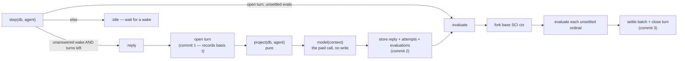

# Agent runtime — the agent record and the turn loop

> **Target design** (present tense). Implementation state, gaps, order, and
> evidence live only in [[roadmap]].

Every agent owns one `core.async.flow` graph created from the same blueprint.
A wake re-derives one immutable database value, performs only the work that
value implies, and commits through the one cluster transaction owner. There is
no central dispatcher, scheduler entity, private work queue, or runtime status
row.

Each cluster owns one acquired base SCI `ctx`. Every turn evaluates in a fresh
fork of that live base, begun from the agent's namespace. The fork is
turn-private mutable interpreter state; the database program graph is the
durable authority. An uncontracted definition an agent evaluates lives only in
that turn's fork: a `defn` an agent wants kept is a program row (it commits
through the same install gate every agent's code does), and a value it wants
kept is transacted data. Nothing rehydrates an agent's scratch definitions
across turns, because an atom's contents are not a fact.

## The agent record — identity, namespace, plan

An entity is its attributes. The stored agent record is three things:

- `:seon.agent/id` — a string identity: lookup, handles, messaging by id;
- `:seon.agent/namespace` — a ref to the `:seon.ns` entity whose REPL the
  agent sits in, and the prompt line forms evaluate against. It is not
  unique: several agents may share one namespace, and stewardship of that
  namespace is `:seon.ns/steward` on the namespace itself, not a fact about
  the agent;
- `:my.plan/*` — the plan facts the agent already stores on itself. There is
  no wrapper entity: a plan attribute the agent transacts is a fact about the
  agent, and a second entity to hold it would only duplicate ownership that
  already exists.

That is the whole stored record. Everything else a page or a prompt shows —
history, what is outstanding, what the agent is waiting on — is a QUERY over
turns and evaluations: turns consume wakes, evaluations belong to turns, and
the record is a derivation over those facts, not a stored list. There is no
`:seon.agent/evals` back-edge (an evaluation's own `:seon.eval/turn` ref,
joined through `:seon.turn/agent`, already answers whose evaluation it is),
no cluster attribute (exactly one `:seon.cluster/name` entity exists per
branch; "the cluster entity of this database value" is one derivation, not
eleven call sites each carrying their own ref), no `turns-left` counter (the
loop keeps track of turns by counting them, never by remembering a number),
and no `:seon.render/units` list (the record's components are the units, in
the entity schema's declared order). The debug page renders the record's
declared keys, then the derived history, in that order.

Deleted from the agent record and named here only because their absence is
load-bearing: `:seon.def/*` (an atom's contents are not a fact), the process
custody stamp and the open-turn pointer (both are queries — see below),
any collection of wakes (a wake is a datom on a listened attribute whose
value is the agent; nothing is copied onto the record and nothing references
the wake back), the run pointer, the situation stamp, the plan digest,
generated runs, context captures, contribution rows, and every derived-and-
stored counter that used to sit beside them.

## The turn — what one model call produces

A **turn** groups an ordered set of evaluations, names what woke it, and
records what the model call cost:

- `:seon.turn/id` — identity for evaluations and attempts to reference;
- `:seon.turn/agent` — whose turn;
- `:seon.turn/opened-at`, `/closed-at` — the bound; open means no
  `closed-at`;
- `:seon.turn/reply` (or `/reply-blob` over the storage bound, or
  `/reply-missing` when a reclaimed blob leaves nothing to show) — the
  model's bytes, stored before evaluation begins;
- `:seon.turn/attempts` — a component set of `:seon.ai.attempt` entities, the
  AI owner's existing family referenced rather than re-homed; one per
  provider attempt, because a paid call is a fact regardless of what it
  produced.

There is no stored basis attribute. **The basis is the turn's own transaction
`:t`** — the `:t` on the turn's identity datom, exactly the same `:t`
Datahike's `as-of` takes as an argument. Because the turn is opened before the
context is projected, and the context is projected from that opening
transaction's database value, the turn's own `:t` reproduces the prompt
exactly: `(as-of db turn-t)` returns the database value the model actually
saw. "Why this turn opened" is the query for wakes whose `:t` falls between
the previous turn's `:t` and this one's, never a stored trigger ref.

A turn can end with no evaluations at all — a crash after open and before the
reply, a provider failure, an empty or unreadable reply. One function closes
the turn with its attempts, each carrying its own error; when the reply was
never stored, the turn is derivably interrupted (closed, no reply, no attempt
error) with no stamp of its own. A submitted source is a turn with a reply
and no attempts, so **`author` is derived, never stored**: no attempts means
the turn was system-authored.

**One open turn per agent is a fence in the writer**, decided by query inside
the transaction function that opens a turn: `open` refuses when the agent
already has a turn with no `closed-at`. There is no in-memory-only custody
check standing in for that fence, because a submitted source opens a turn
the same way an ordinary reply does.

An **evaluation** entity is accreted into the existing `seon.eval` family
(which already holds the gauges `duration-ms`, `allocated-bytes`,
`fn-entries`, and `host-interop-count`): `:seon.eval/id` is a
`:db.unique/identity` string over `(turn, ordinal)` — the structural
nothing-re-executes fence, since a second freeze of the same ordinal upserts
rather than duplicates — plus `turn`, `ordinal`, `comment`, `source`, `ns`;
then, once run, `value` under the storage bound or `missing` (naming why:
over the bound, unserializable, or lost) with `size`, `out`, `error` and
`triage-edn`, `ending-ns` when the form changed the namespace,
`duration-ms`, and the print owner's `:seon.print/length`/`level` in effect;
`interrupted-at` is asserted only at boot, on an evaluation with no terminal
fact whose turn was open. No terminal fact means not yet evaluated.
`:seon.eval/outcome` is deleted (derivable from `error`/`interrupted-at`/
`missing`), and `:seon.eval/author` is deleted the same way `:seon.turn`'s
author is: a system evaluation is simply one whose turn has no reply.

## Waking — listened attributes, Datahike `listen`, answered by `:t`

A **listened attribute** is a ref attribute whose schema row carries
`:seon.wake/listen true`; its value names the agent to wake. Declaring one is
one schema property, because attribute properties already reach schema rows
through one general mechanism, so "which attributes wake an agent" is a
Datalog query over `:seon.wake/listen`, never a hand-maintained list. Today's
listened attributes: `:seon.message/to`, `:seon.error/steward`,
`:seon.schedule.firing/agent` (one immutable firing entity per firing; a
recurrence definition itself asserts no datom), and `:seon.effect/to` (an
effect's settlement wakes the agent that requested it).

A **wake** is a datom asserted on a listened attribute. Datahike `listen`
reports the transaction; the wake router derives its attribute set from one
query and offers a payload-free signal into the woken agent's sliding-1
channel. The entity carrying the datom — a message, a fault, a schedule
firing — is ordinary data; nothing is copied from it, and nothing is written
back onto it. A wake datom is asserted once and never retracted and
reasserted; doing so would move its `:t` forward and silently re-open an
already-answered turn.

**A wake is answered when a turn of that agent has a basis `:t` at or after
the wake's own `:t`, AND that turn's reply came from a model attempt.** The
query joins the turn to a `:seon.ai.attempt` that produced its reply. A turn
that crashed before its reply, a turn whose attempts all failed, and a
submitted source (no attempt at all) never showed the wakes in their context
to a model, so they answer nothing — the wakes stay unanswered and the next
turn opens; the turn bound below is what keeps that finite. Two wakes
asserted in one transaction are one turn, because both compare `:t ≤` the
same basis. A wake asserted mid-turn has `:t >` that basis and opens the
next one. There is no reference from turn to wake, no claim, and no per-wake
write.

Whether a listened attribute opens a turn at all is a second property,
`:seon.wake/opens-turn?`. One declared `false` — a schedule tick, a notice —
only surfaces in the agent's next context; it never itself starts one. A
third property, `:seon.wake/inside`, marks the attributes whose wakes
originate inside the agent's own actions (its own messages, its own
effects), so "the last wake from outside the agent" is a query over that
property, never a hand-coded `from`/`about` pair.

**The turn bound is derived, not counted down.** It is `max turns − turns
whose basis is at or after the last wake from outside the agent`; a human
message resets it simply by being such a wake. Everything the derivation
needs is already on every datom: its `:t`. An empty derived listened set
fails CLOSED — no listened attributes means no wake can ever open a turn,
and the bound never refills on its own.

A fault in an agent's own code wakes that agent through `:seon.error/steward`
like any other wake; the turn bound is what stops it looping, not a
per-item escalation guard. Both relations on a fault are declared:
`:seon.error/agent` (whom it happened to) and `:seon.error/steward` (whom it
is routed to — function → namespace → `:seon.ns/steward`, computed inside
the committing transaction).

```mermaid
sequenceDiagram
    participant M as Message / fault / firing
    participant D as Datahike listen
    participant R as Wake router
    participant A as Agent graph
    M->>D: assert datom on a listened attribute
    D->>R: reports the transaction (its :t)
    R->>R: attribute in :seon.wake/listen set?
    R->>A: payload-free signal, sliding-1
    A->>A: re-derive: unanswered-wake? turns-left?
    Note over A: answered iff a turn's basis :t ≥ wake :t<br/>AND that turn's reply came from a model attempt
```



## The two-arm loop

```clojure
(defn step [db agent]                                   ; pure
  (cond
    (open-turn-with-unsettled-evals db agent) :evaluate  ; only a turn this pass opened; boot closes the rest
    (and (unanswered-wake db agent) (turns-left? db agent)) :reply
    :else                                            :idle))
```

`step` reads one database value and returns one of three arms:

- **`:evaluate`** — an open turn this JVM opened still has unsettled
  evaluations. Fork the base SCI context, evaluate each unsettled ordinal in
  order, then settle the batch and close the turn in one commit. A refused
  terminal transaction closes the turn with failure outcomes in that same
  refusal path, so re-entering `:evaluate` can never execute the same side
  effects twice.
- **`:reply`** — an unanswered wake exists and the agent has turns left. Open
  the turn (its own `:t` becomes the recorded basis) → project the context
  from that basis → call the model, the one paid step → store the reply, the
  attempts, and the forms as evaluation entities, one commit → fall through
  into `:evaluate` in the same pass.
- **`:idle`** — nothing to do; wait for the next wake.



**Three writes per turn** (today five to six): open; store the reply, the
attempts, and the forms as evaluation entities; store the results and close.
The middle write is not folded into open, because a crash between it and the
model call must neither pay the model again nor lose the record that
side-effecting forms ran; it is not folded into the close, because a crash
after the reply is stored but before evaluation must not re-execute a form —
the nothing-re-executes law. `context = project(db, agent)` is pure: the
same database value and the same render profile produce the same bytes every
time, so `context = fn(db)`, `reply = model(context)`,
`evaluations = eval(forms)` is the whole shape, and everything the loop needs
to recover from is stored between those three steps.

## Boot closes every open turn — there is no resume

At boot, one transaction closes every turn with no `closed-at` and stamps
every one of its unsettled evaluations `:seon.eval/interrupted-at`. There is
no custody check to run first, because a second live process on any branch
of the process root is unrepresentable: one JVM holds a lifetime `flock` on
the root's store, one turn proc per (cluster, agent) holds an in-memory turn
permit, and Datahike's writer is already serial. Every open turn found at
boot therefore belongs to a dead process by construction — absence of a
closing fact is the one thing a dead process cannot corrupt, so nothing
needs to be stamped to say who died.

A crash mid-turn is never resumed. The model is never re-called, because the
turn's basis was recorded at open, so the wake it would have answered stays
merely unanswered and the next turn re-projects it. No form re-executes,
because the recovery boundary is "close, stamp `interrupted-at`," never
"continue." What the boot transaction erases is the process stamp, takeover,
release, and holder-only close that a custody model would have needed — none
of it exists, because custody is a query ("my turn with no `closed-at`"),
and "dead" is simply "open at boot."

## Storage, elision, and the three bounds on a value

A value the loop stores crosses at most three separate bounds, and they are
never the same mechanism:

1. **The storage bound** (`:seon.config.eval.result/max-bytes`) is enforced
   as streaming serialization under the evaluation's own SCI interrupt, so a
   lazy sequence that blocks before its first byte is still caught. Under
   the bound the value is stored faithfully; over it, or when the value is
   unserializable, `:seon.eval/missing` names the reason and the size
   reached.
2. **AI context generation** is where elision happens — once, from the
   stored value, under the render profile, with requery forms into the
   stored value for whatever the profile omitted. This is the ONLY elision
   point; nothing upstream of it trims a value a second time.
3. **HTML renders the stored value without limits.** The web UI is a
   forensic surface, not a token-bounded one, so it shows everything the
   storage bound admitted.

A missing value ablates the handle: no `:seon.repl/result` key, and
`:seon.repl/value` says the result is unavailable and why. A later form
naming a dead handle gets an ordinary unresolved-symbol error, never a
special-cased failure.

**Context is a byte-identical projection of the database.** Same database
value (`as-of` the turn's own `:t`), same adopted program commit, and same
render profile — which includes `:seon.render/distance` — together determine
the exact bytes the model saw. Given those three, replaying the projection
reproduces the prompt exactly; the reply's `:seon.ai.attempt/prompt-digest`
is the byte-identity witness. There is no separately stored prompt text or
per-segment contribution row to keep in sync with that projection, because
the whole point of byte-identical projection is that nothing needs to be
stored beyond the basis that reproduces it.

## SCI interruption and admission

Agent-driven evaluation uses the turn's fresh fork of the cluster base SCI
`ctx`. `seon.sci.kernel` is the one guarded owner, with exactly two
entrances: `seon.sci.eval/evaluate` for a form, and `seon.sci.kernel/invoke`
for a named live Var — the entrance every renderer call takes. They share one
interruption mechanism, one arming rule, one deadline, one admission, and one
failure classifier, so their semantics cannot drift; the invoked symbol is
the only difference between the two error faces.

The context carries one stable zero-argument `:interrupt-fn`; SCI calls it at
every interpreted function-body entrance. The configured
`:seon.sci.eval/time-limit-ms` is the only execution limit. Arming is
per-thread: work reached while the identical context is already armed on
that thread inherits the governing arm and its deadline, so nested work can
never restart the clock, and a different context on an armed thread is
refused. Expiry invokes SCI's uncatchable `interrupt!` and returns a flat
error value; no exception escapes into a proc, including the arming refusal
itself.

The admission record's `:seon.eval/fn-entries`, `/host-interop-count`,
`/duration-ms`, and `/allocated-bytes` are in-memory diagnostics, not durable
limits. Display size, depth, collection, and node caps are disabled for
design experimentation; the only remaining bound on a stored value is the
storage bound above, and the only remaining bound on what a model or a
person sees is the render profile applied at the two projection boundaries
above.

The turn is a faithful REPL. A definition becomes live in that turn's fork
when SCI evaluates it, even if later persistence refuses. The persistence
gate decides which program and database facts the terminal transaction may
commit; it does not restrict which functions an agent may call. A `defn`
evaluates to the Var face, while an execution failure evaluates to its flat
error face.

## Live program graph

One cluster has one live program graph and one acquired base SCI context; no
other cluster shares either. Every turn forks that live base and begins from
the agent's namespace. A contracted definition becomes cross-agent visible
after its facts join the program graph and the terminal transaction installs
the committed row into the base; the next turn's fork sees that install.
Boot acquisition rebuilds the program-only base fresh — there is no per-agent
scratch state to rehydrate across a JVM bounce, because none is stored.

Contracted functions persist as `:seon.fn` rows. Their canonical `/spec`,
Malli-derived arity rows, and parsed AST facts commit through the same
producer. Namespace resolver inputs persist as `:seon.ns` plus owned
alias/import/refer bindings. Namespace ownership is `:seon.ns/steward`; it
coordinates who should edit a namespace and never gates callability.

## Session curation

**[TARGET — ruled 2026-08-04]** An editor may revise a turn it did not
author. It works in its own candidate context and scratch branch and returns
a **revision**: an ordered vector of form sources as data, not the editor's
own session. The system then performs a **proof** by mechanically
re-executing the revision on a fresh fork against the original turn's basis
`:t`. Proof makes no model call and fails closed before any external sink.

Adoption requires zero error evaluations, a terminal completed result,
declared content, and equivalence to the original intent. One transaction
commits the proved forms and evaluations as a new turn and connects it to
the original. The original remains forensic history, but queries for active
turns exclude a superseded original. There is one future per original: no
context merge, replay of the editor's exploratory session, or destructive
rewrite of history. The turn schema this PRD ships (§4a of the agent-record-
and-turn-loop PRD) does not yet declare the connecting attribute; landing
this mechanism is the point at which it is named.

## Messages and agent creation

Creation transacts the namespace row and agent row together: an identity, a
`:seon.agent/namespace` ref, and optional additive instructions. Committing
the agent's identity wakes nothing by itself — an agent-id wake is deleted,
because the agent's first message is its first wake, exactly like every
later one. A fresh agent's first context is simply the ordinary projection
of its record: the walk over its declared units, each unit's
`:seon.render/ai` source executed in that first turn's fork at projection
time. Nothing about "opening" is a special transacted mechanism; it is the
same `project(db, agent)` every later turn uses, applied when there is
nothing yet in the history to show.

A message is one recipient, content, instant, and optional numeric ordinal,
with optional sender, `about`, and `caused-by` refs. Delivery vectors record
their source position in `/ordinal`; inbound singletons record zero.
Consumers order equal instants by transaction, ordinal, and numeric entity
id, never by the message identity string. Absence of `/from` means the
message came from outside the agent population; no origin enum repeats that
fact. `:seon.message/to` is the listened attribute that wakes the recipient.
Outbound delivery records the wake it answered as the reply message's
`/caused-by` ref, making conversation depth an ordinary ref walk.

There is no durable parent tree, interaction entity, browser session, hop
counter, or delivery acknowledgement in the running data model. Subagents are
ordinary agents connected by messages and namespace ownership.

Scheduling is per agent. Declared task, schedule, and firing identities feed
the schedule proc in the owning agent's graph. Each due firing is its own
immutable entity carrying `:seon.schedule.firing/agent` — the listened
attribute, declared `:seon.wake/opens-turn? true` — so every firing is a new
datom with its own `:t` rather than a retracted-and-reasserted recurrence
row. A firing invokes the task's declared Var directly, without a model
call, and settles its own maintenance record; only an error settlement sends
a message. There is no central ticker.

Root owns the maintenance portfolio — database and blob reclamation,
footprint inspection, dead-root cleanup, log retention, process census, and
related repair — as ordinary root tasks. Scheduled work and explicit
operator work invoke the same owners. Explicit reset is authorization to
remove the complete managed layout — `data/clusters`, `data/store`,
`data/store.lock`, and `data/blob-staging` — while preserving the
installation control authority at `data/operator`; it succeeds only when its
returned cleanup result reports no residual managed paths.

## Process and workload boundaries

One process root holds the physical Datahike store lock and shared
executors; each cluster owns its branch connection, program graph, agents,
render graph, web service, and bounded compute work-launcher graph.
Submissions carry that cluster-owned launcher explicitly; starting or
stopping a sibling cluster cannot replace its configuration or interrupt its
accepted work. Turn identity is not a second process registry: the root
`flock` plus the per-agent in-memory turn permit are what make "who may open
this agent's next turn" unrepresentable as a stale stamp, so nothing
persists to say who is running.

Every proc explicitly uses `:io` or `:compute`. Remote model calls and
socket writes may block on `:io`; SCI evaluation and pure derivation run on
bounded `:compute`; unresolved mixed chains fail closed to Flow's expensive
`:mixed` workload. Core faults travel through Flow's error channel to the
one fault committer. Agent mistakes become flat values and evaluation
records.

Orderly agent stop joins the turn's completion event. While work remains
process-observable, database commits wake that join without polling. A
stored reply is the boundary after which a remote provider call may be
unobservable; only there may teardown arm a loud backstop derived from the
turn's effective provider timeout and finite retry budget. Per-agent error
fan-out blocks on the shared `:io` virtual-thread executor, never on a
parked platform worker.

## Source authority

- The family declarations under `resources/seon/schemas/` own runtime
  shapes: `seon.agent.edn`, `seon.turn.edn`, `seon.eval.edn`, `seon.wake.edn`,
  `seon.message.edn`, `seon.error.edn`, and `seon.schedule.edn`'s firing
  extension.
- `src/seon/turn.clj` owns the two-arm loop and every in-transaction turn and
  evaluation transition: `step`, `open`, `store`, `close`.
- `src/seon/wake.clj` owns listened-attribute discovery and Datahike `listen`
  routing.
- `src/seon/agent.clj` owns per-agent graph lifecycle.
- `src/seon/sci/eval.clj` owns interruption, live context acquisition, and
  the per-turn fork.
- `src/seon/render/{agent,transcript}.clj` owns the current queries and
  renders over agents, messages, turns, and evaluations.

## See also

- [[architecture]] — process topology, Flow scheduling, and the effect seam.
- [[data-model]] — durable relationships and schema authority.
- [[context]] — byte-identical projection, continuity, and the transcript.
- [[observability]] — forensic use of turns, evaluations, attempts, and
  errors.
