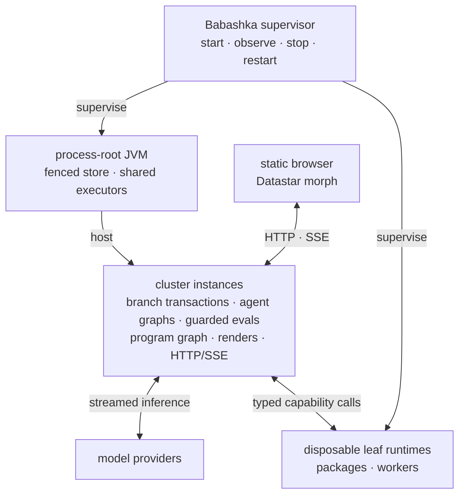

# Seon Runtime Architecture

> **Target design** (present tense). Implementation state, gaps, order, and
> evidence live only in [[roadmap]].

This is the map, not the territory: the thesis, the one vocabulary, the deployment
topology, the cross-cutting principles, and one orienting paragraph per domain.
Every domain detail lives in its own doc — follow the pointer.

## Thesis

Seon is a long-lived runtime where AI agents serve one human. All durable state
is **data in a single-writer, multi-reader, bitemporal database**; every settled
projection — a claim decision, a render, a status view — is a **function of
that database** evaluated reactively. Streamed presentation prefixes are
process-local render-flow values and never durable facts. Isolation,
aggregation, and recovery all fall out of that one choice:
units share *data*, not memory, so they run in parallel, can't corrupt each other,
and restart cleanly from the DB (which is itself reversible). The run cursor is data; the
prompt is a render of data; the UI is a reactive projection of data. The context
unit is the **block** (`:seon.render.block/block`); the prompt, an agent's
**namespace page**, and the **root agent's** namespace page (`/`) are each a
derivation of the same blocks.

Seon is one supervised JVM process root hosting isolated named clusters. The
process root opens one physical Datahike store at `data/clusters/store` under a
lifetime `flock`; each cluster is a branch with its own connection, REPL,
advertisement, graphs, web endpoint, and database facts. The process root owns
the shared `:self` writer resource and executors. Each **cluster instance** owns
transactions on its branch, per-agent flow graphs, guarded evals, the program
graph, render pipeline, and web UI. Agent evals and rendering are co-located
with the selected branch: a read is a pointer into an immutable database value
and a write is a function call.
Disposable **leaf runtimes** contain package and worker effects. The browser
receives static assets and morphed HTML.

**A cluster branch is the data and lifecycle isolation boundary.** Resetting or
stopping one instance does not mutate another branch. Hosted instances share
the process-root store holder and executors, so process death stops every
instance in that JVM and the operator reconstructs each from its branch facts.
Scale durable worlds by adding branches and compute capacity by adding process
roots over different physical stores; never open one physical store from two
JVMs. Store open takes one `flock` assertion before Datahike is opened. This is
the one fenced exception where coordination precedes the database, because it
prevents two writer processes from existing. Within a selected cluster
instance, a request resolves the complete
`{:db-name :t :as-of :since :history :datahike/commit-id}` value before
executing. No renderer, leaf runtime, or browser can commit around the cluster
instance or invent a second feed.

Portability is a source law, not a deployment compromise. A capability family
has one `.cljc` core and one small platform leaf per active tier. The core owns
public data, schemas, validation, interpretation, effect class, and policy.
Leaves own native sessions, clocks, work dispatch, and interop. Reader
conditionals occur only at entry expressions that bridge synchronous and
asynchronous ceremony. Cross-runtime behavior is either the same source or the
same compiled artifact; a hand-mirrored wrapper is not an interface.

## The core ideas

The thesis, unpacked into the ideas everything else serves. Each is backed by
a mechanism — a principle without a code anchor is a slogan. When designing
anything, ask: which of these does it serve, and which existing primitive
already expresses it? (A new noun is a parallel-system risk — map every
concept to `ns`/`defn`/`require`/refs/var-meta/a db value.)

1. **Everything is data in one graph.** One bitemporal db; every moving part —
   the loop, the prompt, a surface, the plan, the code itself — is a function of a
   frozen db snapshot. Replay, debugging, diffing, and time-travel are queries,
   not archaeology. Entities are attributes + refs (no kinds); provenance rides
   the tx entity. Anchors: `seon.db` (sole API), the single writer, [[data-model]].
2. **The language is the harness.** No hand-crafted tool catalog: agents act by
   writing Clojure against fully-specced fns over namespaced data. Every fn's
   in/out is schema'd in the program graph, so "what can process what I'm
   holding" is a Datalog join — relevance is computed, not curated. Prose only
   for what cannot execute. Anchors: `schema/register!` + `:malli/schema`,
   `:seon.fn`/`:seon.ns`, and the capability boundary below. Dated context
   measurements remain in PRD research rather than this map.
   The program graph is cluster-shared: a committed function, schema, or test
   authored by one agent becomes available to every execution scope through
   the same database program delta. Agents build one coherent application
   across ordinary namespaces; namespace organizes code and never encodes
   process ownership. Dynamic context makes relevant shared capabilities
   discoverable when their schemas and data fit the work at hand.
3. **The agent authors its own environment.** A `defn` returning
   `:seon.render/ai` and/or `:seon.render/html` supplies one or both render
   twins —
   writing a function IS authoring context, tools, and UI at once. Both keys =
   twins: agent and human look at ONE derived value; shared situational
   awareness is structural, not messaged. Every specced fn an agent writes
   teaches the system when to surface it. Anchors: the render twins, the
   entity walk, current-ns auto-run — [[context]].
   Authorship provenance remains on the source transaction for attribution,
   maintenance, and policy without making that agent's home namespace a
   permanent silo. Published agent-authored functions are shared capabilities;
   the invoking agent may differ from the original author.
4. **Perpetual motion = plan + location + window.** Grounding that survives
   forever: purpose + the `my.plan` anchor (WHAT I'm doing) + current-ns
   (WHERE I am) + the sliding transcript window (what I'm doing RIGHT NOW). A
   1000-turn agent behaves like a turn-3 agent because context is derived,
   windowed, and cache-stable — never accumulated and never replaced by a
   lossy conversation summary. Raw recent events occupy a bounded window;
   intent and knowledge that must survive it are ordinary plan/database facts
   that remain directly queryable. (The claim under test: the
   plan-survives-restart bench is its measurement.) Anchors: [[context]] §order.
5. **Measured, not asserted.** The context/tool surface is a fitness landscape:
   every dial is config data, so contexts are A/B'd and selected against frozen
   benchmarks (`pass^k`, the eval ledger). Dated measurements and model results
   live in PRD research. Every scorer check must be stated in the agent's
   context, or the bench measures prompt-omission. Endgame: the agent adjusts
   its own initial-context config and the loop selects what works.
6. **Failures are data; core faults fail admission.** Agent and user failures
   become flat error values in derived surfaces. A failed core publication or
   readiness transition records one bounded core fault and, in development,
   may intentionally fail the process/readiness gate. Units share data rather
   than mutable application state; the writer arbitrates total order and late
   writes fail the Datahike `:db.fn/cas` work fence. `:db.fn/cas` is reserved
   for facts two processes race to win exactly once: plan freeze from absent
   to digest, and run claim from no process to the process record
   (CAS-on-absence). Anchors: [[agent-runtime]] and
   [[observability]].
7. **Capabilities cross tiers without mirrors.** Each capability family has one
   portable `.cljc` core containing its public request and response data,
   validation, interpretation, and policy. One platform leaf per active tier
   owns sessions, ambient invocation context, clocks, and native interop.
   `effect/request!` in `seon.effect` is the one guarded function every
   agent-facing `my.*` tool call enters, carrying the request identity.
   Agent-facing entry functions compose core and leaf; their entry
   expression is the only reader-conditional site for sync/async ceremony.
   Cross-runtime code is either the same source or the same compiled artifact;
   hand-mirrored wrappers are not an interface. Replacing an old tier means
   repointing consumers and deleting the superseded path, never preserving two
   run loops, renderers, or capability APIs. Anchors: `seon.db`, `seon.effect`,
   the capability seam below.
8. **One human, one bond; local compute first.** The runtime serves ONE human;
   the canvas is the shared value the pair looks at together. Ordinary
   personal-data work executes on local models when the measured capability
   permits it. A stronger hosted model is an explicit consultant for planning,
   ambiguity, or recovery, not an inference tax on every tool call. Model
   routing preserves the same context, functions, schemas, database facts, and
   Inspect evidence across both roles, so escalation changes compute rather
   than inventing a second agent system. Infrastructure choices answer to that
   relationship — modest-hardware operation, on-device privacy, honest
   termination, and the agent's own code as the compounding asset serving its
   human. Anchors: the root agent, [[agent-runtime]], `docs/seon/vision/` (the
   Seon premise).
9. **The horizon: think in Clojure, translate out.** Index ANY codebase into
   the same graph (LSP); plan/solve in Clojure and translate into the client's
   language — the Clojure artifact is the executable spec; seon-writes-seon
   behind the tests-and-validations publish gate. Vision tier:
   `docs/seon/vision/think-in-clojure.md`.

## Glossary

One vocabulary, each name grounded in a namespace + a schema/fn.

- **block** — the ONE render unit in both projections: one render function's
  identified output—the function, its explicit arguments, stable element id,
  and current bytes. `:seon.render/ai` joins the prompt and
  `:seon.render/html` goes to the page; they are two projections of the same
  block, never two systems. Blocks are derived by the recursive entity walk,
  not stored data types or a membership list. They order by the basis at which
  their cached bytes last changed, with near-equal changes clustered by branch.
  The cluster entity's instruction refs reach the system message and global
  instruction files through the same walk; there is no static scaffold path.
- **render** — a block's output; the one word for the projection. Engine:
  `seon.render`. A render is never stored.
- **ai render** — a block's prompt-text output (a string, or a symbol
  late-resolved through `seon.render.core/resolve-compiled`).
  `:seon.render/ai`.
- **html render** — `:seon.render/html` selects the function that produces the
  human render; its response carries `:seon.render/hiccup`, which becomes a
  surface.
- **prompt** — the agent's assembled context: the prompt computation acquires
  AI renders from a tree rooted at the agent entity at one immutable database
  value, then orders them by last-bytes-changed. The system role is an ordinary
  `:seon.cluster.instruction` row reached through the cluster entity, not a
  prefixed path outside rendering.
- **page** — the human's UI: a layout over the resolved HTML render tree.
  `seon.ui.*`.
- **surface** — a resolved html render displayed by the web UI.
- **card** — a compact/expanded visual CSS component; never an architectural
  object or persisted entity.
- **layout** — a first-party HTML renderer that arranges an already resolved
  render tree; it never redirects renderer resolution or changes membership.
- **canvas** — the focal, agent-controlled surface in a namespace page: the
  agent↔human communication area.
- **root agent** — ONE `:seon.cluster.agent/id "root"` that is BOTH the `/`
  root namespace-page owner (UI) AND the system orchestrator (lifecycle),
  never two entities. Its all-agents overview uses a dedicated system layout
  over the SAME blocks, render units, route resolution, and live-morph machinery
  as ordinary namespace pages. Its context renders the lifecycle functions
  (`start!`, terminate, cross-agent) prominently, but every indexed function is
  callable by every agent and private is only a curation attribute. Its
  actions use the specific POST routes in `seon.render.route/routes`. Root is
  the base case because its ordinary agent identity is reserved; no parent
  attribute or second lifecycle identity exists. See [[agent-runtime]].
- **namespace page** — one namespace's web surface, route
  `/ns/{namespace}`; its owner agent follows from
  `:seon.cluster.agent/namespace`.
- **route** — one line in `seon.render.route/routes`, compiled by reitit. Routes
  are code, not database entities.
- **reitit** — the HTTP router and reverse-routing index compiled from that one
  route table. See [[ui]].
- **warnings block** — the block surfacing current problems: an ai render to the
  agent, error cards to the human, one source. `seon.agent.ctx.warnings` + `seon.warn`.
  Self-healing — empty when clean.
- **error value** — the flat value an agent, user, provider, or guarded
  runtime-boundary failure produces: required `:seon.error/message` and
  `:seon.error/kind`, with optional structured `:seon.error/data`. It is never
  wrapped in a second error envelope at a capability boundary. A core
  publication or readiness failure instead records one `:seon.error/fact`
  with process and flow provenance, then fails admission in development or
  returns the configured bounded production fallback. See
  [[data-model]] and [[observability]].
- **the walk** — the one block-membership derivation: a recursive read of the
  agent entity and the values it reaches, resolving each value to a renderer
  (explicit `:seon.render/ai` / `:seon.render/html` keys on the value → a
  same-schema render fn in the viewing agent's namespace, else the data's
  owning namespace → the schema-attached default → the structural floor) and
  emitting one block per rendered value. Membership and order are both
  derived. Overrides are ordinary facts reached by the same walk; no stored
  block collection, redirect, priority, or band mechanism exists.
- **program graph** — the collective `:seon.fn`, `:seon.ns`, `:seon.schema`,
  and `:seon.test` facts. Those established top-level attribute namespaces are
  their settled owners.
- **orchestrator-root** — the root agent using the same message, function, and
  database mechanisms as every agent; it has no parent/grant topology. See
  [[agent-runtime]].
- **run / claim / form / eval receipt** — the bounded work entity a message
  opens, its `:seon.cluster.run/process` presence custody, its frozen ordered
  forms, and each form's settle-once `:seon.cluster.eval` receipt. See
  [[agent-runtime]].
- **process root / cluster instance / leaf runtime / database interest** — the
  JVM holding one fenced physical store and shared executors; one branch-local
  transaction/agent/render/web runtime inside it; a disposable native-effect
  process; and one session-owned selective wakeup.

## Deployment topology

One operator supervises two process kinds:

- **Process-root JVM** — opens the one fenced physical store and may host many
  cluster instances. Each instance owns its branch's transactions, durable
  mutation receipts, committed-transaction feed, per-agent flow graphs, model
  I/O, SCI evals, program graph, render pipeline, http-kit endpoint, and
  Datastar SSE. Instances share the root `:compute` and `:io` executors. SCI
  runs on `:compute` platform threads under the one `:interrupt-fn`; database
  reads dereference the selected branch's immutable database value and writes
  call its co-located transaction owner directly. Render evaluation uses the
  same `seon.sci.eval/evaluate` path as every guarded invocation.
- **Leaf runtimes** — run packages and selected platform workers on demand.
  They have no durable authority and are reaped freely. A lost in-flight call
  becomes the flat capability error from which receipt and effect policy
  decide recovery.

The browser is a client, not a supervised runtime process. It loads static CSS
and JavaScript, opens the SSE feed, submits namespaced actions, and applies
Datastar's ID-aware morph. It contains no ClojureScript application or database
logic.

Every process may die. The operator restarts the process root and its selected
cluster instances; each run's `:seon.cluster.run/process`, terminal facts, and
eval receipts let replacement compute derive recovery from that branch's
facts. Render graphs
and leaf runtimes are reconstructed from database, artifact, and configuration
facts. On process restart, every pinned canvas renders once from current
database truth. Remote
servers, thin clients, mobile packaging, and stronger isolation consume the
same protocols and may implement only the leaves their platform supports.

### Canonical data flow

The cluster name selects one branch and its in-process cluster instance. A
database value selects the exact basis transaction and temporal view. Inside
that instance,
a no-argument `seon.db/db` returns the current immutable database value; an
explicit database value remains a frozen read fence. Reads that combine
databases pass the required database values as ordinary Datalog sources. This
is not a return to `*conn*`: callers receive database values, while the
connection remains ambient inside the owning database leaf.

One committed transaction report is sufficient to wake every matching
database interest. The in-process render flow derives affected render units
from the report's exact `:db-after` and publishes patches through
`(sliding-buffer 1)` taps. A committed message wakes the recipient agent's own
graph through the same interest mechanism; Datahike's `:db.fn/cas`, not
delivery order, decides custody.

Datastar owns the browser's ID-aware morph. Datahike owns immutable indexed
database values; the writer owns committed transaction reports. http-kit owns
HTTP connection mechanics. Seon owns database selection, exact-value
derivation, bounded per-tab taps, reconnect from current truth, claim fencing,
and receipt recovery. A disconnected session
stops new work; after reacquisition, consumers derive current truth rather than
replaying process-local events.

Model calls execute on `:io` virtual threads in the process root, so a slow
provider does not occupy `:compute` capacity or block render `step-fn`s.
Their admitted attempts and terminal outcomes are receipts connected to the
owning run and call pass. Embedding and package work is downstream of committed facts and follows
the same claim or capability-effect rules; leaf-runtime death leaves
database-visible work or a flat boundary error rather than wedging its cluster
instance.

Each render unit sends a stable-ID element patch. Datastar's morph engine
applies the minimal DOM change while the server retains no DOM mirror.
Fine-grained element morphs are preserved for every update; only initial paint
renders the whole page. Seon does not introduce server-side DOM diffing, a
per-surface event bus, or a stored render snapshot.

### Downstream distribution boundary

Seon's source repository is the release producer; a downstream product does
not require a Seon source checkout. One release operation publishes coordinated
cluster-JVM and disposable leaf-runtime artifacts plus static
browser assets and the consumer SDK. The artifacts carry the portable source or
compiled capability cores they share; packaging never regenerates
tier-specific mirrors.

One compatibility manifest binds the Seon release/source revision, database
protocol and config/SDK versions, Java/Bun requirements, cluster-JVM/
leaf/source/assets digests, maintained Datahike/Konserve dependency
identities, npm lock, and license/SBOM metadata. A downstream package embeds
that manifest plus its own source/dependency/config/brand digest. Build and
startup reject an incompatible or mixed set before database mutation; neither
selects a mutable “latest” dependency or recompiles in production.

The downstream repository owns its declared Clojure and npm dependencies,
compiled namespaces/preload, config delta, routes and renders, brand CSS/assets,
secrets, and deployment policy. It pins one coordinated Seon release and
invokes the shipped build/operator commands. Product customization composes public data and
function seams;
it does not patch Seon source or introduce a second runtime mechanism.

## Cross-cutting principles

### DB-as-bus

Units are isolated in **compute** but share one **DB**, so "pull together data from
all of them" = read the one DB they all write to — there are no silos to aggregate.
The reactive loop, end to end: a browser action submits a fact → the owning
database writer commits → `listen!` wakes an interest through a
`(sliding-buffer 1)` channel → the render proc derives affected stable-ID
elements at the report's exact `:db-after` → a `mult` fans them to per-tab
`(sliding-buffer 1)` taps → each tab's connection-owned virtual thread batches
Datastar element patches onto its one bounded SSE connection. Reads, writes, heavy
capabilities, cancellation, and selective interests stay inside the cluster
JVM or cross to disposable leaves as ordinary values. **No agent code ever
touches an SSE connection**—agents write facts; the render flow derives and
streams. Loopback SSE is uncompressed by default; remote compression is an
explicit measured transport option.

### Scheduling is core.async.flow

`core.async.flow` is the one in-process scheduling substrate. Seon uses the
real Flow graph and public API with zero forked Flow files. Long-lived runtime
owners are procs; their behavior is a `step-fn`; `conns` and bounded channels
form the `graph-def`; the report channel carries bounded operational evidence.
`flow-monitor` consumes the unmodified graph as the operations and
visualization surface.

**Every agent is its own flow graph.** The graph is created with the agent from
one blueprint, parked between episodes, pausable and resumable per agent, and
kicked off by the messages it receives. There is no central loop, dispatcher,
or scheduler entity — parallelism across agents holds by construction, and
per-agent pause is a Flow command, not a fact a router consults. Beside the
agent graphs, the cluster keeps shared render and fault plumbing graphs, and
the process root owns
one bounded `:compute` executor and one `:io` (virtual-thread) executor shared
by every graph. A per-tab SSE connection is a tap plus a connection-owned
virtual thread, deliberately not a graph: connections churn with browsers while
graph topology is static.

Every proc pins `:io` or `:compute` explicitly; the `:mixed` default pins a
platform thread per proc and is the one scaling cliff. Workload
classification is per-function and derived, never declared per call site: key
capability leaves carry `:seon.workload` defn metadata lifted into the program
graph at index time, chains classify by reachability over the indexed call
edges — only-compute ⇒ `:compute`, only-io ⇒ `:io`, both in one chain ⇒
`:mixed`, unresolved ⇒ `:mixed` fail-closed — and the classification acts at
exactly two seams: proc workload tags and the eval/capability door. The eval
seam additionally arms the one `:interrupt-fn`, runs on a platform thread, and
holds the admitted permit until settlement.

**The transport law.** Anything recovery or another process could ever need is
a database fact — identities, receipts, messages, errors, the settled reply —
with bulky payloads as blobs whose row carries identity, digest, and size.
Everything in flight between procs rides channels, however large, provided its
loss is free by construction: re-derivable from facts at a basis, or superseded
by a newer complete value. The buffer encodes the loss semantics —
`(sliding-buffer 1)` for latest-wins, a fixed buffer for backpressure, a
counted-dropping buffer for observation — and a design where channel loss
breaks recovery is wrong by definition. Database facts and transaction receipts
remain the durable work record.

### Capability seam

Protected `seon.*` namespaces own the database, evaluation, lifecycle, bounds,
policy, and external-effect crossings. Ordinary application namespaces compose
those functions as shared program facts; `my.*` is a convention, not a fixed
catalog or security boundary. Every indexed function is callable. Context
selects what to render, while genuine filesystem, process, web, model, and
database effects enter the one `seon.effect/request!` boundary with their
request identity. Actual namespaces and contracts are queried from the program
graph, never copied into architecture prose.

An agent calls an ordinary schema'd function and does not select a runtime.
Each capability family owns one portable `.cljc` core. The core holds the
public call shape, validation, ordinary request and response data, decoding,
and pure retry decisions. A platform leaf implements the family's small native
contract for one tier: sessions and sockets, blocking or async work, ambient
invocation context, clocks and UUIDs, and direct platform interop.

The entry function binds those halves. Reader conditionals occur only at entry
expressions where an asynchronous tier awaits a leaf result and synchronous JVM
code receives it directly; portable policy below the entry does not fork. A runtime loads
the same source or invokes the same compiled artifact. It never reconstructs a
parallel API with hand-written wrappers. Package hosts enter through the same
rule: a package wrapper is a platform leaf beneath a portable family call
surface, not another capability protocol.

### Transparent distribution

Agents write plain Clojure with no placement awareness. One derived,
basis-fenced execution plan over the program graph — call edges, typed
attribute reads and writes, effect and leaf descriptors, artifact export
inventories, explicit uncertainty edges — is the sole placement authority.
Purity and locality reduce from those stored direct edges; no run loop, router,
or consumer independently rediscovers them from source scans, name prefixes
alone, or hand classification, and dynamic construction fails closed as
unplannable rather than silently empty. Plans are derived values keyed by the
complete database value, graph digest, and tier inventories — never stored.

Routing follows the plan: pure program-graph logic runs in local SCI (SCI-local is
the floor, never a failure), installed capabilities run in local leaves, and a
call whose plan says elsewhere crosses as one invoke request/response family
on the same typed database protocol — schema-projected arguments and results,
receipts riding as for database effects, same-tier calls coalesced. The
transparent proxy is the placement-aware wrapper installer: per var, a local
implementation or a wire-calling stub, synchronous on virtual threads and
awaited on the asynchronous tier. Data crosses as schema-projected values;
a tier-local object crosses as a result-symbol handle tracked in the lifecycle
registry and wiped when its platform resets, so transparency degrades loudly
into data and steering, never silently into staleness.

### Derive everything

Every settled projection — the claim decision, the prompt, an agent's page,
and its state — is a **function of the database value at render time**; nothing
derivable is stored. An agent with `:seon.cluster.agent/run` is running; an
agent without it is idle. A run with `/process` is held and one with
`/closed-at` is closed. Renders are projections, never persisted; transient streamed prefixes
remain process-local render-flow values. New ways to surface data are new
block render fns, not new mechanisms — when the underlying problem is fixed, the
query returns empty and the surface vanishes (self-healing). Frozen caches key
on the complete ordinary database value, including `:datahike/commit-id` and any
`:as-of`, `:since`, or `:history` filter, never on bare `:t`.

### Failures are data; core faults are explicit

Agent-authored, provider, input, capability, and handler failures are caught at
their boundary and represented as flat values with `:seon.error/message` and
`:seon.error/kind`. A core publication or readiness failure is recorded once
as a `:seon.error/fact` carrying its process and flow provenance; development
fails loudly at the owning transition, while a production boundary may return
a bounded fallback. Detailed diagnostics are pulled on demand rather than
injected as a standing census. The full failure map lives in [[data-model]].

### Dependency-aware tests, one runner per runtime boundary

Fast feedback is a projection of the same program graph, not a third test
harness. Portable and cluster JVM correctness use the JVM runner; writer
correctness uses the writer runner; operator behavior uses the operator runner;
agent/model behavior uses Inspect. A
source edit selects declared tests through proven namespace/function/schema
dependency edges and reports why each test was selected. Selection is
conservative: incomplete analyzer data, dynamic lookup, macro/build/config
changes, deletions, or a cross-runtime contract widen to the owning namespace,
dependency closure, runtime tier, or full checkpoint. A selector may do extra
work but must never silently omit a possibly affected test.

The compiler artifact or watch process remains warm only behind an exact source
fingerprint, and test database/runtime fixtures remain isolated from live
clusters. Individual vars and affected namespaces therefore reuse current code,
while the complete checkpoint
periodically tests the selector and runner themselves. Disabled suites,
generated historical results, bespoke drive scripts, and parallel harnesses are
not an optimization cache; they are deleted once their current behavior is
covered by the owning runner.

### One walk, no second assembly path

Block membership is DERIVED: the render walks the agent entity and the values
reachable from it at one database value, resolves a renderer per value, and
emits one block each. There is no stored block collection, no seeded default
set, no render-time merge, no provider, and no central catalog — and nothing
renders outside this system, so the system message and imported instruction
files are `:seon.cluster.instruction` facts reached from the cluster entity and
rendered by ordinary renderers rather than a static scaffold. Every agent is a
separate entity that points at that cluster and may add instruction refs. Order
is the basis at which each cached function call's bytes last changed, with
near-equal changes clustered by branch. No priority or band attributes exist.
The `my.*` namespaces supply render functions. See [[ui]] and [[context]].

### Context is not callability

Every agent may call every function in its cluster's program graph. Context
chooses which functions and facts to render; it never grants execution. The
guarded effect boundary controls external effects, not function visibility.
There is no stored role, grant, or allowlist entity.

### Code as data

The core's source, the agent's eval log, and the analyzer state are three views
of one program graph. Agent-defining forms are `:seon.fn`, `:seon.ns`,
`:seon.schema`, and `:seon.test` entities; those top-level namespaces own their
attributes.
The DB IS the running system (query → install exact namespace bindings →
topo-sort by `:seon.ns/requires` plus refer targets → load; redefine = upsert).
Base-Var redefinition is accepted with the ordinary Clojure-style warning.
Aliases, imports (including nil masks for removed defaults), exact renamed
refers, and actual loaded namespaces are separate facts; runtime never
compresses them back into require syntax or stores JVM Class objects. Agent birth
commits its context components, home namespace/require rows, and safe declaration
facts atomically. After commit, the runtime loads those declarations without
manufacturing quiet eval/transcript rows. The agent sees the resulting facts and
code through ordinary context projections. See [[agent-runtime]].

Each namespace has one owner agent. Another agent requests changes by messaging
that owner and receives a commit or rejection by reply; an incoming message for
an unowned namespace creates and assigns an owner on demand. This distributed
ownership protocol coordinates changes without making code private or adding
an execution allowlist.

Source indexing is publication, never startup. clj-kondo statically analyzes
first-party `src/` and `test/`; global schemas come from admitted EDN, not
application-source evaluation. One non-executing `:current-src` branch and its
commit ID are the baseline future clusters fork. The edit hook reuses cached
per-file artifacts for safe same-identity upserts; structural changes fall
back to a complete scratch build before one guarded branch-head move. Bare
`bin/seon init` requests the complete form explicitly and leaves every existing
cluster untouched. Dependency analysis may resolve external code but never
publishes it into the database program graph.

Startup verifies coherence, never age. One recorded digest plus populated
namespace and function rows is a coherent sovereign world even when its
digest predates the current baseline; startup reports that age and proceeds
without indexing. An empty, digest-ambiguous, or partial graph is denied with
one explicit remedy: `init CLUSTER --force` destroys it and reforks from the
published `current-src` commit. Seon does not synchronize program facts into an existing
cluster.

## The domains

### Data model — [[data-model]]

Everything is namespaced datoms in one temporal database. The cluster connects
agents, instructions, configuration, and the program graph; an agent's optional
current-run ref leads to forms and eval receipts, while messages, captures,
attempts, errors, and program rows connect through their own refs. The doc owns
the admitted identity and attribute census, relationship forms, absence-based
state, and the flat error value. See [[data-model]].

### Agent runtime — [[agent-runtime]]

Runs are claimable database state. `:seon.cluster.run/process` presence IS
custody; recovery stamps dangling receipts `interrupted-at`, closes the run,
and retracts the agent's current-run pointer. There is no epoch, lease, or
expiry. Each
agent's own flow
graph reduces over the frozen form plan.
Its basis accumulator begins at the plan transaction's `:db-after`; each
form's transaction report supplies the next basis through its `:db-after`.
Provider and eval receipts open before dispatch and terminalize through
`:db.fn/cas`,
making cluster JVM death recoverable without a process-local attempt buffer.
Creation produces an idle agent; inbound messages open bounded runs. The doc
owns claim/run/form/receipt and derived-state mechanics, the one
`:interrupt-fn`, fact-first initialization, the
**orchestrator-root** lifecycle
root-agent lifecycle, and process replacement recovery. See
[[agent-runtime]].

### UI — [[ui]]

The human UI is **pages**—a **layout** arranging an already resolved tree of
block HTML renders, each visible block a **surface**. The one code route table
serves `/`, namespace and agent pages and their debug variants, message
submission, feeds, `/data`, and static assets. reitit compiles that table and
provides reverse routing; there are no route datoms. The **live
channel is ours**: each demanded normalized computation owns one database
interest. A matching report wakes its render proc, which invokes
agent-authored renderers through the one SCI door, suppresses equal bytes, and
fans stable-ID element patches through per-tab
`(sliding-buffer 1)` taps. Reconnect resolves the current database value and
repaints current truth. The doc owns
block/render/canvas/layout, the page tree, reitit + the gate, the SSE
channel, and the derived-walk block model. See [[ui]].

### Capabilities and authored code

Protected `seon.*` owners enforce runtime and effect boundaries. Agents compose
ordinary functions and namespaced data in any application namespace, and every
indexed function remains callable. The program graph is the exact namespace,
function, schema, and test catalog; this map does not mirror it.

### Observability — [[observability]]

Questions about what an agent saw and why it acted are answered by runs,
context captures, provider attempts, forms, eval receipts, messages, and error
facts. The context capture stores the exact prompt and rendered basis before
the external call; attempts preserve the remote-call observations; forms and
receipts preserve the REPL interleave. Process logs remain operational evidence,
not the durable forensic model. See [[observability]].

## Documentation boundary

Architecture documents own timeless intended mechanisms, vocabulary, and
boundaries. [[roadmap]] alone owns current implementation state, gaps, work
order, dates, measurements, and acceptance evidence.

## Detail docs

- [[data-model]] — current entity shapes, attributes, relationship forms, and
  error values.
- [[agent-runtime]] — claim/run/form/receipt state, guarded evaluation,
  receipt recovery, creation-as-idle, and orchestrator-root lifecycle.
- [[ui]] — block/render/canvas/layout, the page tree, reitit + the capability gate,
  the selective Datastar live channel, configurable compression, and the
  derived-walk block model.
- [[observability]] — context captures, attempts, eval receipts, error facts,
  and cluster lifecycle evidence.
- [[context]] — the dynamic context tree, per-function-call cache,
  last-bytes-changed ordering with branch tie-clustering, namespace-as-location,
  pull-first relevance retrieval, and the UI twin of every block.
- [[roadmap]] — current implementation state, gaps, work order, and evidence.
- [[datahike-primer]] — the source-grounded "work in datahike's grain" mindset (db is
  a value, only values cross the database protocol, `:db.fn/cas` as assertion,
  exact database-value caching). Read before
  touching claim or transaction logic.
