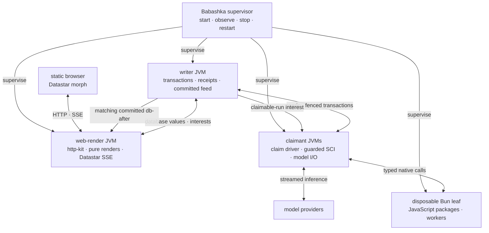

# Seon Runtime Architecture

> **Target design** (present tense). Implementation state, gaps, order, and
> evidence live only in [[roadmap]].

This is the map, not the territory: the thesis, the one vocabulary, the deployment
topology, the cross-cutting principles, and one orienting paragraph per domain.
Every domain detail lives in its own doc — follow the pointer.

## Thesis

Seon is a long-lived runtime where AI agents serve one human. Everything is **data
in a single-writer, multi-reader, bitemporal database**; every moving part — a
claim decision, a render, a status view — is a **function of that database** evaluated
reactively. Isolation, aggregation, and recovery all fall out of that one choice:
units share *data*, not memory, so they run in parallel, can't corrupt each other,
and restart cleanly from the DB (which is itself reversible). The driver cursor is data; the
prompt is a render of data; the UI is a reactive projection of data. The context
unit is the **block** (`:seon.agent.ctx/block`); the prompt, an agent’s **view**,
and the **root agent's** view (`/`) are each a derivation of the same blocks.

Seon is a supervised set of replaceable processes around one database. The
**writer JVM** owns transactions and the committed-transaction feed only; it
never executes agent-authored code or serves HTTP. Independent **claimant
JVMs** execute the claim-native driver and guarded agent code. An independent
**web-render JVM** serves pure database-derived HTML and Datastar SSE from its
own database session. A disposable **Bun leaf host** contains JavaScript package
and worker effects. The browser receives static assets and morphed HTML.

**Client/server is the shape.** Exactly one writer authority owns each
database's ordered writes and committed reports. Every other process receives
ordinary immutable database values and typed results through the versioned
database protocol. A process session retains the latest complete database value
received from acquisition, a successful transaction, or a database interest;
an explicit value remains a snapshot fence. A request resolves the complete
`{:db-name :t :as-of :since :history :datahike/commit-id}` value before
executing. No claimant, renderer, package host, or browser can commit around
the writer or invent a second feed.

Portability is a source law, not a deployment compromise. A capability family
has one `.cljc` core and one small platform leaf per active tier. The core owns
public data, schemas, validation, interpretation, effect class, and policy.
Leaves own native sessions, clocks, scheduling, and interop. Reader
conditionals occur only at entry expressions that bridge synchronous and
asynchronous ceremony. Cross-runtime behavior is either the same source or the
same compiled artifact; a hand-mirrored wrapper is not an interface.

## The core ideas

The thesis, unpacked into the ideas everything else serves. Each is backed by
a mechanism — a principle without a code anchor is a slogan. When designing
anything, ask: which of these does it serve, and which existing primitive
already expresses it? (A new noun is a parallel-system risk — map every
concept to `ns`/`defn`/`require`/refs/var-meta/a db value.)

1. **Everything is data in one graph.** One bitemporal db; every moving part —
   the loop, the prompt, a surface, the plan, the code itself — is a function of a
   frozen db snapshot. Replay, debugging, diffing, and time-travel are queries,
   not archaeology. Entities are attributes + refs (no kinds); provenance rides
   the tx entity. Anchors: `seon.db` (sole API), the single writer, [[data-model]].
2. **The language is the harness.** No hand-crafted tool catalog: agents act by
   writing Clojure against fully-specced fns over namespaced data. Every fn's
   in/out is schema'd in the program graph, so "what can process what I'm
   holding" is a Datalog join — relevance is computed, not curated. Prose only
   for what cannot execute. Anchors: `schema/register!` + `:malli/schema`,
   `:seon.fn`/`:seon.ns`, [[toolkit]]. (Trajectory, bounded by the measured
   present: the minimal base plus relevant namespace source beats a standing
   skills manual, and composition functions render their complete relevant
   value — [[laws]].)
   The program graph is cluster-shared: a committed function, schema, or test
   authored by one agent becomes available to every execution scope through
   the same database program delta. Agents build one coherent application
   across ordinary namespaces; namespace organizes code and never encodes
   process ownership. Dynamic context makes relevant shared capabilities
   discoverable when their schemas and data fit the work at hand.
3. **The agent authors its own environment.** A `defn` returning
   `:seon.render/ai` and/or `:seon.render/hiccup` supplies one or both render
   twins —
   writing a function IS authoring context, tools, and UI at once. Both keys =
   twins: agent and human look at ONE derived value; shared situational
   awareness is structural, not messaged (canvas-first mitigates fabrication —
   prose is where agents lie, [[laws]]). Every specced fn an agent writes
   teaches the system when to surface it. Anchors: the render twins,
   `install!`/`remove!`, current-ns auto-run — [[context]].
   Authorship provenance remains on the source transaction for attribution,
   maintenance, and policy without making that agent's home namespace a
   permanent silo. Published agent-authored functions are shared capabilities;
   the invoking agent may differ from the original author.
4. **Perpetual motion = plan + location + window.** Grounding that survives
   forever: purpose + the `my.plan` anchor (WHAT I'm doing) + current-ns
   (WHERE I am) + the sliding transcript window (what I'm doing RIGHT NOW). A
   1000-turn agent behaves like a turn-3 agent because context is derived,
   windowed, and cache-stable — never accumulated and never replaced by a
   lossy conversation summary. Raw recent events occupy a bounded window;
   intent and knowledge that must survive it are ordinary plan/database facts
   that remain directly queryable. (The claim under test: the
   plan-survives-restart bench is its measurement.) Anchors: [[context]] §order.
5. **Measured, not asserted.** The context/tool surface is a fitness landscape:
   every dial is config data, so contexts are A/B'd and selected against frozen
   benchmarks (`pass^k`, the eval ledger). The laws in [[laws]] are
   measurements, not opinions. Every scorer check must be stated in the agent's
   context, or the bench measures prompt-omission. Endgame: the agent adjusts
   its own initial-context config and the loop selects what works.
6. **Failures are data; core faults fail admission.** Agent and user failures
   become flat error values in derived surfaces. A failed core publication or
   readiness transition records one bounded core fault and, in development,
   may intentionally fail the process/readiness gate. Units share data rather
   than mutable application state; the writer arbitrates total order and late
   writes fail the CAS work fence. Anchors: [[agent-runtime]] and
   [[observability]].
7. **Capabilities cross tiers without mirrors.** Each capability family has one
   portable `.cljc` core containing its public request and response data,
   validation, interpretation, and policy. One platform leaf per active tier
   owns sessions, ambient invocation context, clocks, scheduling, and native
   interop. Agent-facing entry functions compose core and leaf; their entry
   expression is the only reader-conditional site for sync/async ceremony.
   Cross-runtime code is either the same source or the same compiled artifact;
   hand-mirrored wrappers are not an interface. Replacing an old tier means
   repointing consumers and deleting the superseded path, never preserving two
   drivers, renderers, or capability APIs. Anchors: `seon.db`, `seon.db.leaf`,
   [[toolkit]].
8. **One human, one bond; local compute first.** The runtime serves ONE human;
   the canvas is the shared value the pair looks at together. Ordinary
   personal-data work executes on local models when the measured capability
   permits it. A stronger hosted model is an explicit consultant for planning,
   ambiguity, or recovery, not an inference tax on every tool call. Model
   routing preserves the same context, functions, schemas, database facts, and
   Inspect evidence across both roles, so escalation changes compute rather
   than inventing a second agent system. Infrastructure choices answer to that
   relationship — modest-hardware operation, on-device privacy, honest
   termination, and the agent's own code as the compounding asset serving its
   human. Anchors: the root agent, [[agent-runtime]], `docs/seon/vision/` (the
   Seon premise).
9. **The horizon: think in Clojure, translate out.** Index ANY codebase into
   the same graph (LSP); plan/solve in Clojure and translate into the client's
   language — the Clojure artifact is the executable spec; seon-writes-seon
   behind the tests-and-validations publish gate. Vision tier:
   `docs/seon/vision/think-in-clojure.md`.

## Glossary

One vocabulary, each name grounded in a namespace + a schema/fn.

- **block** — the context unit: a function-of-the-DB map with up to two renders,
  seeded into the agent's own `:seon.agent/ctx` and rendered in
  `:seon.agent.ctx/priority` order. `:seon.agent.ctx/block` in `seon.agent.ctx`.
  `:seon.agent.ctx/name` is a plain `:keyword` — the app-level upsert key (prompt
  header = DOM `#surface-<name>`), NOT a datahike identity.
- **render** — a block's output; the one word for the projection. Engine:
  `seon.render`. A render is never stored.
- **ai render** — a block's prompt-text output (a string, or a symbol late-resolved
  via `seon.eval/lookup-value`). `:seon.render/ai`.
- **html render** — `:seon.render/html` selects the function that produces the
  human render; its response carries `:seon.render/hiccup`, which becomes a
  surface.
- **prompt** — the agent's assembled context: the prompt computation acquires
  ai renders at one immutable database value and concatenates them by priority,
  prefixed by a system role resolved by
  `seon.ai/effective-system-prompt` — the per-request `:seon.ai/system-prompt`
  override → the cluster's `:seon.config/system-text` datom → the shipped
  `seon.agent.ctx/system-text` default. The system prompt is DB state and
  per-request overridable ([[context]] §"The system prompt itself is DB state").
- **page** — the human's UI: a layout placing html renders into slots. `seon.ui.*`.
- **surface** — a resolved html render displayed by the web UI.
- **card** — a compact/expanded visual CSS component; never an architectural
  object or persisted entity.
- **slot** — a named, DB-keyed hole in a layout: `(slot :name)` →
  `[:div {:id "surface-<name>" :data-slot :name}]`, keyed on
  `:seon.agent.ctx/name`.
- **layout** — a render whose hiccup contains slots (it nests surfaces); a role,
  not a stored kind. A render with no slots is a leaf surface.
- **canvas** — the focal, agent-controlled surface in an agent view: the
  agent↔human communication area.
- **view** — an agent's page, route `/agent/{id}`: the canvas plus a
  recency-ordered rail of the agent's other html surfaces.
- **root agent** — ONE `:seon.agent/id "root"` that is BOTH the `/` system-view
  owner (UI) AND the system orchestrator (lifecycle) — the same elevated grant,
  never two entities. Its all-agents overview uses a dedicated system layout
  over the SAME blocks, render units, route resolution, and live-morph machinery
  as ordinary agent pages. It holds the elevated system-level lifecycle
  functions (`start!`, terminate, cross-agent) in its
  discoverable context; those functions enforce their own caller rules. Its
  registered home callbacks still pass through the ordinary `/call` browser
  gate. It is the root of the render + route
  tree (`/` → `/agent/{id}` → apps) and the base case of the bootstrap recursion
  (root has no `:seon.agent/parent`). See [[agent-runtime]].
- **app** — an agent-authored sub-page, route `/agent/{id}/app/{x}`.
- **route** — a datom mapping a URL pattern to a layout, consumed by reitit.
  `:seon.route/*` (`seon.route` ns).
- **reitit** — the front door: a router that is a pure derived value of the route
  datoms (vendored, `reference-code/reitit`, `.cljc`). The capability gate
  (`seon.web.reactive.call`) authorizes the fn behind `/call`. See [[ui]].
- **warnings block** — the block surfacing current problems: an ai render to the
  agent, error cards to the human, one source. `seon.agent.ctx.warnings` + `seon.warn`.
  Self-healing — empty when clean.
- **error value** — the flat value an agent, user, provider, or guarded
  runtime-boundary failure produces: required `:seon.error/message` and
  `:seon.error/kind`, with optional structured `:seon.error/data`. It is never
  nested under `:seon/error` at a capability boundary. A core publication/
  readiness failure instead records one `:seon.error/fault :core` and fails
  admission in development or returns the configured bounded production fallback. See
  [[data-model]] and [[observability]].
- **seed-copy** — the seed/override mechanism: ALL blocks are copied into the agent's
  own `:seon.agent/ctx` at creation; render reads that COMPLETE set sorted by
  priority. There is no render-merge, no separate default set, no provider.
- **`install!` / `remove!`** — the sole seed/override functions, in `seon.agent.ctx`.
  `install!` is scope-aware + variadic (a single map OR a vector-of-maps); idempotent
  upsert-by-`:seon.agent.ctx/name`; at boot/no-scope it builds the default seed set,
  in an agent's scope it targets that agent's `:seon.agent/ctx`. `remove!` drops by
  name (component cascade). Override = `install!`/`remove!`, period — for core,
  downstream namespaces, and agents themselves.
- **orchestrator-root** — the lifecycle facet of the root agent: it `start!`s and
  manages child agents through `/call`, writing `:seon.agent/parent`. See
  [[agent-runtime]].
- **run / claim / turn / phase** — the bounded work entity a trigger opens,
  its claimant-and-epoch custody, one prompt/model/eval record, and that
  record's persisted recovery cursor. See [[agent-runtime]].
- **writer / claimant / web-render / leaf host / database interest** — the
  transaction-and-feed JVM; a replaceable agent-code JVM; the pure HTTP/SSE
  JVM; a disposable native-effect process; and one session-owned selective
  wakeup.

## Deployment topology

One operator supervises five roles per active cluster:

- **Writer JVM** — owns Datahike transactions, durable mutation receipts, and
  the committed-transaction feed. Its job is transaction authority only.
  Agent-authored code never executes here, and this process never serves HTTP.
- **Web-render JVM** — owns the HTTP front door and Datastar SSE. It uses
  http-kit and the Datastar Clojure adapter, retains its own immutable replica
  through a database session, and derives trusted views from required database values. One
  virtual thread drains each live connection; a one-slot mailbox retains only
  the newest complete state. Killing it cannot kill a claimant or writer.
- **Claimant JVMs** — run the one portable claim-native driver. Each reads its
  local immutable replica and forwards writes to the writer. A claimant uses
  one virtual thread per held run, submits SCI work through the guarded eval
  door to a bounded platform pool, performs model I/O, and reads/writes through
  the database protocol. More capacity means more interchangeable claimants.
- **Bun leaf host** — runs `seon.packages.js.*` and selected JavaScript-only
  workers. It has no durable authority. A lost in-flight call becomes the flat
  capability error from which receipt and effect policy decide recovery.
- **Browser** — loads static CSS and JavaScript, opens the SSE feed, submits
  namespaced actions, and applies Datastar's ID-aware morph. It contains no
  ClojureScript application or database logic.

Every non-writer process may be killed and reconstructed from database,
artifact, and configuration facts. Dormant databases retain durable facts
without a claimant, renderer, or leaf host. Remote servers, thin clients,
mobile packaging, and stronger isolation consume the same protocols and may
implement only the leaves their platform supports.

### Canonical data flow

The database name selects a writer-owned durable database and the corresponding
process-local immutable replica. A database value selects the exact basis
transaction and temporal view. A process's no-argument `seon.db/db` returns its
current replica value; an explicit database value remains a frozen read fence.
Reads that combine databases pass the required database values as ordinary
Datalog sources. This is not a return to `*conn*`: callers receive database
values, while replica connections remain inside each process's database leaf.

One committed report is sufficient to wake every matching session interest.
The web-render process groups equivalent demands, derives each complete view
from the report's exact `db-after`, and replaces any queued older view with the
newest one. Claimants treat the same feed as a wakeup to rescan claimable runs;
the claim CAS, not delivery order, decides custody.

Datastar owns the browser's ID-aware morph. Datahike owns immutable indexed
replica values; the writer owns committed reports. http-kit owns HTTP connection mechanics. Seon owns database
selection, exact-value derivation, bounded latest-wins delivery, reconnect from
current truth, claim fencing, and receipt recovery. A disconnected session
stops new work; after reacquisition, consumers derive current truth rather than
replaying process-local events.

Model calls execute in a claimant, so a slow provider cannot block the writer
or web-render process. Their admitted attempts and terminal outcomes are
receipts connected to the turn. Embedding and package work is downstream of
committed facts and follows the same claim or capability-effect rules; worker
death leaves database-visible work or a flat boundary error rather than
wedging the writer.

The default feed sends one complete stable-ID element because Datastar's morph
engine applies the minimal DOM change while the server retains no DOM mirror.
Expensive closed surfaces may be independently demanded after measurement, but
they remain functions in the same view and ride the same ordered feed. First
paint, reconnect, and structural changes always send the complete `#app-view`.
Seon does not introduce server-side DOM diffing, a per-surface event bus, or a
second render cache merely to reduce bytes.

### Downstream distribution boundary

Seon's source repository is the release producer; a downstream product does
not require a Seon source checkout. One release operation publishes coordinated
writer, web-render, claimant, and disposable leaf-host artifacts plus static
browser assets and the consumer SDK. The artifacts carry the portable source or
compiled capability cores they share; packaging never regenerates
tier-specific mirrors.

One compatibility manifest binds the Seon release/source revision, database
protocol and config/SDK versions, Java/Bun requirements, writer/web-render/
claimant/leaf/source/assets digests, maintained Datahike/Konserve dependency
identities, npm lock, and license/SBOM metadata. A downstream package embeds
that manifest plus its own source/dependency/config/brand digest. Build and
startup reject an incompatible or mixed set before database mutation; neither
selects a mutable “latest” dependency or recompiles in production.

The downstream repository owns its declared Clojure and npm dependencies,
compiled namespaces/preload, config delta, routes and renders, brand CSS/assets,
secrets, and deployment policy. It pins one coordinated Seon release and
invokes the shipped build/operator commands. Product customization composes public data and
function seams;
it does not patch Seon source or introduce a second runtime mechanism.

## Cross-cutting principles

### DB-as-bus

Units are isolated in **compute** but share one **DB**, so "pull together data from
all of them" = read the one DB they all write to — there are no silos to aggregate.
The reactive loop, end to end: a browser action submits a fact → the owning
database writer commits → the web-render replica and its database-scoped
interest advance to the new `:db-after` value → one database-value-pinned read batch derives the affected
views → the web-render JVM streams whole-element Datastar **morphs**, which
idiomorph diffs client-side. A coalescing throttle collapses a transaction burst
into one derivation. Reads, writes, heavy capabilities, cancellation, and
selective interests share one versioned database protocol; only ordinary values
cross. `:db.fn/cas` is data and crosses fine, closures cannot. Interests are
session-owned wakeups over the process's replica, not a second invalidation bus;
reconnect reacquires the current replica value and derives current truth.
**No agent code ever touches an SSE connection**—agents
write facts; the web-render process derives and streams. Loopback SSE is uncompressed by
default; remote compression is an explicit measured transport option.

### Capability seam

An agent calls an ordinary schema'd function and does not select a runtime.
Each capability family owns one portable `.cljc` core. The core holds the
public call shape, validation, ordinary request and response data, decoding,
and pure retry decisions. A platform leaf implements the family's small native
contract for one tier: sessions and sockets, blocking or async scheduling,
ambient invocation context, clocks and UUIDs, and direct platform interop.

The entry function binds those halves. Reader conditionals occur only at entry
expressions where an asynchronous tier awaits a leaf result and synchronous JVM
code receives it directly; portable policy below the entry does not fork. A runtime loads
the same source or invokes the same compiled artifact. It never reconstructs a
parallel API with hand-written wrappers. Package hosts enter through the same
rule: a package wrapper is a platform leaf beneath a portable family call
surface, not another capability protocol.

### Derive everything

Everything — the claim decision, the prompt, an agent's view, a status view, the work
bound, the agent's state — is a **function of the DB at render time**; nothing
derivable is stored. Agent state is the `seon.derive/derive-state` projection of
primitives (an open run, `paused-at`, `terminated-at`), never a stored field. The
work bound is `default-turn-limit` + the inbound-message count, not a per-message
write. Renders are projections, never persisted. New ways to surface data are new
block render fns, not new mechanisms — when the underlying problem is fixed, the
query returns empty and the surface vanishes (self-healing). Frozen caches key
on the complete ordinary database value, including `:datahike/commit-id` and any
`:as-of`, `:since`, or `:history` filter, never on bare `:t`.

### Failures are data; core faults are explicit

Agent-authored, provider, input, capability, and handler failures are caught at
their boundary and represented as flat values with `:seon.error/message` and
`:seon.error/kind`. A core publication or
readiness failure is recorded once with `:seon.error/fault :core`; development
fails loudly at the owning transition, while a production boundary may return a
bounded fallback. Detailed diagnostics are pulled on demand rather than injected
as a standing census. The full failure map lives in [[data-model]].

### Dependency-aware tests, one runner per runtime boundary

Fast feedback is a projection of the same program graph, not a third test
harness. Portable and claimant correctness use the JVM runner; writer
correctness uses the writer runner; operator behavior uses the operator runner;
agent/model behavior uses Inspect. A
source edit selects declared tests through proven namespace/function/schema
dependency edges and reports why each test was selected. Selection is
conservative: incomplete analyzer data, dynamic lookup, macro/build/config
changes, deletions, or a cross-runtime contract widen to the owning namespace,
dependency closure, runtime tier, or full checkpoint. A selector may do extra
work but must never silently omit a possibly affected test.

The compiler artifact or watch process remains warm only behind an exact source
fingerprint, and test database/runtime fixtures remain isolated from live
clusters. Individual vars and affected namespaces therefore reuse current code,
while the complete checkpoint
periodically tests the selector and runner themselves. Disabled suites,
generated historical results, bespoke drive scripts, and parallel harnesses are
not an optimization cache; they are deleted once their current behavior is
covered by the owning runner.

### Seed-copy, not merge

ALL blocks are copied into the agent's own `:seon.agent/ctx` at creation; render
reads that complete set sorted by `:seon.agent.ctx/priority` and stops. There is no
render-merge over a separate default set, no provider, no central catalog. Override
is `install!`/`remove!` against a scope (boot scope builds the default seed set;
agent scope targets that agent). The `my.*` nses define the render fns + block data
and are batch-installed at seed. See [[ui]].

### Roles are capabilities

A role = the discoverable functions/context plus the guarded operations an agent
can perform, NEVER a stored `:kind`/`:role` enum. "Orchestrator" sees the
spawn/terminate/system functions; "worker" does not, while each operation owns
its enforcement. The `/call` gate covers registered browser callbacks in an
agent's home namespace; it does not authorize direct REPL/eval calls to core
lifecycle functions. This is the entity-level case
of the general rule: an entity's kind is the attributes it carries, never a stored
discriminator (see [[data-model]]).

### Code as data

The core's source, the agent's eval log, and the analyzer state are three views of
one code corpus. Agent-defining forms persist as `:seon.fn` / `:seon.ns` /
`:seon.schema` entities; the DB IS the running system (query → reconstitute →
topo-sort by `:seon.ns/require-edges` → load; redefine = upsert). Agent birth
commits its context components, home namespace/require rows, and safe declaration
facts atomically. After commit, the runtime loads those declarations without
manufacturing quiet eval/transcript rows. The agent sees the resulting facts and
code through ordinary context projections. See [[agent-runtime]].

## The domains

### Data model — [[data-model]]

Everything is namespaced datoms in one bitemporal DB; the agent record is the root of
its context and current-run pointer, and everything else is reachable from it or derived.
The doc owns every entity/attr/type, the three relationship kinds (datahike ref,
identity/lookup attr, symbol-as-value late binding), the flat error value + the
entity-kind-vs-value-enum rule (kind = attribute presence, never a stored
discriminator), and the domain schemas: `my.kb` (no agent ref → global, one KB all
agents see), `my.plan` (a TREE via `:my.plan/parent` + derived roll-up, scoped per
agent by `:my.plan/agent`), and `my.agent` (`:my.agent/purpose`, the per-agent seed
worked-example). Global-vs-per-agent is decided by the **data's** agent-ref, never by
the block. Index every ns's valid forms; render `my.*` in full. See [[data-model]].

### Agent runtime — [[agent-runtime]]

Runs are claimable database state. Claimant identity, monotonic epoch, and
heartbeat lease live on the run; expiry is derived. One portable driver on
every execution tier advances the persisted turn-phase cursor under the held
pointer-plus-epoch fence. Provider and eval receipts open before dispatch and
terminalize by CAS, making claimant death recoverable without a process-local
attempt buffer. Creation still produces an idle agent; messages and due
schedules open bounded runs. The doc owns claim/run/turn/phase/derived-state
mechanics, the guarded eval door, fact-first initialization, the
**orchestrator-root** lifecycle
(`start!` = a core function surfaced to root, writing `:seon.agent/parent` and
enforcing its own caller/depth rule; roles-as-capabilities; root = the cluster-boot base case;
UI-root == orchestrator-root), and claimant recovery. See
[[agent-runtime]].

### UI — [[ui]]

The human UI is **pages** — a **layout** placing block html renders into named
**slots**, each filled slot a **surface**; all pages are agent **views**, a tree of
routes: the root agent’s view (`/`), per-agent views (`/agent/{id}`), and apps
(`/agent/{id}/app/{x}`). Routing is data via **reitit** over `:seon.route/*` datoms;
`/call` is the one browser-action door and its gate authorizes registered
agent-owned home callbacks (it is not lifecycle authorization). The **live
channel is ours**: each demanded normalized computation owns one
database-scoped selective interest. A matching report wakes its exact
database-value-pinned derivation, and equivalent sockets share the resulting
whole-element **morph** (idiomorph-diffed client-side); reconnect resolves the
current database value and repaints current truth. The independent web-render
JVM uses required database values and executes no agent code. The doc owns
block/render/canvas/slot/layout, the page tree, reitit + the gate, the SSE
channel, and the seed-copy + variadic `install!`/`remove!` override model. See
[[ui]].

### Toolkit — [[toolkit]]

The agent's editable composition layer is the intended `my.*` corpus:
`my.blob`, `my.canvas`, `my.data`, `my.kb`, `my.ns`, `my.plan`, `my.skills`, and
`my.ui`. Protected filesystem, search, shell, web, lifecycle, and evaluation
capabilities remain under `seon.*` and are exposed only by an agent's curated
home requirements. Exact function contracts are discoverable program facts,
not a second catalog in architecture prose.

### Observability — [[observability]]

Every question about agent behavior — what an agent saw at turn N, what changed
between turns, why it acted — is answered by a **query against the database plus
the blob archive**. Process logs remain operational evidence rather than turn
truth. Each turn persists the frozen ordinary database value that makes context
re-derivable, the assembled prompt
verbatim as a blob, and the raw reply. `agent-debug/turn` reconstructs any turn;
`turn-diff` shows what changed between two; a dedicated **forensic agent** runs
these queries on demand; the `/agents/run` door drives a reproducible task
through an agent in the cluster for an external harness. See
[[observability]].

## Documentation boundary

Architecture documents own timeless intended mechanisms, vocabulary, and
boundaries. [[roadmap]] alone owns current implementation state, gaps, work
order, dates, measurements, and acceptance evidence.

## Detail docs

- [[data-model]] — entity shapes, attributes, relationship forms, error values,
  and the `my.kb`/`my.plan`/`my.agent` schemas.
- [[agent-runtime]] — claim/run/turn/phase/derived-state, guarded evaluation,
  receipt recovery, creation-as-idle, and orchestrator-root lifecycle.
- [[ui]] — block/render/canvas/slot/layout, the page tree, reitit + the capability gate,
  the selective Datastar live channel, configurable compression, and the
  seed-copy + `install!`/`remove!` override.
- [[toolkit]] — the `my.*` function catalog over the protected `seon.*` floor.
- [[observability]] — historical turn reconstruction (database value + prompt blob + reply), `agent-debug/turn` /
  `turn-diff`, the blob archive, the forensic agent, cluster lifecycle + the
  `/agents/run` door.
- [[context]] — the dynamic context system: `context = f(db, location,
  window, tail)`, the three-band cache gradient (stable prefix / sliding
  transcript window / free dynamic tail), namespace-as-location, pull-first
  relevance retrieval, and the UI twin of every band.
- [[laws]] — the drive-measured empirical laws (render-prominence,
  cache-stability, canvas-first, pass^k, keep-iff-lifts-battery) that
  constrain every design above. Not principles — measurements.
- [[roadmap]] — current implementation state, gaps, work order, and evidence.
- [[datahike-primer]] — the source-grounded "work in datahike's grain" mindset (db is
  a value, only values cross the database protocol, CAS-as-assertion,
  exact database-value caching). Read before
  touching claim or transaction logic.
- [[library-grounding]] — the current concept-to-source read map for Datahike,
  Malli, SCI/JVM execution, Bun leaves, Reitit, Datastar, and the test selectors.
