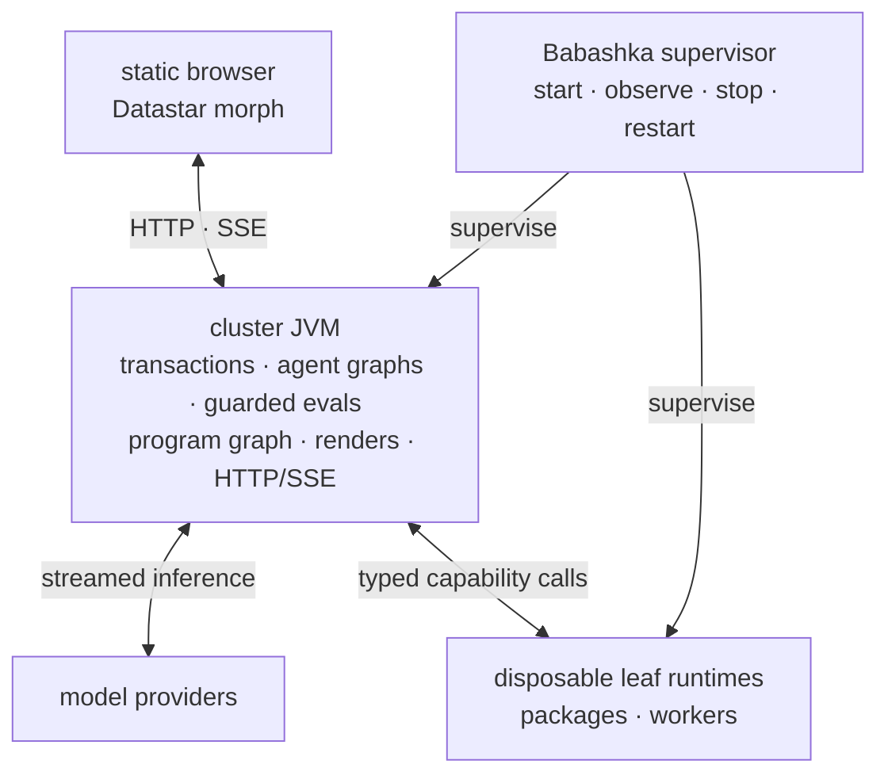

# Seon Runtime Architecture

> **Target design** (present tense). Implementation state, gaps, order, and
> evidence live only in [[roadmap]].

This is the map, not the territory: the thesis, the one vocabulary, the deployment
topology, the cross-cutting principles, and one orienting paragraph per domain.
Every domain detail lives in its own doc — follow the pointer.

## Thesis

Seon is a long-lived runtime where AI agents serve one human. All durable state
is **data in a single-writer, multi-reader, bitemporal database**; every settled
projection — a claim decision, a render, a status view — is a **function of
that database** evaluated reactively. Streamed presentation prefixes are
process-local render-flow values and never durable facts. Isolation,
aggregation, and recovery all fall out of that one choice:
units share *data*, not memory, so they run in parallel, can't corrupt each other,
and restart cleanly from the DB (which is itself reversible). The run cursor is data; the
prompt is a render of data; the UI is a reactive projection of data. The context
unit is the **block** (`:seon.render.block/block`); the prompt, an agent’s **view**,
and the **root agent's** view (`/`) are each a derivation of the same blocks.

Seon is a supervised set of isolated clusters.
Each cluster is one store: its own `data/clusters/<name>/`, process directory,
ports, and mutable state. Datahike's `:self` writer requires exactly one writer
process per store, so one **cluster JVM** owns transactions, the per-agent
flow graphs, guarded evals, the program graph, the render pipeline, and the web
UI for that cluster. Agent evals and rendering are co-located with the database: a read is
a pointer into an immutable database value and a write is a function call.
Disposable **leaf runtimes** contain package and worker effects. The browser
receives static assets and morphed HTML.

**A cluster is the isolation and scaling boundary.** Clusters share no mutable
state, so one crashing or being reset cannot touch another. Scale by adding
clusters, never by adding another process to one store. Store open takes one
`flock` assertion before Datahike is opened; a second cluster JVM for the same
store refuses loudly. This is the one fenced exception where coordination
precedes the database, because it prevents two database writers from existing.
Within the cluster JVM, a request resolves the complete
`{:db-name :t :as-of :since :history :datahike/commit-id}` value before
executing. No renderer, leaf runtime, or browser can commit around the cluster
JVM or invent a second feed.

Portability is a source law, not a deployment compromise. A capability family
has one `.cljc` core and one small platform leaf per active tier. The core owns
public data, schemas, validation, interpretation, effect class, and policy.
Leaves own native sessions, clocks, work dispatch, and interop. Reader
conditionals occur only at entry expressions that bridge synchronous and
asynchronous ceremony. Cross-runtime behavior is either the same source or the
same compiled artifact; a hand-mirrored wrapper is not an interface.

## The core ideas

The thesis, unpacked into the ideas everything else serves. Each is backed by
a mechanism — a principle without a code anchor is a slogan. When designing
anything, ask: which of these does it serve, and which existing primitive
already expresses it? (A new noun is a parallel-system risk — map every
concept to `ns`/`defn`/`require`/refs/var-meta/a db value.)

1. **Everything is data in one graph.** One bitemporal db; every moving part —
   the loop, the prompt, a surface, the plan, the code itself — is a function of a
   frozen db snapshot. Replay, debugging, diffing, and time-travel are queries,
   not archaeology. Entities are attributes + refs (no kinds); provenance rides
   the tx entity. Anchors: `seon.db` (sole API), the single writer, [[data-model]].
2. **The language is the harness.** No hand-crafted tool catalog: agents act by
   writing Clojure against fully-specced fns over namespaced data. Every fn's
   in/out is schema'd in the program graph, so "what can process what I'm
   holding" is a Datalog join — relevance is computed, not curated. Prose only
   for what cannot execute. Anchors: `schema/register!` + `:malli/schema`,
   `:seon.fn`/`:seon.ns`, [[toolkit]]. (Trajectory, bounded by the measured
   present: the minimal base plus relevant namespace source beats a standing
   skills manual, and composition functions render their complete relevant
   value — [[laws]].)
   The program graph is cluster-shared: a committed function, schema, or test
   authored by one agent becomes available to every execution scope through
   the same database program delta. Agents build one coherent application
   across ordinary namespaces; namespace organizes code and never encodes
   process ownership. Dynamic context makes relevant shared capabilities
   discoverable when their schemas and data fit the work at hand.
3. **The agent authors its own environment.** A `defn` returning
   `:seon.render/ai` and/or `:seon.render/hiccup` supplies one or both render
   twins —
   writing a function IS authoring context, tools, and UI at once. Both keys =
   twins: agent and human look at ONE derived value; shared situational
   awareness is structural, not messaged (canvas-first mitigates fabrication —
   prose is where agents lie, [[laws]]). Every specced fn an agent writes
   teaches the system when to surface it. Anchors: the render twins,
   `seon.render.block/install-tx`, current-ns auto-run — [[context]].
   Authorship provenance remains on the source transaction for attribution,
   maintenance, and policy without making that agent's home namespace a
   permanent silo. Published agent-authored functions are shared capabilities;
   the invoking agent may differ from the original author.
4. **Perpetual motion = plan + location + window.** Grounding that survives
   forever: purpose + the `my.plan` anchor (WHAT I'm doing) + current-ns
   (WHERE I am) + the sliding transcript window (what I'm doing RIGHT NOW). A
   1000-turn agent behaves like a turn-3 agent because context is derived,
   windowed, and cache-stable — never accumulated and never replaced by a
   lossy conversation summary. Raw recent events occupy a bounded window;
   intent and knowledge that must survive it are ordinary plan/database facts
   that remain directly queryable. (The claim under test: the
   plan-survives-restart bench is its measurement.) Anchors: [[context]] §order.
5. **Measured, not asserted.** The context/tool surface is a fitness landscape:
   every dial is config data, so contexts are A/B'd and selected against frozen
   benchmarks (`pass^k`, the eval ledger). The laws in [[laws]] are
   measurements, not opinions. Every scorer check must be stated in the agent's
   context, or the bench measures prompt-omission. Endgame: the agent adjusts
   its own initial-context config and the loop selects what works.
6. **Failures are data; core faults fail admission.** Agent and user failures
   become flat error values in derived surfaces. A failed core publication or
   readiness transition records one bounded core fault and, in development,
   may intentionally fail the process/readiness gate. Units share data rather
   than mutable application state; the writer arbitrates total order and late
   writes fail the Datahike `:db.fn/cas` work fence. `:db.fn/cas` is reserved
   for facts two processes race to win exactly once: plan freeze from absent
   to digest, and run claim from no process to the process record
   (CAS-on-absence). Anchors: [[agent-runtime]] and
   [[observability]].
7. **Capabilities cross tiers without mirrors.** Each capability family has one
   portable `.cljc` core containing its public request and response data,
   validation, interpretation, and policy. One platform leaf per active tier
   owns sessions, ambient invocation context, clocks, and native interop.
   `effect/request!` in `seon.effect` is the one guarded function every
   agent-facing `my.*` tool call enters, carrying the request identity.
   Agent-facing entry functions compose core and leaf; their entry
   expression is the only reader-conditional site for sync/async ceremony.
   Cross-runtime code is either the same source or the same compiled artifact;
   hand-mirrored wrappers are not an interface. Replacing an old tier means
   repointing consumers and deleting the superseded path, never preserving two
   run loops, renderers, or capability APIs. Anchors: `seon.db`, `seon.effect`,
   [[toolkit]].
8. **One human, one bond; local compute first.** The runtime serves ONE human;
   the canvas is the shared value the pair looks at together. Ordinary
   personal-data work executes on local models when the measured capability
   permits it. A stronger hosted model is an explicit consultant for planning,
   ambiguity, or recovery, not an inference tax on every tool call. Model
   routing preserves the same context, functions, schemas, database facts, and
   Inspect evidence across both roles, so escalation changes compute rather
   than inventing a second agent system. Infrastructure choices answer to that
   relationship — modest-hardware operation, on-device privacy, honest
   termination, and the agent's own code as the compounding asset serving its
   human. Anchors: the root agent, [[agent-runtime]], `docs/seon/vision/` (the
   Seon premise).
9. **The horizon: think in Clojure, translate out.** Index ANY codebase into
   the same graph (LSP); plan/solve in Clojure and translate into the client's
   language — the Clojure artifact is the executable spec; seon-writes-seon
   behind the tests-and-validations publish gate. Vision tier:
   `docs/seon/vision/think-in-clojure.md`.

## Glossary

One vocabulary, each name grounded in a namespace + a schema/fn.

- **block** — the context unit: a function-of-the-DB map with up to two renders,
  owned through the agent's `:seon.cluster.agent/blocks` component ref and
  rendered in `:seon.render.block/priority` order.
  `:seon.render.block/block` in `seon.render.block`.
  `:seon.render.block/name` is a plain `:keyword` — the app-level upsert key (prompt
  header = DOM `#surface-<name>`), NOT a datahike identity.
- **render** — a block's output; the one word for the projection. Engine:
  `seon.render`. A render is never stored.
- **ai render** — a block's prompt-text output (a string, or a symbol
  late-resolved through `seon.render.core/resolve-compiled`).
  `:seon.render/ai`.
- **html render** — `:seon.render/html` selects the function that produces the
  human render; its response carries `:seon.render/hiccup`, which becomes a
  surface.
- **prompt** — the agent's assembled context: the prompt computation acquires
  ai renders at one immutable database value and concatenates them by priority,
  prefixed by a system role resolved by
  `seon.ai/effective-system-prompt` — the per-request `:seon.ai/system-prompt`
  override → the cluster's `:seon.config/system-text` datom → the shipped
  `seon.agent.ctx/system-text` default. The system prompt is DB state and
  per-request overridable ([[context]] §"The system prompt itself is DB state").
- **page** — the human's UI: a layout placing html renders into slots. `seon.ui.*`.
- **surface** — a resolved html render displayed by the web UI.
- **card** — a compact/expanded visual CSS component; never an architectural
  object or persisted entity.
- **slot** — a named, DB-keyed hole in a layout: `(slot :name)` →
  `[:div {:id "surface-<name>" :data-slot :name}]`, keyed on
  `:seon.render.block/name`.
- **layout** — a render whose hiccup contains slots (it nests surfaces); a role,
  not a stored kind. A render with no slots is a leaf surface.
- **canvas** — the focal, agent-controlled surface in an agent view: the
  agent↔human communication area.
- **view** — an agent's page, route `/agent/{id}`: the canvas plus a
  recency-ordered rail of the agent's other html surfaces.
- **root agent** — ONE `:seon.agent/id "root"` that is BOTH the `/` system-view
  owner (UI) AND the system orchestrator (lifecycle) — the same elevated grant,
  never two entities. Its all-agents overview uses a dedicated system layout
  over the SAME blocks, render units, route resolution, and live-morph machinery
  as ordinary agent pages. It holds the elevated system-level lifecycle
  functions (`start!`, terminate, cross-agent) in its
  discoverable context; those functions enforce their own caller rules. Its
  registered home callbacks still pass through the ordinary `/call` browser
  gate. It is the root of the render + route
  tree (`/` → `/agent/{id}` → apps) and the base case of the bootstrap recursion
  (root has no `:seon.agent/parent`). See [[agent-runtime]].
- **app** — an agent-authored sub-page, route `/agent/{id}/app/{x}`.
- **route** — a datom mapping a URL pattern to a layout, consumed by reitit.
  `:seon.route/*` (`seon.route` ns).
- **reitit** — the HTTP router: a pure derived value of the route
  datoms (vendored, `reference-code/reitit`, `.cljc`). The capability gate
  (`seon.web.reactive.call`) authorizes the fn behind `/call`. See [[ui]].
- **warnings block** — the block surfacing current problems: an ai render to the
  agent, error cards to the human, one source. `seon.agent.ctx.warnings` + `seon.warn`.
  Self-healing — empty when clean.
- **error value** — the flat value an agent, user, provider, or guarded
  runtime-boundary failure produces: required `:seon.error/message` and
  `:seon.error/kind`, with optional structured `:seon.error/data`. It is never
  nested under `:seon/error` at a capability boundary. A core publication/
  readiness failure instead records one `:seon.error/fault :core` and fails
  admission in development or returns the configured bounded production fallback. See
  [[data-model]] and [[observability]].
- **seed-copy** — the seed/override mechanism: ALL blocks are copied through
  the agent's `:seon.cluster.agent/blocks` component ref at creation; render
  reads that COMPLETE set sorted by priority. There is no render-merge, no
  separate default set, and no provider.
- **`seon.render.block/install-tx`** — the sole block-set derivation. It returns
  transaction data that replaces same-named blocks wholesale within one
  agent's `:seon.cluster.agent/blocks` collection. Removal retracts the block
  entity and follows the component cascade; callers commit through the one
  database owner.
- **program graph** — the collective `:seon.fn`, `:seon.ns`, `:seon.schema`,
  and `:seon.test` facts. Those established top-level attribute namespaces are
  their settled owners.
- **orchestrator-root** — the lifecycle facet of the root agent: it `start!`s and
  manages child agents through `/call`, writing `:seon.agent/parent`. See
  [[agent-runtime]].
- **run / claim / turn / phase** — the bounded work entity a trigger opens,
  its `:seon.agent.run/process` presence custody, one prompt/model/eval record, and that
  record's persisted recovery cursor. See [[agent-runtime]].
- **cluster JVM / leaf runtime / database interest** — the transaction,
  agent-graph, guarded-eval, program-graph, render-pipeline, and HTTP/SSE JVM
  for one store; a disposable native-effect process; and one session-owned
  selective wakeup.

## Deployment topology

One operator supervises two process kinds per active cluster:

- **Cluster JVM** — owns Datahike transactions, durable mutation receipts, the
  committed-transaction feed, the per-agent flow graphs, model I/O, SCI agent
  evals, the program graph, the render pipeline, http-kit, and Datastar SSE. It runs SCI
  on `:compute` platform threads under the one `:interrupt-fn`; database reads
  dereference the current immutable database value and writes call the
  co-located transaction owner directly. Render evaluation uses the same
  `seon.sci.eval/evaluate` path as every guarded invocation. Supervision,
  bounded evals, and cheap flow-graph rebuilds protect the process; a
  process wall is not the isolation mechanism.
- **Leaf runtimes** — run packages and selected platform workers on demand.
  They have no durable authority and are reaped freely. A lost in-flight call
  becomes the flat capability error from which receipt and effect policy
  decide recovery.

The browser is a client, not a supervised runtime process. It loads static CSS
and JavaScript, opens the SSE feed, submits namespaced actions, and applies
Datastar's ID-aware morph. It contains no ClojureScript application or database
logic.

Every process may die. The operator restarts the cluster JVM for its store, and
the run's `:seon.agent.run/process`, phase, and receipts let replacement
compute resume from database facts. The render graph and leaf runtimes are
reconstructed from database, artifact, and configuration facts. On cluster-JVM
restart, every pinned canvas renders once from current database truth. Remote
servers, thin clients, mobile packaging, and stronger isolation consume the
same protocols and may implement only the leaves their platform supports.

### Canonical data flow

The cluster name selects one store and its cluster JVM. A database value
selects the exact basis transaction and temporal view. Inside the cluster JVM,
a no-argument `seon.db/db` returns the current immutable database value; an
explicit database value remains a frozen read fence. Reads that combine
databases pass the required database values as ordinary Datalog sources. This
is not a return to `*conn*`: callers receive database values, while the
connection remains ambient inside the owning database leaf.

One committed transaction report is sufficient to wake every matching
database interest. The in-process render flow derives affected render units
from the report's exact `:db-after` and publishes patches through
`(sliding-buffer 1)` taps. A committed message wakes the recipient agent's own
graph through the same interest mechanism; Datahike's `:db.fn/cas`, not
delivery order, decides custody.

Datastar owns the browser's ID-aware morph. Datahike owns immutable indexed
database values; the writer owns committed transaction reports. http-kit owns
HTTP connection mechanics. Seon owns database selection, exact-value
derivation, bounded per-tab taps, reconnect from current truth, claim fencing,
and receipt recovery. A disconnected session
stops new work; after reacquisition, consumers derive current truth rather than
replaying process-local events.

Model calls execute on `:io` virtual threads in the cluster JVM, so a slow
provider does not occupy `:compute` capacity or block render `step-fn`s.
Their admitted attempts and terminal outcomes are receipts connected to the
turn. Embedding and package work is downstream of committed facts and follows
the same claim or capability-effect rules; leaf-runtime death leaves
database-visible work or a flat boundary error rather than wedging the cluster
JVM.

Each render unit sends a stable-ID element patch. Datastar's morph engine
applies the minimal DOM change while the server retains no DOM mirror.
Fine-grained element morphs are preserved for every update; only initial paint
renders the whole page. Seon does not introduce server-side DOM diffing, a
per-surface event bus, or a stored render snapshot.

### Downstream distribution boundary

Seon's source repository is the release producer; a downstream product does
not require a Seon source checkout. One release operation publishes coordinated
cluster-JVM and disposable leaf-runtime artifacts plus static
browser assets and the consumer SDK. The artifacts carry the portable source or
compiled capability cores they share; packaging never regenerates
tier-specific mirrors.

One compatibility manifest binds the Seon release/source revision, database
protocol and config/SDK versions, Java/Bun requirements, cluster-JVM/
leaf/source/assets digests, maintained Datahike/Konserve dependency
identities, npm lock, and license/SBOM metadata. A downstream package embeds
that manifest plus its own source/dependency/config/brand digest. Build and
startup reject an incompatible or mixed set before database mutation; neither
selects a mutable “latest” dependency or recompiles in production.

The downstream repository owns its declared Clojure and npm dependencies,
compiled namespaces/preload, config delta, routes and renders, brand CSS/assets,
secrets, and deployment policy. It pins one coordinated Seon release and
invokes the shipped build/operator commands. Product customization composes public data and
function seams;
it does not patch Seon source or introduce a second runtime mechanism.

## Cross-cutting principles

### DB-as-bus

Units are isolated in **compute** but share one **DB**, so "pull together data from
all of them" = read the one DB they all write to — there are no silos to aggregate.
The reactive loop, end to end: a browser action submits a fact → the owning
database writer commits → `listen!` wakes an interest through a
`(sliding-buffer 1)` channel → the render proc derives affected stable-ID
elements at the report's exact `:db-after` → a `mult` fans them to per-tab
`(sliding-buffer 1)` taps → each tab's connection-owned virtual thread batches
Datastar element patches onto its one bounded SSE connection. Reads, writes, heavy
capabilities, cancellation, and selective interests stay inside the cluster
JVM or cross to disposable leaves as ordinary values. **No agent code ever
touches an SSE connection**—agents write facts; the render flow derives and
streams. Loopback SSE is uncompressed by default; remote compression is an
explicit measured transport option.

### Scheduling is core.async.flow

`core.async.flow` is the one in-process scheduling substrate. Seon uses the
real Flow graph and public API with zero forked Flow files. Long-lived runtime
owners are procs; their behavior is a `step-fn`; `conns` and bounded channels
form the `graph-def`; the report channel carries bounded operational evidence.
`flow-monitor` consumes the unmodified graph as the operations and
visualization surface.

**Every agent is its own flow graph.** The graph is created with the agent from
one blueprint, parked between episodes, pausable and resumable per agent, and
kicked off by the messages it receives. There is no central loop, dispatcher,
or scheduler entity — parallelism across agents holds by construction, and
per-agent pause is a Flow command, not a fact a router consults. Beside the
agent graphs, the cluster keeps a few shared plumbing graphs — the render
pipeline, the fault committer, and schedule fires — and the process root owns
one bounded `:compute` executor and one `:io` (virtual-thread) executor shared
by every graph. A per-tab SSE connection is a tap plus a connection-owned
virtual thread, deliberately not a graph: connections churn with browsers while
graph topology is static.

Every proc pins `:io` or `:compute` explicitly; the `:mixed` default pins a
platform thread per proc and is the one scaling cliff ([[laws]]). Workload
classification is per-function and derived, never declared per call site: key
capability leaves carry `:seon.workload` defn metadata lifted into the program
graph at index time, chains classify by reachability over the indexed call
edges — only-compute ⇒ `:compute`, only-io ⇒ `:io`, both in one chain ⇒
`:mixed`, unresolved ⇒ `:mixed` fail-closed — and the classification acts at
exactly two seams: proc workload tags and the eval/capability door. The eval
seam additionally arms the one `:interrupt-fn`, runs on a platform thread, and
holds the admitted permit until settlement.

**The transport law.** Anything recovery or another process could ever need is
a database fact — identities, receipts, messages, errors, the settled reply —
with bulky payloads as blobs whose row carries identity, digest, and size.
Everything in flight between procs rides channels, however large, provided its
loss is free by construction: re-derivable from facts at a basis, or superseded
by a newer complete value. The buffer encodes the loss semantics —
`(sliding-buffer 1)` for latest-wins, a fixed buffer for backpressure, a
counted-dropping buffer for observation — and a design where channel loss
breaks recovery is wrong by definition. Database facts and transaction receipts
remain the durable work record.

### Capability seam

An agent calls an ordinary schema'd function and does not select a runtime.
Each capability family owns one portable `.cljc` core. The core holds the
public call shape, validation, ordinary request and response data, decoding,
and pure retry decisions. A platform leaf implements the family's small native
contract for one tier: sessions and sockets, blocking or async work, ambient
invocation context, clocks and UUIDs, and direct platform interop. Every
agent-facing `my.*` tool call enters `seon.effect/request!`, which
validates and carries the one request identity before selecting the admitted
family leaf.

The entry function binds those halves. Reader conditionals occur only at entry
expressions where an asynchronous tier awaits a leaf result and synchronous JVM
code receives it directly; portable policy below the entry does not fork. A runtime loads
the same source or invokes the same compiled artifact. It never reconstructs a
parallel API with hand-written wrappers. Package hosts enter through the same
rule: a package wrapper is a platform leaf beneath a portable family call
surface, not another capability protocol.

### Transparent distribution

Agents write plain Clojure with no placement awareness. One derived,
basis-fenced execution plan over the program graph — call edges, typed
attribute reads and writes, effect and leaf descriptors, artifact export
inventories, explicit uncertainty edges — is the sole placement authority.
Purity and locality reduce from those stored direct edges; no run loop, router,
or consumer independently rediscovers them from source scans, name prefixes
alone, or hand classification, and dynamic construction fails closed as
unplannable rather than silently empty. Plans are derived values keyed by the
complete database value, graph digest, and tier inventories — never stored.

Routing follows the plan: pure program-graph logic runs in local SCI (SCI-local is
the floor, never a failure), installed capabilities run in local leaves, and a
call whose plan says elsewhere crosses as one invoke request/response family
on the same typed database protocol — schema-projected arguments and results,
receipts riding as for database effects, same-tier calls coalesced. The
transparent proxy is the placement-aware wrapper installer: per var, a local
implementation or a wire-calling stub, synchronous on virtual threads and
awaited on the asynchronous tier. Data crosses as schema-projected values;
a tier-local object crosses as a result-symbol handle tracked in the lifecycle
registry and wiped when its platform resets, so transparency degrades loudly
into data and steering, never silently into staleness.

### Derive everything

Every settled projection — the claim decision, the prompt, an agent's view, a
status view, the work bound, the agent's state — is a **function of the DB at
render time**; nothing derivable is stored. Agent state is the
`seon.derive/derive-state` projection of
primitives (an open run, `paused-at`, `terminated-at`), never a stored field. The
work bound is `default-turn-limit` + the inbound-message count, not a per-message
write. Renders are projections, never persisted; transient streamed prefixes
remain process-local render-flow values. New ways to surface data are new
block render fns, not new mechanisms — when the underlying problem is fixed, the
query returns empty and the surface vanishes (self-healing). Frozen caches key
on the complete ordinary database value, including `:datahike/commit-id` and any
`:as-of`, `:since`, or `:history` filter, never on bare `:t`.

### Failures are data; core faults are explicit

Agent-authored, provider, input, capability, and handler failures are caught at
their boundary and represented as flat values with `:seon.error/message` and
`:seon.error/kind`. A core publication or
readiness failure is recorded once with `:seon.error/fault :core`; development
fails loudly at the owning transition, while a production boundary may return a
bounded fallback. Detailed diagnostics are pulled on demand rather than injected
as a standing census. The full failure map lives in [[data-model]].

### Dependency-aware tests, one runner per runtime boundary

Fast feedback is a projection of the same program graph, not a third test
harness. Portable and cluster JVM correctness use the JVM runner; writer
correctness uses the writer runner; operator behavior uses the operator runner;
agent/model behavior uses Inspect. A
source edit selects declared tests through proven namespace/function/schema
dependency edges and reports why each test was selected. Selection is
conservative: incomplete analyzer data, dynamic lookup, macro/build/config
changes, deletions, or a cross-runtime contract widen to the owning namespace,
dependency closure, runtime tier, or full checkpoint. A selector may do extra
work but must never silently omit a possibly affected test.

The compiler artifact or watch process remains warm only behind an exact source
fingerprint, and test database/runtime fixtures remain isolated from live
clusters. Individual vars and affected namespaces therefore reuse current code,
while the complete checkpoint
periodically tests the selector and runner themselves. Disabled suites,
generated historical results, bespoke drive scripts, and parallel harnesses are
not an optimization cache; they are deleted once their current behavior is
covered by the owning runner.

### Seed-copy, not merge

ALL blocks are copied through the agent's `:seon.cluster.agent/blocks`
component ref at creation; render reads that complete set sorted by
`:seon.render.block/priority` and stops. There is no render-time merge over a
separate default set, no provider, and no central catalog.
`seon.render.block/install-tx` purely derives replacement transaction data for
one agent's collection; the database owner commits it. The `my.*` namespaces
define the render functions and block data seeded at creation. See [[ui]].

### Roles are capabilities

A role = the discoverable functions/context plus the guarded operations an agent
can perform, NEVER a stored `:kind`/`:role` enum. "Orchestrator" sees the
spawn/terminate/system functions; "worker" does not, while each operation owns
its enforcement. The `/call` gate covers registered browser callbacks in an
agent's home namespace; it does not authorize direct REPL/eval calls to core
lifecycle functions. This is the entity-level case
of the general rule: an entity's kind is the attributes it carries, never a stored
discriminator (see [[data-model]]).

### Code as data

The core's source, the agent's eval log, and the analyzer state are three views
of one program graph. Agent-defining forms are `:seon.fn`, `:seon.ns`,
`:seon.schema`, and `:seon.test` entities; those top-level namespaces own their
attributes.
The DB IS the running system (query → install exact namespace bindings →
topo-sort by `:seon.ns/requires` plus refer targets → load; redefine = upsert).
Aliases, exact renamed refers, and actual loaded namespaces are separate facts;
runtime never compresses them back into require syntax. Agent birth
commits its context components, home namespace/require rows, and safe declaration
facts atomically. After commit, the runtime loads those declarations without
manufacturing quiet eval/transcript rows. The agent sees the resulting facts and
code through ordinary context projections. See [[agent-runtime]].

Source indexing is explicit and never part of startup. Ancestor population
indexes the source-owned base before a cluster forks; an operator-invoked
`index` exact-reconciles that same source-owned slice into an existing cluster
while preserving every other fact and agent-authored declaration. Bare
`bin/seon index` is the deliberate exception to the operator's ordinary
no-name-means-default rule: it creates or reuses the content-addressed
ancestor for current source, leaves every existing cluster untouched, and
makes that ancestor the baseline future clusters fork. Several baselines
coexist in the roster by digest.

Startup verifies coherence, never age. One recorded digest plus populated
namespace and function rows is a coherent sovereign world even when its
digest predates the current baseline; startup reports that age and proceeds
without indexing. An empty, digest-ambiguous, or partial graph is denied with
both explicit remedies: `index CLUSTER` preserves history, whereas `reset`
destroys it and reforks from the current ancestor.

## The domains

### Data model — [[data-model]]

Everything is namespaced datoms in one bitemporal DB; the agent record is the root of
its context and current-run pointer, and everything else is reachable from it or derived.
The doc owns every entity/attr/type, the three relationship kinds (datahike ref,
identity/lookup attr, symbol-as-value late binding), the flat error value + the
entity-kind-vs-value-enum rule (kind = attribute presence, never a stored
discriminator), and the domain schemas: `my.kb` (no agent ref → global, one KB all
agents see), `my.plan` (a TREE via `:my.plan/parent` + derived roll-up, scoped per
agent by `:my.plan/agent`), and `my.agent` (`:my.agent/purpose`, the per-agent seed
worked-example). Global-vs-per-agent is decided by the **data's** agent-ref, never by
the block. Index every ns's valid forms; render `my.*` in full. See [[data-model]].

### Agent runtime — [[agent-runtime]]

Runs are claimable database state. `:seon.agent.run/process` presence IS
custody (claimed by CAS-on-absence; recovery stamps dangling receipts
`interrupted-at` and retracts it — no epoch, no lease, no expiry). Each
agent's own flow
graph reduces over the frozen form plan.
Its basis accumulator begins at the plan transaction's `:db-after`; each
form's transaction report supplies the next basis through its `:db-after`.
Provider and eval receipts open before dispatch and terminalize through
`:db.fn/cas`,
making cluster JVM death recoverable without a process-local attempt buffer.
Creation still produces an idle agent; messages and due schedules open bounded
runs. The doc owns claim/run/turn/phase/derived-state mechanics, the one
`:interrupt-fn`, fact-first initialization, the
**orchestrator-root** lifecycle
(`start!` = a core function surfaced to root, writing `:seon.agent/parent` and
enforcing its own caller/depth rule; roles-as-capabilities; root = the cluster-boot base case;
UI-root == orchestrator-root), and process replacement recovery. See
[[agent-runtime]].

### UI — [[ui]]

The human UI is **pages** — a **layout** placing block html renders into named
**slots**, each filled slot a **surface**; all pages are agent **views**, a tree of
routes: the root agent’s view (`/`), per-agent views (`/agent/{id}`), and apps
(`/agent/{id}/app/{x}`). Routing is data via **reitit** over `:seon.route/*` datoms;
`/call` is the browser-action endpoint and its gate authorizes registered
agent-owned home callbacks (it is not lifecycle authorization). The **live
channel is ours**: each demanded normalized computation owns one database
interest. A matching report wakes its render proc, which evaluates
agent-authored renderers through `seon.sci.eval/evaluate`, suppresses equal
results, and fans stable-ID element patches through per-tab
`(sliding-buffer 1)` taps. Reconnect resolves the current database value and
repaints current truth. The doc owns
block/render/canvas/slot/layout, the page tree, reitit + the gate, the SSE
channel, and the seed-copy + pure `seon.render.block/install-tx` override
model. See [[ui]].

### Toolkit — [[toolkit]]

The agent-facing tool surface is flat `my.*` namespaces:
`my.blob`, `my.canvas`, `my.data`, `my.fs`, `my.kb`, `my.ns`, `my.plan`,
`my.shell`, `my.skills`, `my.ui`, and `my.web`. Every effectful entry calls the
one guarded `seon.effect/request!` function with the request identity.
Protected policy and platform leaves remain under `seon.*`. Exact function
contracts are discoverable program facts, not a second catalog in architecture
prose.

### Observability — [[observability]]

Every question about agent behavior — what an agent saw at turn N, what changed
between turns, why it acted — is answered by a **query against the database plus
the blob archive**. Process logs remain operational evidence rather than turn
truth. Each turn persists the frozen ordinary database value that makes context
re-derivable, the assembled prompt
verbatim as a blob, and the raw reply. `agent-debug/turn` reconstructs any turn;
`turn-diff` shows what changed between two; a dedicated **forensic agent** runs
these queries on demand; the `/agents/run` endpoint runs a reproducible task
through an agent in the cluster for an external harness. See
[[observability]].

## Documentation boundary

Architecture documents own timeless intended mechanisms, vocabulary, and
boundaries. [[roadmap]] alone owns current implementation state, gaps, work
order, dates, measurements, and acceptance evidence.

## Detail docs

- [[data-model]] — entity shapes, attributes, relationship forms, error values,
  and the `my.kb`/`my.plan`/`my.agent` schemas.
- [[agent-runtime]] — claim/run/turn/phase/derived-state, guarded evaluation,
  receipt recovery, creation-as-idle, and orchestrator-root lifecycle.
- [[ui]] — block/render/canvas/slot/layout, the page tree, reitit + the capability gate,
  the selective Datastar live channel, configurable compression, and the
  seed-copy + `seon.render.block/install-tx` override.
- [[toolkit]] — the `my.*` function catalog over the protected `seon.*` floor.
- [[observability]] — historical turn reconstruction (database value + prompt blob + reply), `agent-debug/turn` /
  `turn-diff`, the blob archive, the forensic agent, cluster lifecycle + the
  `/agents/run` endpoint.
- [[context]] — the dynamic context system: `context = f(db, location,
  window, tail)`, the three-band cache gradient (stable prefix / sliding
  transcript window / free dynamic tail), namespace-as-location, pull-first
  relevance retrieval, and the UI twin of every band.
- [[laws]] — the drive-measured empirical laws (render-prominence,
  cache-stability, canvas-first, pass^k, keep-iff-lifts-battery) that
  constrain every design above. Not principles — measurements.
- [[roadmap]] — current implementation state, gaps, work order, and evidence.
- [[datahike-primer]] — the source-grounded "work in datahike's grain" mindset (db is
  a value, only values cross the database protocol, `:db.fn/cas` as assertion,
  exact database-value caching). Read before
  touching claim or transaction logic.
- [[library-grounding]] — the current concept-to-source read map for Datahike,
  Malli, SCI/JVM execution, Bun leaves, Reitit, Datastar, and the test selectors.
